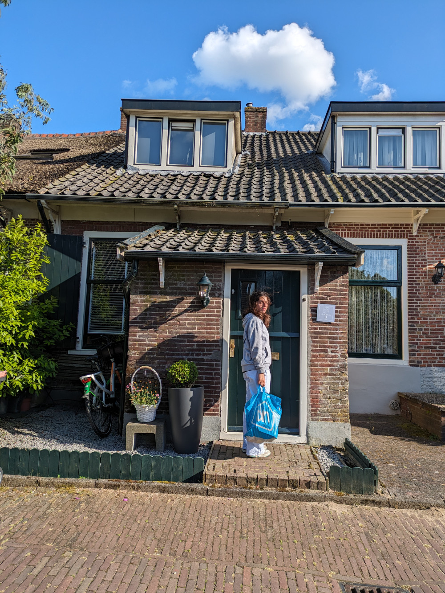
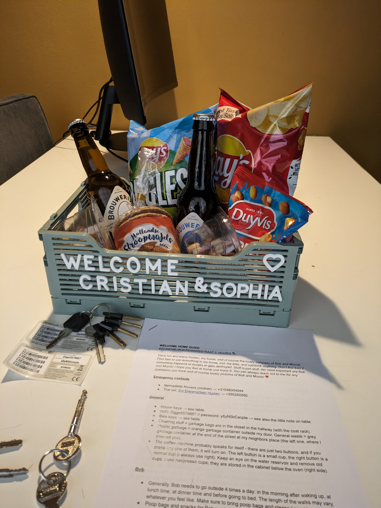
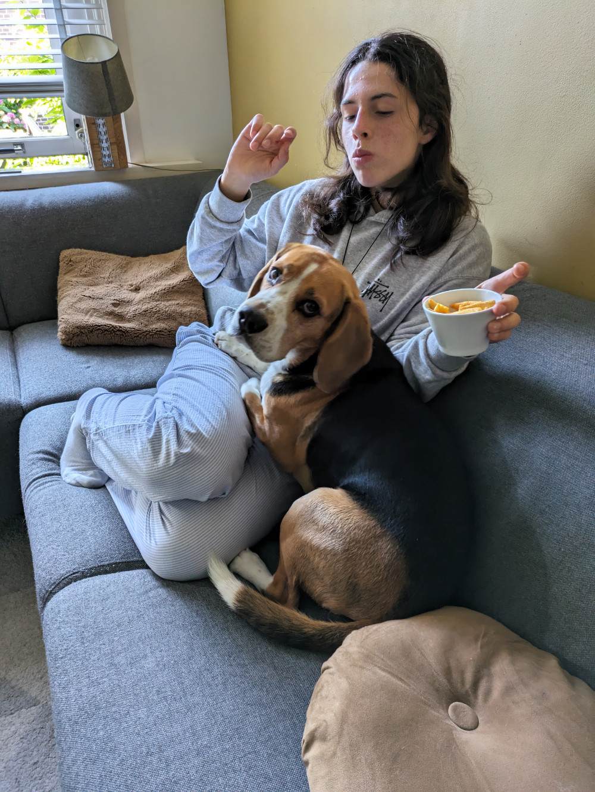

_I didn't have a photo of the sunset in the Netherlands, so I used DALL-E._

The duration of twilight depends on the latitude. Equatorial and tropical regions have a shorter twilight compared to places at higher latitudes. The closer we get to the North Pole or the South Pole, the longer twilight and dawn will last.

I had already noticed this in South Africa, on various occasions, where the sunset lasted the time of several beers. In Italy, you drink one beer and the sunset is already over. Maybe that’s why South Africans consume so much beer?

Last night we sat down at the restaurant at 7:00 PM, and twilight was just beginning. We went to bed at 10:00 PM, when the sky outside the hotel window was finally transitioning from day to night.

In the afternoon, we arrived in Huizen, where Liz welcomed us to her home in the center of this quiet town. The Uber that was supposed to take her to the airport arrived after about half an hour, during which Liz introduced us to her dog, Bob, and her cat, Morris.

_The entrance to Liz's house_

_Liz's welcome_

_Bob is a real cuddlebug_

Bob is a very friendly and playful 3-year-old beagle, while Morris is 9 years old and doesn’t like strangers very much. All our attempts to approach him were abruptly interrupted by a violent swipe of his paw, fortunately without using his claws.

The apartment we are staying in is located in the historic center of Huizen. We have Liz’s bicycle at our disposal, and we should buy our own as soon as possible because bicycles are essential here.
