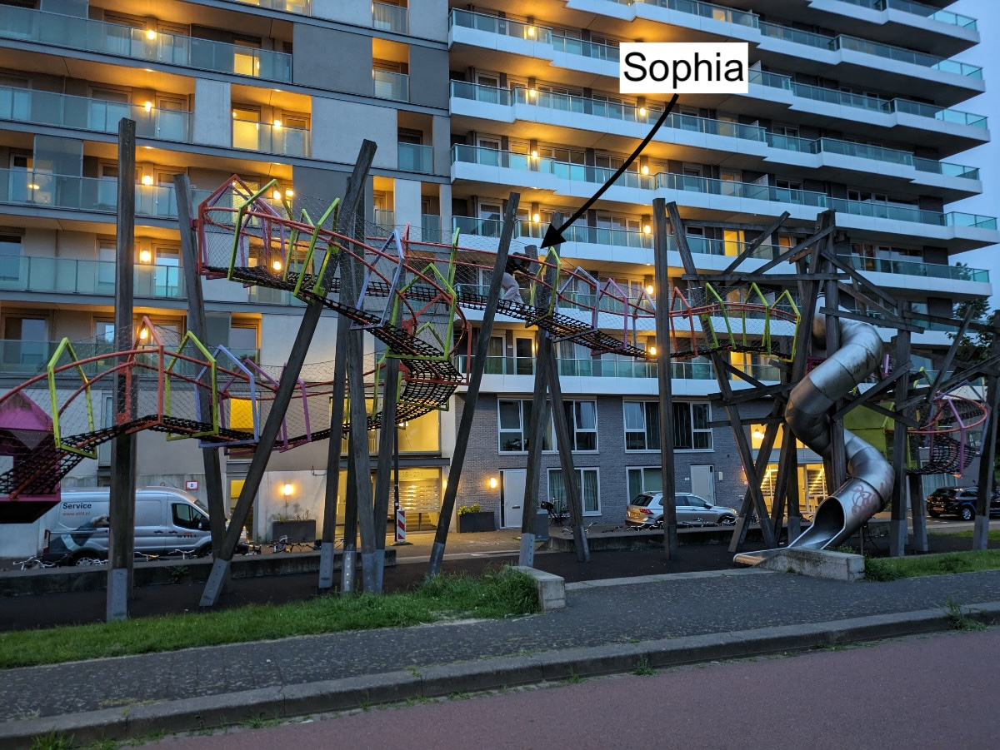
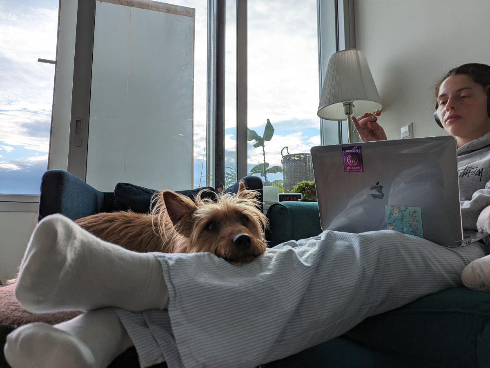

_Expert hunters_

This morning I completed my GitHub profile, a platform used by all developers to keep track of their written code, but also used by recruiters to understand a developer's level of competence, and I also fine-tuned my LinkedIn profile.

At this point, since my portfolio is ready and my resume is updated, I can officially declare the job hunt open.

After 15 years of stable work, I'm throwing myself completely into a field where I've never truly played before, and I'm going to compete with young, agile, and sprightly fresh graduates at my tender age of 48. Let's see what happens.

I believe I can still do something good for another twenty years, at least in the world of programming. Maybe I'm deluding myself, but we'll find out together in the coming weeks.

I just submitted my application for two positions on LinkedIn, both companies looking for a "frontend web developer" to work in Amsterdam, in a hybrid, full-time mode. I will also use other platforms to find a job besides LinkedIn.
Last night, during our evening outing with JJ, we passed by some children's play structures that most likely would never be built in Italy, at least I think so, not for economic reasons but because in the Netherlands, as well as I believe in the Scandinavian countries, and in South Africa, there is a different sensitivity towards children's safety.

I think everyone has seen the Nordic family at the beach, or even in tourist cities, with two or three small children, and noticed how the parents are apparently uninterested in the enormous danger looming over their children as they jump barefoot from one rock to another or climb giant monuments.
The mega structure we saw last night scared even me, but Sophia climbed it and completed the whole thing.

_The super-mega structure_

_Apartment with canal view for rent, €3000 per month._

Speaking of how children are given responsibilities, one thing I've noticed for a long time is that here, in supermarkets, all the staff responsible for stocking shelves are teenage boys and girls.\
It's truly impressive to see a 14-year-old in uniform working inside the supermarket. And they work very hard!
At the exit of all the different supermarket chains, there is always a billboard with flyers to attract new young employees. The hourly wages based on age are clearly stated, quite low when you are 14, I believe to discourage child exploitation by parents.
The weekly hours must also be few because, after all, these kids still go to school.

_A 21-year-old earns three times as much as a 15-year-old._

The area we are in is full of large apartment buildings, which I believe are all fully occupied since in the Netherlands, especially in the Randstad, the most developed area where Amsterdam is located, there is a severe housing crisis and a shortage of homes. Despite this, walking through the neighborhood is very peaceful. It seems half-empty but still extremely well-maintained and clean.

This morning, JJ got a bit dirty when Sophia took him outside, so we had to wash him since he spends all his time with us on the bed or the couch. He was really a sweetheart; he let us wash him calmly without any resistance. In fact, he even cooperated and anticipated our moves. So adorable.

Our beloved Sky was a completely different story in this regard. As soon as he realized we intended to remove the remnants of the rotting carcass he had diligently rubbed himself in, he would put up a real fight to escape the hated soap.

How much I miss Sky!

_Look at that cute little face!_
