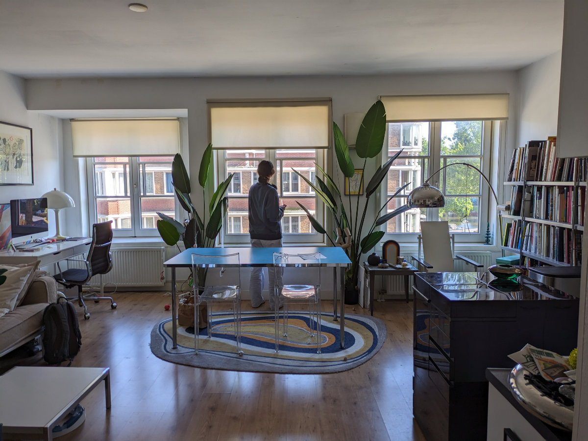
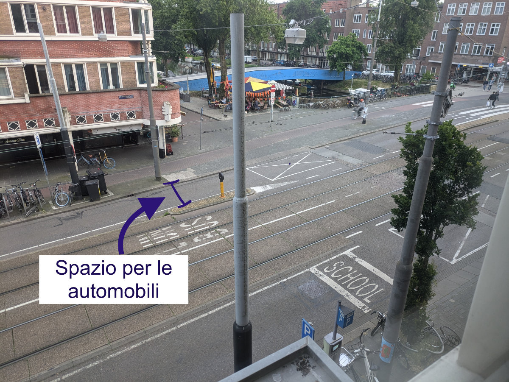
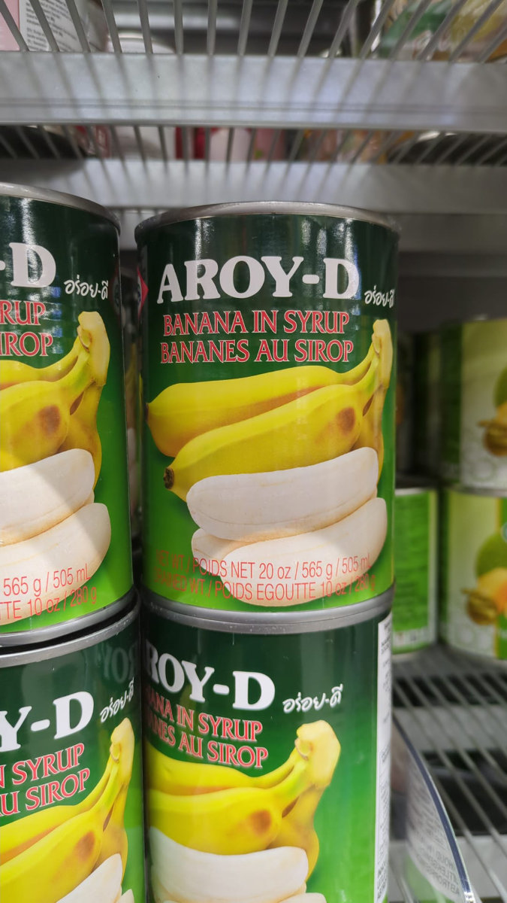
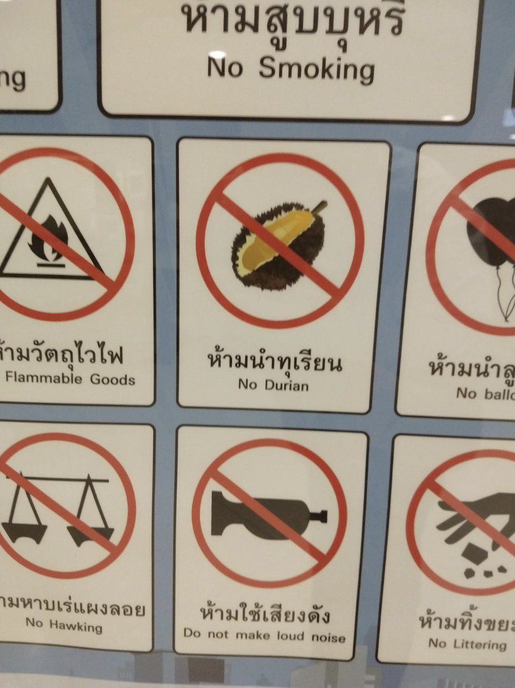

_Sophia is in love with this apartment_

Yesterday, we entered Stephane's house. He had left us the keys when we came for the first meeting a few days ago. For now, the cat Frances doesn't let us get close, but Stephane told us it would take a few days for him to get used to strangers.

Christina returned from her trip, and we greeted her and especially JJ, who will remain in our hearts with his sweetness and personality. We had a good time at Christina's; her apartment was small but very cozy and equipped with everything we needed.

Stephane's house is very well cared for and full of personality. He is a French fashion designer, and his artistic touch is clearly evident. There are beautiful paintings on the walls, some signed by him, and every single piece of furniture has been chosen with great taste and originality. We are on the second floor, and a tram, the 13, passes by on the street below, heading towards the central station. In each direction, there is a narrow lane for cars, a sidewalk, a bike path, and another wide sidewalk. This arrangement of the streets makes walking or cycling around Amsterdam very pleasant.

_Some of the paintings_

_The apartment seen from the outside_

_A very aloof cat_

_But he's a bit curious, you can tell_

_This is the area designated for cars, as seen from our window_

We haven't bought bicycles yet.
My idea was to buy two used ones as soon as possible, but then I changed my mind.
In fact, from Saturday we will be in Hattem, a small town 120 km east of Amsterdam, not far from the city of Zwolle. There we will reunite with the rest of the Cassetta family, and it would be a problem to move around by car with bicycles. We would have to return to Amsterdam by train, with the bicycles, which would cost us extra money since we already have a car.
So we postponed the purchase of bicycles (at that point there will be 4) to the day we have a stable home.

This evening we went out with Sophia for an after-dinner walk. A couple of honking cars passed by, like at a wedding. I think it's because Turkey won the European football match. In the Netherlands, the most represented foreign nationality is Turkish, accounting for 2.44% of the population, followed by Moroccan (2.38%) and Surinamese (2.05%).
In fourth place, with just under 2%, we find the "Indos," an ethnic minority, mostly represented by people of mixed European-Indonesian origins, who, however, have European surnames. 80% of the world's Indo population lives in the Netherlands.

This morning we went to Amsterdam North, on the other side of the large canal behind the central station. For a long time, this part of Amsterdam, in its more developed area, was a dormitory zone, but today it is gaining a bit more vitality.
For lunch, we ate at a place we had already been to during the Christmas period, an Asian fast food inside an Asian supermarket, where they cook everything in front of you and serve it to you in a few minutes. The supermarket is astonishing, you could spend an hour looking at all the strange things for sale. They even had fresh durian, in a tray, already peeled, a small piece, like two bites, cost €25.
They also had syrup bananas.
Durian is a tropical fruit typical of Southeast Asia that, when opened, smells like rotting carcass but then has a delicate and very particular taste, also described as tasting like custard, vanilla, or cheesecake.
In Thailand, I remember, in markets or around the streets, there were signs indicating the prohibition of opening the fruit in public, I swear.

The reason we went to Amsterdam North is that I needed to buy running shoes. I forgot mine in Italy and couldn't wait any longer, so this afternoon I had my first run in the Netherlands. Actually, I've run in the Netherlands several times before, but it was almost 30 years ago, and that was another life.
Anyway, I had a nice run through Rembrandtpark, and I hope to be able to run every day from now on.

The job hunt continues. Every day I apply for open positions as a "Frontend web developer," mostly in Amsterdam, Rotterdam, and Utrecht. I have already received some negative responses, and nothing more.
At the same time, I am working on a new project that demonstrates my skills, including the use of another highly requested "JavaScript framework" (forgive the technical jargon, but I don't know how to describe it otherwise).
There seems to be a lot of activity in the sector, so something should come up.

_Syrup bananas_

_Do not open the durian!_

_After-dinner walk_
