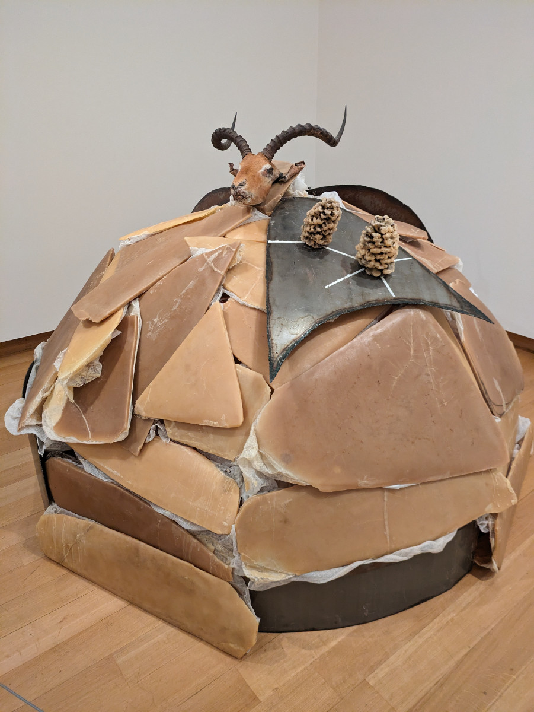
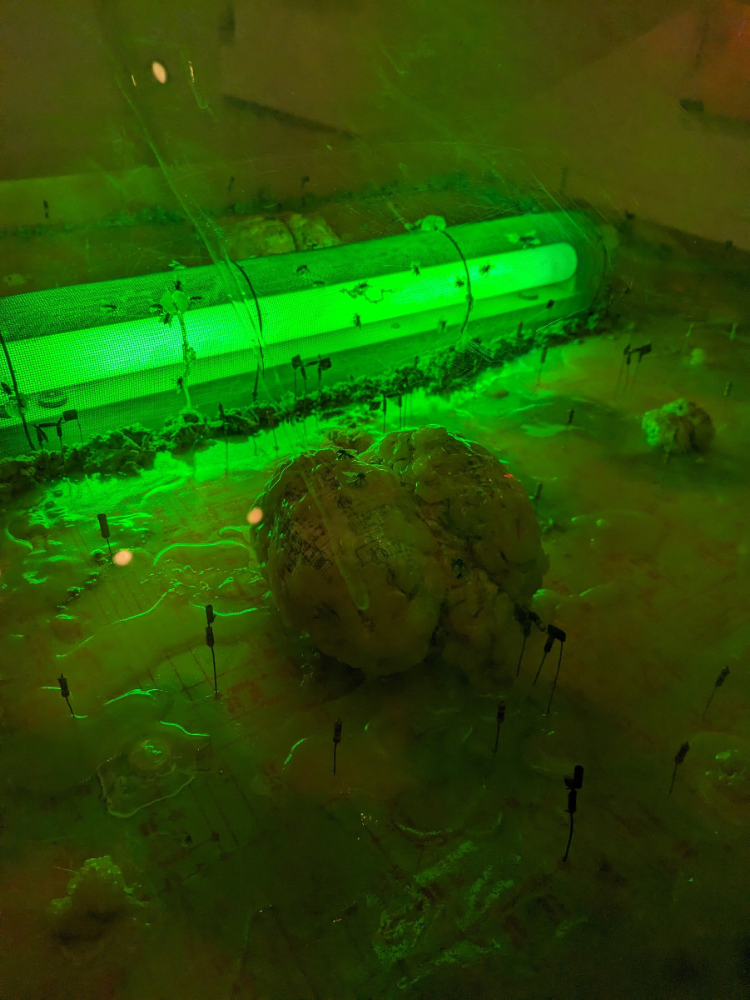
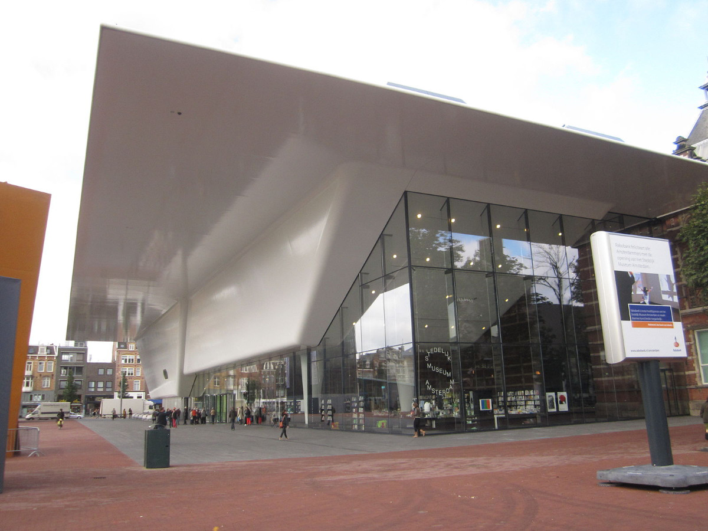
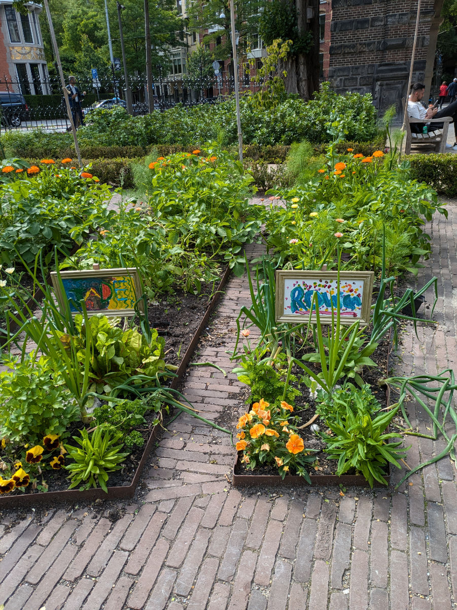

_The "goat cake" of the Stedelijk Museum_

These days we visited a couple of museums. To do so, we purchased the "Museumkaart," an annual card for visiting all the museums in the Netherlands. It costs €70 for adults and €39 for those under 18 and grants access to more than 500 museums.

The first museum we visited was the Stedelijk, which features galleries of Modern and Contemporary Art. We went there after being turned away at the entrance of the Van Gogh Museum, which is right next door, as it requires a reservation to enter.

The Stedelijk Museum houses various galleries of paintings, sculptures, and installations. I liked it, but Sophia wanted to go quickly because she doesn't appreciate contemporary art (I also struggle with it a bit, to be honest), and besides, we had JJ waiting for us at home at that time.

Yesterday afternoon, however, we managed to visit the Van Gogh Museum after making a reservation. The museum is organized over four floors and systematically shows the evolution of his work throughout his life. There are also paintings by artists who inspired him, especially Paul Gauguin, with whom Van Gogh had a tumultuous friendship.

I admit it was my first time visiting this museum, despite all my trips to Amsterdam, even though most Italians say they have visited it. However, this isn't true because they are embarrassed to admit that they went to Amsterdam just to smoke weed.

_Fried Green Brains at the Stedelijk Museum_

_The Stedelijk Museum_

_Museumkaart and the List of Museums_

Both museums are located in an area with a large lawn where we participated in the New Year's Eve party last December 31st. It was an incredible event with live concerts and performances under continuous rain, and around midnight, there were fireworks made with lasers against a backdrop of artificial smoke and sounds. Sophia, Gemma, and I went and spent four hours in the rain. Of course, no one had an umbrella, but amidst the crowd, it wasn't so bad.

Hildegard stayed home because she had fallen down the stairs a few days before and hurt her back. Despite her injury, my beloved wife went outside for five minutes at the stroke of midnight to see the neighborhood fireworks and forgot the house keys inside. In the Netherlands, all front doors don't have handles on the outside, so there's always the risk of locking yourself out. That's what happened, and poor Hilly found herself locked out of the house in her pajamas, with a broken back, in the rain, while the rest of the family, soaked from the rain, was returning home eager for a nice hot shower.

We were in the car, around one o'clock, on the short drive from downtown Amsterdam to Amstelveen, where we were staying, when we received Hildegard's call telling us what had happened. At first, we thought it was a joke, but when we realized the miserable reality, Gemma had a hysterical fit and started crying. Meanwhile, Hilly tried to contact our neighbor to see if he had a spare key to our apartment. Given this terrible and senseless habit of the Dutch to have house locks made this way, a spare key is usually given to a trusted neighbor because, no matter how organized and precise a people are, sooner or later anyone will lock themselves out like idiots.

The neighbor didn't respond to Hilly's messages because he wasn't celebrating New Year's Eve and had gone to bed around 10:00 PM. The poor woman was outside the house for an hour before, by pure coincidence, our neighbor Daniel noticed her wandering up and down the street in her pajamas and let her into his house because he didn't have the spare keys! We arrived shortly after, drenched like castaways landing on a deserted island. We all settled in the office room of the very kind Daniel, who, defying all stereotypes about the Dutch, welcomed us warmly and generously into his home. Happy 2024!!

We managed to get into our house only the next day around noon, after finding spare keys from another neighbor who, however, was absent that night.

These days, Hildegard is still at Civettaia to help the newcomers settle in more smoothly. She intended to write a post on this blog as well, but with all the commitments, she couldn't. She still has to take the last carload of boxes to Luigi's warehouse, and then all our stuff will be sorted.

Gemma, on the other hand, has just finished middle school by presenting a project on slavery in the United States during the nineteenth century, also making connections with the different forms of slavery today in Italy and around the world.

Today is the last day we spend in Amsterdam; early tomorrow morning, we will leave Stephane's house, which has pampered us with its stylish comfort, and we will go to Hattem, where we will stay at Bart and Moniek's house to look after their dog Bruno. Finally, we will be able to ride bicycles because Bart and Moniek have more than one. We will stay there until July 11th. This evening we will have dinner at our friends' house in Amstelveen, the house where the New Year's Eve incident happened.

_Urban gardens near the museums_

_Sophia drinks a smoothie made of dragon fruit and other tropical fruits._

_Hilly, Gemma, and the last boxes_
