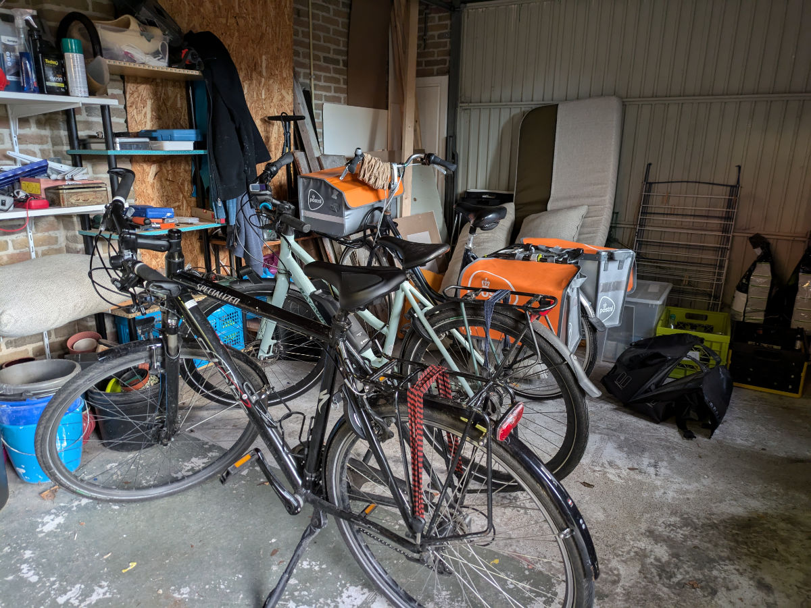
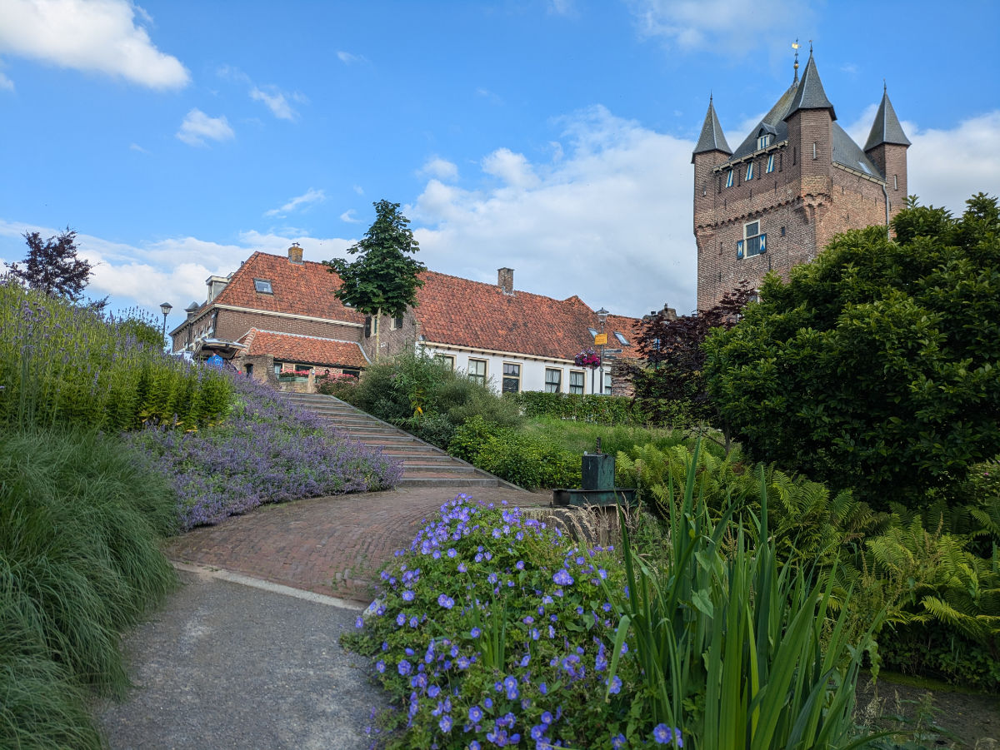
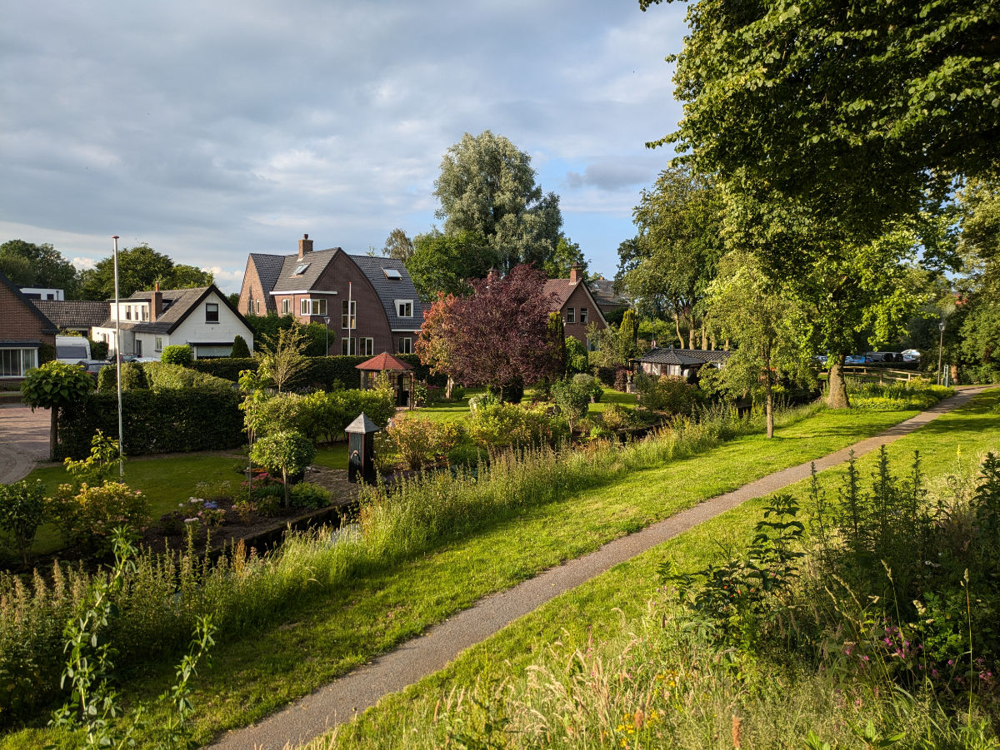
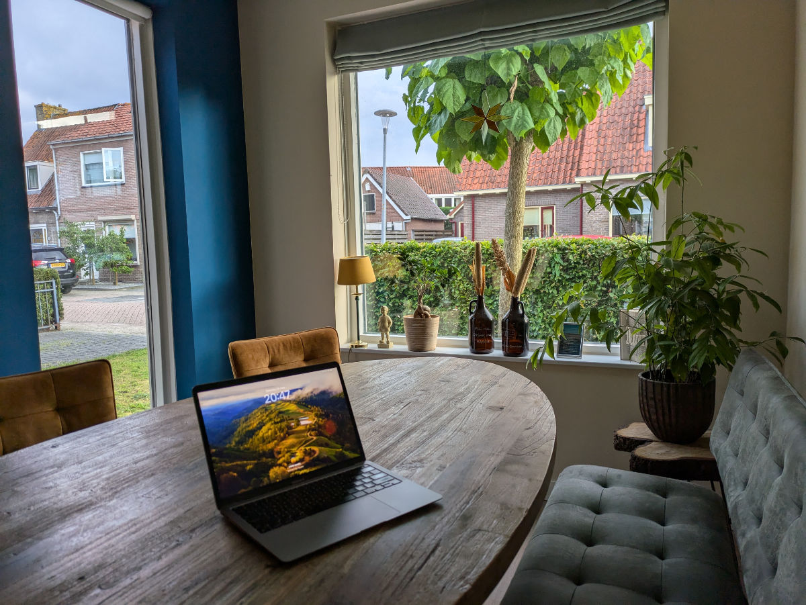

_The display case of typical things_

For evolutionary reasons, during the period of falling in love, we humans only see the positive characteristics in the object of our infatuation, often exaggerating them, and we minimize or don't see the negative ones at all.
For this reason, you must be patient if in this blog I am somewhat glorifying the Netherlands, often comparing them to Italy, my previous love, which has disappointed me a bit in some respects.

To balance the story, I must admit that at least one negative stereotype about the Netherlands is proving to be true so far. The food in restaurants is bad. Of course, coming from Italy, the bar is set very high, but I don't remember the quality being so low in England. Maybe twenty-three years ago my palate wasn't as spoiled.

On the other hand, a negative stereotype about Italy is that Italians manage to complicate everything unnecessarily, often with grotesque results.
Take a tourist who arrives in Rome and needs to take public transport to get to the apartment they have booked, very easily, on Airbnb. Maybe they need to take a train and then a bus.
From the point of view of tickets: where do you get them? Can I buy them online? For the train, yes, you can, but it's very complicated for someone who doesn't know the "Trenitalia" website. And the bus? Where do I get the ticket? Online? Well, maybe. I don't know? Maybe I can buy it on the bus itself? I don't think so. Oh well, let me call an Uber and be done with it! Ahahahah. No Uber in Italy!
In the Netherlands, there is a contactless card on which you load money and can use it on all public transport, including trains and ferries, throughout the country.
I repeat, throughout the country!
You check in when you get on a vehicle and then check out when you get off and pay only for the distance traveled.
If you don't have this card, you can use any contactless credit or debit card or even your phone.
This morning we took a bus from Amsterdam to the station, a train from the station to Zwolle, an hour away, and then another bus from Zwolle to Hattem. All simply by using our rechargeable card.
I'm really in love!

Arriving in Hattem, we were welcomed by Bart and Moniek in their beautiful home. They left shortly after for a trip to Albania and will return on July 11th.
Bruno is a six-year-old mixed breed, part Labrador, playful and sweet, he didn't bark even once, with two strangers in the house.
The house is located in a residential area near a forest of large oaks. The soft ground of the paths will be perfect for my new running shoes.

Finally, we have two bicycles at our disposal, there would also be a third, but it's Moniek's work bike, since she is a mail carrier, so we can't use it.
In the afternoon, we therefore took the bikes and went to visit the center of Hattem.
What a sight! It is truly a Nordic jewel box.
There was a festival in the center for the summer solstice and when we arrived the band was playing, there were craft beer and street food stalls.\
Around the walls of the historic center, there are spectacular and well-kept gardens. There is also a windmill.
We are going to enjoy this place!

_A moment of rest_

_Walking in th woods_

_Bruno's garden_

_Our bikes_

_Moniek's work bicycle_

_The entrance to the historic center of Hattem_

_The flower-filled streets of Hattem_

_The sitting marching band_

_Gardens around the walls_

_More beauty around the walls_

_My new office_
