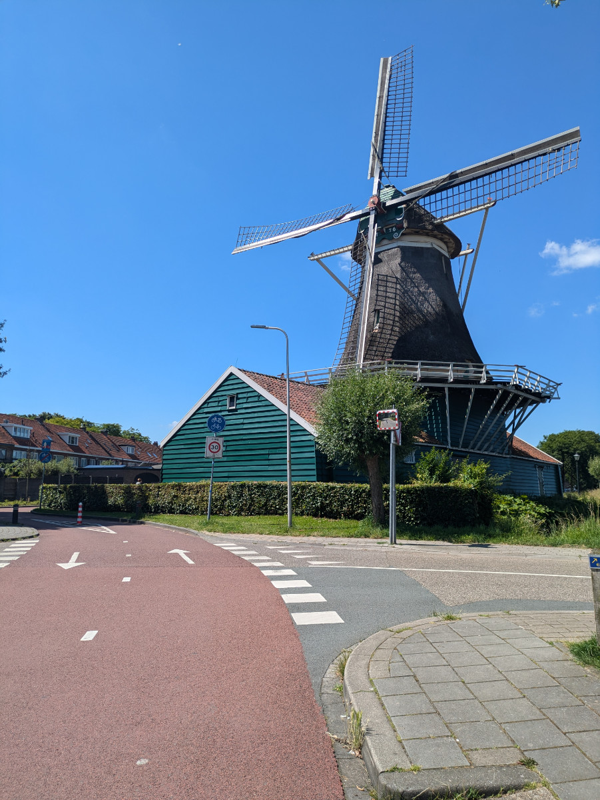
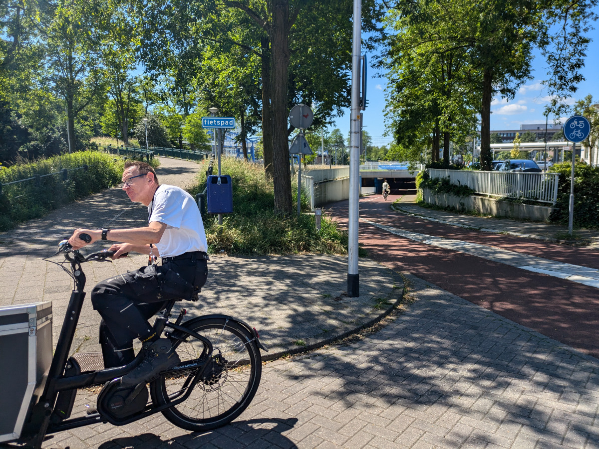
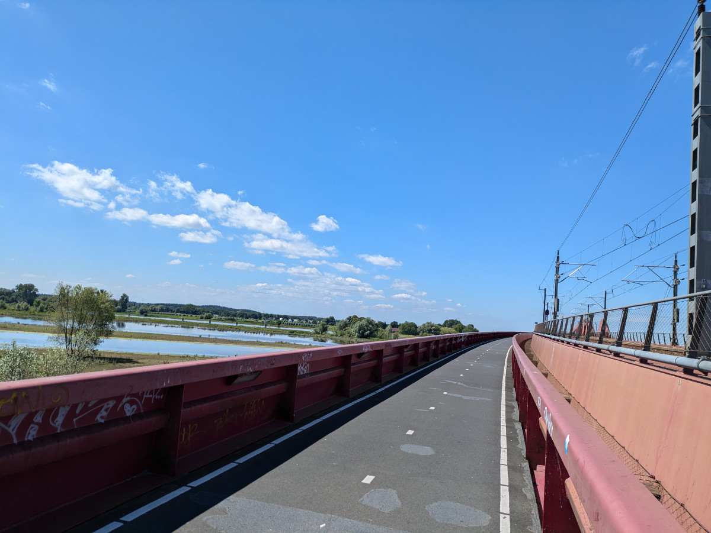
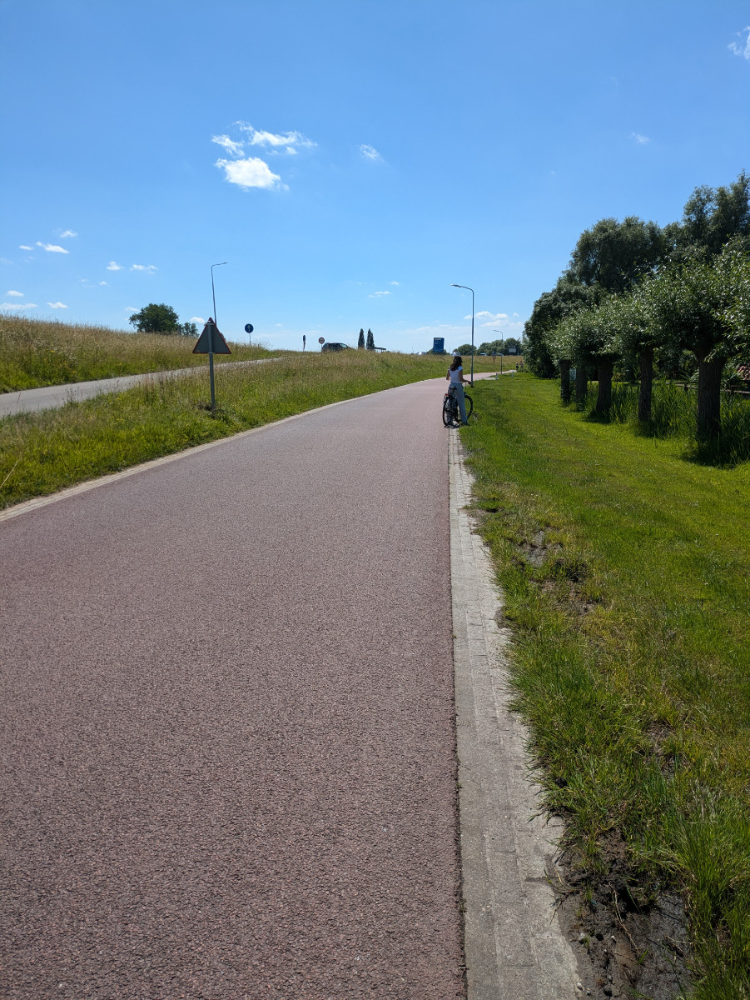
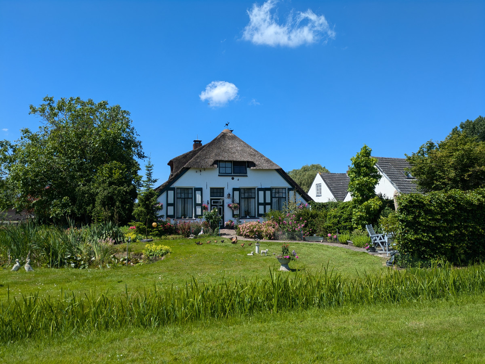
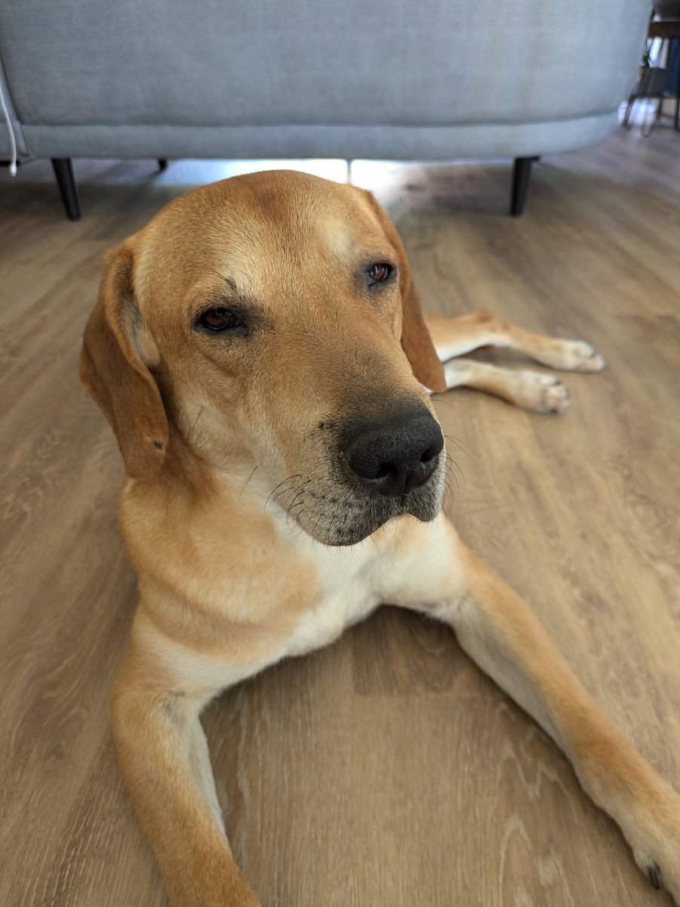

_Two typical things from the Netherlands_

Important notice for everyone planning to visit the Netherlands in the future (and, of course, come to visit us).

Spending a few days in the Netherlands without riding a bicycle would be like traveling to Italy and eating only at McDonald's. Anyone who has never explored Dutch cities or countryside on a bike should know that we're not talking about simple bike paths but actual roads for bicycles.

Both yesterday and today, we went to Zwolle, about a thirty-minute bike ride from our home, with indescribable pleasure and ease. Ninety percent of the route is on roads dedicated solely to bicycles, with the remaining 10% on classic bike paths. At intersections, bicycles almost always have the right of way, and everywhere there are traffic lights and signage dedicated to bikes. Almost everyone has one or more bags attached to their bikes because they use them for grocery shopping or other errands. Outside stations, schools, supermarkets, and practically everywhere, there are hundreds of bikes parked.

I remember the first time I arrived at Amsterdam station, it was 1995, and I came by train from Milan. I was amazed by the mountain of bicycles parked outside the station. I couldn't believe it! Today, there are no more bikes parked outside Amsterdam station; they built an underwater parking garage just for bicycles, costing 60 million euros. There is an impressive timelapse video online showing how it was constructed.

Zwolle is a beautiful medieval city with 133,000 inhabitants, all surrounded by canals outside its walls. Yesterday, which was a sunny Sunday, the green banks of some canals were full of people in swimsuits and bikinis sunbathing. The streets and squares were filled with chairs and tables, and many Dutch people were drinking beer or wine. This morning, we went to downtown Zwolle at 10, and everything was closed; the shops opened after 11:00. Tomorrow we have to go back to Zwolle because we have an appointment at 3:00 PM to get our temporary tax code, so it will be our first encounter with Dutch bureaucracy. So far, everything has been simple. We made the appointment online and filled out a form, also online, with our details. When we go to the office, we have to show a QR code from our phone instead of bringing a paper form.

My job search is ongoing. Every day I apply for at least two or three new positions, but so far, I've only received very polite but negative responses. I'm also working on a new app because I've noticed many job offers for “full-stack developers” (sorry for the jargon) instead of just “front-end developers,” which I could also apply for, but I don't have projects that demonstrate my abilities, so I'm working on that.

Sophia is spending a lot of time reading. Since we arrived, she has bought at least three books, but she is still continuing her Dutch and programming lessons.

Bruno is doing well; he is an extremely obedient and calm dog, although when we take him out, he pulls on the leash like crazy the whole time.

_It's a maze of bike paths._

_Bike path along the railway bridge._

_Returning home through the countryside of Hattem._

_My dream house._

_Our street._

_Bruno is really chilled!_
