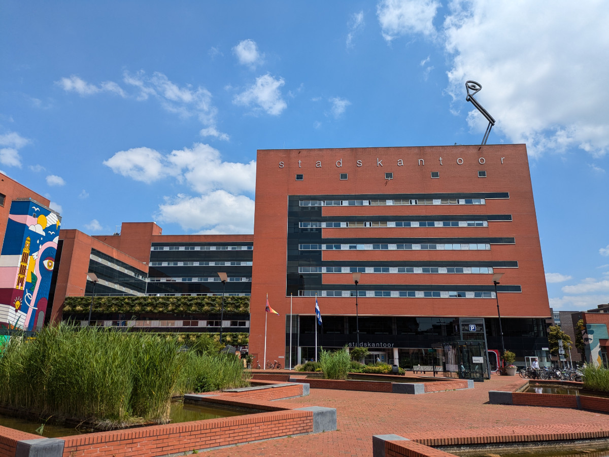

_Zwolle's city hall has the Pixar logo._

Yesterday we went to the town hall to obtain the “Burgerservicenummer,” also known as BSN, which is the Dutch tax identification number.\
The experience was sublime.\
I am sure that at some point, I will encounter at least one public administration employee who will treat me like a miserable plebeian because they hold the upper hand. However, at the Zwolle town hall, the employees were almost all in their twenties, quick, efficient, and professional.\
But what do they do with old folks like me? I am starting to worry!\
Anyway, everything went smoothly, and we obtained the provisional BSN, since we do not have a residence address at the moment, but once we have a stable address, it will become permanent.

The town hall is located in a modern area with offices, university faculties, and high schools, and as always, lots and lots of greenery. The Netherlands has a population density two and a half times that of Italy, and despite this, it seems there is more space for everyone.\
This is due to the fact that a large part of Italy's territory is mountainous and therefore less developed, but I also believe it is an effect of how Italian urban areas are organized. In recent decades, no efforts have been made to create more green areas, larger sidewalks, etc., making them chaotic and suffocating.

Not much is happening in our lives these days. I spend all day on the computer, and Sophia is engaged in various activities at home, including plenty of rest, since she worked all last summer.\
Taking Bruno for a walk is quite an endeavor because he pulls like crazy, and I am sure my right arm has stretched by a few centimeters. Now I have started alternating the arm I use to hold the leash.

At La Civettaia, Hildegard is almost ready to leave. She has been sleeping at a friend's place for a few days and only goes there to work during the day.\
On Friday evening, Gemma will perform her dance show, and then they will leave on Saturday morning. They will stop in Milan on Saturday night and somewhere in France on Sunday night.\
They could have done it all in one trip, as it is just over 15 hours, but they want to have a “road trip” and take it easy.\
So on Friday evening, Hilly will say goodbye to La Civettaia for good.\
That place has truly been a dream home for the last 15 years, and we will miss it dearly.

_The pensive cat and the dam._

_An entrance road to Hattem._

_A modest house in the area._
