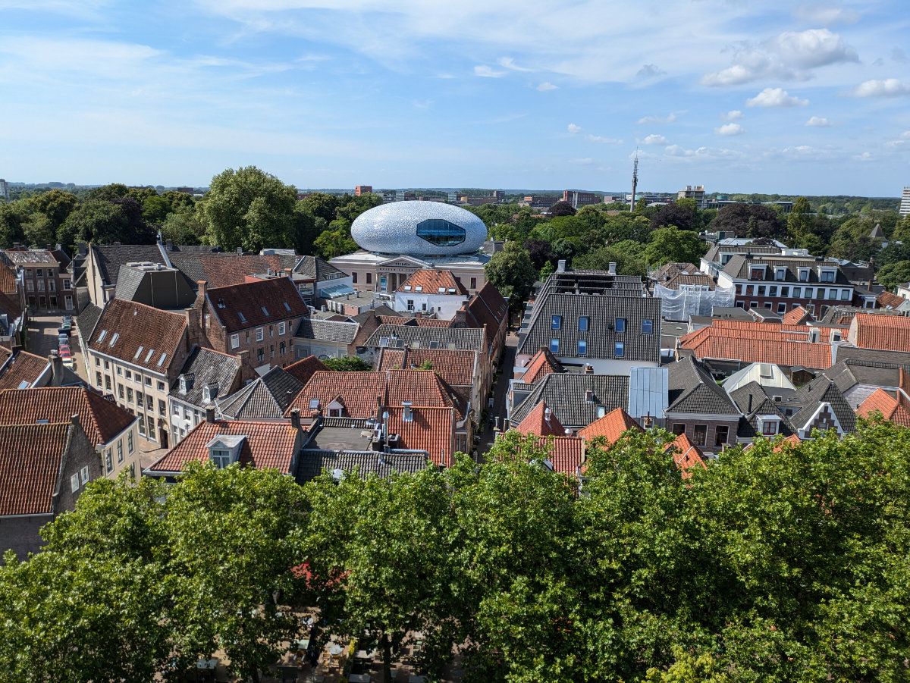
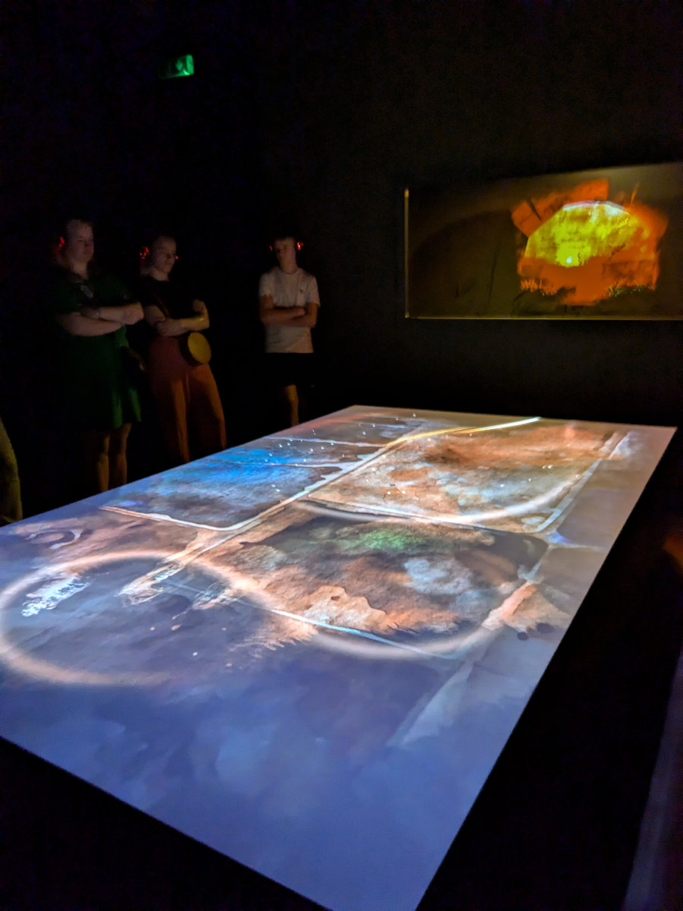
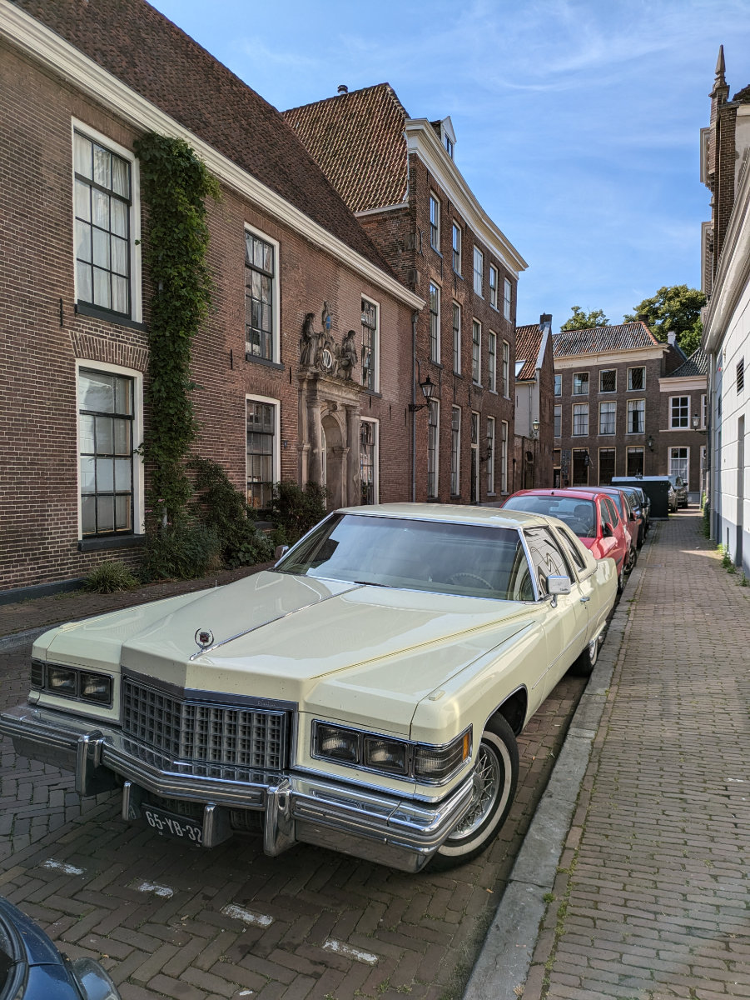
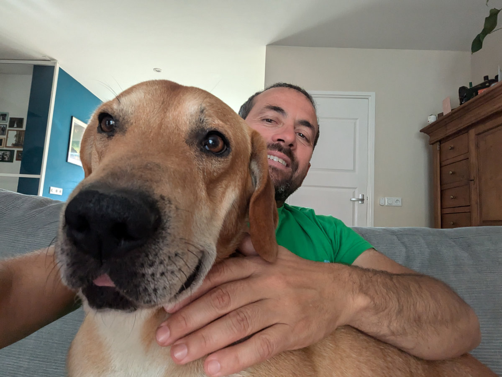

_Zwolle seen from the church roof_

Tonight all four of us will be reunited in our new country of residence. Hilly and Gemma will arrive late in the evening; they have an appointment at 1:00 PM in Baden, Switzerland, with a friend, and then they will continue through Germany towards Hattem. They surprised us by not stopping to sleep in France but coming straight here. Sophia and I can't wait.

Two days ago was Sophia's birthday, and we went to the cinema. Here we can also see films in their original language at the cinema, which is a nice thing. The films are not dubbed, neither in the cinema nor on TV. After the cinema, we wanted to eat something, but we filled up on nachos and chips and were no longer hungry, so we went home. Cycling along the railway bridge at sunset was beautiful.

Yesterday morning we went to a show that we had booked a few days before. In the main church of Zwolle, they built a closed structure inside which a show takes place every half hour. Our appointment was at 10:30 in the morning. At the entrance, they gave us wireless headphones, ours selected for the English language. Entering the first room, there were about twenty people, and there was a kind of large table on which images were projected. The subject of the story was the history of Zwolle and the "Hanseatic League," an alliance mainly of a commercial type between the cities of northern Europe and the Baltic Sea, a sort of "maritime republics" of northern Europe. Zwolle was part of this alliance.

In the second room, the story was projected all around on the walls and the floor. The music and the voice narrating the events were very engaging. A nice way to get to know the history. There were also children, and they seemed very captivated.

After the show, they took us up to the roof of the church to see the city from above. What a spectacle! Inside the church, there was also an exhibition of design objects made by emerging artists. One thing I noticed is that the churches in Zwolle host a variety of activities, not just religious ones. In one, there is a bar, and in another, a sushi restaurant.

On the streets of Zwolle, there was the city market. They were selling beautiful cherries at €4 per kg, an amazing deal!

Regarding my job search, everything is on hold at the moment, in the sense that I am responding to some advertisements from time to time, but I realized that in my portfolio, I have not given enough attention to a particular technology. I am remedying that.

The best way to find a job, however, is through networking, and for this purpose, I signed up for a "meetup" that will be held in Amsterdam on July 11. "Meetups" are free events that can be organized by anyone, and in the programming sector, they are usually organized by companies or associations to address a specific topic. I am told they are excellent places to build professional relationships.

From this point of view, that is, in starting and maintaining relationships, whether professional or friendships, I am a bit of a caveman, a lone wolf. But now I have to change.

_First pirt of the show_

_The exposition inside the church_

_Around the streets of Zwolle_

_Greetings from Bruno_
