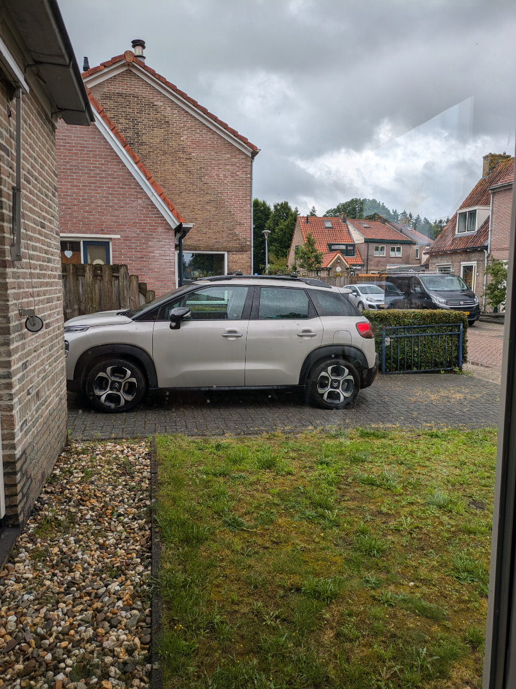
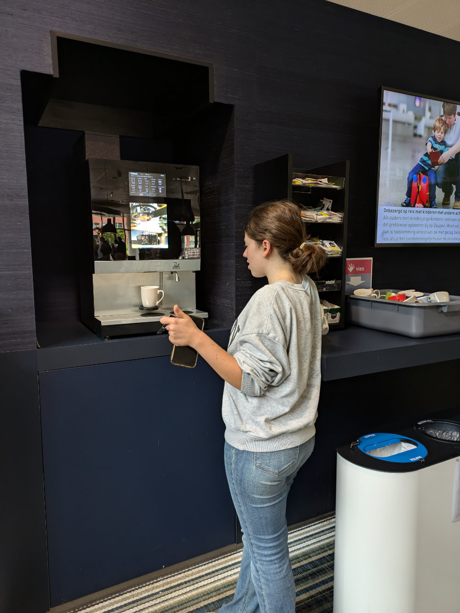
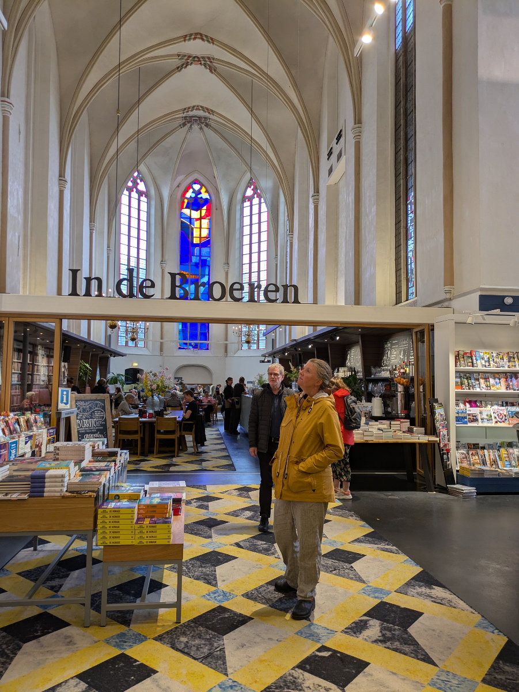
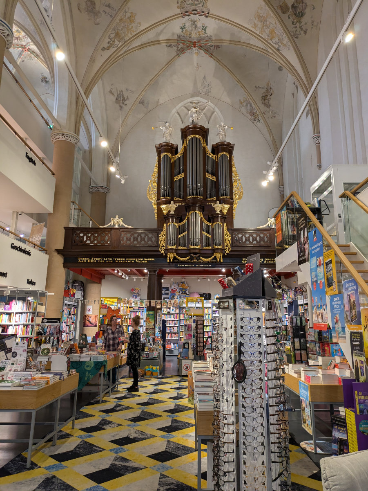

_How strange to see our car parked out here._

The Cassetta Family Has Officially Moved to Holland

Yes, indeed, Holland and not the Netherlands. Starting today, I will refer to it as Holland. For those reading the blog in English, nothing will change, but in Italian, I have been stressing everyone with “Paesi Bassi” and “Nederlandesi.” However, I have recently come across new information. Although Holland is only a region of the Netherlands, abroad, the whole country is often called Holland, and the inhabitants are referred to as the Hollanders. Even here, they often call their nation "Holland" themselves.\
Now that the European football championship is on, and the Dutch are great fans, like the Italians, I often see orange banners outside houses with "Holland" written on them. So, sorry if I caused some confusion, but long live Holland!

As I was saying, the whole Cassetta family is now reunited after almost a month of separation. Gemma and Hilly arrived at one in the morning, dead tired. They devoured the chicken curry I had cooked for Sophia and me, and then we all went to bed. They arrived with the car full of stuff. I don't know how we will manage to move around now that Sophia and I are here with our luggage too.

Yesterday, we spent the day in Hattem taking long walks with Bruno. Today, Gemma and I rented two more bicycles, which we will keep for the next week, and then we went to Zwolle because Hilly and Gemma had an appointment to get their social security number (BSN). I went with them because I wanted to enjoy the sublime experience with public administration again, and it was even better than the first time. Today, I noticed there was a machine for coffee, cappuccinos, hot chocolates, and various types of tea available to the public, all for free.\
The cups were ceramic!\
I immediately got a hot chocolate, and Gemma and Hilly had a cappuccino. As soon as we sat down on the sofas with our steaming drinks, Gemma and Hilly's numbers were called, and they rushed to the counters, leaving me with their cappuccino cups, making me look like the typical Italian who grabs as much as he can when there's something free.

After getting the social security number, we took a tour around the center because Gemma needs to practice riding her bicycle and learn to ride it in places other than the countryside. We entered another "non-church" turned into a bookstore and bar/café, very elegant, and then for a snack, we had fries, chicken nuggets, and meatballs, all fried. What a snack! Everyone was doing it, so we adapted.

Tonight, we watched the football match Netherlands-Romania. The Netherlands won three to zero, and at the end, fireworks were set off in our street. Poor Bruno, terrified, came to sit between Hilly and me for reassurance.

Tomorrow morning, we are all going to Leiden, an hour and a half by car from here, because we have an appointment with the school where we plan to enroll the girls. We made this appointment several months ago. At the time, thinking about this moment seemed distant and a bit surreal, but today we are here. We have been in this house together for only two days, but it already feels like home. It's incredible how quickly you adapt.

We will still have to move to different houses before settling in a permanent residence. It saddens me to think that most likely, the house we find in a few months will be the last house where all four of us will live together. Those walls will see Sophia leave first, followed by Gemma. So we have to choose it well.

_Gemma takes her cappuccino in the town hall._

_The former church converted into a bookstore._

_The Dutch have truly understood how to use churches._
