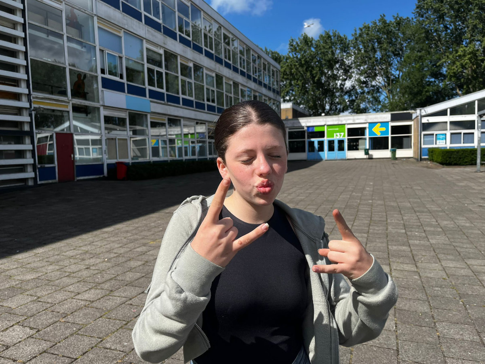
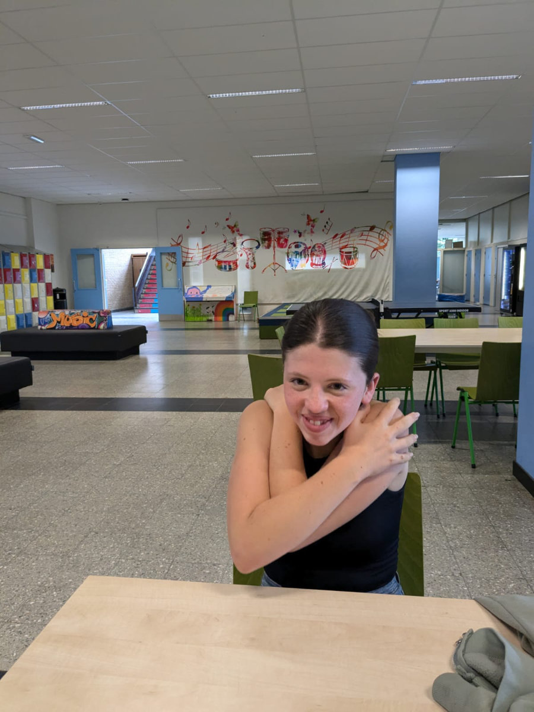

_Gemma in a typical youngster pose, in front of the school_

We left Hattem at 9 in the morning, after taking Bruno for a nice walk since he would be home alone for several hours. By 11, we were in the office of the school enrollment officer. She offered us something to drink before starting the meeting, and then we sat at a large conference table, the four of us on one side and her on the other.

She began by giving us an overview of the school, the Leonardo da Vinci Institute in Leiden, showing us charts that depicted the various stages through which students, within a maximum of two years, were introduced into the Dutch school system after learning the language. The students at the school are between 11 and 18 years old, mostly from the Middle East and North Africa, with some from Ukraine. It was the last day of school before summer vacation, and we noticed at the entrance that almost all the girls were wearing the Hijab, the traditional Islamic veil that covers the head and neck.

By the end of the meeting, which lasted almost an hour and a half, all our questions had been answered, and we decided to enroll the girls in that school. At that point, the officer took a laptop and asked us a series of questions to fill out the enrollment forms, which we signed at the end. She also told us that Sophia and Gemma would need to take four written tests and a small reading test to be placed in the appropriate classes for their level. They could take the tests immediately, but since we had Bruno home alone, and the tests would take more than two hours, we scheduled them for the next day, again at 11.

We left the school feeling very enthusiastic about the reception we received; the only one slightly unhappy was Gemma, who thought she was done with tests after just finishing middle school exams, only to face new ones the next day. The school building is quite old, and next year will be its last year of use before it is demolished, and the students will move to a temporary building until the new one is ready.

The next morning, Hilly and the girls left at 9 to return to Leiden and complete the enrollment process. The tests included a brief reading test in Dutch, a logic test to assess the students' ability to learn new concepts quickly, a math test, an English test, and a Dutch comprehension test with multiple-choice questions. Based on the test results, students were placed in one of three learning pace classes: slow, medium, and fast. There is also a fourth class for students who arrive at the school completely illiterate.

While the girls were taking the tests, I stayed home to work and look for rental houses in the Leiden area. If we don't find a house in Leiden or one of the nearby small municipalities by the start of school, the enrollment will be canceled, and we will have to enroll them in the area where we end up living. We hope to avoid this because we like Leiden and the school very much.

Around 3 PM, Hilly and the girls returned. The first thing Sophia said was, "It's incredible, everything worked in that school!" The tests started exactly at 11, and all the computers the students (there were 13) had to use for the tests were working perfectly, with no issues. We were not used to such efficiency. Both Sophia and Gemma were placed in fast-learning classes. Sophia also did well in the Dutch comprehension test, so they gave her an additional written test in Dutch, which didn't go as well. Their understanding of the language is advanced because they know Afrikaans, but their writing skills still need improvement.

A significant difference from Italian high schools is how smartphones are managed. Since last year, the Dutch government has enforced a strict law banning the use of smartphones by students in all schools. At the school entrance, there are lockers where students must leave their phones from 8:20 AM until they leave, usually at 4:00 PM. They can't even take them out during breaks or lunch. This isn't new for Gemma, as it was already like this in middle school, but in high school, Sophia told us that most of her classmates were constantly on their phones during any break.

Now we just need to find a house in the area of the Netherlands where it is hardest to find one. To rent a house, you often need to prove you have two good salaries. The best houses we see in ads always have these requirements. The task is daunting, and there isn't much time.\
Will our heroes succeed?\
We'll find out in the next episodes.

_Gemma ready to take the tests_

_The school's entrance_

_The chart explaining the educational pathway_
