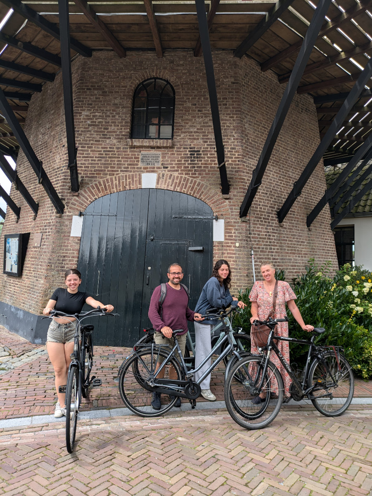
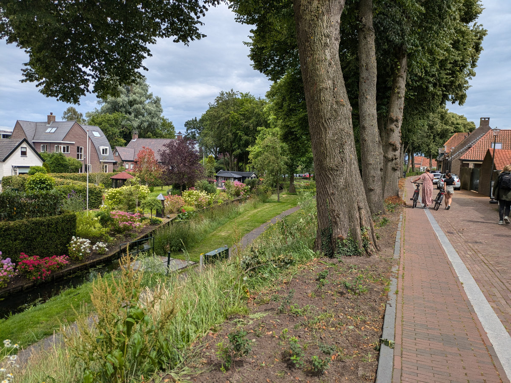

_Our Sunday outing to Hattem_

We are really enjoying Hattem and the fantastic house of Ben and Moniek.
Last night at 9:00 PM there was the Netherlands-Turkey soccer match, the quarterfinals of the European Championship. Not knowing this in advance, we had booked a cinema for exactly the same time.
We biked to Zwolle even though it was cold and it could have rained at any moment.
As we arrived at the cinema, there were hordes of Dutch people, each with at least one orange garment, heading towards the center of Zwolle, where the match was being broadcast.
We were going to see “Inside Out 2” in 3D.
When we left the cinema, happy nonetheless to have seen a great movie, the match had just ended and from the center of Zwolle came a wave of music, screams, and car horns. The Netherlands had won, 2-1, and now goes to the semifinals against England. We absolutely won’t miss the next match.
Returning home, it felt like New Year’s Eve with all the fireworks booming through the streets.

Today we went to lunch in Hattem. As soon as we left the house, obviously by bike, it started to rain. Gemma cursed us the entire way.
In Hattem square, there are several bars/restaurants, and we chose the busiest one with a free table. We took the opportunity to toast to celebrate the fact that all four of us have officially immigrated to the Netherlands.
There was Coke in my glass.
On the night of last December 31, I made a promise to myself that I wouldn’t drink any alcohol until I found a job in the Netherlands. Six months have passed, and I have not yet succumbed to the temptation of drinking a cold beer or a good glass of red wine.
There have been some occasions when it was really hard to resist, but so far I haven’t given up. I started this because I needed to be more clear-headed in the early morning when I was in front of the computer for my 3/4 hours of study and programming before starting work, and lately, I felt that even a couple of glasses of wine the night before didn’t allow me to be 100% focused.
But I have to admit that I can’t wait to celebrate my first job with a nice beer. Hopefully soon.

Gemma is becoming more and more confident on her bike even though she panics a bit in very busy areas. In a few months, she will have to use it daily to go to school. I’m sure that when she sees her classmates doing it naturally, she won’t see it as an imposition and will put more effort into it.

Hildegard spent all afternoon yesterday redoing her resume. She’s trying to combine all her experience in the hospitality industry with her new passion for social media. For several months she has been managing the social profiles of two of her friends to learn the trade.
Another job she would like to do is being a mail carrier. The idea of going house to house delivering letters and meanwhile exchanging greetings and chatting with dozens of people a day fascinates her a lot. I think this job suits her perfectly.

Sophia is making beautiful fashion drawings. A few days ago she bought a collector’s edition of Vogue magazine from which she is taking inspiration. She is also studying Dutch because she wants to be as prepared as possible when school starts. Maybe I hadn’t mentioned yet that the language the teachers will use will be exclusively Dutch.
I also need to get moving with Dutch otherwise by Christmas I’ll be the only one in the family who still doesn’t understand anything.

_Through the streets of Hattem_

_Here we are still unaware of the approaching downpour._

_We are not yet equipped for all this rain._

_The curious trattoria "Tabacchi" in Zwolle_

_Lagotto dogs are also found in the Netherlands._
