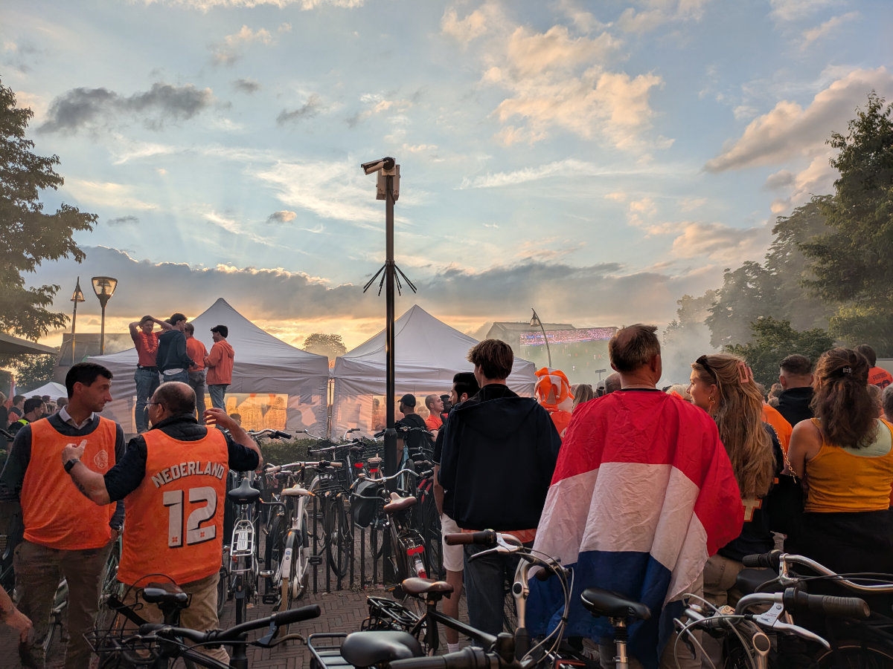
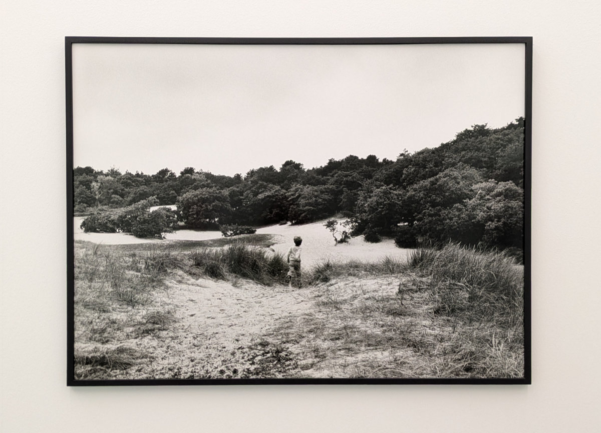
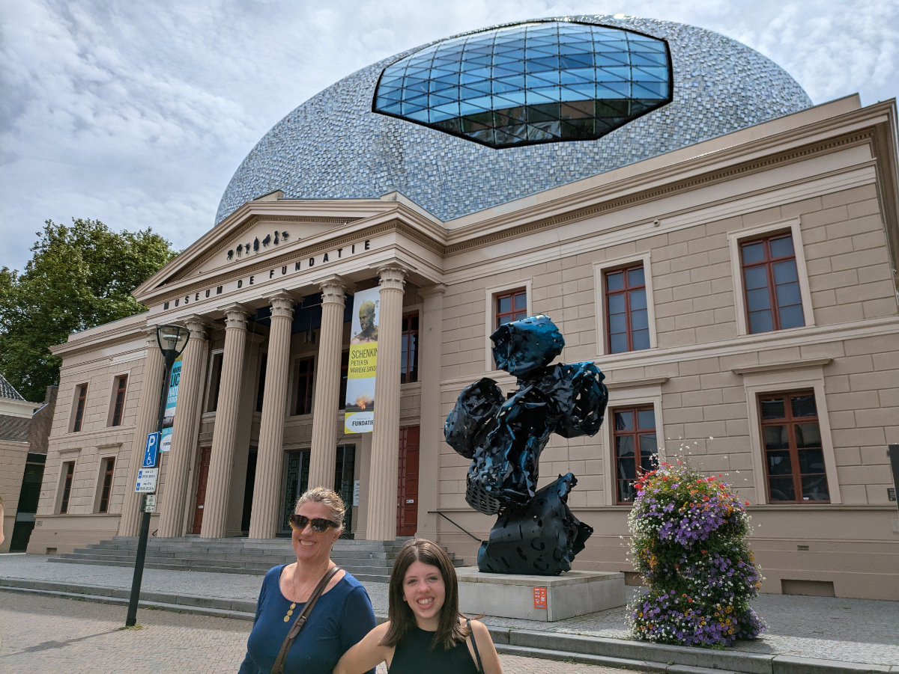
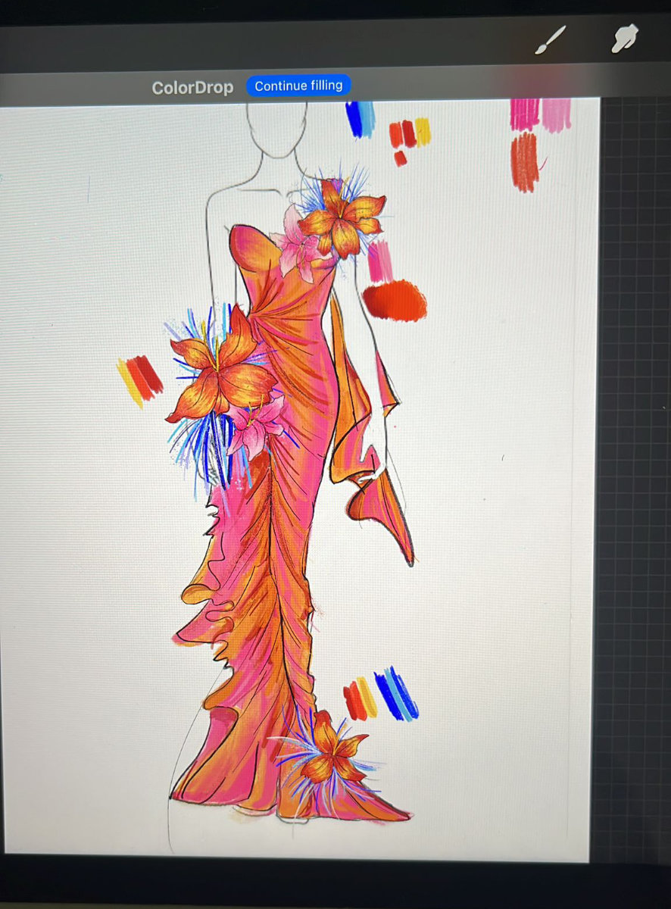
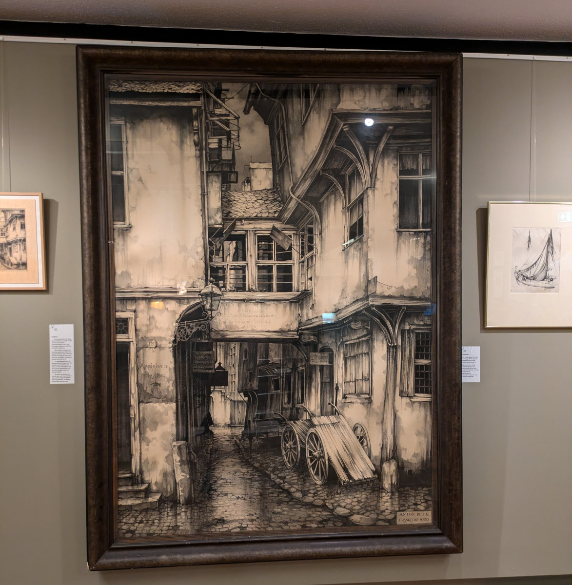
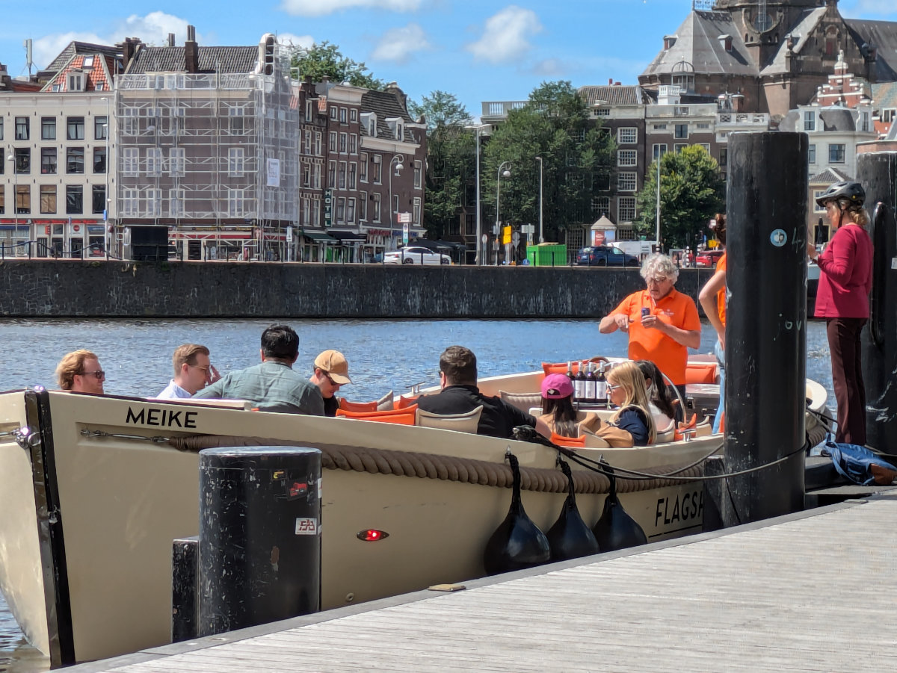
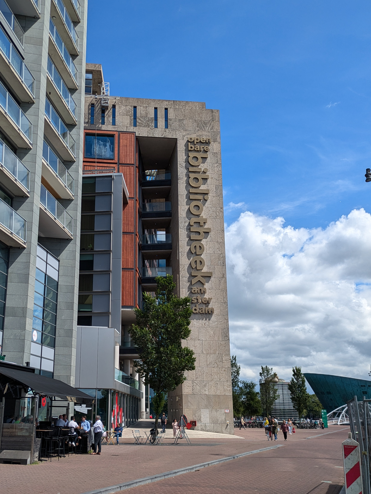
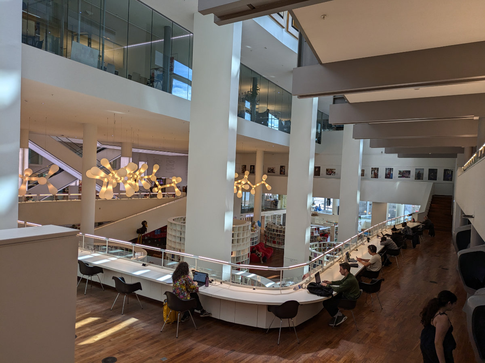
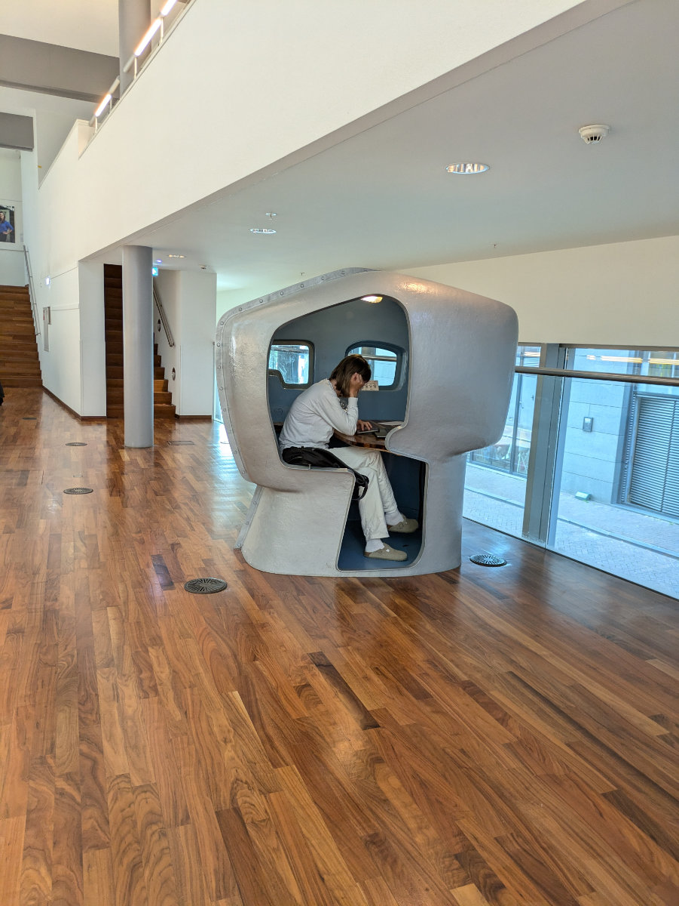

_In the distance you can also see the screen_

I am on the train from Zwolle to Amsterdam. I just met Bart and Moniek at the station where they arrived with their car. They said they had a wonderful trip through Albania, Bosnia, and Kosovo.
Saying goodbye to Bruno was tough. Gemma said she can't do as many pet sittings as Sophia and I did because she gets too attached to the animals.
Right now, the train is passing over the red bridge that crosses the Ijseel River, and out the window, I see the bike path we have ridden many times from Hattem to Zwolle by bike.

Last night, for the first time, we went to Zwolle by car (we had returned the rental bikes) to watch the soccer match between the Netherlands and England.
The Dutch take cheering for their national team very seriously. We thought we would enjoy the semifinal in front of the big screen set up in a large square in Zwolle, but it turned out a bit differently.
Thousands of people dressed in orange were trying to catch at least a glimpse of that screen, hoping to see their team/nation win.
I want to emphasize that it was not just thousands of people but thousands of very tall people, which in my case, given my height, made the task even more difficult.
It was like when you were a kid and went to a very crowded place, except in this case, my father wasn't there to put me on his shoulders.
Anyway, we found a pretty good spot, in front of some bicycles that blocked any potential giants, and we watched the whole match. The Netherlands played quite poorly and lost two to one.
It took us an hour to get out of the parking lot.
Bikes are better!

In the last few days, we made use of our “museumkaart” and visited the foundation museum in Zwolle and the museum dedicated to Anton Pieck in Hattem.
In the interesting building of the Foundation Museum, we saw a series of contemporary art paintings, photographs, and videos. One of the photos, depicting a child in winter among the sand dunes, reminded me of a past memory.
When I was maybe 4 or 5 years old, I went to Sardinia for Christmas. I usually went there in the summer and spent a month camping among the magical sand dunes of Chia. For me, that sea represented total freedom, and during the cold and foggy Milanese winter, I dreamed of running down a dune to dive into its warm turquoise waters. So, when I went there in winter, my little brain had a kind of synaptic short circuit that made me run down the dune to dive fully clothed into the transparent and icy waves of Chia.

---

_The painting that revived my memory_

At the Anton Pieck Museum, we saw the works of this interesting Dutch painter, illustrator, and graphic artist who lived throughout the 20th century. You have probably come across one of his illustrations in a fairy tale book or might have heard of "Efteling," a fantasy-themed amusement park that he helped design, located in the southwest of the Netherlands.

_The Zwolle Foundation Museum_

_The big museum window_

_A dress designed by Sophia_

_A drawing by Anton Pieck_

This morning, Hilly and the girls left quite early to go to Oosterbeek, where we have our new pet sitting gig. They left with a car so loaded with stuff that there wouldn't have been any room for me anyway. Gemma and Sophia had to carve out a niche among bags, slippers, beach rackets, boxes, and various binders. Hildegard didn't have the energy, during the preparations for the departure to Tuscany, to pack a bit more efficiently. In all this, she forgot to bring my only box, a 40 cm sided cube, with some clothes I needed for the summer. I love you, my dear wife!

Meanwhile, after the train ride, I arrived in Amsterdam, bought a tuna salad at an Albert Heijn, one of the Dutch supermarkets, and ate it on a bench in front of a large canal from which small boats departed to take tourists among the canals. I will spend the next few hours in a library ten minutes’ walk from Amsterdam station, a place open from morning until ten in the evening with plenty of workstations, large tables, a café, and several floors of books and other workspaces. A perfect place to work in peace.

At 6:00 PM, the Meetup I signed up for several days ago begins, during which I hope to find some contacts for potential job opportunities. The Meetup is organized by an association for Frontend developers, I didn't even know such a thing existed. There will be two short conferences interspersed with social moments, precisely for networking.

Yesterday, I had my first phone call from a company to which I responded to a job advertisement. They immediately asked if I spoke Dutch, and when I said no, they replied that unfortunately, it was necessary for me to speak it, in addition to English. They also asked how much experience I had with Angular, and I said none at all. So, the conversation ended there.

I have applied to about forty job ads in the last few weeks and always avoided doing so when Dutch language proficiency was mandatory or when I didn't know the required technology at all, yet at least one slipped through, and that’s the one that contacted me. I had underestimated the necessity of the Dutch language in the tech sector. All the information I had gathered made me think that English was sufficient, but now, among all the job ads I see for developers, at least 50% also require Dutch.

Anyway, I remain positive and motivated, and Hilly also seems quite enthusiastic.

_There are more bottles of wine on board than people._

_The "Bibliotheek"_

_Inside the library where I'm working right now._

_The concentration cubicle. There are several of them._
