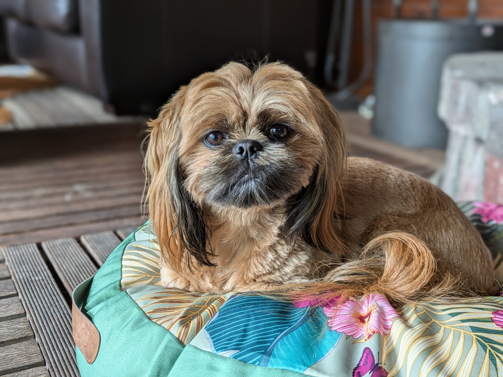
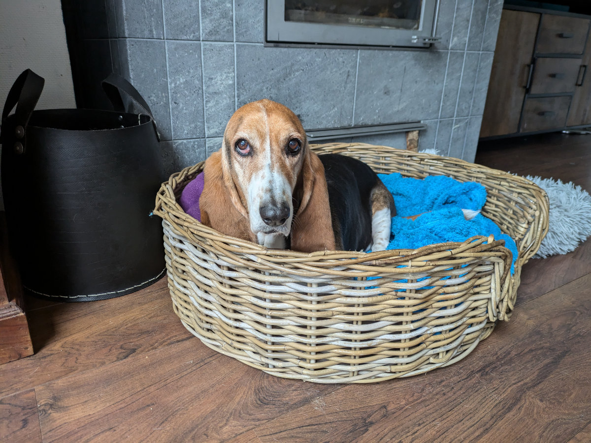

_How can you not want to smother her with kisses?_

We are at the home of Karen and Jaco, a South African family currently on vacation in France. Hildegard and Karen were colleagues 30 years ago for a short period, but they have stayed in touch. When they learned that we were doing pet sitting, we made arrangements, and now here we are in Oosterbeek.

This area is a bit different from what we have seen so far. The village is situated on a hill, so there are ups and downs, quite a novelty. Five kilometers away is Arnhem, a city with 167,000 inhabitants.

Karen, Jaco, and little Amee have two dogs and a hamster. One of the dogs is named Abbie, immediately renamed "Spiffy" by Gemma. Spiffy is a one-year-old female and is like a stuffed toy. Sophia says she causes a strong "cuteness overload". That uncontrollable feeling of almost wanting to devour a creature that is too cute. Spiffy constantly wants to play and prances around the house like a little elf.

The other dog is named Lilly; she is eleven years old and has severe arthritis. Watching her clumsily move on her half-deformed arthritic legs breaks your heart. She has a sad yet very sweet look in her eyes.

_Look at her eyes_

The hamster is named Pluisie and stays in his cage all day except when someone puts him in a perforated, transparent plastic ball, allowing him to roam the room erratically, spinning the ball as he moves. The house is large and very beautiful; we even have a jacuzzi in the garden and a sauna. As in all other places, except when we were in downtown Amsterdam, there is an unreal silence, and it seems that the houses around us are all uninhabited.

Yesterday we were supposed to go to another South African barbecue, at lunch with some acquaintances of Hilly (whom she had never met), but Hilly wasn't feeling well, so we canceled. So, the girls and I went to visit the "Nederlands Openluchtmuseum," just ten minutes by car from home. The "Dutch Open Air Museum" is a theme park dedicated to Dutch history, customs, and traditions, founded in 1912. It was a real surprise; the girls expected another boring art gallery, but they had a lot of fun. There are various villages, all made of real houses, most of which are historical buildings transported there for preservation.

There are craft shops where detailed demonstrations of traditional processes are given, and the artisans actually produce the goods, not just for show. It was wonderful to enter the houses and see how they were furnished 2 or 3 centuries ago. A novelty was seeing how people slept back then. In all the country houses, there is a rectangular cabinet, usually in the kitchen, with blankets and pillows inside, where people evidently slept in a fetal position, given the bed's length and the height of the Dutch. They kept it in the kitchen because it was the warmest room in the house.

Tomorrow morning, we will take Sophia and Gemma to Düsseldorf, where they will fly to Cagliari. Gemma can't wait to go to the beach every day with her best friend, Elena, and Sophia will also see her best friend, Maya, who she hasn't seen in a year and a half since Maya moved to Australia. Now, Maya is also going to Pula, and they will spend several days together. I already know we will miss them a lot, but it will also be nice to be just Hilly and me for two weeks.

In these two weeks, we will be pet sitting in Wassenaar, an apparently very popular seaside town among Germans, between The Hague and Leiden, and then we will go to Scheveningen, next to The Hague, also on the coast, where we will be when the girls return to the Netherlands.

In the previous post, I was talking about the Meetup I was going to attend that evening. Here's how it went. At 6 PM, we gathered in the offices of a company that develops the app "Werkspot," also active in Italy under the name "Instapro," through which you can request services from plumbers, electricians, masons, etc. There were about forty of us, with 40 pizza boxes and two fridges full of drinks. Two mini-conferences on very specific web development topics were held, and before, during, and after, we ate pizza and drank while chatting with other participants until 10 PM.

For me, the event was very positive. I met a couple of developers with whom I exchanged contacts, but more importantly, it made everything feel a bit more real. I have been studying and practicing something for four years but have never had the opportunity to discuss these topics with anyone because I don't know any frontend developers.

Hilly has made progress in her attempt to start a career as a social media manager. A friend assigned her a client, so she will start getting paid hourly. It's not much, but she is learning many things that will surely be useful in the future.

From Friday, we will be very close to Leiden, so we can visit some agencies in person to find a rental house. Today, we actually had a video call appointment with an agency, but they canceled at the last minute.

_I surprise Gemma while she's enjoying the jacuzzi._

_Dutch beds from the past_

_The shipbuilder's workshop_

_The pantry full of provisions_

_Wandering through the little villages of the open-air museum_

_The girls on an exploration_
