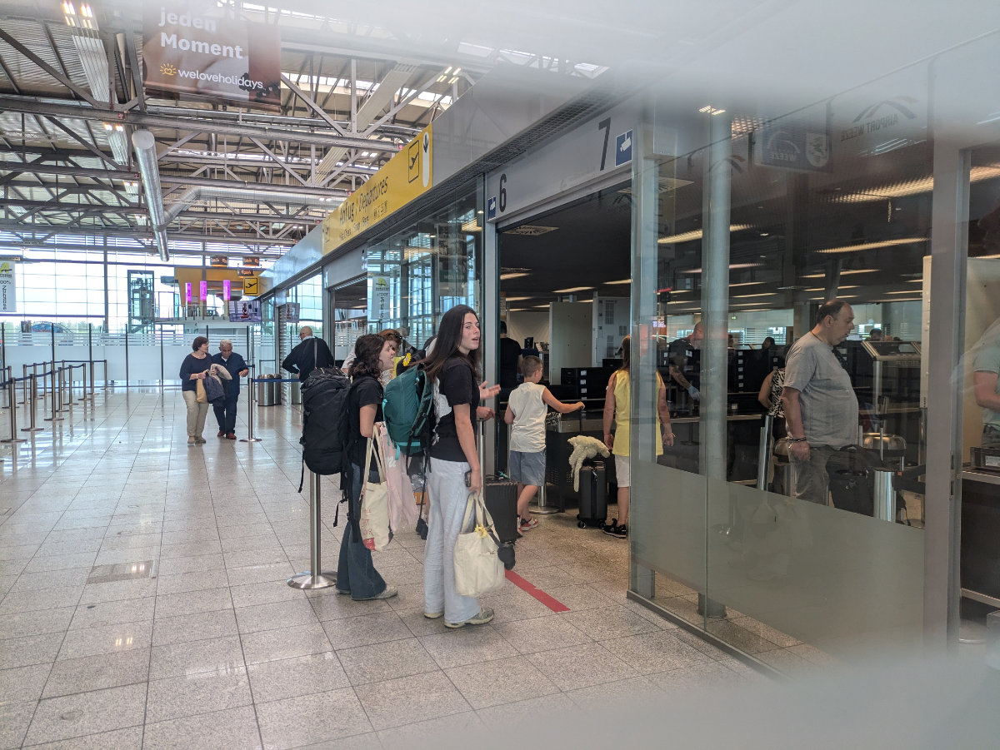
_the world is our oyster_

The girls left a few days ago, and every now and then we receive some photos of the crystal-clear sea of southern Sardinia. I am happy that they are there. I said goodbye to them at Dusseldorf airport, and it was nice to see them go through security for the first time on their own. I hope this will be the first of many trips they take around the world.

We left Karen and Jaco's house two days ago. Saying goodbye to "Spiffy" and Lilly was not easy. We spent the last few days in Oosterbeek mainly sitting in front of the computer, working, and looking for a job and a house. Still nothing concrete. One day we went to visit the Kroller Muller museum. The museum is located within a large natural park. At the park entrance, there is a parking lot where you can leave the car and take one of the hundreds of bicycles provided by the park to explore it in complete tranquility.

After a few kilometers of cycling through oak forests and an area of low spontaneous vegetation, which feels like being in South Africa, you arrive at the museum. The Kroller Muller museum is another open-air museum. Walking in the large park of the museum, which is itself within the natural park, you can see large modern and contemporary art sculptures positioned in the landscape, which enhance their value.

You can follow different paths and trails, all dotted with signs indicating which emotions and sensations to pay attention to. At the end of the visit, we realized there was also an entire indoor section that we didn't manage to visit thoroughly, so we promised to return with the girls.

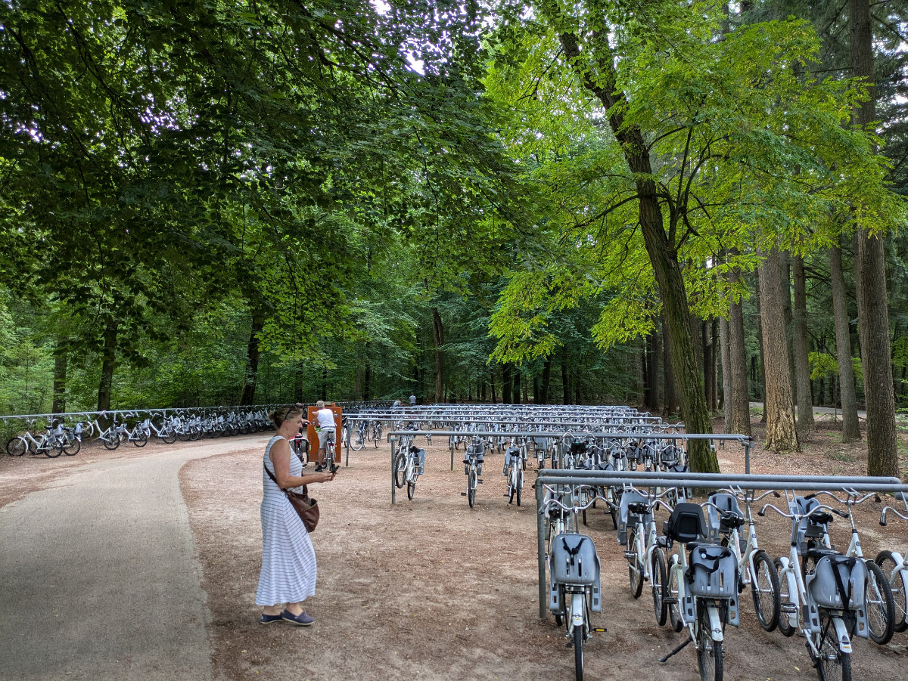
_The bicycles in the natural park._

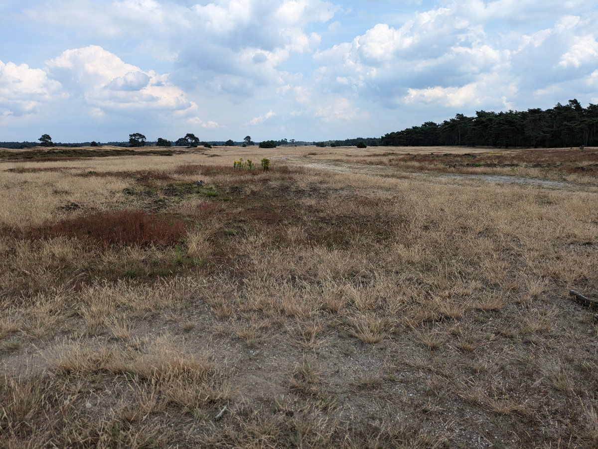
_The Dutch Savannah_

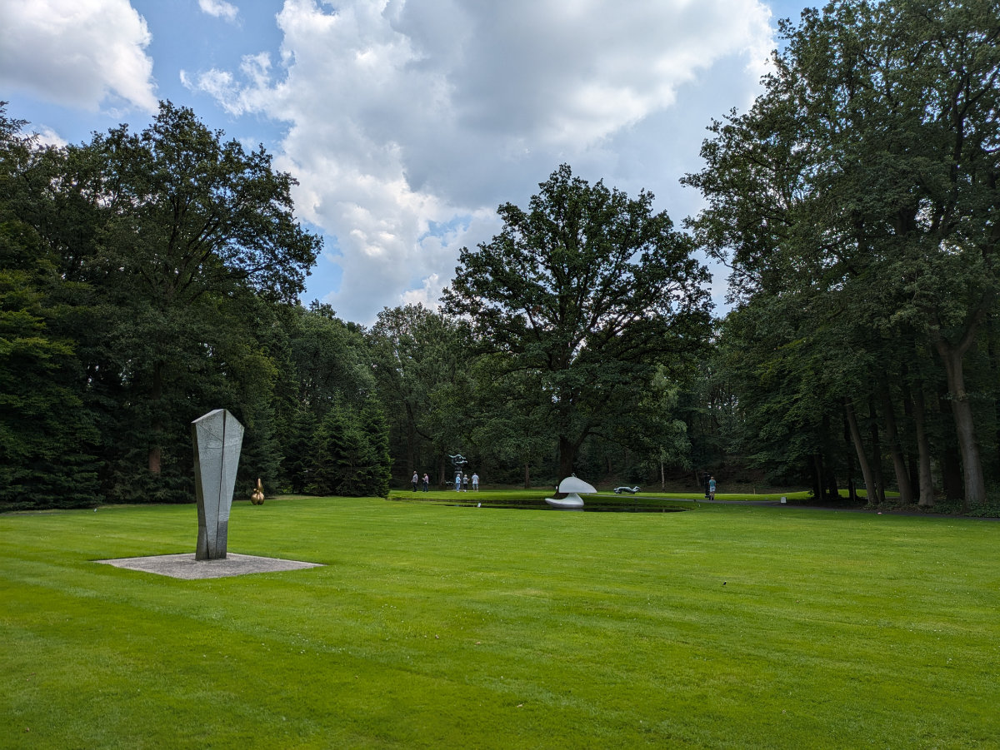
_The Kroller Muller museum_

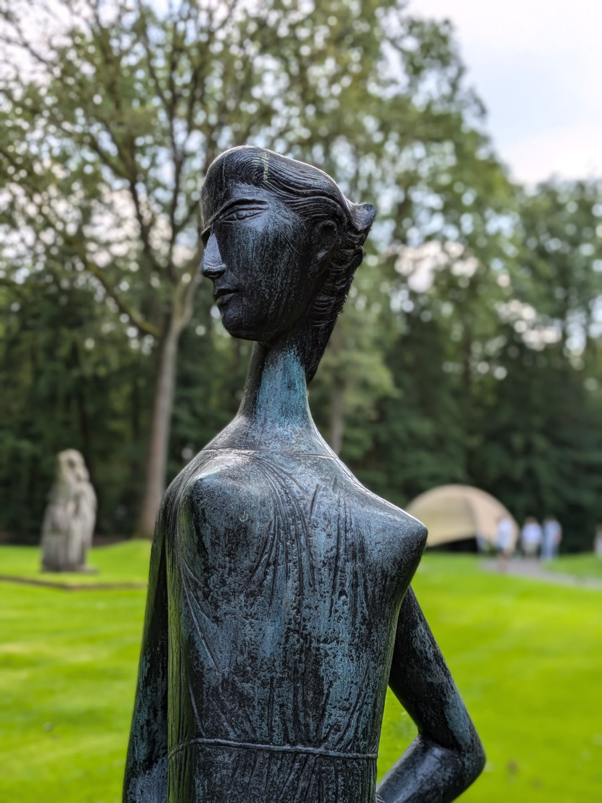
_A statue from the Kröller-Müller Museum_

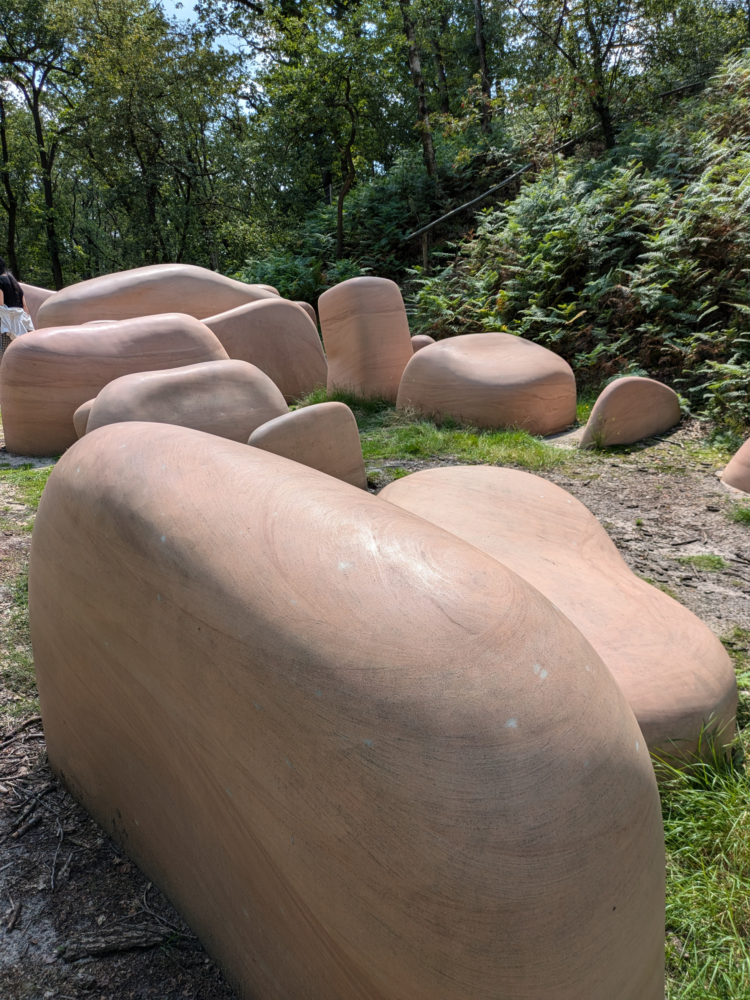
_Large pink rocks_

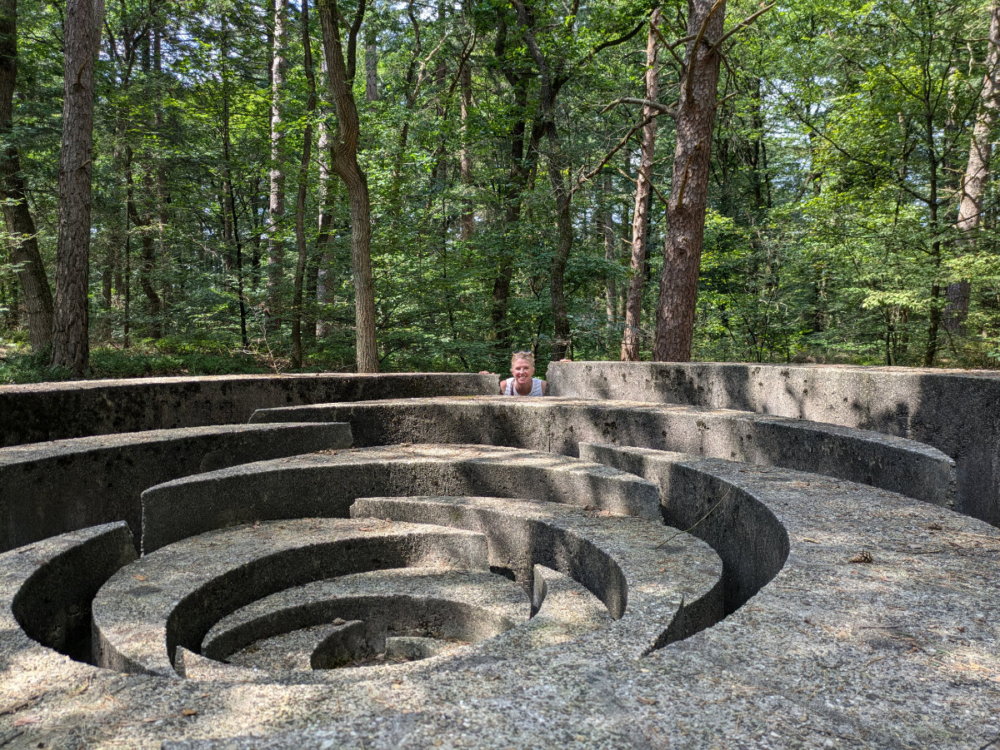
_Peekaboo!_

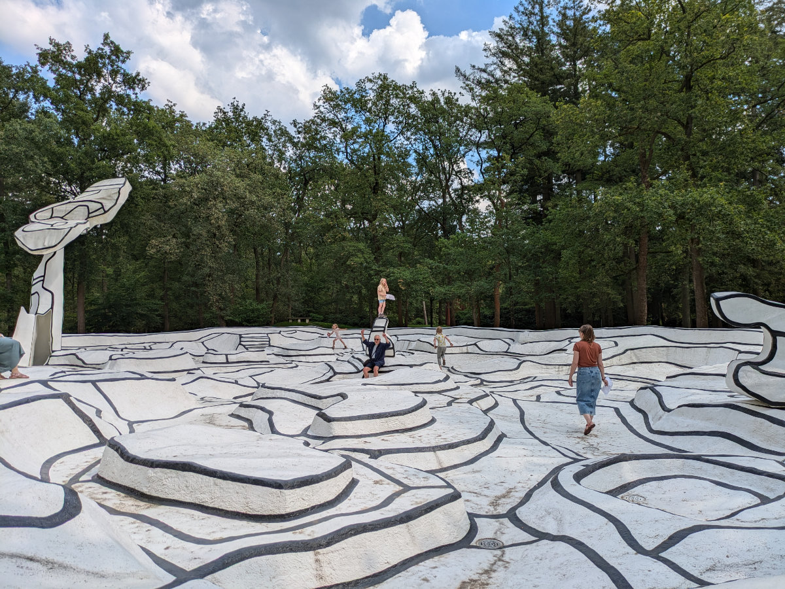
_The bizarre black-and-white maze of the museum_

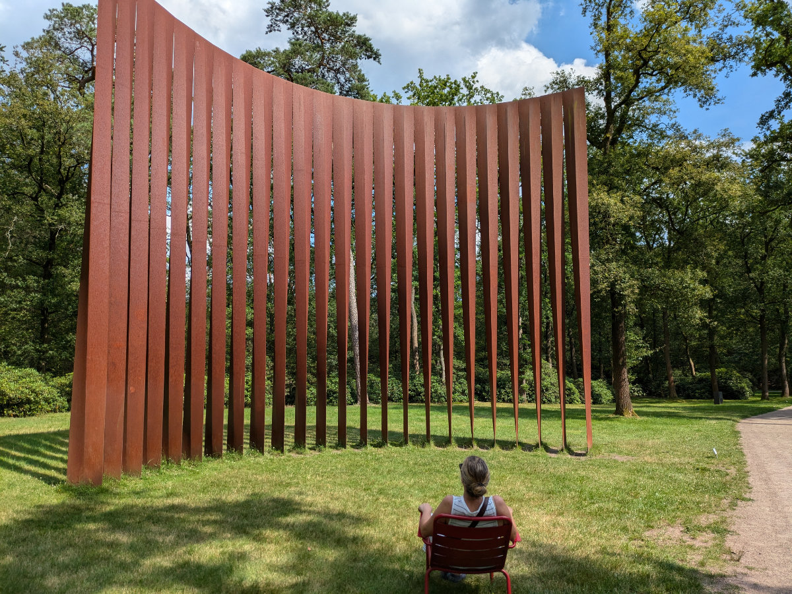
_Long rusted steel pillars_

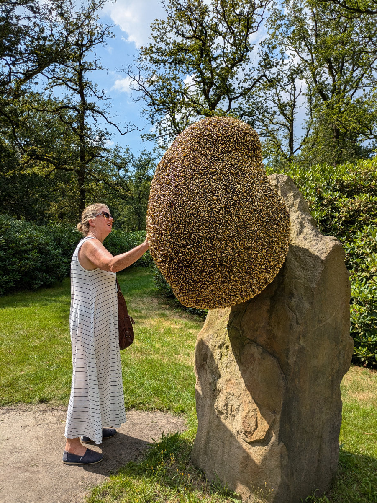
_A large beehive_

For the past couple of days, we’ve been staying at Naina and Martin’s house. They have two daughters around the same age as Sophia and Gemma, and they’ve gone on vacation for ten days, leaving us their home to take care of their three cats, two guinea pigs, and a fish tank.  
Their house is in Wassenaar, a town 10 km north of The Hague and 5 kilometers from Leiden.  
Wassenaar is one of the most expensive places in the Netherlands when it comes to house prices. The area is very green and well-maintained, with lots of small streets and bike paths, and the sea is just a few minutes away.

On Saturday afternoon, we cycled to Leiden. There were many boats on the canals, many of which had speakers playing music and young people partying.  
We went to Leiden to pick up a “2good2go” bag. It’s an app that allows you to buy a surprise package from bars, cafés, supermarkets, and bakeries containing food items that, for various reasons, would otherwise be thrown away but are still good to consume.  
The cost of a bag is around 5 euros. We had picked up one in Dharnem for 5.90 euros from a café in the center, and it contained a variety of sandwiches, pastries, and savory items that hadn’t been served during the day.  
The bag we got on Saturday in Leiden, however, came from a supermarket, cost 5 euros, and contained two large pasta salads, a pack of pork tenderloin slices, and a half-kilo strawberry yogurt. It’s a way to save money and avoid the senseless waste of food.

On our bike ride back from Leiden, we saw a house with a “For Rent” sign outside. We stopped to chat with the neighbor who was busy working in the garden.  
The house is a two-story house, similar to the one we’re in now, probably about a hundred square meters, but located in a nice area of Wassenaar, overlooking a canal and a park. The lady told us that until recently, an English family lived there. Our daydreams of moving into that house were abruptly interrupted when the lady told us that it was being rented for 3,000 euros a month. Our budget is 2,000 euros, at least for now.

Today, we want to visit some real estate agencies in the area and try to understand if it’s possible to rent a house even without two employment contracts.  
We are in contact with an agency run by South African women that helps expatriates or families looking for a home in the Netherlands. The person we spoke with said it is possible to rent a house without employment contracts but by paying 12 months in advance. This agency, however, charges a month's rent as a fee, like most agencies in the Netherlands, but they want a thousand euros in advance and exclusivity in finding us a house. We haven’t felt ready to commit to them yet, at least until we’ve thoroughly checked how local agencies operate. We’ll do that in the coming days.

Another possibility would be to rent a furnished house on a short-term basis until we have two employment contracts and, therefore, the possibility to consider any rental offer. We’ll see in the coming days.

---

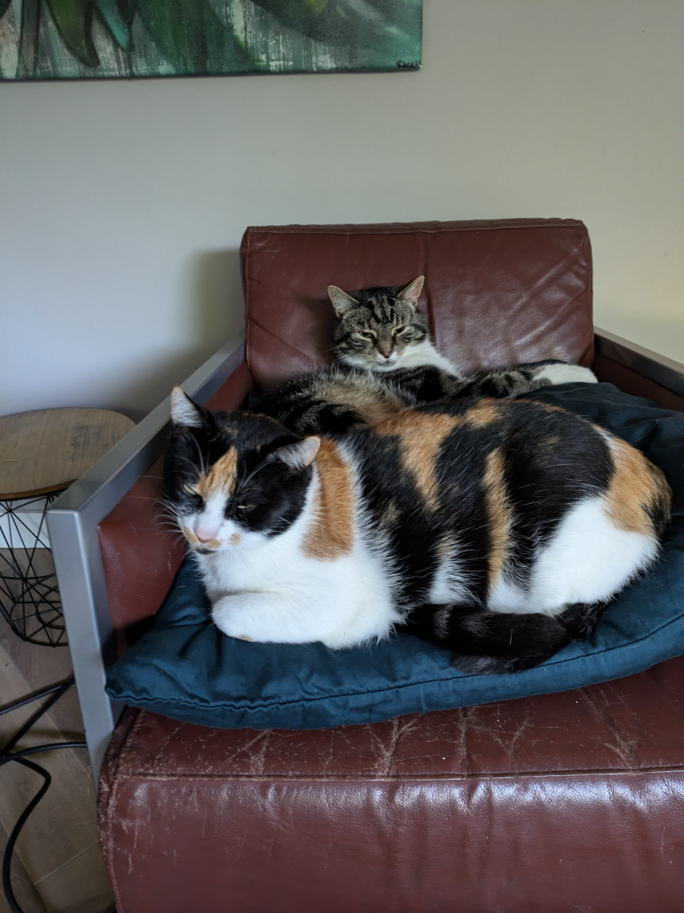
_Ody e Tippy the cats_

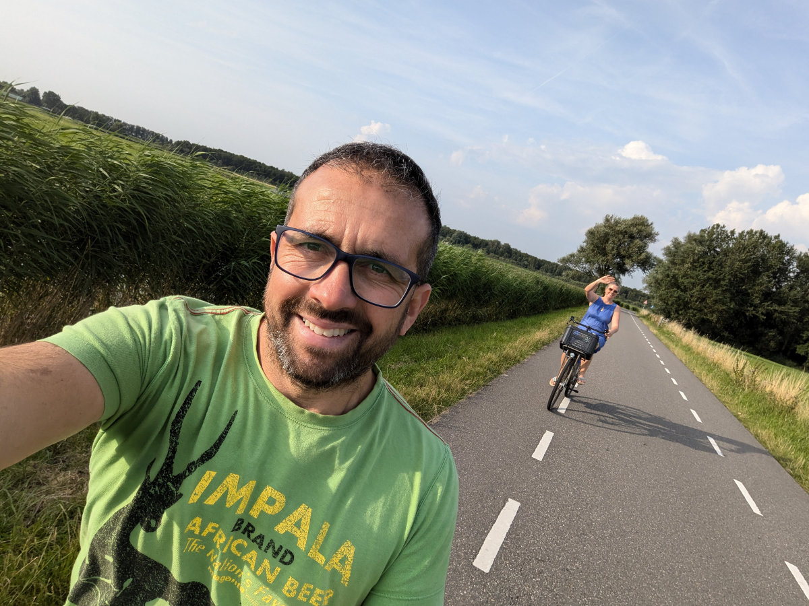
_On the way back by bike from Leiden_
