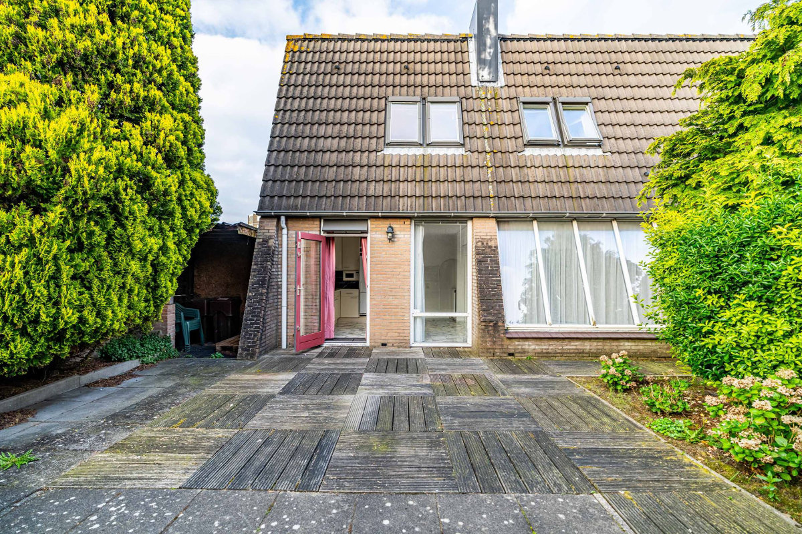
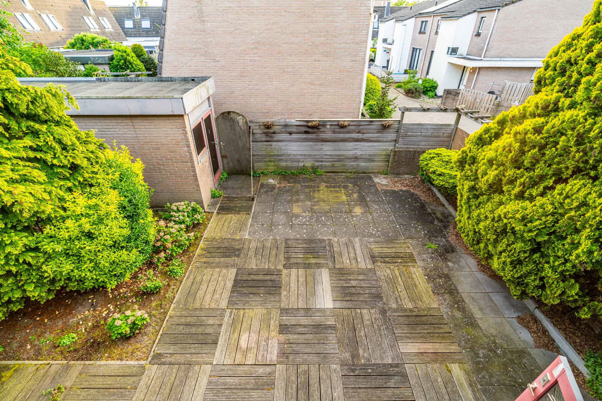
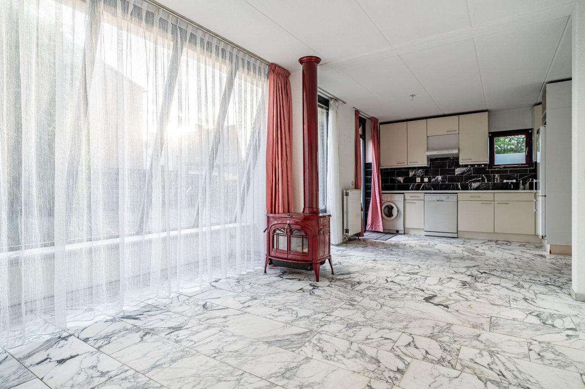
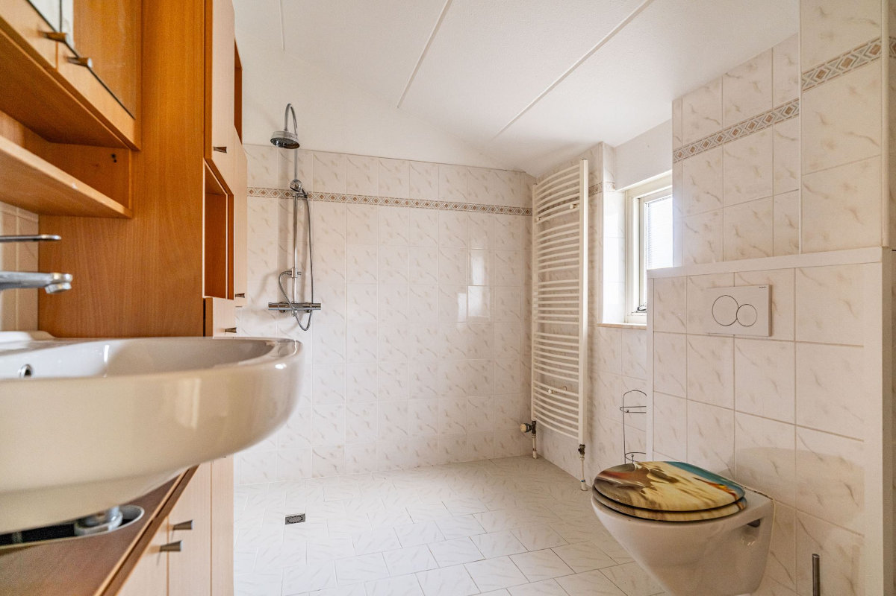
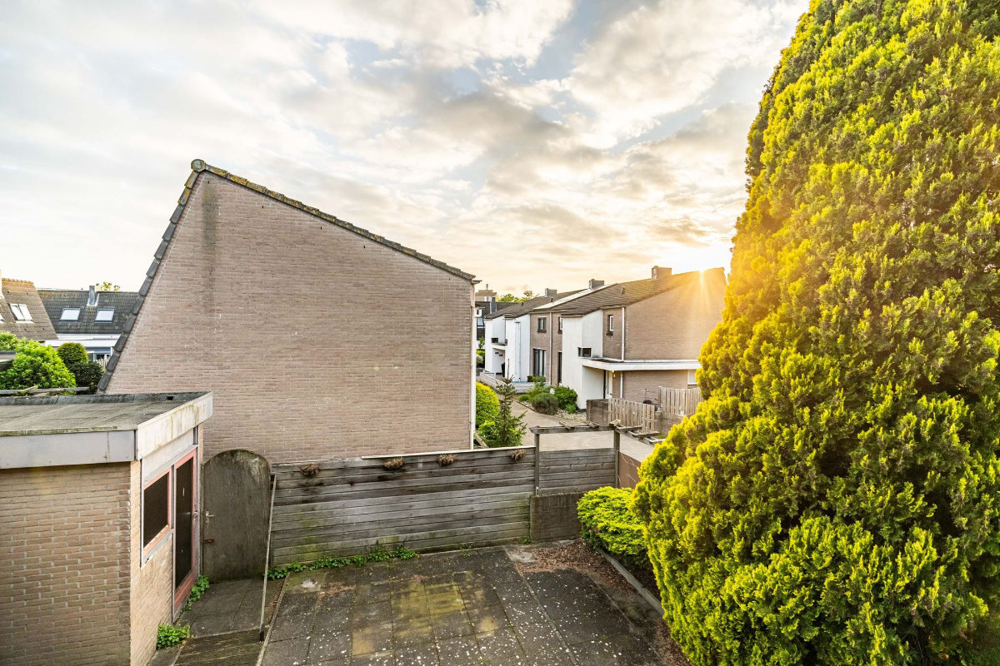
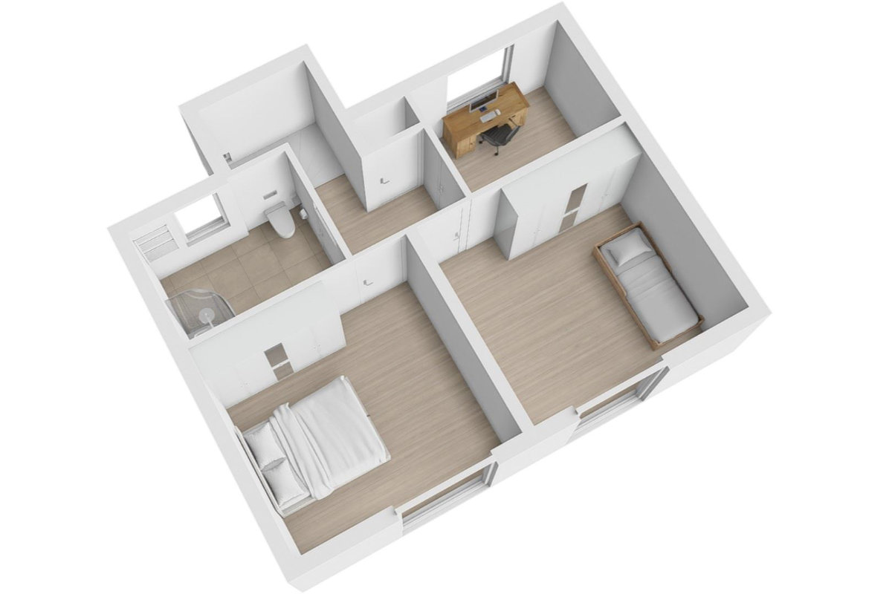

_The house seen from the garden_

Maybe we've found it!

This morning, Hilly and I went to see a house for rent in Leiden. We were taken there by an agency run by South Africans that works exclusively with expats. It’s the first house we’ve visited, and it might be the only one.

It’s a somewhat unusual building compared to typical Dutch houses, which all look a bit similar. Although the house is already livable, there are some “horror” elements like the entire ground floor flooring, the kitchen, and some furniture that would stay in the house. The most positive aspect is that it’s only a seven-minute bike ride from the school that Sophia and Gemma will attend and fifteen minutes, again by bike, from the center of Leiden.

The area is also very quiet and well-served. There’s a train station 5 minutes away; supermarkets, cafes, and restaurants are very close, as well as a beautiful park. In short, the location is ideal.

A slightly less positive aspect is the price, 2200 euros per month, which is a bit higher than the budget we had set. The house would be available from mid-August, which suits us since we’re set up with pet sitting until August 22nd, and then we would be homeless.

After visiting the house and meeting the owner, who seems like a very nice person, Hilly and I stayed for lunch in Leiden. We ate at a bar bistro along one of the many canals that make Leiden truly adorable and charming.

Living in this place seems like a dream, and if the house goes through, we would all be very happy; even the girls, with whom we had a video call right after to ask for their opinion.

In fact, one of them would have to settle for a very small bedroom, and Gemma offered to sacrifice. When I say very small, I mean 5.5 square meters! But it does have a nice window.

The garden is quite large, by Dutch standards, but it is mostly paved. There’s also a small external room where I could set up a micro-workshop, a sixth of the size of the one I had at Civettaia. Hilly and I are fantasizing about all the improvements we would make if the owner accepts our proposal.

This morning, there were also other people viewing the house, and to give you an idea, from what the agencies tell us, the housing crisis is so severe that when a house comes on the market, there are immediately about a hundred requests, which are then whittled down to about ten that are proposed to the owner for evaluation. In this case, it seems there are fewer requests because the house isn’t very nice inside (while usually, they are very well-maintained) and because the price for the size is a bit high. But we are quite desperate, and if in a year we wanted to change, we would only need to give a month’s notice.

On the other hand, the owner needs to give 3 months' notice. That’s how it works here.

_View from the bedroom window_

_The "beautiful" marble floor and the "gorgeous" kitchen._

_The bathroom is quite large and even has a window, such a luxury in the Netherlands_

_The view from the bedroom is not comparable to that of La Civettaia, but it’s not so bad either.._

_The upstairs with the study that would become Gemma's little room._

Regarding work, both of us are responding to various job ads every day. If we manage to secure the house in the coming weeks, even without job contracts, we would have a bit of breathing room to find work, with about 3 or 4 months of autonomy before diving into the world of restaurants, shops, food delivery, toilet cleaning, and various manual labor.

Even though in that case we would have to work overtime to afford the €2200 rent. But one step at a time!

Two days ago, we went to the beach at Wassenaar, the town where we are currently staying. A beautiful 20-minute bike ride through natural forests and sand dunes led us to a stunning beach with a sea, alas, rust-colored, in which only two children were swimming, happy enough to splash around in a puddle.

But we all agree that we are not here for the sea; for that, we go to Sardinia or South Africa, thank you very much. In the past week, it has rained very little, and we’ve enjoyed a bit of summer.

Sophia and Gemma tell us about the crazy heat in Sardinia. Gemma and Elena are living "La dolce vita"! During the day, they take the bus to the beach at the "Torre Chia" campground, where Iron works as a lifeguard, and every evening they dress up and put on makeup to go to the square in Pula, where they already have a group of friends.

Sophia is enjoying the sea at Nora and is planning her near future, making spending budgets and predictions on the earnings she will make working in one of the dozens of cafes along the canals in central Leiden. She said that as soon as she gets back, she will look for work. At her age, I only thought about living off my parents and never had any savings. Hilly was the same!\
Where did Sophia come from?

_Around Leiden_

_Flower-filled canals_

_Leiden is very pleasant_

_A forty-euro (800 rand) snack, damn them!_
