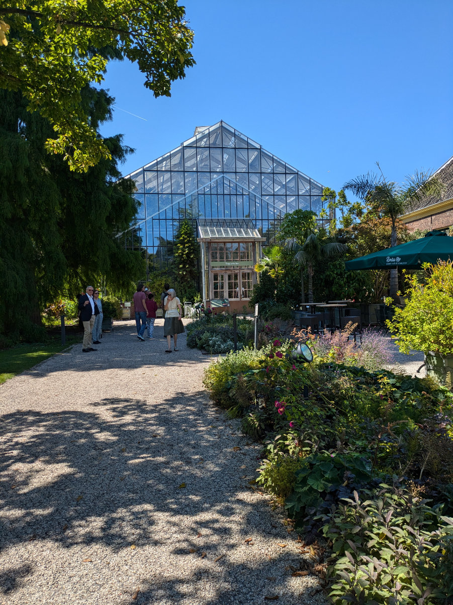

_Yuppieee!!!_

Today, around lunchtime, we received the wonderful news that the owner of the house we visited on Friday has chosen us as tenants. Over the weekend, despite trying to think about it as little as possible, my undisciplined brain engaged in intense background activity to plan DIY projects, solve logistical problems, set dates and deadlines. Now I can finally bring all this mental activity to the forefront!

While we were cycling back from The Hague, where we went to visit the family that will entrust us with their home for the next three weeks starting tomorrow, Hilly and I talked about how this whole big puzzle, which when completed will represent our new life in the Netherlands, is magically coming together in the best possible way.

We managed to avoid paying for hotels or Airbnb all summer and will move from the last pet-sitting to the house we found. This has saved us a lot of money and will give us a few more months to look for work.

The house will be handed over to us on August 15 while the last pet-sitting will end on August 21, Gemma's birthday. Before August 21, I want to make some improvements to the house. We want to lay parquet flooring on the entire ground floor to cover the marble we don't like. Possibly paint the kitchen cabinets. Maybe change the color of some walls. Fix up the bathroom.

Before the start of school at the end of August, we will also have to go to Tuscany to pick up the stuff we have in storage.

The fact that we will be living in Leiden makes me immensely happy. Yesterday we went out to lunch with Maartje, a dear friend who grew up in Leiden and used to frequent Hilly's parents when they lived there in the early '70s because Hilly's dad was doing his PhD in law. She told us a lot of stories about those years and all the Dutch and South African friends who orbited around them at that time.

We also visited the botanical garden, using our “museumkaart” and thus saving twenty euros each. Everything was extremely well-kept and well-organized, and surely a place to visit several times a year. There is a large tropical greenhouse, warm and humid, where it will be nice to go on cold winter days. At one point, there are tables in the greenhouse where you can have a picnic or even work on your computer.

Yesterday, Leiden was an explosion of flowers along the canals, festive boats, and tables full of beers. Maartje gave us a list of events that will take place between August and October. The town festival is on October 3, and they serve free herring and vegetables to everyone. A very old tradition.

In the house we are going to tomorrow, we will have to take care of 2 dogs and 1 cat. The house is a ten-minute walk from the center of The Hague and five minutes from a large forest. The road we took by bike from Wassenaar to The Hague is incredible. It runs parallel to the coast but a few kilometers inland, with large trees letting little light through, and on the left side, heading towards The Hague, there are dozens of villas, each more spectacular than the last. A sort of Dutch Beverly Hills. Those who suffer from severe social envy should stay away!

Thursday afternoon, Sophia and Gemma will return to the Netherlands. They are very happy about the news of the house, especially about the fact that they can leave for school at 8:10 in the morning. A huge change for them compared to how they grew up.

For all these years, they have spent an hour and a half on the bus every day, round trip (thanks Samuela, Valeria, and Angelo for your relentless and fantastic service), and Sophia in the last two years even more, to go to Empoli six days a week. This meant waking up every morning between 5:30 and 6:00. You can understand their happiness!

_The tropical greenhouse_

_On the second floor of the tropical greenhouse_

_This fellow was placed on a tree trunk_

_One of the strangest plants I have ever seen_

_The Zen garden_

_Along a canal in the botanical garden_

_At the table with Maartje_

_Buildings in The Hague_

_Hilly's little critters_
