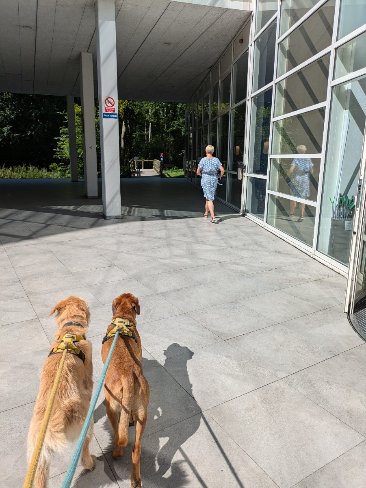
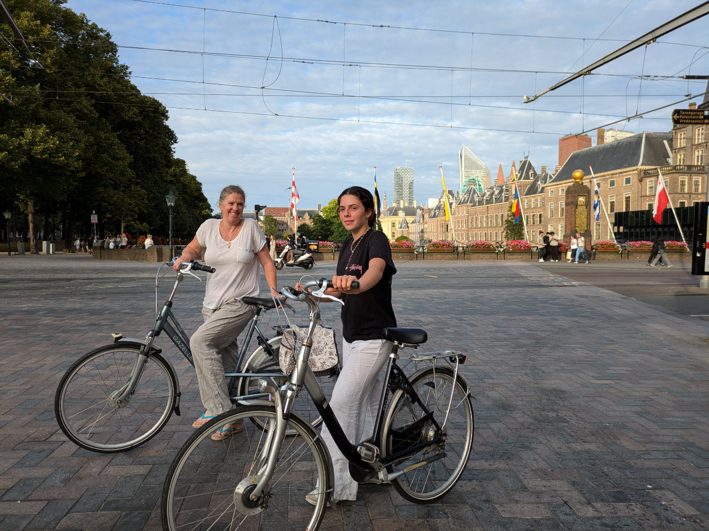
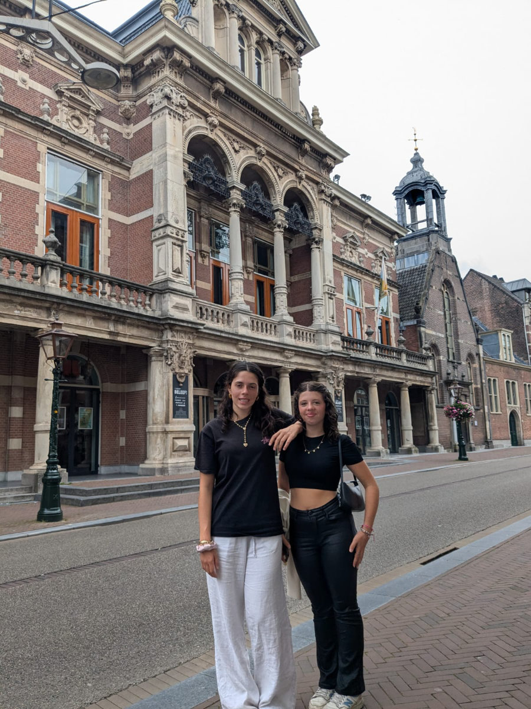

_The dogs pull like crazy when they catch sight of the small bridge_

A week has passed since the last post and since the phone call from the real estate agency that made us jump for joy. Meanwhile, the girls have returned from Sardinia. Dark skin and hair lightened by the sun. The day they returned from Cagliari it was 44 degrees there. Here it’s at most 27.

The dogs Bertie and Gertie are fantastic. Brother and sister, two years old, from the same litter but very different. When we take them to the beach, they go crazy, chasing seagulls and getting lost in the dunes. The cat Moxie is very friendly and let himself be cuddled from the very first moment.\
The area we live in is quite unique. We are very close to the skyscrapers but live on a quiet street of three-story houses with gardens. A five-minute walk takes you to glass and steel offices, which would seem like the worst place to walk the dogs, but then, after passing under porticoes, you cross a wooden bridge and find yourself in a dense forest of oaks and beeches where you can walk for miles in nature.\
The Hague is very charming. Different from typical Dutch cities.\
The center is a beautiful mix of modernity and the past and, in the suburbs, there are very wide streets, large buildings, and lots of greenery. There is an international atmosphere, and you hear a lot of English spoken. Quite different from a city like Zwolle, for example, where everything is Dutch to the core.

On Saturday we went to Leiden to show Sophia the house from the outside. Gemma didn’t want to come.
While peeking into the garden, we noticed the owner sitting on a chair, eating a sandwich. He was working on small renovations he had committed to doing before the handover day. He noticed our presence and let us in, giving us another nice tour of the house. Sophia was very happy to see her future room and started a Pinterest board, inviting the rest of the family to participate, to share ideas for possible interior improvements.\
Meanwhile, I’m making a list of the materials I need to change the flooring downstairs and in the girls’ rooms.\
This morning we have a video call with an agency that should provide us with connections for electricity, water, heating, and the internet. Heating is provided by the municipality. Hot water comes directly into the house and should theoretically be cheaper and more ecological than having our own gas boiler.

On Saturday we also bought the first two bicycles. For Hilly and Sophia. We responded to an ad on Facebook Marketplace, both were for sale by the same owner, who was in Wassenaar, a few blocks from where we stayed until a few days ago.\
Both bikes are of the brand “Gazelle,” very common in the Netherlands and of excellent quality.\
We paid €260 for Hilly’s and €180 for Sophia’s. There was no way to negotiate even €10 off the price.\
Both need a good maintenance job, especially Hilly’s, but most of my tools are still in Italy. I can’t wait to get my hands on them.
Today we will go looking for a bike for Gemma, around shops in The Hague. Being more insecure on two wheels, she prefers to see many and find the one most comfortable for her size.

I’m thinking of looking for work, for the time being, in the many bike shops in Leiden. The pay is basic, but at least I’d start working doing something I like. An idea that came to me, after securing the house, which has a large paved garden and a micro workshop, is to buy very bad used bikes and transform them into elegant custom bikes with a high “hipster value" to then resell. This as an extra job, whether I work as a programmer or something else. The idea fascinates me a lot.

Over the weekend, a Belgian friend of ours, whom Hilly has known for many years, came to visit us. Niele hasn’t lived in Europe for a long time. She has worked as a teacher in South Africa, several years in Ethiopia, and now has been in Congo for a couple of years, where she teaches in Flemish at an elementary school. She told us a lot of stories about Ethiopia and Congo. She had visited us when we lived in Crespina, then a couple of times at Civettaia, and now she’s also the first friend to see our new house.

We have booked the van/truck to go to Tuscany to get our stuff. We leave on the morning of the 21st and will be back on the night of the 23rd. Sophia will stay alone in the new house the whole time while Gemma will come with us. She’s willing to travel 3000 km just to see her friends even for just one day. To offset the cost of the trip a bit, which between rental and fuel will be about €2000, we found a Dutch lady, through a post on Facebook, who needs to transport some packages and furniture to her house in Versilia (a region of Tuscany). We agreed on a contribution of €600.
So on the 21st at 9:30 am we pick up the van/truck, go to a village on the way to Germany to load the lady’s things, and plan to arrive in Versilia the next morning to deliver the small load.\
To avoid arriving too early in the morning, we will sleep in the car for a few hours. Then on the 22nd, we will load our things, meet some friends, and probably won’t see Gemma for even a minute, and on the morning of the 23rd, we will leave with the loaded vehicle heading to Leiden.\
Another piece of the puzzle that I hope will fall into place without too many problems.

_Bertie is a big puppy_

_Moxie sleeps with Gemma every night_

_Gertie loves getting lost among the sand dunes._

_The beach in The Hague_

_Great runs in the water._

_The new bicycles of Sophia and Hilly._

_Around The Hague_

_The Binnenhof, the ministerial offices of The Hague._

_In the background, the theater in Leiden where Merinda (Hilly's mother) worked as a cloakroom attendant 50 years ago._
