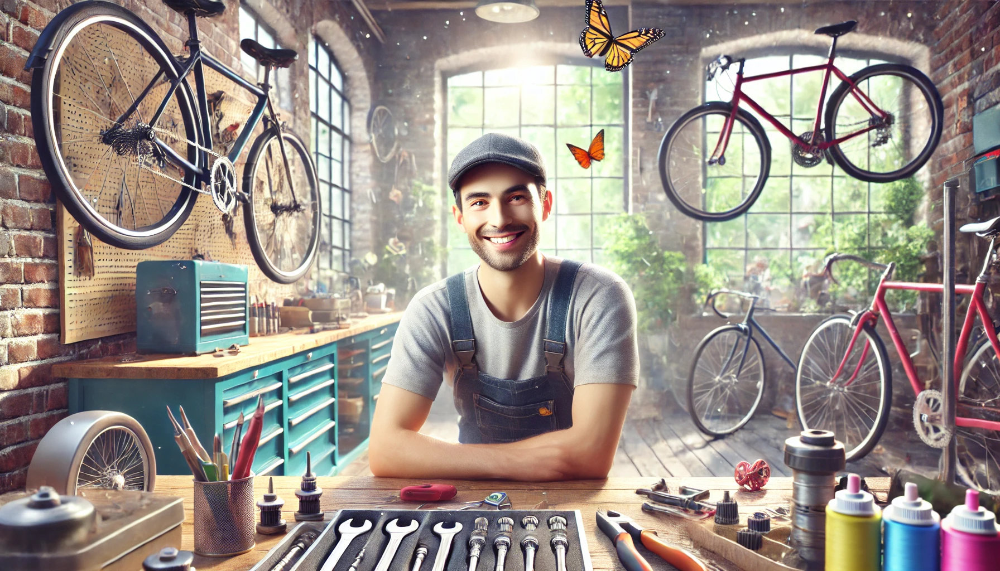
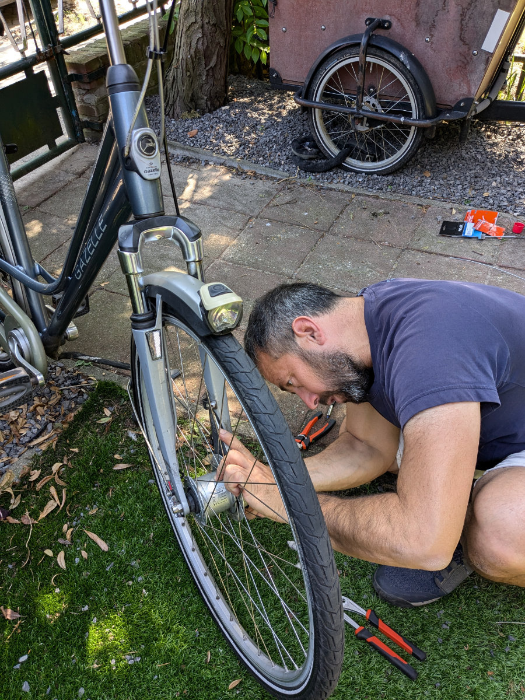
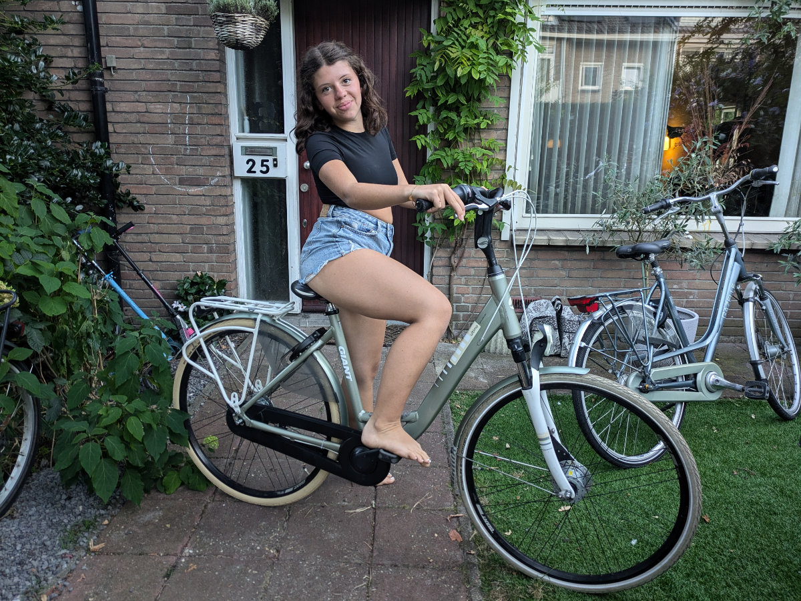
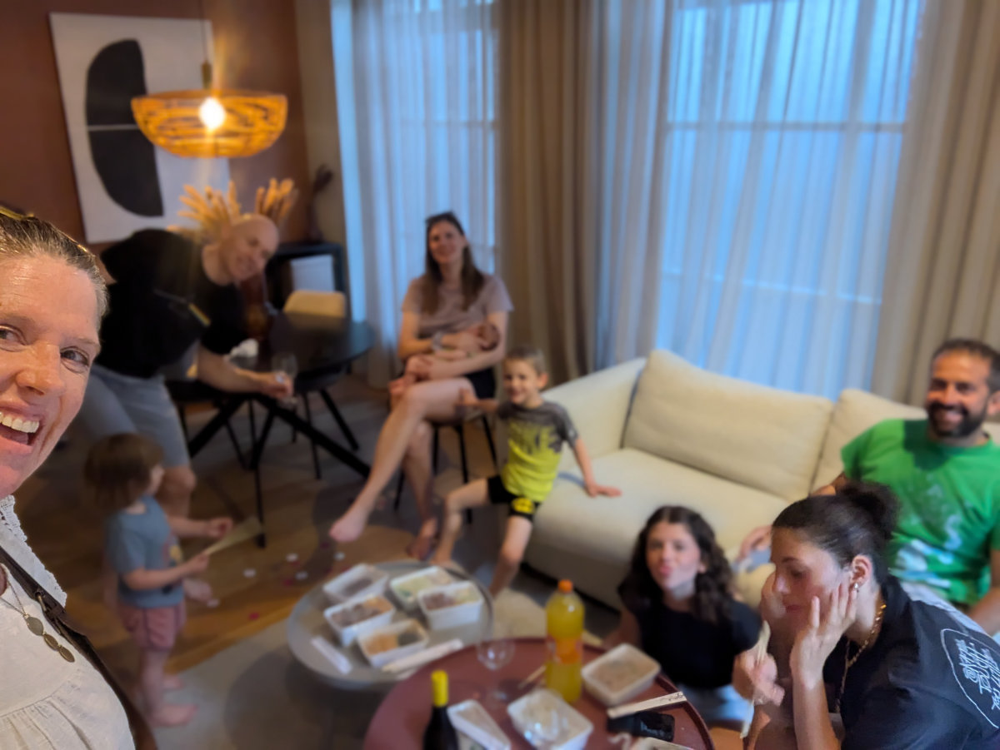
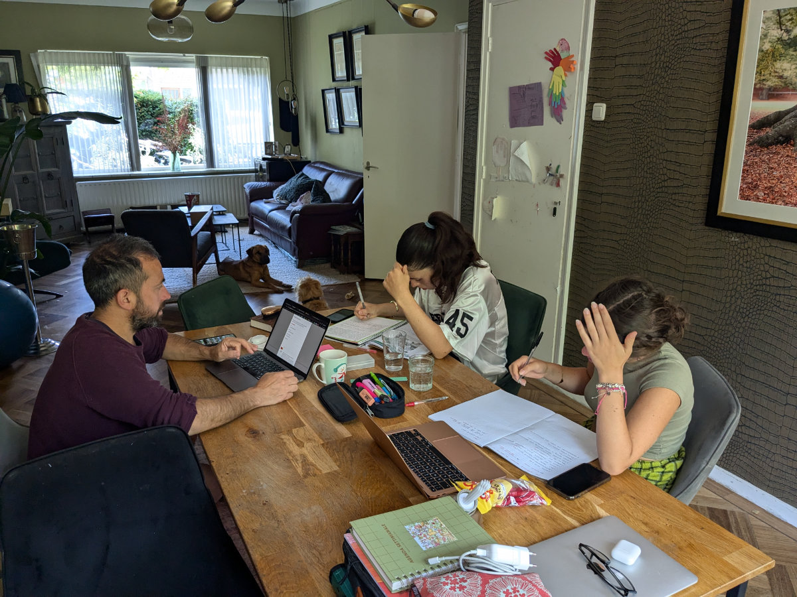

_This would be somewhat of a dream for me_

A few days ago, I responded to a job advertisement seeking bicycle mechanics. The offer included an 8-week course to learn how to repair all types of bikes, followed by a guaranteed job. The ad clearly stated that some hands-on experience with bikes (which I have), a willingness to learn (which I also have), and proficiency in spoken and written Dutch (which I don't have) were necessary.

I either didn't notice this last requirement or subconsciously chose to ignore it, and promptly responded to the ad, among the dozens I apply to each week.

A couple of days later, I received a call, in Dutch, from a woman who was immediately taken aback when I replied in English, telling her I didn't speak her country's language. She thought she had dialed the wrong number, as she was looking for a certain Cristian Cassetta who had applied for the bicycle mechanic position. I reassured her that I was indeed Cristian Cassetta and that I had applied for the job and was interested in it.

"Yes, okay, but you don't know Dutch," she said. I responded, "That's true, I don't, but I love bikes, I'm eager to learn, and besides, I don't have to talk to the bikes."

We shared a big laugh and she began explaining the details.

Basically, everyone taking the course receives state unemployment benefits, and the government also pays for the course, which costs €4,000. In my case, I am not yet registered as a worker in the Netherlands, I don't receive benefits, and the government doesn't pay anything for me.

There is an alternative, she said: if it's okay with me, I can take the course for free, but then I must commit to working in one of their bike shops in Leiden, or nearby, for at least a year.

After a brief consultation with Hilly, I accepted the offer.

First, however, they need to accept me, because it's an investment for them to have me go through the course if I'm not good at it. To be accepted into the course, I have to take a test with a professional mechanic who will evaluate my skills and attitude (let's hope they don't evaluate my Dutch!).

For the test, I need to go to a village an hour and a half away by car; I need to be there at 11 AM tomorrow.

If I'm accepted, I can start the classes on August 26th, and for 8 weeks, I'll need to go to Utrecht, for 40 hours a week. The course is 90% practical and 10% theoretical. The theory will all be in Dutch, so I'll have to manage with continuous instant translations using Google Translate.

At the end, there will be an exam, and they will issue a certificate.

The pay, once I get the job, is relatively low for the Netherlands. We're talking about €2,470 gross per month for 38 hours of work. However, the taxes on low salaries are very few, only 9%, so we should still be able to manage, perhaps supplementing with other jobs on weekends, for at least a year, during which I can deepen my knowledge as a developer or take bike mechanics to a higher level. This obviously assumes that Hilly will work full-time as well.

I am very excited about working with bikes and really hope everything will work out. This would also give me the opportunity, in my spare time, to do some “bike flipping”, buying rundown bikes on Facebook, fixing them up, customizing them a bit, and then reselling them for a profit.

To prepare for tomorrow's exam, I worked a bit on Hilly's and Sophia's bikes, with the few tools I brought with me, since they had never been maintained by the previous owner. Dutch bikes are quite different from the mountain bikes I was used to working on. I hope I don't mess up tomorrow!

On Monday, Gemma and I bought a bicycle for her. We got it at a store, used, and paid €320 for it. Gemma is very happy with the purchase and is practicing around the skyscrapers of The Hague.

Last night, we met up with some friends who live in Iceland and were passing through the Netherlands. They had to catch a flight in Amsterdam but knowing we were here, they spent a night in The Hague, in an Airbnb.

The four of us went by bike to meet them and had dinner together. Then, so as not to leave the dogs alone for too long, Sophia and Gemma rode back home by themselves, through the city at night.

Another big step.

_I am practicing with Dutch bicycles._

_Gemma's new bike_

_Christian, Anna, and their three children live in Iceland, but Christian is South African and Anna is German (everyone out of focus except Hilly)._

_Morning study session._
