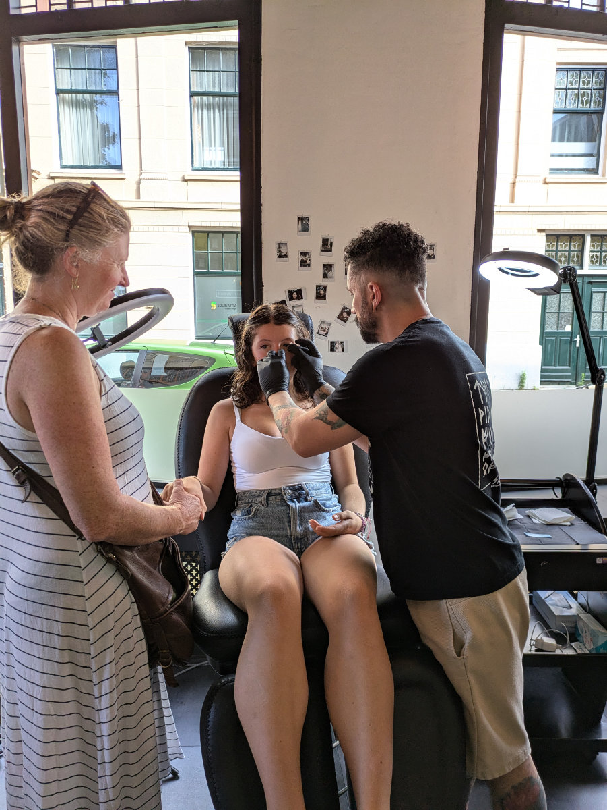
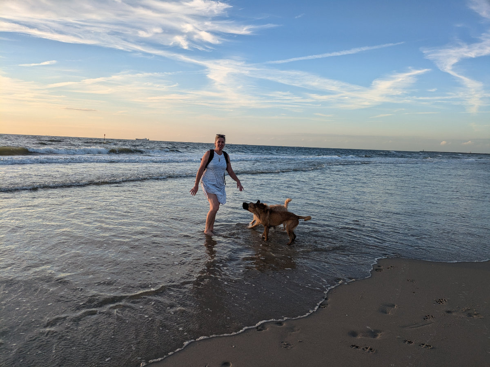
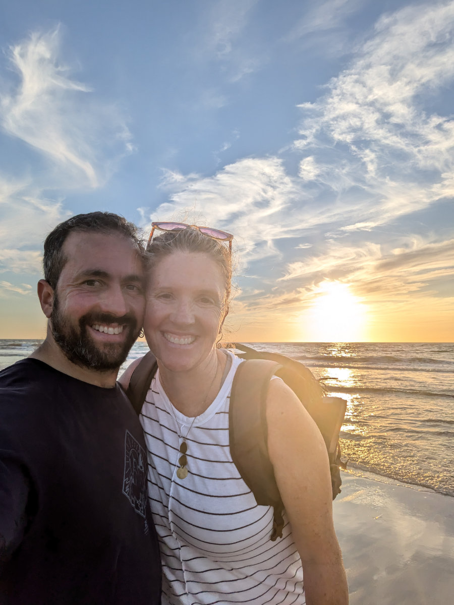

_The school "Maintec" to which I am enrolled._

I did it! I'm enrolled in the course. Yuppie!!

The hour and a half drive to reach the workshop went smoothly. Driving on the highway in the Netherlands is quite relaxing. The cars all maintain a safe distance and use their indicators to change lanes. Many Italians would consider driving in these conditions boring, but for me, it's a blessing.

I park the car in front of a large bicycle shop in an industrial area in the town of Uden. Behind the building is the workshop/school where the courses are held. The company that organizes them has two locations; I’ll be attending the one in Zeist, near Utrecht.

The course is in progress in the workshop. There are about ten guys and men, all busy working on bicycles suspended by cables attached to the ceiling. Each student has a station with a lift to raise the bike, a workbench, and all the necessary tools.

At the back of the workshop/school, I find the office of Annette, the lady I had spoken to on the phone. She smiles at me and gestures for me to come in.

She offers me a coffee, but I refuse; I’m already quite nervous.

She starts speaking to me in Dutch but quickly switches to English when she sees the huge question mark on my face. She asks me some questions while typing on the computer.

“Why do you want to become a bicycle mechanic?” I respond rather succinctly that it’s my passion and I believe I can do it well. In reality, I wanted to tell her that at this point in my life, there are only three jobs I would do with great enthusiasm: web developer, carpenter, or bicycle mechanic. But I thought of that later, while driving home with a huge smile on my face.

After the chat with Annette, it's time to get my hands dirty. Annette introduces me to Tom, the instructor for that course. Tom and Annette speak to me in Dutch; I nod, but it doesn't work—they realize I don’t understand a thing and quickly switch to English. Phew! I dodged that bullet!

Tom takes me to a station where a women's bike is hanging and tells me to disassemble and reassemble the rear wheel.

Dutch bicycles are more complicated than Italian bikes or mountain bikes because they have drum brakes and a gear system integrated into the rear hub. This means you have to remove a series of gadgets in the correct order before you can unscrew the bolts holding the rear wheel.

Another stroke of luck! That very morning, while sipping my coffee, waiting to leave for the interview, I had watched a YouTube video of a guy disassembling and reassembling a rear wheel exactly like the one in front of me now.

I start confidently, though my hands were shaking a bit, under Tom’s watchful eye. Meanwhile, he asks me, “Ferrari or Lamborghini?” I don’t understand his question and randomly reply, “Fiat.” He tells me he’s heard that Italians are divided into two categories: those who love Ferrari and those who prefer Lamborghini. I tell him, with a drop of sweat on my forehead while handling a thin Allen key, that I didn’t know about this.

He then talks about his passion for cars and how he enjoys restoring old ones. He has several. In the meantime, he moves away, and I continue focused on my mission, confident that I’m doing well. After reassembling the wheel, I ask him if the chain tension is correct—neither too loose nor too tight. He replies, “Don’t worry, just leave the bike as it is. I’ve already told the secretary that you’re more than good enough. I saw it within two minutes, from the way you handled the tools. It’s clear that you’re used to working with precision.”

A wave of pride sweeps over my ego, always hungry for compliments.

In fact, he’s right. Ever since I was a child, when I received a gift, after handling it for a few minutes, I would proceed to take it apart to see what was inside.

When I was in middle school, I was given a radio-controlled car as a kit. I remember being completely absorbed for several hours in assembling the small parts, forgetting even to eat or go to the bathroom.

My bicycles were always customized in some way, as was my moped.

All of this made the difference.

At the end of the interview, Annette told me that all that remained was to ask the school administrator for authorization to enroll me in the next course. My situation was a bit unusual since the course wasn’t funded by the state in my case, and for them, it represented a bit of a risk—an investment they would recover during my first year of work.

We parted with the promise that she would let me know something before the weekend.

Meanwhile, on my way home, I couldn’t help but fantasize about the possible outcomes that my acceptance into the course would entail.

Only this afternoon, after another 24 hours spent on edge, Annette called me to give me the good news that I had been enrolled in the course starting on August 26, the last available spot. Yea!!

This afternoon we took Gemma to get her nose pierced. When we arrived at the shop, we were told she was too young and needed to be at least 16 years old. We left determined to try another shop when the guy called us back and said he had spoken to the owner, and in fact, with parental consent, it could be done right away. So Gemma sat in the black leather chair while the guy, a Colombian who lives between Spain and the Netherlands, prepared the tools.

Gemma was scared but mustered up the courage. The guy took a large shiny needle and pierced one of her nostrils, pushing the implement several centimeters through her nose. A rather splatter scene, and Gemma’s eyes welled up with tears.

After a couple of seconds, it was all over, and the little shiny stud appeared on my daughter’s nose. Not bad, I must say. It suits her well.

We left the shop satisfied and got on our bikes to head home, where Gemma couldn’t wait to get there to post a story on Instagram.

Back home, Hilly and I loaded the dogs into the car to go to the beach. I put on my running shoes because there’s a beautiful paved trail on the dunes that I wanted to run.

While she walks the dogs along the shoreline, I enjoy the run.

The route is breathtaking. Miles of wild rose bushes and blackberries with the sound of waves and seagulls in the background. Most of the roses have wilted; I can only imagine how beautiful it will be at the end of May!

This beach thing is surprising me. Apart from the color of the sea, it has nothing to envy from the beautiful runs I used to do at Cape St. Francis, in South Africa, in the nature reserve that stretches up to the lighthouse.

_Gemma gets thoroughly tortured._

_My daughter's little nose!!_

_The path through the dunes._

_Beautiful wild rose and blackberry bushes._

_The path leading to the sea._

_A young boy enjoys surfing with a board among the waves_

_Bertie and Gertie are having a blast._

_We are happy._
