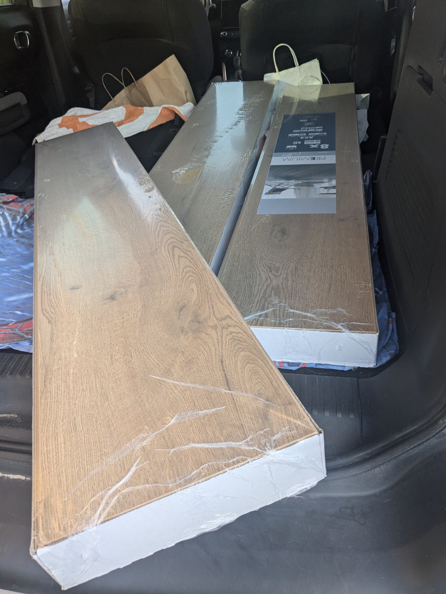
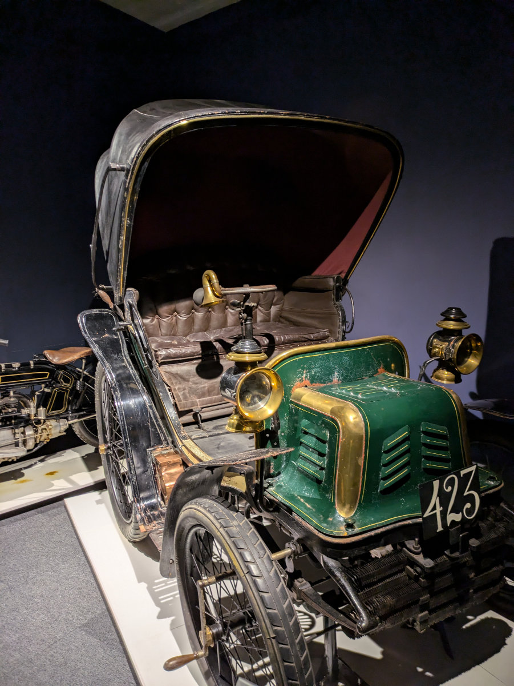
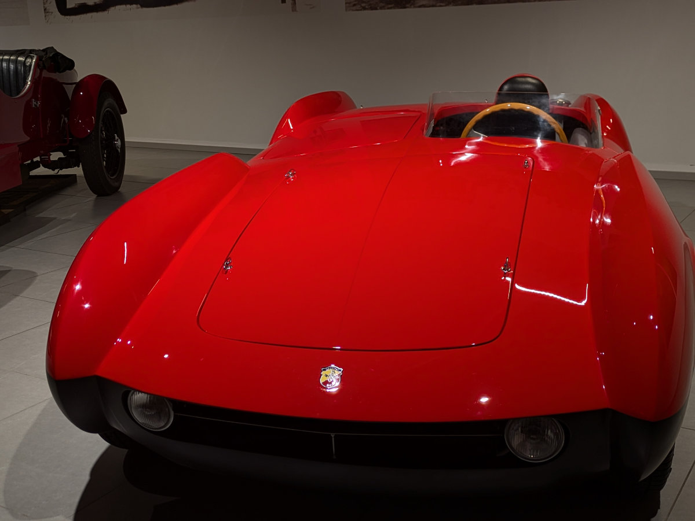

_At the beginning, the paradigm was still that of carriages; this is one of the first to be motorized._

Yesterday afternoon, we bought the flooring for the house. The DIY supermarket chain, Praxis, has a 30% discount on many laminate floors all week. There's one of these stores less than a kilometer away from the house, and we had already visited it a few days earlier. So, we contacted the owner, Alfons, to ask if he could open the house for us to bring in the packs of the new flooring boards. We agreed to meet at 7:00 PM.

The girls spent the whole day in Amsterdam on their own, and on their way back, they took the train to Leiden instead of The Hague. So, the four of us went to the store to choose the flooring and then to the house to bring it in two trips. Finally, Gemma got to see the inside of the house, which she hadn't done yet, and she was surprised by her little room. She expected it to be smaller, given our rather dramatic descriptions; we wanted to make sure she wouldn't complain in the future about having a room that's almost a third the size of Sophia's.

_We load the new flooring into the car, 25 packs in total._

At the store where we bought the flooring, we were assisted by a sales assistant (since we had never worked with this type of material before) to make sure we chose the right thing and installed it without making a mess. I’d like to take this opportunity to talk about a characteristic of Dutch people that we’ve noticed since we’ve been here. Very often, at first glance, the Dutch person seems serious and cold, apparently determined to keep the conversation brief, concise, and limited to the minimum necessary to conclude the social interaction as quickly as possible.\
However, this attitude doesn’t stem from a desire to get rid of us but rather from a cultural difference. We Italians are at the opposite end of the spectrum. How many times in Italy have I asked someone for information, only to find myself suddenly trapped in an endless loop where the same information was repeated from start to finish, in a perverse cycle, which would only end when one of us got tired of the friendly chat.

When traveling or living abroad, it’s important to shed the lenses we wear in our own country through which we interpret other people’s behaviors. By doing this, we can have some hope of interacting more deeply with other people and cultures, which always have much to offer, and the more we do this, the more we minimize potential incidents and misunderstandings.

Sunday, we had a wonderful day. In the morning, we visited the Louwman Museum of automobiles in The Hague, about a fifteen-minute bike ride from the house where we currently live. We had passed by the museum countless times, both by car and bike, and had planned to visit it. We were all incredibly surprised.

The museum is practically an endless collection of cars, organized and displayed in an incredibly effective and creative way. The tour starts on the top floor of the large building, entirely dedicated to the history of automobiles, where you transition from 18th-century horse-drawn carriages to the first motorized carriages powered by steam, and then to the first internal combustion engines, and so on.

The cars are all well displayed and lit, with effective and engaging explanations. They’ve also done something clever that I hadn’t seen in any other museum. Next to each model, there is a QR code that, when scanned, leads to a Spotify track with the explanation in various languages, read by an actor. This way, they avoid the need for audio guides, allowing everyone the convenience of using their own phone.

On the first floor, the cars are organized by different themes, and there’s a strong sense of nostalgia seeing cars from the 1950s to the 2000s. On the ground floor, they’ve recreated evocative environments of various workshops from the past, some from the distant past. From time to time, to make the experience a bit more varied, there are rooms dedicated to objects like car radios, ashtrays, innovative or curious car parts, paintings, sculptures, or other works of art, all themed around cars.

I’m not a car or motorcycle enthusiast, in the city, they bother me quite a bit, especially motorcycles, but this museum was truly fascinating, and I’ll definitely return to listen to every single audio description. I recommend anyone coming to the Netherlands for longer than a weekend to visit it. Especially friends like Renato Volpi, Massimo Troso, Michele Sanesi, and Johnny le Roux: guys, you absolutely have to come and see it!

_The Louwman Museum._

_What an evolution from this to a Tesla_

_This car was the subject of a film, "Genevieve," which was shown on a screen in the background._

_One of the first motorcycles, with the engine integrated into the front wheel._

_Harley Davidson_

_Maybe one day I'll combine my passions and build wooden bicycles._

_A retro style for this 2008 Lincoln Sedan Delivery._

_Fiat with wicker interiors, a beach model_

_A Rolls-Royce for an Indian Maharaja._

_A unique Fiat car-boat._

_A fiery red Abarth._

_Camping in great style._

_The ancient workshop of a carriage maker._

_This area of the museum, with various reconstructions of past environments, is very evocative._

Late Sunday afternoon, we went to the beach for a sunset picnic. We brought the dogs along as well. I was very doubtful that they would let us eat in peace without rushing onto the blanket with our food and covering everything in sand, as they had already done on previous days when we laid on the beach. But Hilly insisted we bring them.\
She was right.\
Bertie and Gertie stayed away from our well-set blanket, allowing us to enjoy our picnic in peace. Good dogs!

Yesterday was probably the hottest day of the summer, reaching 34 degrees, and there wasn't a breath of wind. Hilly and I biked to visit the car rental where we had reserved the van, to make sure there was a place to leave our car while we travel to Italy. We biked for over an hour through The Hague, sweating quite a bit. Along the way, there were several people walking around shirtless, and hordes of bicycles heading towards the beach.\
Today it should rain, theoretically. It's been more than three weeks of dry weather, which I didn’t expect could happen in the Netherlands. Everyone told me that in any season, after 3 or at most 4 days of sunshine, the rain would return. Perhaps an effect of climate change.

Tomorrow afternoon at 2:00 PM, we'll receive the keys to the house. In the coming days, I'll lay the flooring throughout the entire ground floor and in Sophia and Gemma's rooms. We’ll also paint the new wall that Alfons just built to enclose Gemma's tiny bedroom. Everything else will be done gradually, living in the house and not getting carried away with too many renovations. After all, the house could be sold at any moment. In the Netherlands, the owner is required to give three months' notice if they need the house, while the tenant only has to give one month's notice.\
Another thing we need to be cautious about is buying furniture, small items, or various decor. There are plenty of well-stocked thrift stores ("kringloop" in Dutch) around with many nice things at very low prices. Our idea is to furnish the apartment in a minimalist way; we already have a lot, perhaps too much, so we need to curb our consumerist impulses and be as frugal as possible. It won't be easy.

_Family picnic at sunset on the beach._
