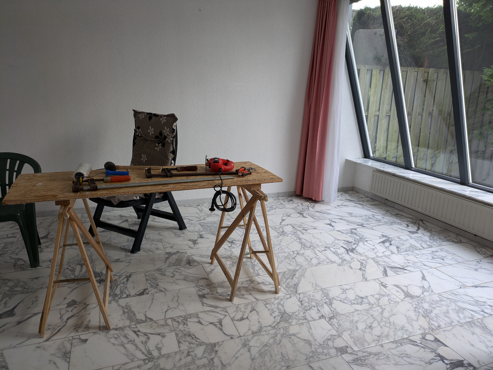
_Let's hurry up and cover this floor._

_I wrote this post on the day of departure for Italy; I thought I would be able to put it online during the trip, but I didn't manage to do so. Now we're back home in Leiden after a 72-hour saga that I'll share in the next post._

_Here is the post from August 21._

The last few days have been intense, hectic, full of emotions, productive, frenetic, rewarding, but also nerve-wracking and exhausting. Let's recap.

On the afternoon of the 14th, we had a meeting with the landlord and the agency to hand over the keys. Everything went well on that front. We immediately got to work.

We started by painting all the interior walls. To avoid leaving the dogs alone, we took turns. I would go to the house in the morning with Sophia and Gemma, while Hilly stayed in The Hague. Then at a certain point, I would take the girls back and pick up Hilly to return and continue painting with her.

Sophia and Gemma turned out to be excellent painters. Sophia had done it a couple of times before, but Gemma was a novice, and she really surprised me with how quickly and intuitively she learned the art of the brush and roller. We all worked diligently and consistently, even on Ferragosto (Italian holiday), until we had given the house a nice refresh. It had been a few years since it was last painted.

Then it was time to start installing the parquet (laminate) in the bedrooms and throughout the ground floor.

The plan was to continue taking turns, with the girls and Hilly alternating to help me lay the flooring, so we could finish everything by August 20th, yesterday, because on the 21st we were supposed to leave to go pick up our things in Tuscany.

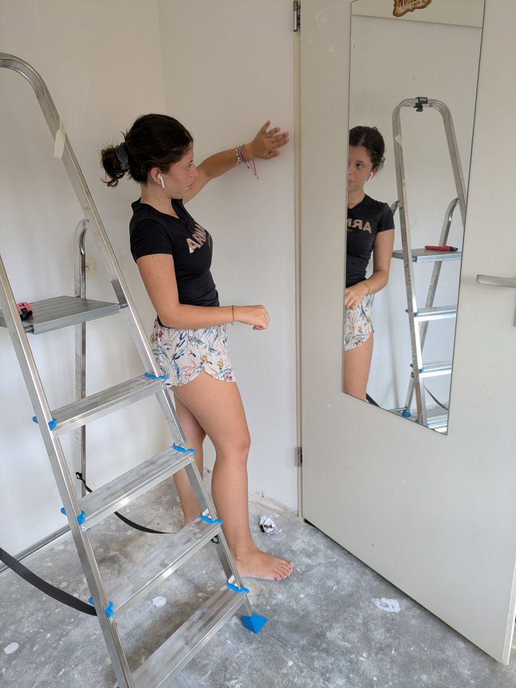
_Gemma is putting masking tape on the walls before painting her bedroom._

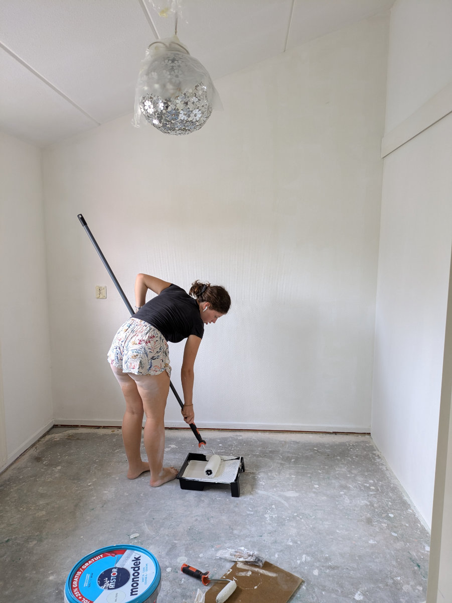
_Busy with the roller._

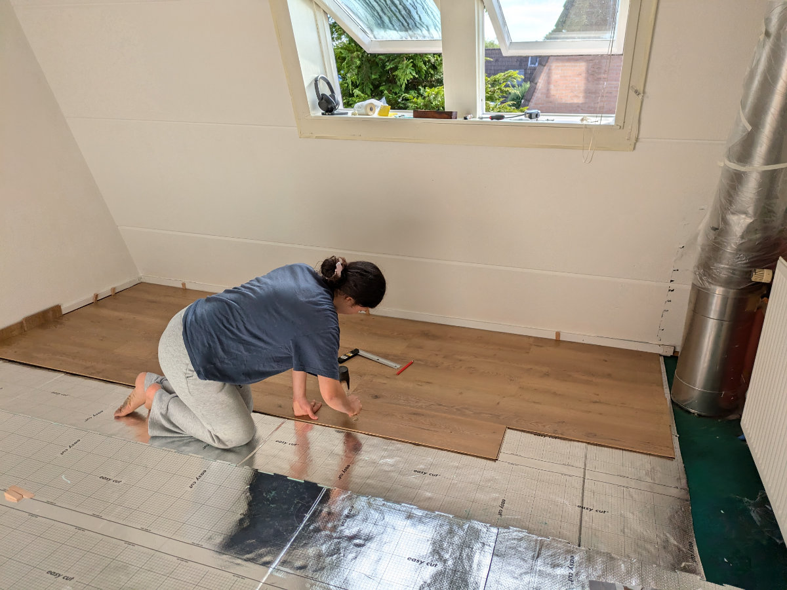
_The frustrating initial floor laying_

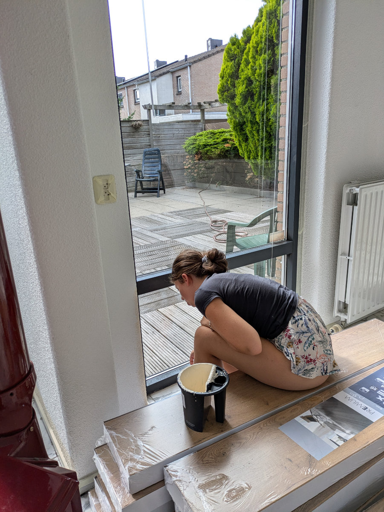
_Gemma is painting the ground floor_

In the early afternoon of Saturday, the 17th, Hilly started feeling unwell. We were finishing up the painting, with Gemma there too, while Sophia was at the house with the dogs, when Hilly had to lie down on the floor, with a severe headache and a lack of energy. Gemma and I finished painting the living room walls and then the three of us went back to Sophia. Hilly went straight to bed and spent the night with a fever, orange-colored vomit, and pains all over her body. The next day, she felt even worse and stayed in bed without being able to eat anything.

Sophia and I started working on the upstairs floor. I had never installed parquet before. After watching about ten videos on YouTube, I was convinced it would be pretty easy, and it was in the end, but not at first. We had to figure out some things that weren’t as straightforward as they seemed, so it took us several hours to do a couple of square meters in Sophia’s little room, feeling discouraged and overwhelmed, only to take it all apart and start over in a different way.

On Sunday afternoon, we went back home, dead tired but satisfied, and took a few hours to rest. Hilly wasn’t improving, and her forehead was burning hot. The symptoms were unusual due to how quickly they appeared and because of severe pain and stiffness in her neck area. I decided to seek help.

Since we hadn’t yet registered with a doctor, I didn’t know who to turn to. After some online research and asking for advice from Dehlia, our South African friend who lives with her family in Amsterdam, I found out that we needed to contact a phone number for extraordinary healthcare assistance for cases that don’t require an urgent ambulance or emergency room visit. I spent more than ten minutes on the phone with a recorded voice but couldn’t get through to an operator before the line was abruptly cut off. At this point, I loaded Hilly into the car with some difficulty since she could barely stand, and headed to a hospital in The Hague, a twenty-minute drive away, where I had read there was some sort of night medical service. When we arrived, we were let into a waiting room where there were about ten people, mostly parents with small children waiting to be seen.

We were told that without an appointment, which had to be made using the same phone number I had called earlier, we couldn’t see a doctor. So, I got back on the phone while Hilly lay down on a couch.

The recorded voice kept repeating the same chant in Dutch, which I didn’t understand at all, but after about twenty minutes, I noticed that the recording was regularly interrupted by another recorded voice saying a word that I realized was a number, gradually decreasing.

The number represented the people waiting to be answered. We had started at number 13.

After thirty-five minutes, we were down to number two, and I was extremely anxious that the line would drop before I could talk to an operator and that I would have to start all over again. At the thirty-eighth minute, the infernal robotic chant was interrupted by the voice of a flesh-and-blood human being, a sentient entity with whom I could interact in a two-way conversation.

The Dutch healthcare system is often criticized for being difficult to access in cases where a diagnosis hasn’t been made yet. You have to go through an initial screening, which is often followed, according to its critics, by a prescription to rest because everything will resolve on its own, with at most some paracetamol.

After answering about twenty questions from the operator, acting as an intermediary between her and Hilly, who couldn’t even talk on the phone, I was told that it was probably a severe "stomach flu" (gastroenteritis), as there were several cases going around, and the symptoms matched, so Hilly wasn’t entitled to a medical visit. The assistant in the waiting room was very compassionate and “reassured” us by saying that if things got worse during the night, we should call the number again or even 112 (European emergency number for police, ambulance, fire brigade).

Driving home that night, I wasn’t very convinced it was gastroenteritis, and I was a bit worried.

During the night, Hilly had a high fever and constant nightmares, and the next day she still felt extremely tired (she hadn’t eaten in almost 48 hours) with a severe headache but with some signs of improvement. For the first time, the possibility arose that I would have to go to Italy alone with Gemma, covering 3,000 km in two days. A nightmare worse than Hilly’s!

While Sophia and I continued installing the floor, Gemma worked on painting her window. Sophia managed to do some areas of the floor all by herself, even using the miter saw to cut the boards.

By Monday evening, we had finished 80% of the floor, with only the entrance left to do, and Hilly was still extremely weak and discouraged, but at least she had stopped vomiting, and the headache was subsiding. The next day, Tuesday, would be the last day to finish our house and clean the house in The Hague because on Wednesday morning, at 6:30 a.m., the family would return from their trip to the United States, and we would leave for Italy.

Since the three bicycles we bought were still in The Hague, early Tuesday morning, the girls and I cycled to Leiden. It was a beautiful ride, all on a bike path through the countryside, and in 45 minutes, we were home. By 1 p.m., Sophia and I had finished the floor and stood admiring it for several minutes, starting to plan where we would place the furniture we were going to pick up in Tuscany. Hilly ate a bit of plain rice and an apple, gathered her strength, and came to pick us up in the car.

Maybe she would be able to leave the next day after all.

In the afternoon, we cleaned the house and took the dogs for their last walks. To say goodbye, the cat, Moxie, vomited on a chair in the living room. How sweet!

This morning at 5 a.m., we were all up, doing the final vacuuming, cleaning the bathroom, putting the sheets in the wash, throwing our last things in the car, and off we went, heading home. Hilly seems reborn, refreshed by the forced fast and rest, emerging from the dark tunnel she had fallen into.

We left Sophia in Leiden, in the house that still needs tidying and cleaning, where she will sleep on the inflatable mattress we borrowed, waiting for our return on Friday night, for the first time in her life, all alone. What strength!

We picked up the van/truck, a 300,000-kilometer clunker with no air conditioning, no Bluetooth, and not even a USB port to charge the phone for navigation. But we’re very happy. Hilly has been driving for four hours, Gemma can’t wait to see her friends again, and it’s also her birthday. I’m writing this post as we speed down the German highway with a small load of furniture to deliver to Corsanico, a village in the province of Lucca.

This time we risked losing a piece of the puzzle, but in the end, we found it, and in the coming days, if all goes well, we’ll be able to fit it into the right place.

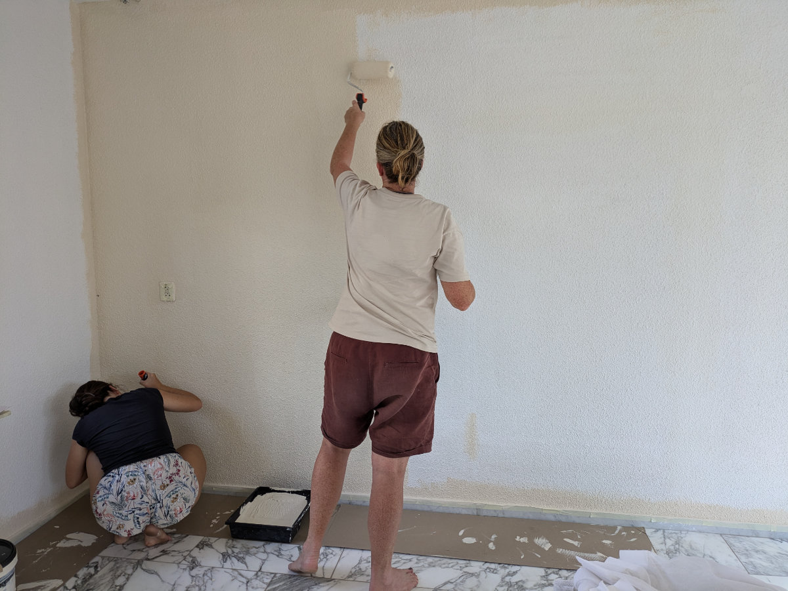
_"Hilly just before the physical collapse."_

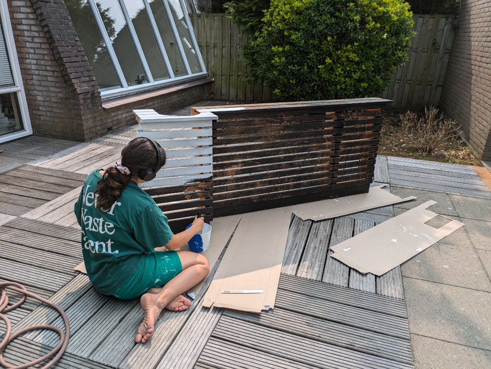
_Sophia paints the radiator cover in her room_

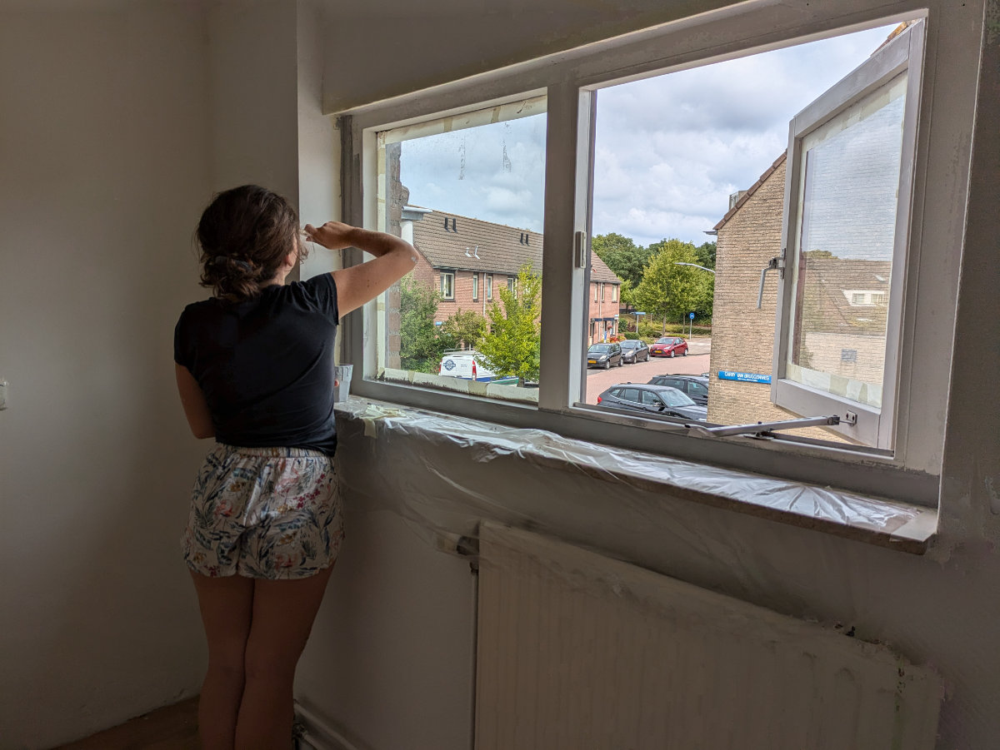
_Gemma working on her window._

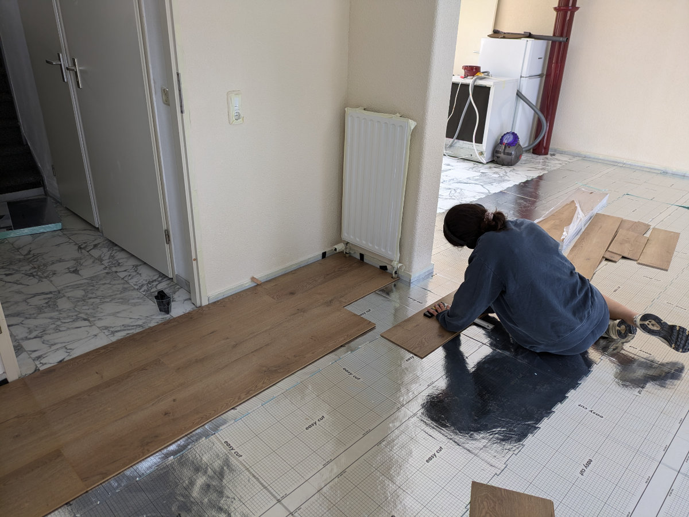
_Sophia concentrated on the floor in the living room_

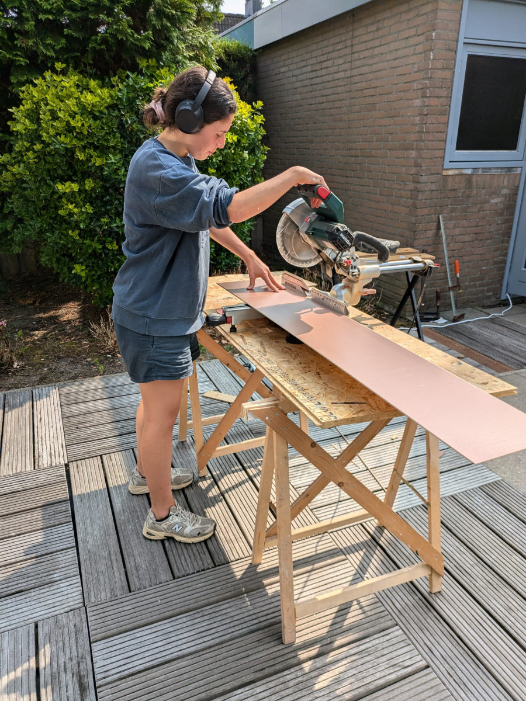
_Sophia, the wizard of the miter saw._

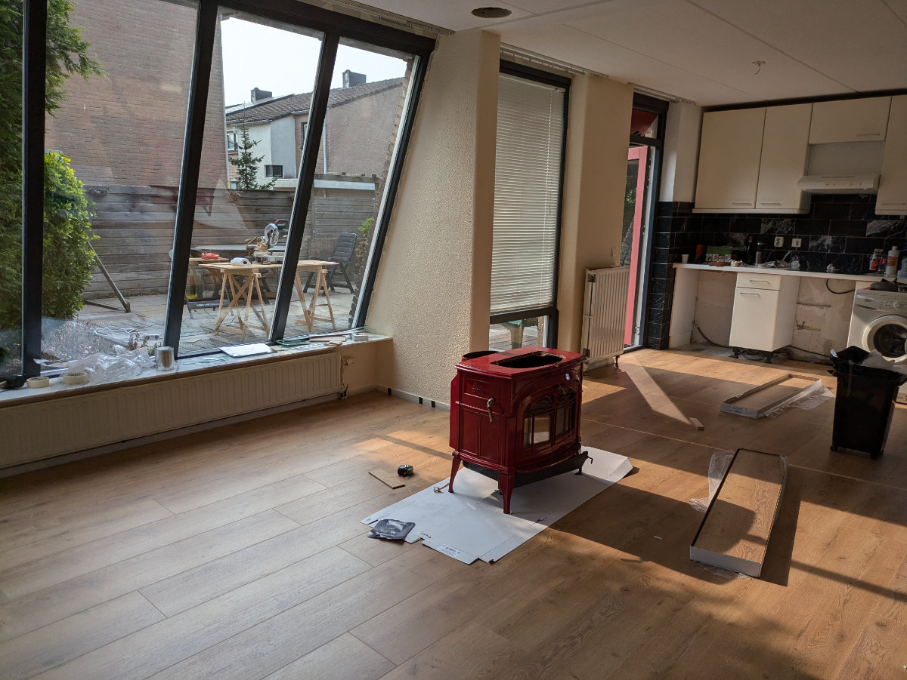
_The living room new flooring_

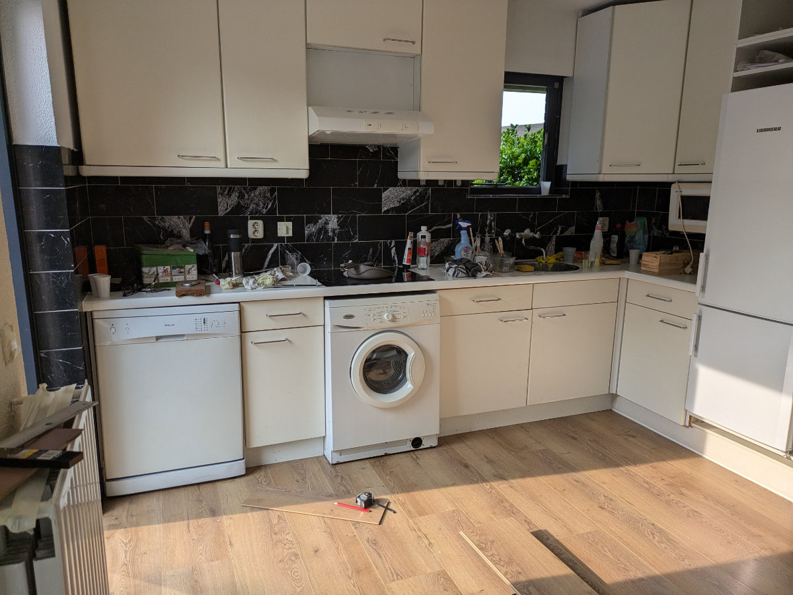
_Our "wonderful" kitchen_

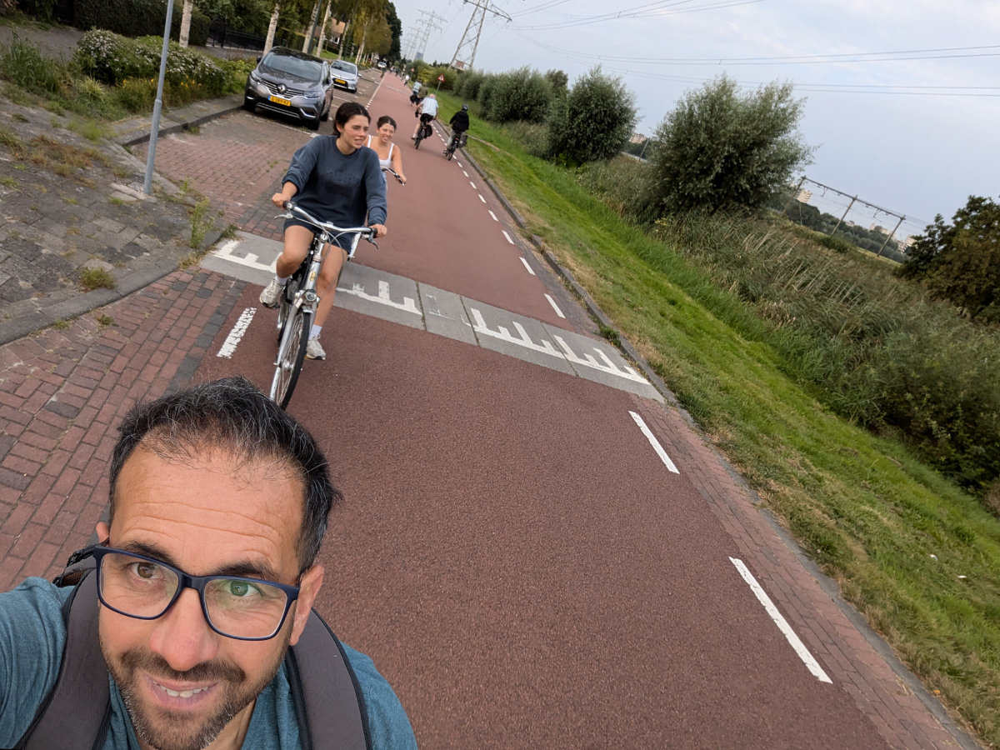
_Cycling to Leiden_

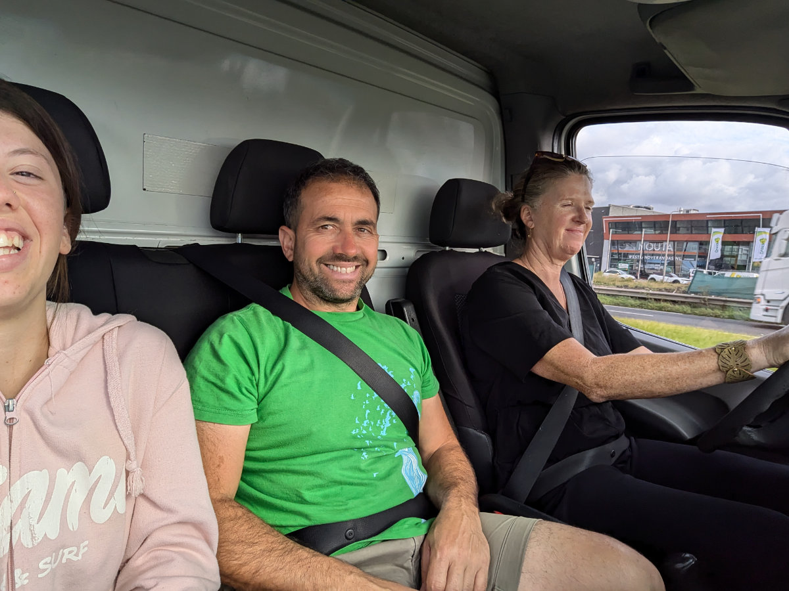
_Montaione here we come!_

_Driving the van/truck_
