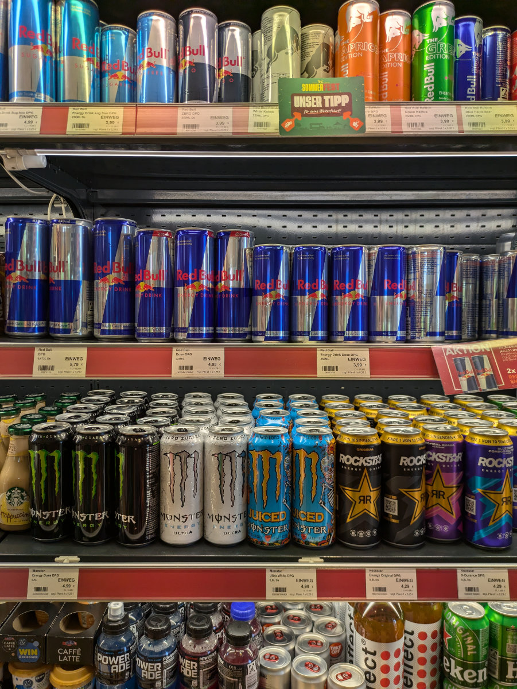
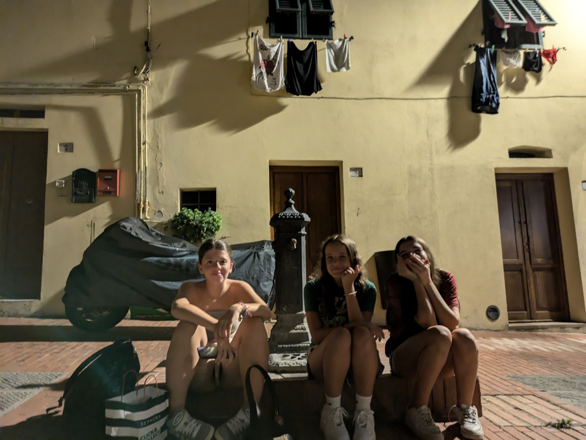
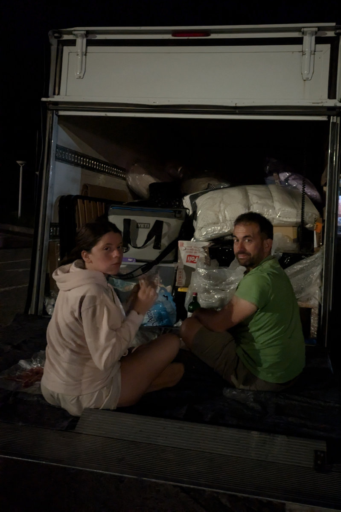
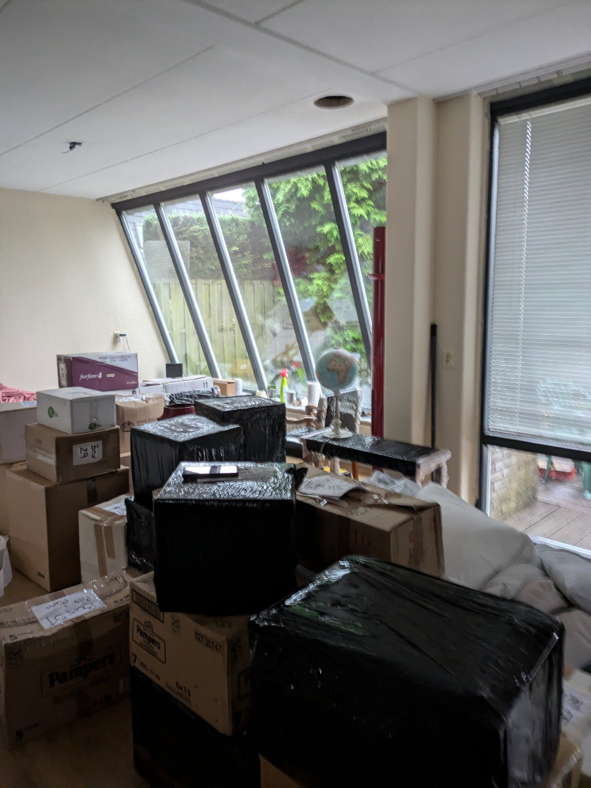

_Questa immagine la capirete leggendo il post_

The trip to Italy was incredibly tough.
I had never suffered from lack of sleep so much in my life. It's now Sunday morning, and I've just gotten up after almost 24 hours of sleep. Our living room is cluttered with boxes and packed furniture, so, spoiler alert, we made it, safe and sound, but what an ordeal!

We left off with Hilly, who, after recovering from the mysterious illness, was driving the van/truck towards Italy.  
In those first hours, we realized that the van/truck was a wreck, even though we had paid €1000 for three days, and it was averaging 90 km/h, with peaks of 100 km/h going downhill.  
The trip was shaping up to be longer than expected.  
When we left, we were told not to worry about the brake malfunction light being on, it was a false alarm, and the brakes should work for the 3000 km journey.  
After about a hundred kilometers, the engine light also came on, indicating a possible malfunction.  
We cursed the rental company and decided to ignore it and continue.  
The van/truck didn't have Bluetooth. Gemma had prepared playlists on Spotify that we couldn't listen to, unfortunately. Just before entering Switzerland, I turned on the lights as it was getting dark, and a new, charming warning light appeared on the dashboard, which, after a brief search in the van/truck manual, we discovered meant there was a malfunction with the lights. We stopped at the next rest area to check that all the lights were working and found that the left headlight was indeed not working. More curses and insults toward the rental company.  
There was no way we could get through Swiss customs in this condition, and it was dangerous to drive without a headlight anyway.  
Fortunately, I managed to buy a bulb at the rest stop and successfully replaced it. On the road again!  
At one in the morning, we were at the entrance of the Gotthard tunnel. Fortunately, given the time, there was little traffic, and we managed to get through in less than an hour.  
Shortly after, we decided to stop for a nap. We had been driving non-stop for more than seventeen hours. I had gotten up at 3:30 AM the previous day, so I had been awake for 24 hours and was starting to have some amusing but worrying hallucinations.  
We spent two hours at the Bellinzona South service station, trying to sleep, all three of us crammed into the small cab. I found the right position to avoid leg cramps, but every time I fell asleep, I would relax my muscles only to be immediately awakened by painful contractions in my glutes, forcing me back into the uncomfortable starting position that, however, prevented cramps.  
At 5:30 in the morning, fresh as roses picked two weeks ago, we hit the road again. At least it was getting light, making it easier to drive without falling asleep.
The next stop was to deliver the load of boxes and items we had collected in the Netherlands at Monique's father's house, to be taken to Corsanico, a mountain village in the province of Lucca, where Monique has lived for about a year. We arrived at her place at 10:00, after dangerously climbing up a narrow road the exact width of the van/truck and pruning the area's olive trees with the top of our vehicle’s cargo box.
After unloading Monique's things, we headed to Montaione, where we finally arrived after 27 hours from departure, at Jill and Jason's house, our dear American friends who have lived in Montaione since 2019. We dropped Gemma off at her friend Alice's house, arranging to meet the next day at 5:00 AM for the departure to the Netherlands.
Jill and Jason offered us their bedroom for another micro-nap of 2 hours before going to load our things at Luigi and Rita's warehouse in Castelfiorentino.  
Jill also offered us some focaccia, prosciutto crudo, and incredible tomatoes, which we devoured due to our great hunger and the lack of such delicacies in the Netherlands.  
Loading the van/truck was quite simple; there was no need to use the experience gained from hundreds of hours playing Tetris on my Game Boy in the '90s since the rented vehicle turned out to be oversized compared to the volume of our belongings to be transported. In the end, we filled it to 70%, placing the heavy items at the bottom so as not to tip over at the first turn taken too quickly.  
After a quick but intense aperitif with some friends from Montaione, which was wonderful to see again, and a dinner at Jason and Jill's, we slept for six long hours, restoring a small but essential percentage of our mental energy, feeling ready for the marathon return trip.  
Gemma was punctual and showed up in the little square below the house at 5:00 on the dot, along with her two friends, Alice and Ginevra, with whom she had spent the night. Big hugs and goodbyes, and then we were off from the Coop in Montaione to Leiden; one last big effort.  
Inside the white wreck, morale was as high as the temperature, despite the open windows. We were still unaware of the psychological descent into hell that awaited us in the coming hours.  
The first stop was in Parma, where we left the highway in search of a supermarket to stock up on supplies and also to get some focaccia and prosciutto crudo to bring to Sophia, so she could also experience a bit of the Italian delight we had felt at Jill and Jason's house.  
In Switzerland, there was a lot of traffic. From time to time, we found ourselves stuck behind hundreds of cars, the only vehicle with the windows open under the scorching sun. It took a couple of hours to get through the Gotthard tunnel and then more long lines on the highway. We were starting to waver.  
The van/truck had to be returned the next morning by 9:00 AM, a Saturday, otherwise, we would have to wait until Monday morning, with a hefty penalty. There was no time to stop.  
As darkness fell, the paranoia and hallucinations began.  
I suffer greatly from lack of sleep and haven't been able to sleep in a moving car since I was a child and narrowly escaped a dangerous accident.  
I was in the car with my parents and sister; it was summer, and we were going on vacation. After disembarking from the ferry in northern Sardinia, we were heading to Pula, in the far south of that wonderful island, where we spent our happiest moments every summer.  
I was dozing in the back seat of our Fiat 131 Mirafiori when a tire burst, sending us into a series of high-speed spins on the Sardinian highway, where we narrowly missed a disastrous head-on collision with the cars speeding in the opposite lane.  
It was my first trauma in a car.  
The second trauma happened several years later when I was about 20. I was going from Milan to Sofia, Bulgaria, for a concert with some friends. We were taking turns driving without stopping because otherwise, we would have been late for the concert. For various reasons, we had to go through Romania. It was night, and we were in the mountains of Transylvania when I was finally managing to fall asleep, with great difficulty given my passenger anxiety. I remember just slipping into a dream where I heard the screeching of tires on the asphalt and then a terrifying crash. I woke up with a start to find myself in the silent cabin of the vehicle, a brief moment of tranquility interrupted after a couple of seconds by the screeching of tires and the impact of an object on the car's windshield. For several hours, I thought I had experienced a premonition, dreaming of what would happen a few seconds later. In reality, my brain had probably recreated the event in the dream afterward, confusing the timeline by a few seconds, something that can happen in situations of great psychological stress.  
The accident was caused by a railway crossing. There was no light or sign indicating the lowered steel barrier, and the girl driving only saw it at the last moment because there was thick fog. The barrier completely shattered the windshield, and we had to kick it out of the vehicle to drive, freezing in the cold winter night until we reached Bucharest, the capital of Romania, where in the morning, we found a mechanic who put on a new windshield. We managed to get to the concert on time, but my trauma was greatly reinforced.  
To indelibly consolidate my fear as a passenger, there was another occasion when we were still going to Sardinia. Hilly was driving our Fiat Punto on the highway between La Spezia and Livorno, and I sat nervously beside her, making sure she didn't fall asleep since we had left Milan in the middle of the night to catch the 6:00 AM ferry from Livorno.  
At 120 km/h, while overtaking a car, Hilly managed to fall asleep and scraped the entire left side of the car against the guardrail. I was done for. From that day 20 years ago, my hatred for the combination of car-darkness-highway has been absolute and unmanageable.  
Let's go back to a few hours ago, when we were driving in the north of Switzerland, almost in Germany, after more than 12 hours of nonstop travel. I finally decided to hand the wheel over to Hilly, resigning myself to a violent and painful death. Hilly at the wheel, Gemma in the middle seat, and me on the left. My head was moving like one of those Chinese lucky cat figurines, with the same swaying motion, not up and down, but forward to look at the road, and to the left to look at Hilly's eyes, hoping they wouldn’t close for longer than the normal, involuntary blinking needed to moisten the eyeballs. During the night drive that separated us from our new home, I sank into a psychedelic bad trip caused by sleep deprivation and the resurfacing of my past traumas. I saw nonexistent objects hurtling towards us, and I couldn’t stop the wave of terrifying thoughts that all ended with our brutal deaths and Sophia being left alone in a house with the baseboards still to be installed.  
At one point, even Hilly started to experience a slight distortion of perception and kept touching her nose, feeling it grotesquely large and deformed.  
We arrived in Leiden at 4:30 in the morning, after more than 23 hours of travel. We unloaded the mattresses from the van/truck and slept for 2 hours, after which we completely emptied the vehicle to return it to the rental company in The Hague. I don’t want to drive on the highway at night for at least the next five years!  
Now I feel rested, after a long sleep, and happy to have put another piece of the puzzle in its place. I’m writing this while sitting among the boxes we’ll unpack in the coming days, glad to be surrounded by familiar objects and overjoyed that tomorrow morning I’ll start the bicycle mechanic course.

_The many warning lights on during the trip._

_My favorite section at roadside rest stops._

_Gemma and her friends at 5 in the morning, after yet another sleepless night._

_Midnight dinner on the van fold-down tailgate_

_Boxes in the living room_

_Our temporary bed_
