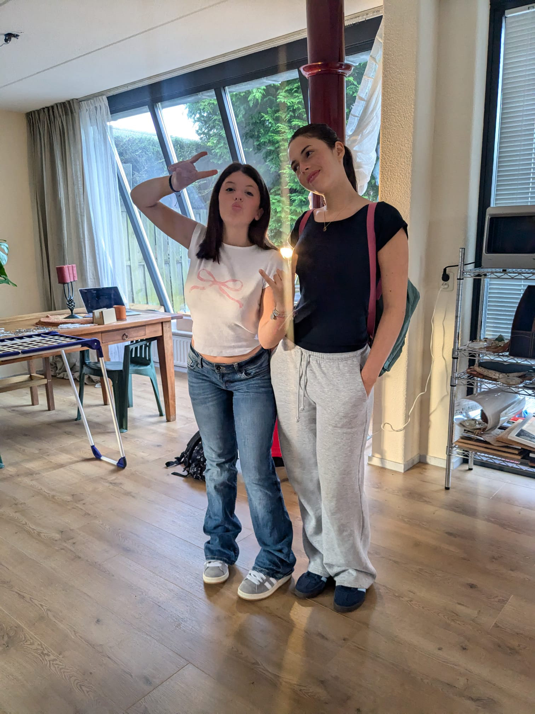
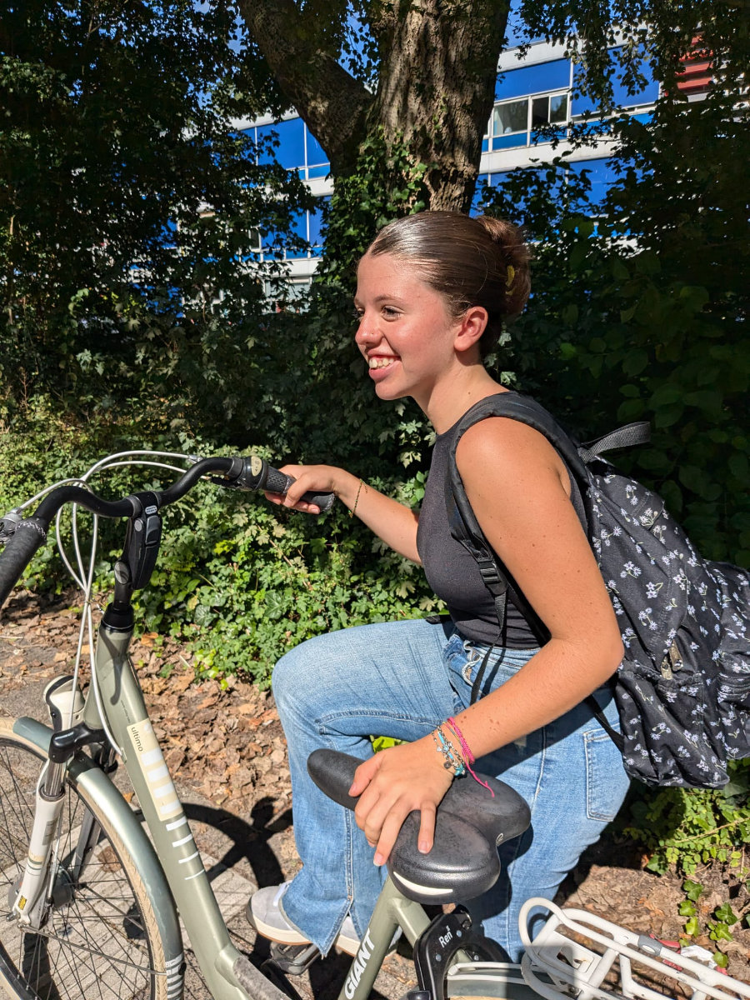
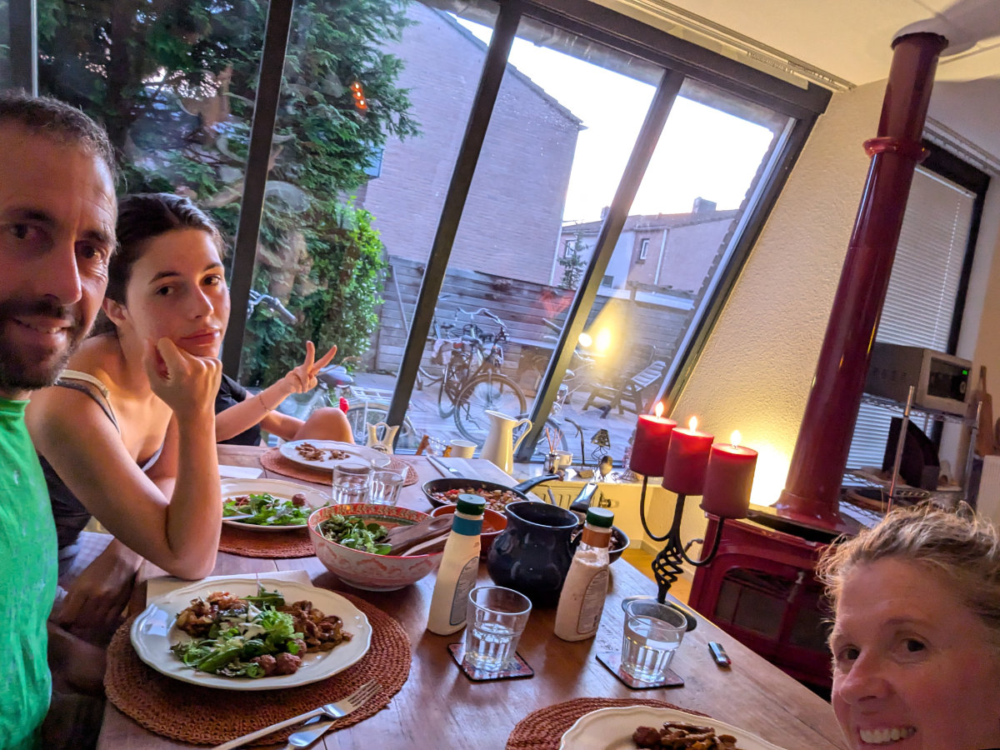
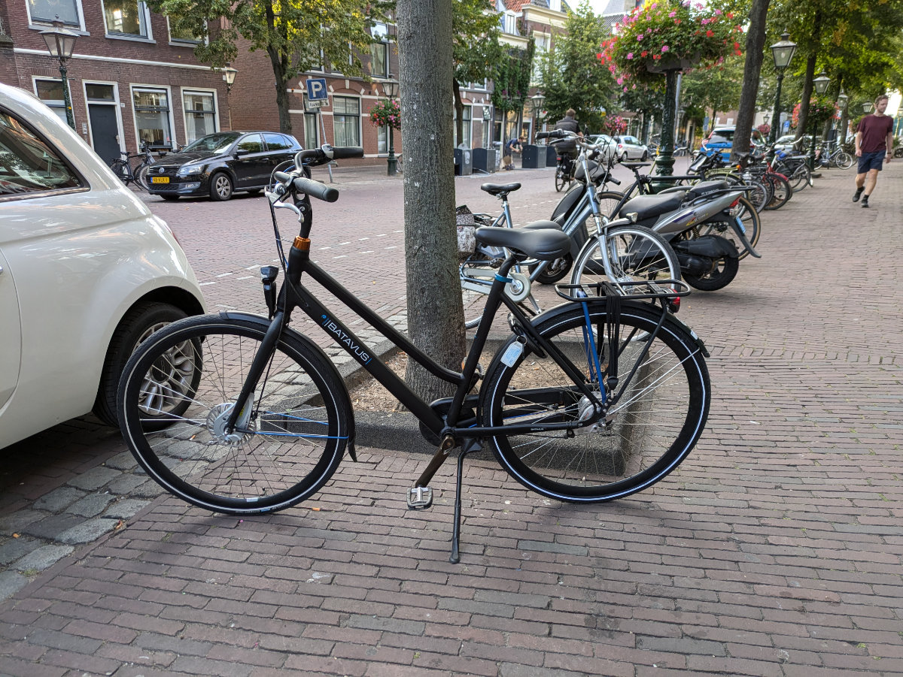
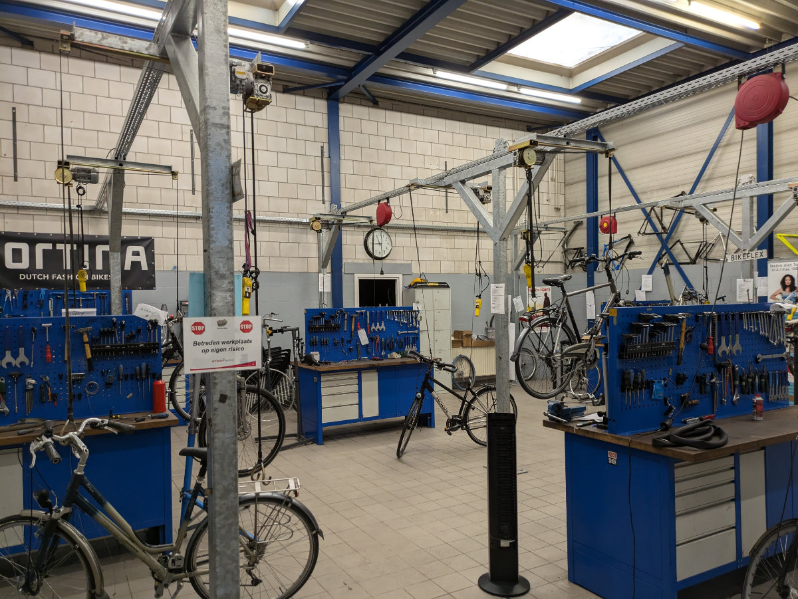
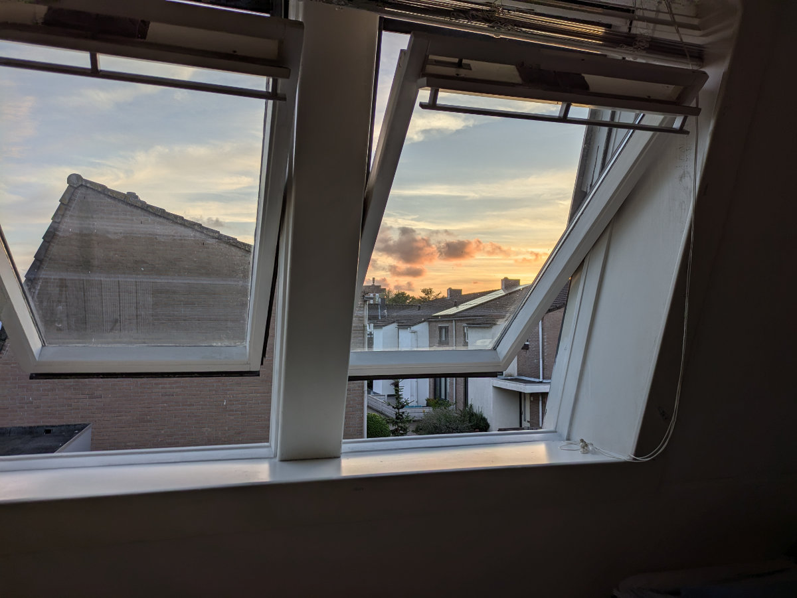
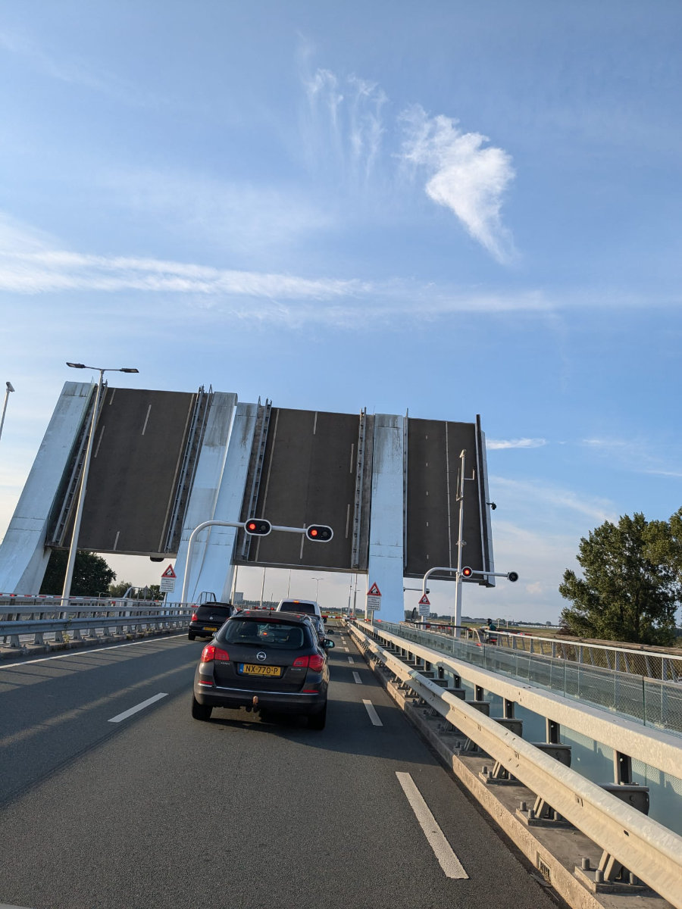

_Ready for a school day_

The girls started their school year on Tuesday, and I began the day before, on Monday, with bike mechanic school.

On Tuesday morning, there was a lot of excitement in the house. Gemma was supposed to start school at 8:20 AM that day, while Sophia at 10:00 AM. Gemma was more anxious than I’ve ever seen her. Since they were starting at different times on the first day, Hilly went with them by bike to the entrance. At dinner that evening, we talked a lot about their first impressions of school, the teachers, and their classmates.

Gemma's class is quite small, with only 14 students, aged between 12 and 16. They’re all beginners in Dutch, and they started with games to learn basic vocabulary. Gemma is much more advanced than them and is getting a bit bored, but they’ll probably move her to a class at her level later on. She quickly made friends with her deskmate, a Filipino girl.

Her attitude has changed radically. Before the vacation in Sardinia, she was very pessimistic about our decision to move to the Netherlands. Since they returned, and especially since school started, she seems like a different person. She still says she can’t stand the Dutch boys and gilrs, and luckily there aren’t any in her class.

Sophia’s class is a bit bigger, with 19 students, all in their second year of ISK (the international class before integrating into school in the Netherlands), and according to Sophia, she’s the one most behind in Dutch. This makes her happy because she likes to feel challenged and make great efforts to improve herself.

The mix of nationalities among the students is about 80% from the Middle East or nearby (Syria, Iran, Turkey, Afghanistan), 15% Ukrainian, and 5% from the rest of the world (Africa, South America, Asia, Europe).

The contrast between the girls from places like Syria and Iran (the majority) and the girls raised in non-Muslim cultures is quite stark. Gemma goes to school dressed as she likes (there’s no dress code) and fully made up, while the others go to school with Hijab's and bare faces.

In the first days of school, the teachers emphasized the importance of not being late or absent. If a student is an hour late, they have to stay at school for an extra hour after 4:00 PM. After a few instances of being late, the parents are notified. All absences must be justified, and efforts must be made to avoid them. For example, if a medical visit is needed, it must be scheduled outside school hours. To add even just one day to your vacation, you need the principal’s permission.

Hilly is now a housewife for the first time since 2005, when we got married, and for a few months, she didn’t have a job and waited for me at home in the afternoons after I returned from the pharmaceutical lab where I worked. She was frustrated because she didn’t know how to speak Italian yet and thought she would never find a job or have any friends.

Now she’s very happy to see us leave in the morning so she can focus on organizing the house, getting rid of the omnipresent boxes, cooking delicious dinners in our new kitchen, and going to the town hall or bank to take care of our bureaucratic tasks. Soon she’ll find a job and, knowing her well, also make lots of friends.

The house is taking shape nicely. It’s incredible how we all already feel “at home,” thanks also to all the things we brought from Montaione.

But the thing that makes me happiest of all is riding through the alleys and bike paths along the canals leading to the center of Leiden on my new bike. It gives me the same inner joy I had when I used to look out from my bedroom window at Civettaia, over those endless hills, or when I spent hours sitting on the top deck of a bus travelling around London, listening to music on my portable CD player and watching people from different cultures all caught up in the frenzy of the English metropoly.

My first week in the course is going very well. I’m learning new things every day, and my colleagues are very welcoming and make continuous efforts to communicate with me in English. We take long coffee breaks where they get lost in seemingly very amusing discussions, judging by their constant laughter, of which I understand nothing except for a word here and there, but for now, that’s okay. Albert, the teacher, is a good instructor. He’s very patient and always tries to challenge us with new problems and puzzles on how to solve various issues with the bikes we’re repairing.

We’re spending this whole week working on classic city bikes with derailleur gears and V-brakes. Next week, we’ll be working on Dutch bikes, which are a bit more complicated. I’ve learned to completely disassemble and reassemble the rear wheel, including the hub, even removing the ball bearings and all the spokes, which then have to be reassembled according to a precise pattern that can vary from wheel to wheel.

Yesterday, something noteworthy happened. We spent the entire afternoon in the meeting room studying the theory useful for repairing electric bikes. Albert wrote Ohm’s law and the equations for calculating work, given the volts and amps of a closed circuit, on the board.

Then he gave us some rather simple questions on how to check for malfunctions on an e-bike using a multimeter and applying the aforementioned equations. Under normal conditions, these concepts would have been very simple for me. Ever since middle school, I’ve always stood out in class as the one who quickly grasped physics concepts and the use of mathematical formulas.

Once in my first middle school year, the math teacher took me around to the third year classes to explain to the students how to solve quadratic equations, just to humiliate those in the third grade who still hadn’t understood them. Really a bad example from the teacher, who made me seem like a know-it-all in the eyes of my older classmates, inflating my ego and making those students who were already insecure even more so.

Yesterday, in the meeting room, for the first time in my life, I experienced a strong “dyscalculia,” the inability to manipulate numbers, which some people suffer from. I couldn’t solve problems that simply required inverting the formulas. I looked at the numbers and units of measurement as if they were an alien language without logical sense.

I think this happened because during the day, my brain functions are enormously focused on understanding a new language, Dutch, leaving very little room for the brain area useful for the abstract thinking necessary to solve mathematical problems. When I tried solving the problems at home later that evening, everything was clear and simple, and my faculties were mysteriously restored.

In the last fifteen years, it was nice working with my wife as my only colleague, of course with ups and downs. On certain sweltering summer evenings, while cooking dinner for guests, we would have strangled each other, but overall, we got along well. However, a change was needed, and now I realize how much I missed the healthy camaraderie among a group of bike nerds working on a common project.

_Gemma prepares for the ride to school_

_Dinners by housewife Hilly_

_My new bike, a real bargain found on Marktplaats_

_The workstations where I spend eight hours a day_

_The weather is still nice in the Netherlands, but soon we'll experience the infamous Dutch autumn_

_Transformer bridge, there are several in our area_
