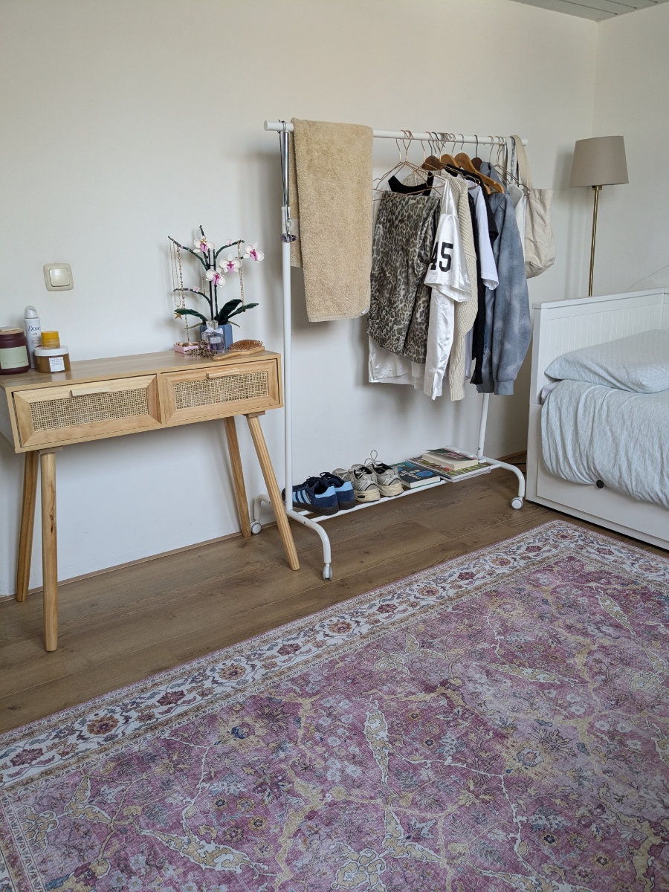

_Grappling with the washing machine and the force of gravity_

Another week has started and we were all looking forward to getting to work. Gemma said the weekend was too long, she would have shortened it by a day. On Saturday Hilly and I worked all day on the house (baseboards not yet finished). On Sunday, the four of us went to the natural science museum in Leiden. It's not the classic exhibition of stuffed animals, more or less interesting rocks and bones of extinct animals, instead, they had a more immersive approach mixing the same elements just mentioned with audiovisual installations, light shows and semi-dark rooms obtaining a more engaging effect.\
Since we have the museum card and can go back anytime we only saw a small part of the museum and then went for a picnic at the botanical garden, still taking advantage of the museum card.

I find it hard to put into words the joy we feel cycling around Leiden. You have to come and try it to understand it.

This morning at the bike school we spent several hours discussing sprockets, chainrings, chains, rear and front derailleurs analyzing them in detail, in all their possible variations and combinations.\
In the afternoon we paired up to take apart an electric bike motor and it was fun collaborating with my partner, neither of us had any idea how to do it and we had a lot of laughs.\
A load of Dutch city bikes has also arrived, there are about thirty of them, quite wrecked. In the next few days we have to disassemble them one by one and refurbish them, then they will be sold.

The girls had their first meal at school, they formed a table in the cafeteria along with a small group of South Americans, Syrians and Turks. They say that being Italian they are venerated by most of the students and they obviously like this situation.
They have different schedules every day and when Gemma finishes before Sophia she waits for her in the cafeteria, partly because she wants to go home together and partly because there is a Colombian boy she likes in her class and he also stops to wait for his brother.

A little while ago we carried out a feat that at first seemed impossible. I have already talked about how steep the stairs are in Holland.\
Crazy stuff.\
In Italy they would be illegal. Even in our house they are no less and I already know that one of these days I'm going to take a good fall. Anyway, the incredible feat was to bring the washing machine, which was in the kitchen, upstairs to put it in the bathroom.\
We tied a rope around the very heavy appliance, Sophia and Gemma pulled from above and Hilly and I pushed from below. At one point we got stuck and thought we would never make it and would have to stay there until someone let go and Hilly and I would end up crushed at the foot of the stairs, near the front door.\
Instead thanks to a sudden burst of energy we managed to get to the last step and now the infernal object, symbol of female emancipation is in its place in our bathroom.

After the feat Sophia and I went for a run around the neighborhood. The Dutch have an urban development model that I really like. Our area is a maze of streets and clusters of houses that are always different and interesting. Every two or three blocks the style of the houses changes and there are many parks, playgrounds for children, canals, ponds, pastures of sheep and cows. Running along a canal you can look into the gardens of the various houses, all have steps that go down to the water where there is a boat, a canoe or a SUP attached.

A couple of nights ago, with Hilly, we did the math on the fixed costs we will have to incur to live in Holland. The situation is not exactly rosy. I really like to read the details of the economic situation of families or individuals, I know that for many people these are private things that are not talked about, I like to do it.

Between rent, utilities, health insurance and various amenities, the monthly fixed costs reach the figure of €3300. If we then add the grocery shopping, the very limited occasional shopping and some small entertainment, we get to €4400. Two basic salaries are therefore enough for mere survival without being able to afford holidays, extra purchases, unforeseen events or accumulation of savings. As soon as we have a job I will write exactly how much we earn. The positive thing is that here it is much easier, compared to Italy, to have salary increases or second paid activities.

Compared to Italy the big differences are in the cost of houses and in the mandatory health insurance, which however does not cost much, in our case we spend €330, for the whole family, because we added orthodontics for Sophia and Gemma, but you can also stay under €300 per month. Children under the age of 18 do not pay for health insurance but benefit from that of the parent with the most advantageous insurance.

Since the possession and use of cars is strongly discouraged (one of the reasons why we chose to come here) it means that the car tax and car insurance are very expensive, always compared to Italy. As for fuel, however, we are at the same level of costs with the difference that diesel costs much less than petrol.

Next year will be a bit of a settling-in year, we will have to dip into our savings, which have almost halved in the last 3 months, to supplement our salaries and try to increase our income as soon as possible. Definitely no holidays until 2026.\
This thing, however, does not weigh on us, at least for now, because we are all enthusiastic simply to be in this place and to live our new daily life.

_The beautiful interior of the natural science museum_

_The small window on the stairs at home_

_Sophia's bedroom_

_Sophia's desk—we still don't have chairs, so we're using the plastic ones we found in the garden_

_Gemma, on the other hand, still doesn't have a bed._

_Used sofa, a great deal_

_We found this piece of furniture in the center at a 'Kringloop'; it looks great in the kitchen. We still need to find an oven.._

_My first complete renovation of a city bike. This photo is from yesterday; today, I've almost finished putting everything back together._
