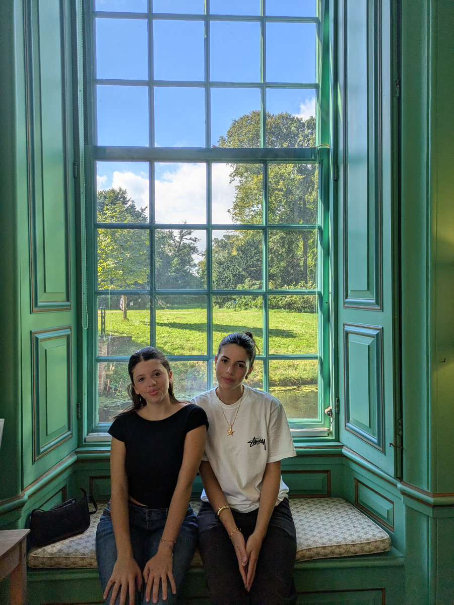

_Inside Duivenvoorde Castle, a few kilometers from our house_

As a child, I started going out on my own in the early years of elementary school. What began as simple playtime in the courtyard with a friend, who was also my neighbor, gradually turned into exploring the neighborhood and pushing myself to venture farther and farther away. It was like a video game, where as you progress, new locations appear on the map; my world expanded, bringing more opportunities but also more dangers, most of which I was largely unaware of.

Within a few years, I gained more and more confidence, and to continue with the video game analogy, I unlocked a new ability: I got the keys to the house.

In middle school, I began going out in the evenings too, especially as summer approached. I would frequently hang out outside the homes of some friends who lived in my neighborhood, because there was a girl I liked a lot, and I’d return home before midnight, as long as there was no school the next day.

When high school started, my map suddenly expanded to cover the entire city of Milan, and I unlocked new, fascinating abilities, though not all of them were positive, I must admit.

I believe this gradual increase in freedom and trust from parents is a common experience for everyone.

Except in the case of Sophia and Gemma.

In their case, this gradual process didn’t happen because they went from occasional outings in the small town of Montaione (where Gemma had to be driven since we lived 17 km away) and even rarer evenings out with classmates (for Sophia, always involving a car ride), to now having the entire city within biking distance and, in the past few days, beginning to go out regularly with a small group of school friends.

This situation is completely new for both me and Hilly. On the one hand, we’re very happy that they’re adjusting so well, but on the other, we’re becoming aware of new anxieties and concerns.

One really nice thing that’s happening is a renewed closeness between Sophia and Gemma. Sophia constantly goes into Gemma’s room, and I hear them giggling all the time and talking about people I don’t know. We did meet the group they’ve been hanging out with recently, though. Two days ago, they were in a park near our house, the Dutch utumn is painting the Netherlands in a hurry so they all sought refuge on our new (second hand) couch.

There were four of them, all boys, between 14 and 18 years old. Two Colombians, an Egyptian, and a Congolese. They made a good first impression, even though we didn’t see them for long because Sophia and Gemma banished us upstairs, forbidding us from embarrassing them with our “boomer” antics.

We agreed to stay out of the way because we were a bit caught off guard by the novelty, but we made it clear that next time we expect to be able to move freely in our own home.

One attitude we definitely want to avoid is the classic Italian one, at least in my experience, where kids with their friends become antagonistic toward their parents, trying to spend as little time with them as possible. I refer to Italy because the way Hilly grew up is completely different. From my first visit to South Africa, I remember being surprised at how much parents, friends of parents, uncles and unts, etc., were included in the young people’s gatherings. I liked this right away. In my world, adults were always seen as dangerous plague-stricken individuals with whom it was best not to share confidences and to stay as far away from as possible.

From what I understand so far, in the Netherlands, the situation is more similar to the South African one.

Even at school, both Gemma and Sophia immediately noticed how students aren’t in constant opposition to teachers and are treated as equals. The atmosphere that’s created is much less tense and rigid than how they both remembered it until last school year.
