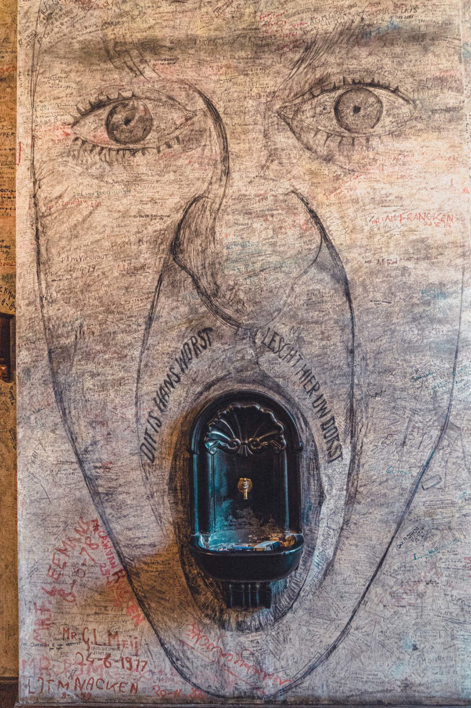
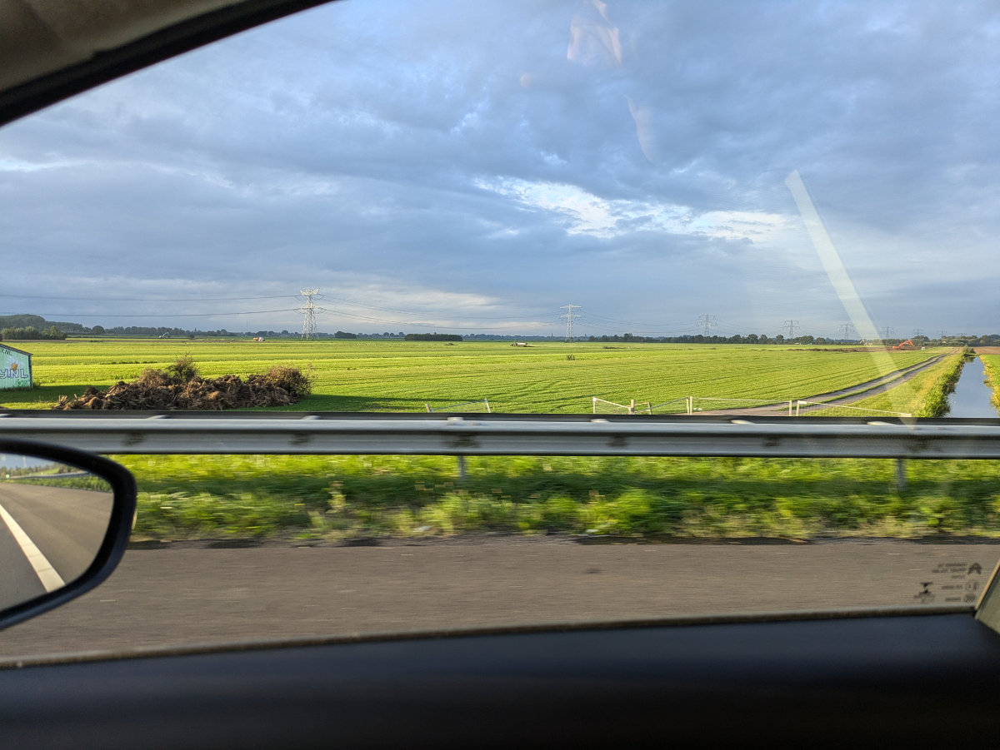
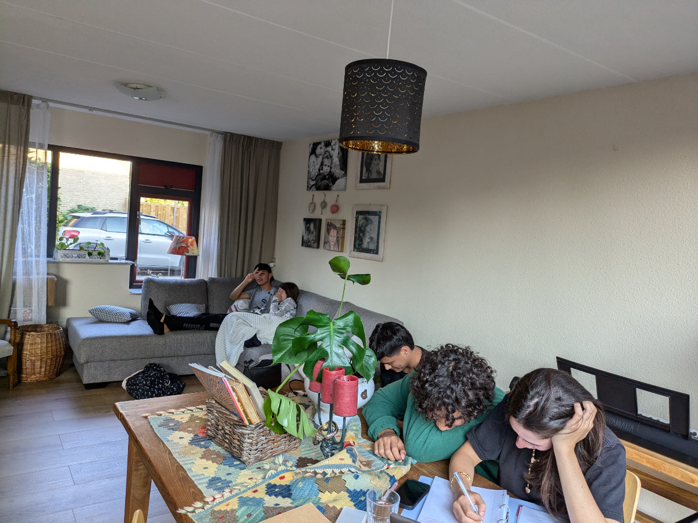
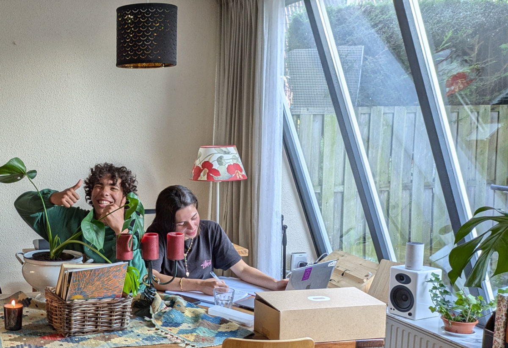
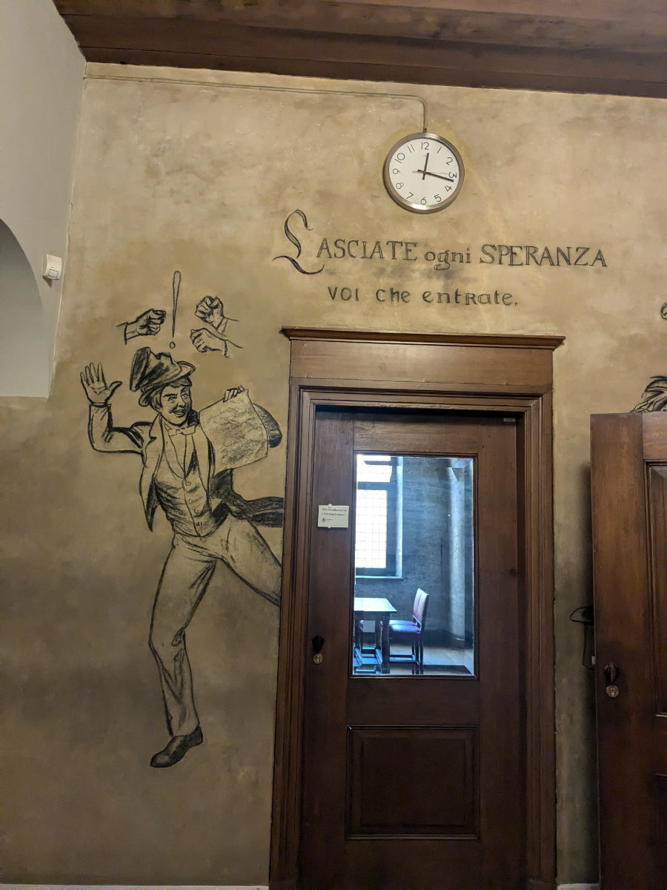
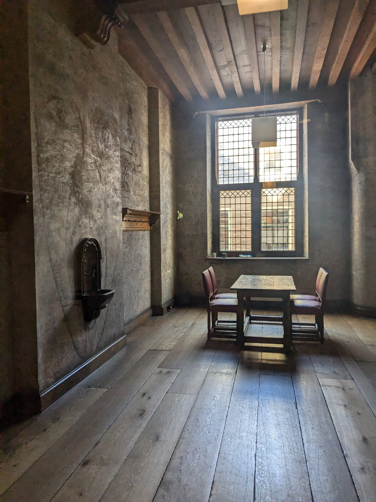
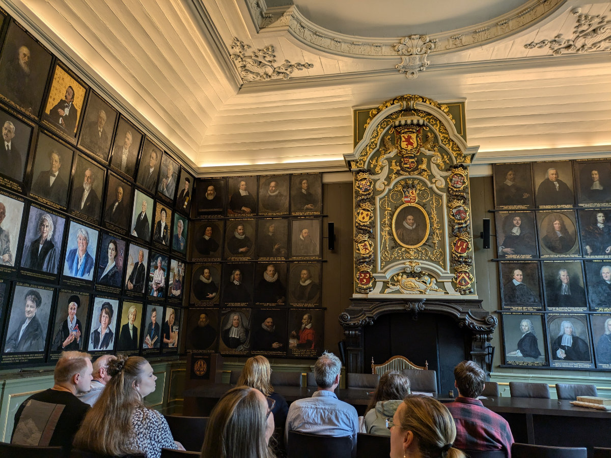
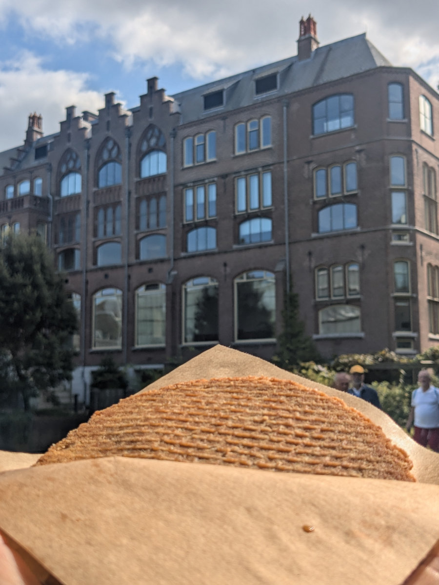

_A drawing studded with signatures in the "sweat room"_

The last few weeks have seen me caught up in a sort of routine. Bike mechanic course from Monday to Friday, visits to the local "kringloop" (second-hand stores) on Saturday mornings, housework on Saturday afternoons, cultural outings in Leiden on Sundays with the whole family… repeat. The road traffic, both in the mornings and afternoons, has gotten worse lately, probably due to the Dutch returning from vacation. It takes me 2 and a half hours driving back and forth. Luckily, there are podcasts!

In the bike course, we’re quite a close-knit group. The instructor told us that it's rare to find groups so motivated, and jokingly suggested that we open a shop together. Yesterday, in the middle of the day, he gave me a mountain bike that he found on the street to fix up; it was in pretty bad shape, but all the components were in place. I immediately hung it up on the hooks, disassembled everything, and set about cleaning and greasing all the parts. This afternoon, I put it back together, adjusted the brakes and derailleurs, and then took it out for a test ride. It’s a beast!

Before leaving today, in the afternoon, since there were only four of us, he gave us a group task. One of the bikes we’re working on had a fractured frame, so he told us to find another frame from those stacked in the warehouse and adapt it to fit all the components from the one with the broken frame. Quite the challenge. We should be done by tomorrow.

Hilly had her first job interview. It's for a position at Johnson and Johnson, the American pharmaceutical company, which has a large branch in Leiden. She would work in the labs where they make breast prosthetics. If she passes the next interview, which should take place in the coming days, she’ll receive a temporary contract starting from early November.

Even though it’s a type of job she never expected, she’s happy for several reasons. First of all, it’s only a 20-minute bike ride from home. Second, the pay is pretty good, though we’re not exactly sure how much she’ll take home because they always talk about gross salary; we’ll see with the first paycheck. A third positive is that she would work a six-day week, meaning four days of work and two at home. A slightly less positive aspect is that she would have to do shifts, one from 6:30 AM to 2:45 PM and the other from 2:45 PM to 11:00 PM, and it also seems she’ll rarely get the entire weekend off, which isn’t ideal. In any case, the job isn’t guaranteed yet, and even if she doesn’t like it, she can always look for something else.

The girls are experiencing an explosion of new stimuli and discoveries, especially Sophia, who wasn’t used to so much social life all at once. I mentioned in another post that Gemma had developed a crush on Aleandro, a Colombian boy, but even Sophia quickly found herself a boyfriend, of Egyptian origin but raised in Dubai. They didn’t waste any time, those rascals!

We’re all a bit surprised by these developments, but soon we’ll have to set up some new rules and boundaries if we don’t want to be overwhelmed. A few days ago, I went with Gemma and Sophia to visit a gym near their school, where they want to sign up. It’s a women-only gym, a new trend here in the Netherlands; we had already seen some in Amsterdam. Sophia started the free trial week, but Gemma couldn’t sign up because they told us that you need to be at least 16 years old to join a gym in the Netherlands. Poor Gemma will have to find another sport to dedicate herself to, even though she was a bit upset by the age restriction and says she doesn’t want to do any other sport.

Last Sunday was a special day in the Netherlands because the doors of monuments usually closed to the public were open all day. We took the opportunity to visit a historic building in the center of Leiden, home to the country’s oldest university, founded after the Dutch Revolt in 1575. Inside the university building is the famous “sweat room,” where, until recently, students would wait for the results of their final exams. By tradition, students left their signatures on the room's walls, and today there are tens of thousands of them. Among the most famous signatures, you can see those of Winston Churchill and Nelson Mandela when they received their honorary degrees.

A bit less famous but equally relevant for us is the signature of my father-in-law, Henning Viljoen, who passed through the sweat room and left his signature in the early 1970s when he completed his doctorate in law. What an honor!

I won’t go on again about how wonderful it is to ride around Leiden on a bike, I sound like a broken record, now you just have to come try it for yourselves. Almost every day, Hilly and I take a little ride. We’re enjoying our free time together, like when we were newly married and didn’t have kids yet.

For now, the weather is still nice, but soon the rains and cold will begin, and we’ll experience the much-feared Dutch winter. Then it’ll be goodbye to the pleasant pre-dinner bike rides.

_Out the window on the highway in the morning_

_Gemma, Sophia and their friends_

_Sophia and Fares_

_Entrance door to the "sweat room" with Dante's warning._

_It looks more like an execution chamber than a waiting room_

_In this room my father-in-law discussed his doctoral thesis_

_Freshly baked stroopwafel_
