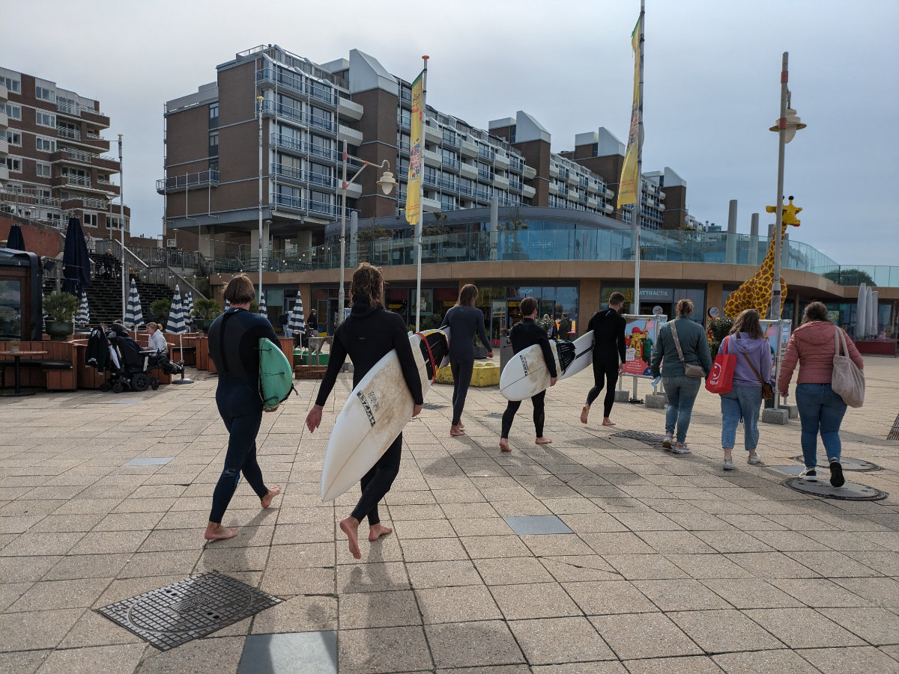
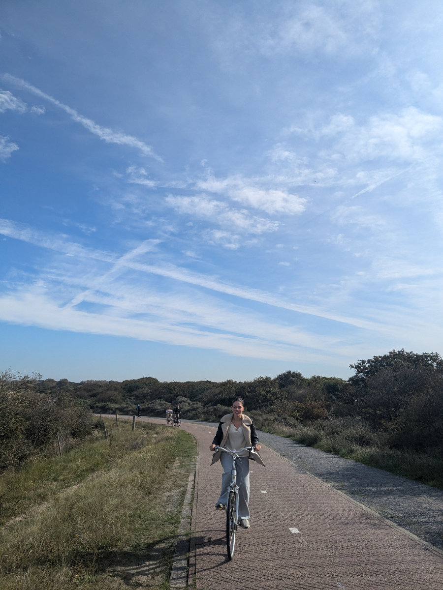
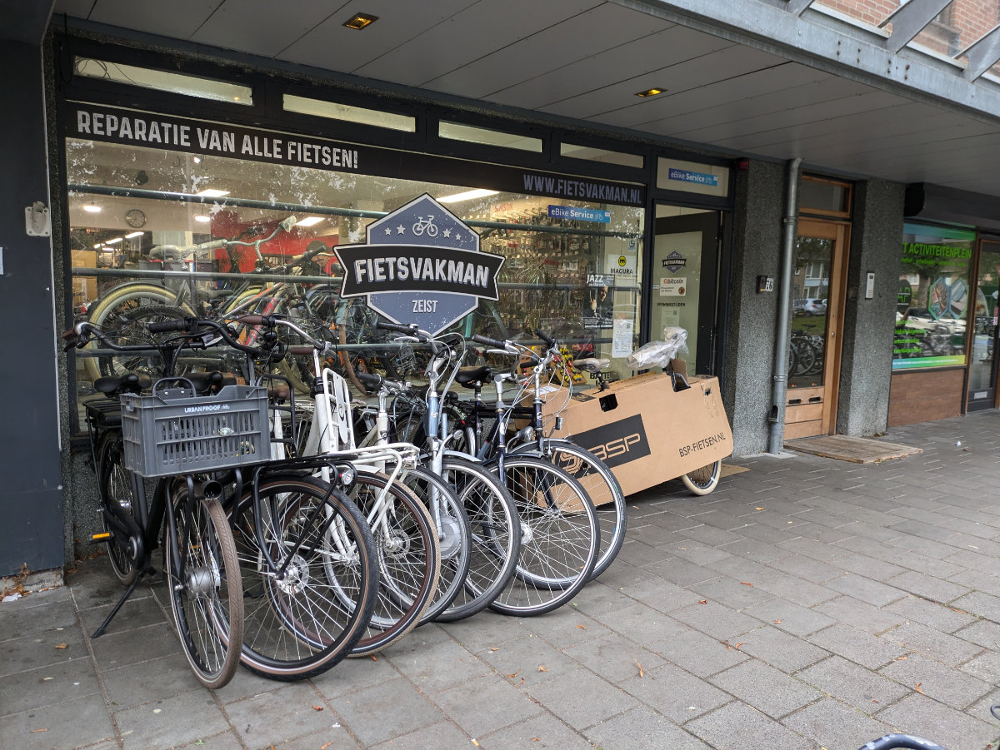
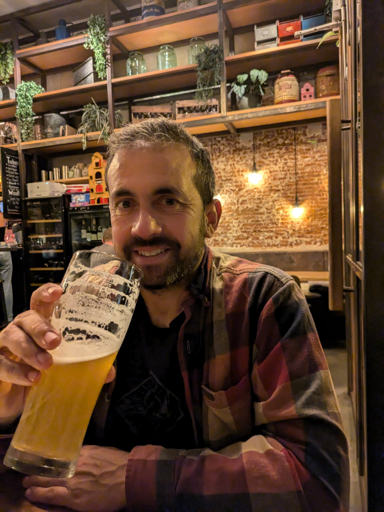
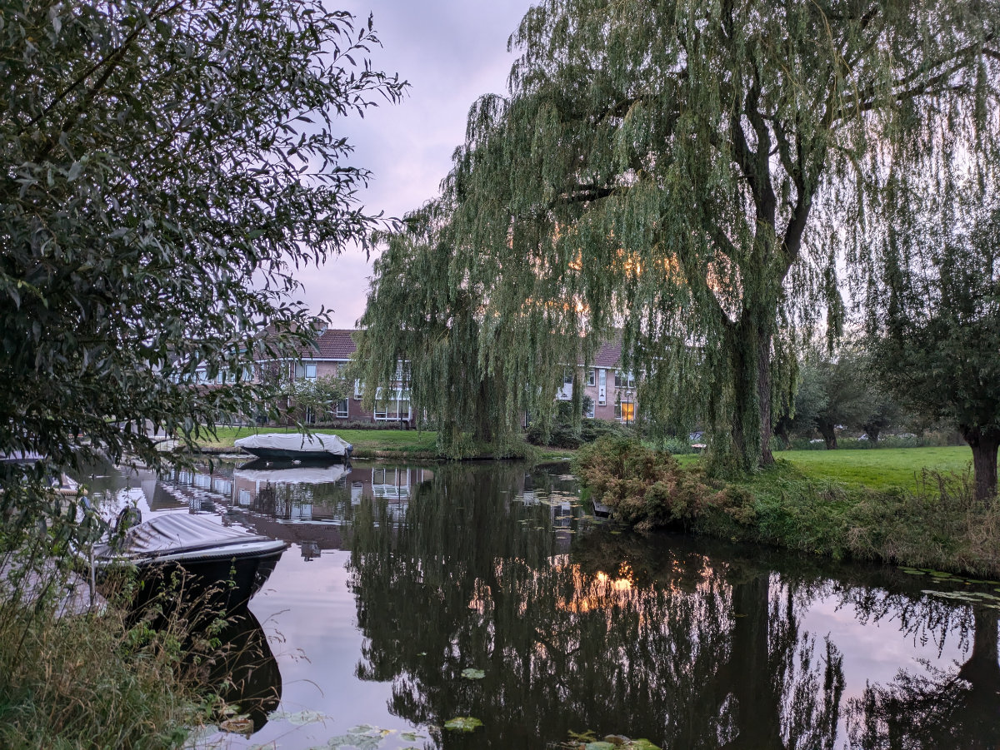
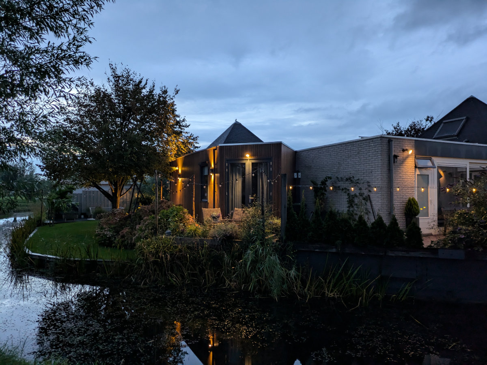
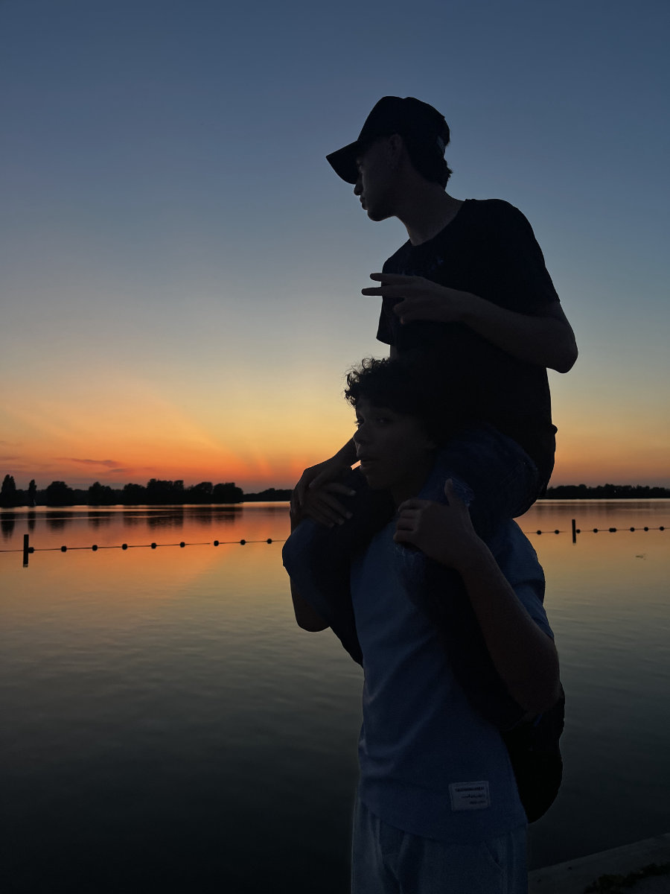
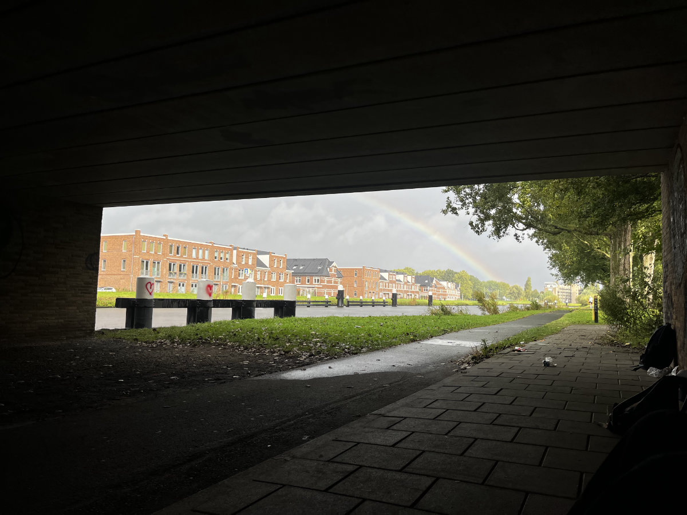

_On the seafront in Scheveningen_

Yesterday, the four of us went to Scheveningen by bike. It was sunny, but there was a brisk chill in the air. There's a bike path that runs along the coast, and from Katwijk, near Leiden, you can reach The Hague, passing right through Scheveningen. It's a beautiful route, winding through sand dunes, shrubs, and coniferous trees. There were lots of people biking and running. The sky was clear, the sun was incredibly bright, but not warm at all.

In Scheveningen, there were several surfers heading towards the beach. The waves weren't huge, but they were regular and long, perfect for learning. We saw two surfers arrive by bike, wearing wetsuits, barefoot, and carrying their boards under their arms. What a contrast!

The idea for this outing came from Hilly after she did the same route, 35 km round trip, last Monday. She had gone for a job interview to be a wine sales representative for a South African wine farm. At the interview, there was an Italian and a South African, both owners of various businesses. Out of all the résumés they received, they only considered Hilly's and one other candidate’s. The interview went well, and they agreed to make her an offer when one of the two, I can't remember if it was the Italian or the South African, returns from vacation. The offer would likely be commission-based rather than a fixed salary, which wouldn’t work for us right now. For this reason, Hilly has decided to decline the offer, whatever it may be.

In the meantime, she’s had two more interviews with Johnson & Johnson, and they will be hiring her. She hasn’t signed a contract yet, but they’ve told her she will in the coming days. The job would be shift work, as I mentioned in a previous post. The work environment seemed positive, stimulating, and international. The work is all in English, and she will start in the "breast prosthesis packaging" department, with the possibility of quickly moving to higher levels.

Hilly’s news about her future job at J&J came on Friday, the same day I worked a shift at a bike shop in Zeist, the town next to Utrecht where I go every day for my bike course. The shop is called "Fietsvakman" (Fiets means bicycle in Dutch), and it partners with Maintec (where I’m taking my course) to give apprentices hands-on practice. The owner of Fietsvakman is Roger, a Salvadoran/Canadian who has lived in the Netherlands for 25 years, married to a Dutch woman, and they have a 17-year-old son. Roger has done several jobs in the Netherlands and, out of passion, opened a bike shop in 2017. His only colleague is Jost, a Dutchman who has been working with him since the beginning.

They showed me in great detail how the shop operates. Throughout the day, dozens of customers came in. When a customer arrives, they usually bring a bike, unless they want to buy a new one or need parts or materials. When taking the bike in, you need to do a quick visual inspection so that any additional issues, beyond those mentioned by the customer, can be discussed right away.

During the day, I worked on several bikes, each with its own problems, some easier to solve than others. Working with Jost and Roger was a lot of fun. Roger is a character, constantly making jokes. The workstations were quite messy, a whole different story compared to the bike school. I had to carve out a little space to place my tools and the parts I disassembled, amidst a mountain of other tools, used spare parts, broken pieces, half-empty grease containers, punctured inner tubes, various packaging, and trash. A chaotic scene where Roger and Jost probably saw some sort of system, though not too much, since they spent a lot of time looking for a 15mm wrench or a chain tool. The excuse is that they're setting up a new shop, on the same street as this one, but twice as big, and they need to move in before Christmas. The day was extremely stimulating, and I can’t wait to start working in a shop, where I absolutely won’t compromise on the order and cleanliness of the workstation.

The particular cosmic alignment where on Friday both Hilly's and my jobs became more concrete, combined with the fact that Sophia and Gemma had organized an evening with friends at our house and kindly asked us to leave for a few hours, set the stage for an extraordinary outing for Hilly and me. We went to a beautiful bar on the canals in the center of Leiden, and I ended up breaking my nearly nine-month streak of not drinking alcohol. How I enjoyed that beer! Cheers!

During dinner, surrounded by dozens of students, as I savored a local craft beer and Hilly enjoyed a glass of Primitivo from Apulia, we fantasized about opening a bike repair shop, attached to a café, in Leiden. We imagined creating a place where people could bring their bikes for maintenance while enjoying a slice of cake or a plate of proper lasagna. The idea made Hilly’s eyes light up, and we got lost in fantasies and brainstorming about the interior design and potential menu. Who knows, maybe in a couple of years, a new adventure?

Sophia and Gemma are increasingly happy with the new situation. Gemma has blossomed. I’ve never confronted her about the fact that she swore she would never adapt to the Netherlands, while I kept telling her otherwise. Stubborn as she is, to avoid giving me the satisfaction, she would come up with any excuse, but one of these days, I’ll tell her.

Last Friday evening, they went with their friends for a picnic at a lake very close to our house, less than five minutes by bike. They stayed there until sunset.\
Behind our house, there are beautiful canals along which I go running, and at dusk, when the lights come on in the small gardens, everything feels very "gezellig," a Dutch word that can’t be precisely translated into English, except perhaps as "cozy," which in turn doesn’t have an exact equivalent in Italian, meaning a mix of welcoming and intimate.

_Towards Scheveningen_

_Roger's bike shop_

_Cheers everyone, I really enjoyed it_

_The canals behind the house_

_Gezellig!_

_Photo taken by Sophia at the lake_

_A few days ago Sophia hid under a bridge next to her school, with some classmates, to avoid the rain_
