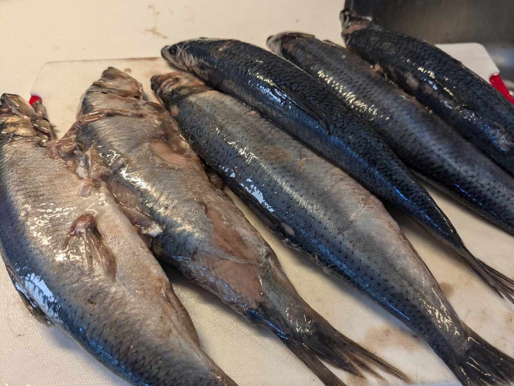
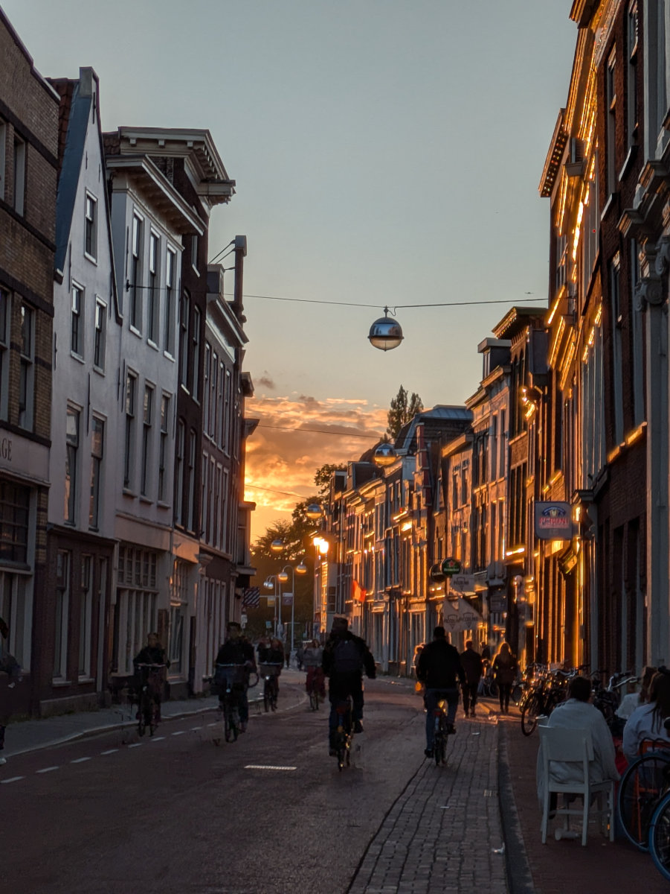
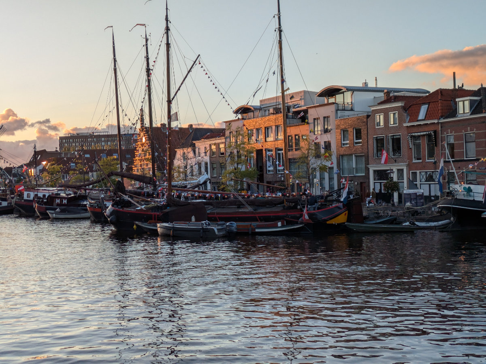
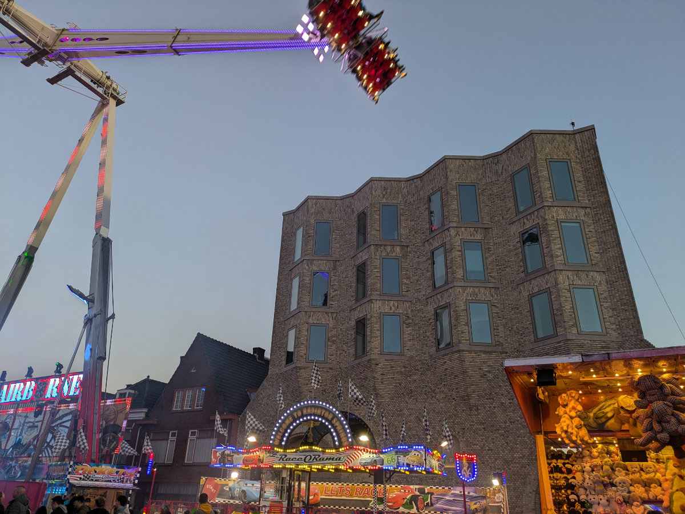
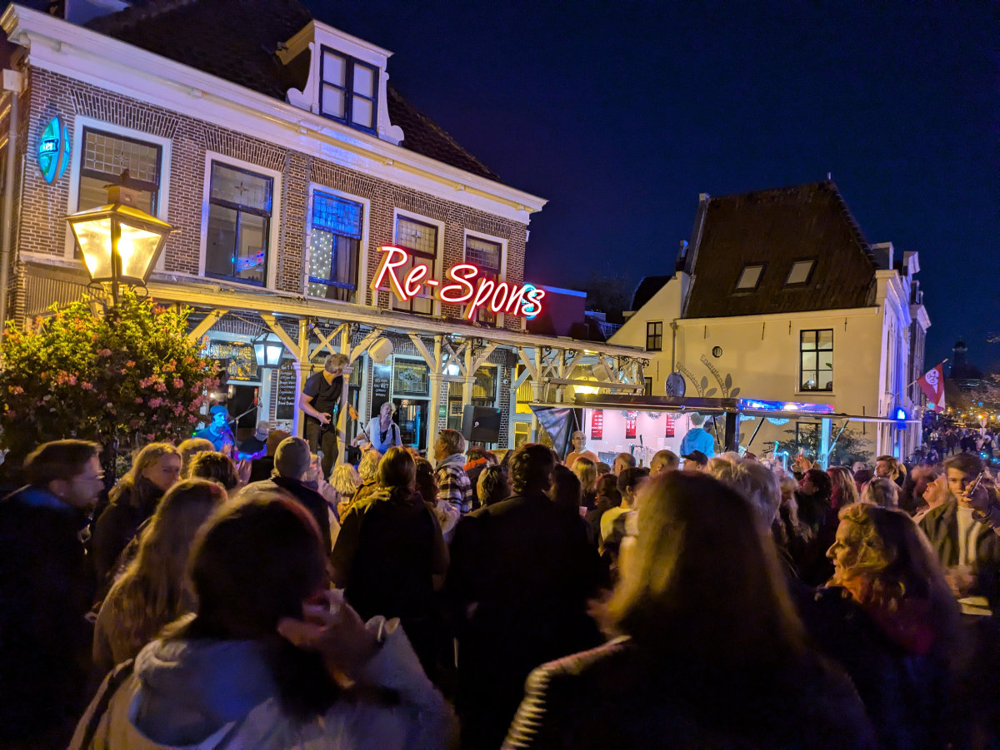
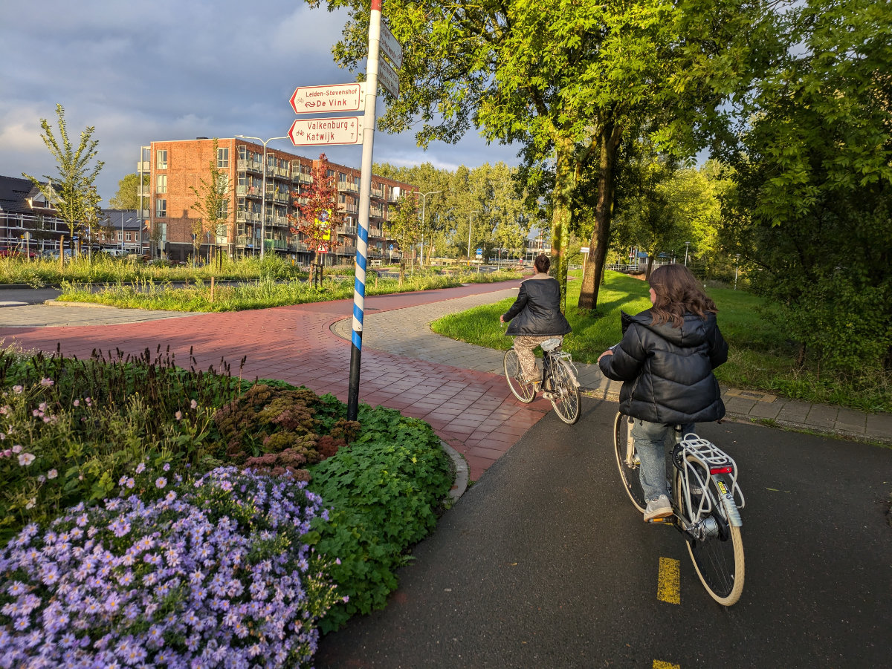

_The rides tower over the town_

Last week, in Leiden, there were big celebrations. On October 3, 1574, 450 years ago, Leiden was liberated from Spanish occupation. Every year, the entire city is involved in a large liberation festival. On October 2, as per tradition, “Hotspot” is offered, a traditional Dutch dish, a kind of mashed potatoes, onions, and carrots served with a beef stew. According to legend, the recipe dates back to 1574 and was the food the Dutch found in the Spaniards' pots as they fled after the long siege of Leiden.

The Hotspot is offered for free by the “October 3rd Association” to all Leiden residents. We joined the line around 5:30 pm. The long and orderly snake of people wound through several streets of the historic center and led to stations where volunteers served the steaming food. All around, groups of people were already eating and drinking beer. At first, I thought it would take forever to reach the much-awaited meal, but it only took about twenty minutes. It was me, Hilly, and Sophia, who was a bit pessimistic about the quality of what looked like poorly made slop. In the end, though, she had to change her mind and cleaned her plate completely.

The next day, all schools, shops, and offices were closed. The schools took a four-day break. In the morning, Hilly went downtown early (I was at bike school, which didn’t stop since it’s not in Leiden) to get fresh herring and bread, all also offered for free to the residents, part of the tradition. From the afternoon until late at night, the city was transformed into an amusement park, with rides set up throughout the historic streets, musical bands playing, parades of all kinds, street food, stalls, and beer flowing from 10 in the morning.

Some of the rides were truly crazy, towering tens of meters over the historic buildings, creating a striking contrast. Equally impressive was the cost of the damned attractions, with the best ones costing up to 25 euros for a ride, but even the more insignificant and common ones were quite expensive compared to Italy. Nonetheless, they were always full of people.

The girls wandered around all evening with their gang, while Hilly and I bought some beers from the supermarket, a bottle of rosé, and enjoyed the spectacle of colors and sounds like we hadn’t in a long time. At one point, we found ourselves in a little square where a band was playing music from the 80s and 90s, very engaging, with the audience all over 40, fully immersed in dancing and singing the songs at the top of their lungs. It was a magnet attracting every “Boomer” in the vicinity. We, being part of that category, were inevitably drawn in and stayed for about an hour. Any young person arriving seemed baffled by the bizarre sight of sweaty, fired-up old people, parents, and grandparents really going for it!

Since I had to get up early the next day to go to the bike shop in Zeist, where I would find the friendly faces of Roger and Jost, but also the huge mess of stuff randomly strewn over every horizontal surface, we decided to head home before midnight, when the fireworks were supposed to go off. Unfortunately, we missed them. But in the morning, I had fireworks in my head! I’m no longer used to beer and wine.

_In the background you can see the queue to get herring and bread_

_Our Fresh herrings_

_At sunset the party gets even more lively_

_One of the main canals in Leiden_

_One of the many attractions_

_We're heading to the big party_

_Free parking!_

_The Boomers' Square_

A few days ago, there was also a meeting at the girls' school, where all students and their parents or legal guardians were invited to attend. The gathering was at 7:00 pm in the school's auditorium. On a long table, there were large thermos containers with tea and coffee, as well as plenty of cookies and donuts. There were probably around two hundred people in total. The school's introductory speech was given in Dutch but was translated after each sentence into English, Arabic, and Ukrainian.

The school has students from more than 40 different nationalities. Sophia and Gemma are the only Italians.

In the second part of the meeting, we went to different classrooms where the class teacher/tutor gave us more detailed information and answered our questions. I went to Sophia’s class, and Hilly went to Gemma’s.

In November, they will take in-depth tests on their Dutch language skills, and based on the test results, students may be moved to classes that better suit their level. In fact, Sophia and Gemma are quite ahead compared to the other students, thanks to their knowledge of Afrikaans.

One slightly negative aspect of the otherwise excellent Dutch school integration system is that the students tend to speak English or Arabic among themselves during all social moments outside of lesson hours. This somewhat slows down their integration into the regular school system, although it undoubtedly makes the process smoother and promotes inclusivity and the reduction of disparities between students.

This weekend, the girls will be looking for a job. Here, almost all teenagers work, even if only a few hours a week, usually in the late afternoon or on weekends. This will be very useful for them, not only to increase their finances but also to get more practice with Dutch.

Next week will be my last at bike school, and then I’ll also step into the wonderful world of work. Hilly, on the other hand, should start her contract on November 14th, so she has more than a month left as a housewife!

_On the way to the school reunion_

_This crustacean crossed the road in front of me, all confident, a few days ago. I couldn’t believe my eyes, it must have come out of one of the many canals._
