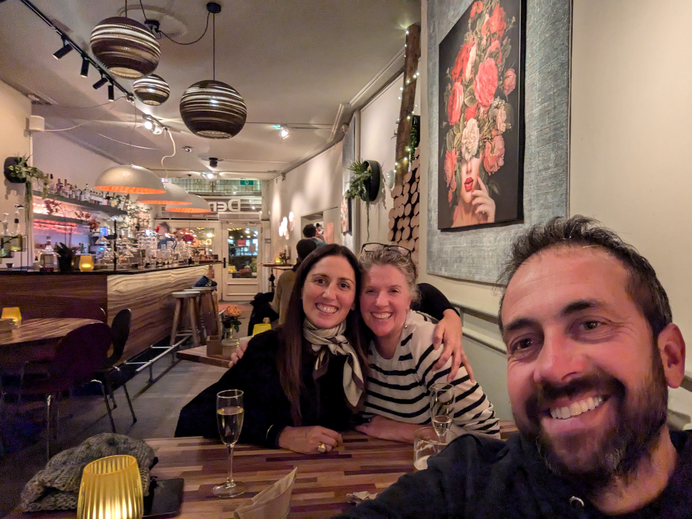
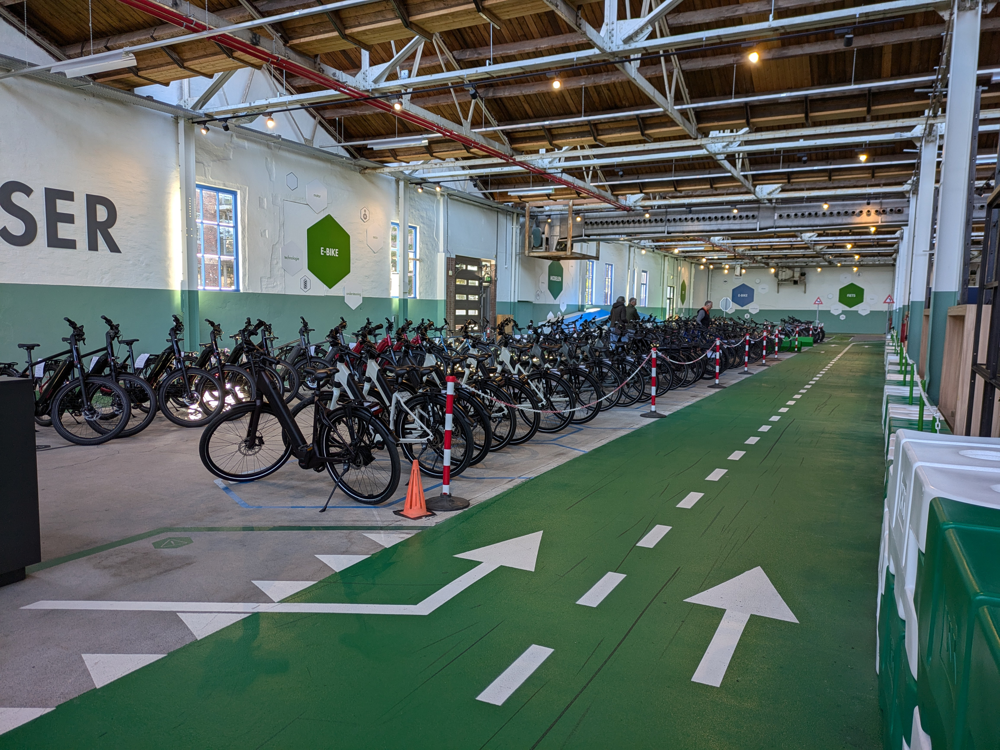
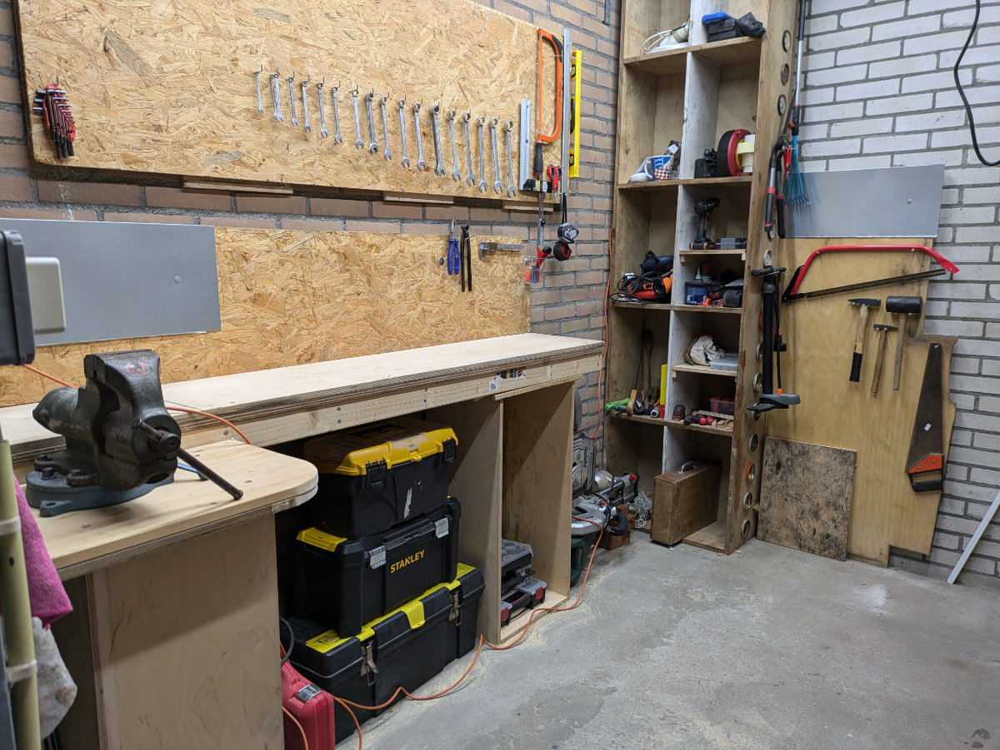
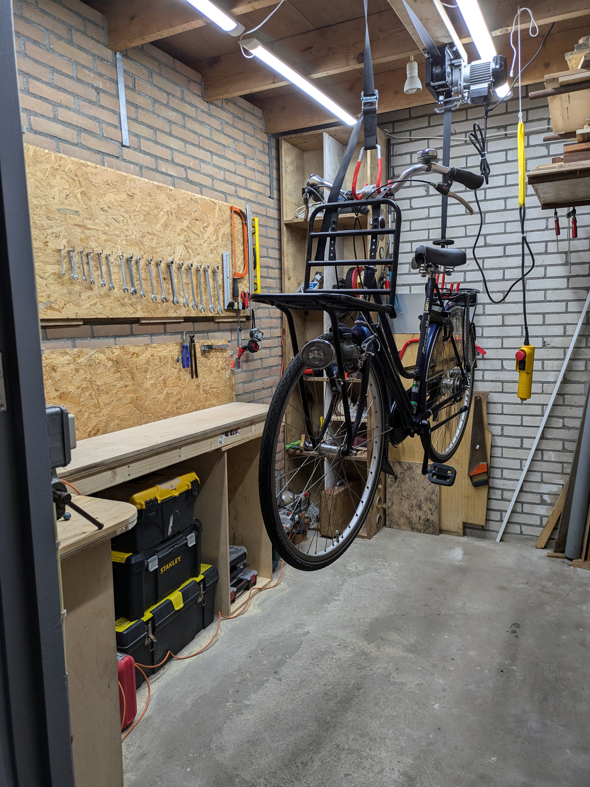
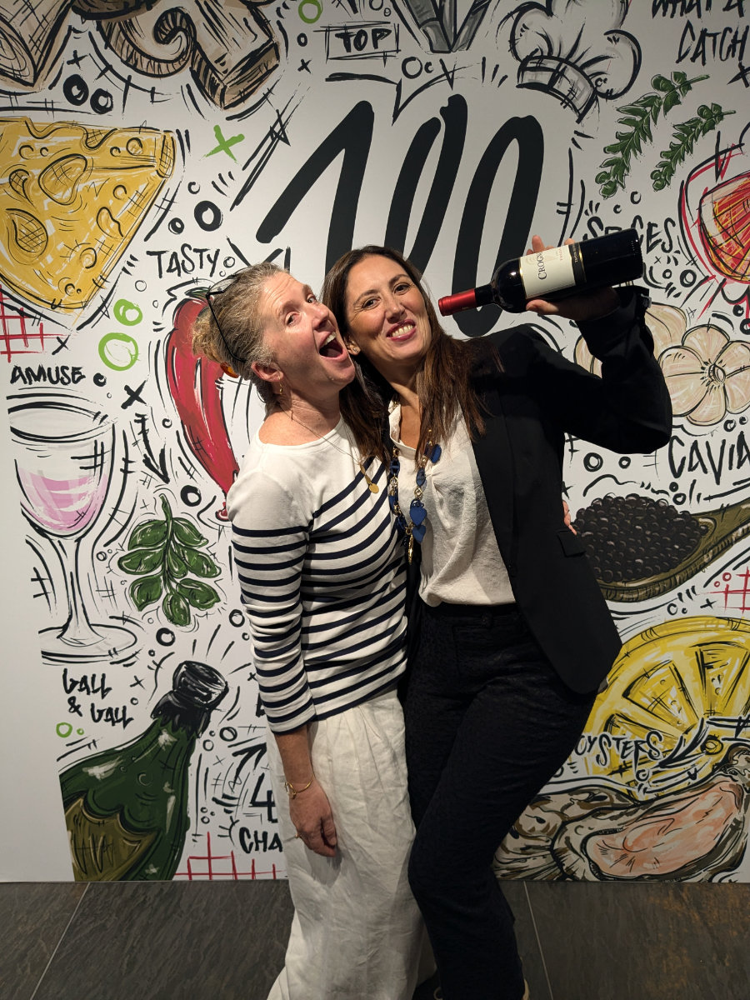

_Natascia is our first of a long series of guests_

I apologize to all Cassetta's Reboot fans for the lack of posts recently. At the moment, I'm having a hard time finding the time and inspiration to write. Initially, I used to post every two or three days, and now it's been two weeks. Nonetheless, I’ll keep going, even if it turns into a monthly update, who knows.

A week ago, on Friday, we went on a school trip with the bike school. We visited a place called “De Fietser” (the cyclist), and Hilly came along too. It’s a large space created in a former factory, where there were dozens of bicycle models of all kinds from various Dutch and international brands, which could be tested on an indoor track. Only in the Netherlands!
This Friday morning, I had the theoretical exams for the bike course. The practical exams took place throughout the week at different times, and we were evaluated by our teacher. For the theoretical exams, an examiner from the "IBKI" (the Institute for Theoretical and Practical Exams in the Mobility Sector) came and gave us a general bike test and a more specific one on electric bikes. Today, Monday, I got the results, and I passed both tests. Yippee!
It’s been 8 wonderful weeks. The group was very close-knit, and even the teacher was sad to see us go.
In the end, there were 6 of us left in the course. One person dropped out after 3 weeks due to health issues.
There was Thomas, perhaps the youngest in the group, just over 25, I think. He had a brief experience working as a software developer, which made him realize that life wasn’t for him.
Then there was Gerard, the oldest, I believe around 61. He had recently been laid off from the company where he had worked for over 30 years, and now he was slowly re-entering the job market.
David, another young guy, had worked for several years at “Swapfiets,” a bicycle subscription service where, by paying a monthly fee, you get a bike and can swap it for another one in perfect condition whenever you have a problem. David wanted to keep working with bikes but in a more skilled and fulfilling role, which is why he took the course.
There was also Jeroen, a DIY enthusiast and passionate about “kite buggies,” those three-wheeled vehicles you drive on the beach pulled by a big kite, like kite surfing.
Then there was Peter, the Rastaman of the group, very friendly and always smiling, fascinated by "cruiser" bikes (those very low bikes with long handlebars like Harley Davidsons and “fat” wheels), and a big fan of cannabis.
Finally, Albert, the teacher, very patient and helpful, with a vast knowledge of bicycles and mechanics, and an infallible sense of humor and ability to solve problems creatively.
I learned a lot, and now I’m ready to work.

_From top left to right: Gerard, Jeroun, David, Thomas, Rayden (he only came to take his exams) Bottom left: Cristian, Peter (Rastaman) and Albert, the teacher_

_De fietser_

_For bike lovers a true paradise_

_We tested some €8,000 electric bikes_

Tomorrow, I have a trial day at a shop in Moerkapelle, a place I’d never heard of, about 20 km from home. I think they’re giving several candidates a trial before hiring someone. If they choose me, I’d be happy, the place looks nice, the right balance between a store and a repair workshop, without leaning too much towards either, at least that’s how it seems from the website and Facebook page.
The fact that it’s 20 km away makes me happy. If it were in Leiden, it would be convenient, but at least this way, I’m forced to ride 40 km a day, keeping myself in shape. I can’t wait to leave the house one January morning, in the dark, under freezing rain, ride my bike for almost an hour, and arrive at the shop, take off my rain gear, gloves, hat, overshoes, rain pants, and jacket, head to the coffee maker, and make myself a big cup of hot coffee. Maybe it’s just a romantic thought, and soon enough, I’ll give in and drive to work when it rains, unlike the Dutch, who ride their bikes in the rain without a problem.
This afternoon, Hilly and I rode the route to the shop and back, a total of 42 kilometers, 90% through the Dutch countryside, which is always pleasant and picturesque. The shop was closed, like all bike shops on Mondays since they are open on Saturdays.

Over the past two weekends, I gave my little workshop a good tidy-up. Now it’s ready to accommodate one bike at a time. Often, outside houses or businesses, “waste” is left that could actually be useful to someone else. Furniture, appliances, materials. A couple of weeks ago, I brought home some drawers made of high-quality plywood. I took them all apart and built a table and shelves for the workshop. I even have some leftover panels that I’ll use in the future.

_The micro-workshop before the renovation_

_The materials I found for free_

_The micro-workshop after the renovation_

_I'm ready for work_

A week ago, we had our first guest from Italy.
Natascia was passing through for the weekend because there was a culinary event near Utrecht, and she was bringing wines from the company she represents. She asked Hilly if she wanted to join her for Saturday and Sunday, to taste gourmet dishes, offer their wine to the attendees, and enjoy the hotel’s spa in the downtime. Hilly didn’t hesitate to accept. On the Friday before the event, Natascia stayed at our house, and we went into town, to Leiden, with our bikes, to grab a drink while we left the house to Sophia and Gemma, who wanted to watch a movie with the usual international gang of friends.
This week, the girls have several tests at school, including the theory and practical bike test. It’s usually done in elementary school, but in their case, they’re doing it now because they all came from abroad.
Next week, they’ll have a 9-day vacation, as per the school calendar.
This morning, Sophia didn’t go to school because she has a bad cold. Hilly still isn’t working, and I had a Monday off since school ended on Friday, and I only start working tomorrow. The only one to leave the house was Gemma. She left all by herself at 7:50, it was dark outside, and it looked like it could pour rain at any moment. It was emotional to see her leave, happy and positive about going to school. Just last year, it used to take us an hour to wake her up in the morning, and she was always in a bad mood. What a change!

_Someone stop them!!_

_Autumn colors close to home_
