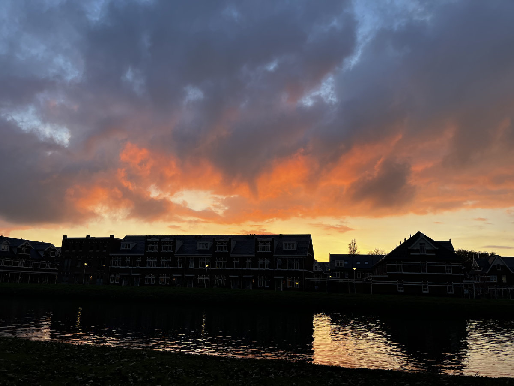
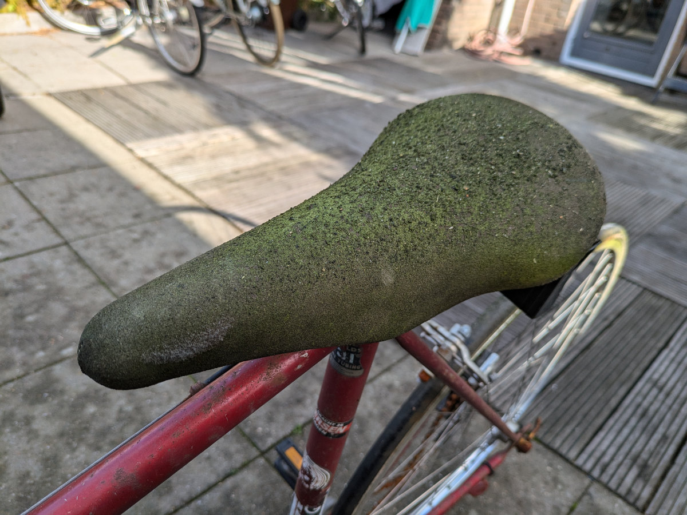

_Outside the girls' school at sunset_

My work situation still hasn’t been resolved. The trial day at the bike shop in Morkapelle (20 km from Leiden) went very well. The owner, Koen, told me right away that as far as he was concerned, he would have hired me immediately, but unfortunately, he has to work with the school, which requires him to hire me through them, at least for the first year, at a much higher cost than if he were to hire me directly. So far, after a week, we’re still in contact because he’s negotiating with the school for better conditions.

In the meantime, I’m going around all the bike shops in Leiden, asking directly if they want to hire me. If I find someone who offers a good salary, I can bypass the school and pay for the course out of pocket (€4000), or so says the contract I signed with them.

There are 15 bike shops in Leiden. I still have two more to visit. Most are fully staffed with mechanics, but four or five have taken my contact information and will let me know. Many have told me that this is the slowest time of year for work and that they might need someone starting in February. This is the same reason the school gave me to explain why they haven’t found a place for me yet.

Today I plan to visit the remaining shops in Leiden and then start with nearby towns. This going directly to the shops to ask for a job is actually quite fun. At first, the first two or three places, I felt a bit embarrassed. Yesterday, though, I felt like a kid on a treasure hunt. A few days ago, I created a Notion file (a beautiful app I’ve been using for years to organize my life) with a list of shops in the area, giving each one a rating from one to three to assess how much I’d like to work there, at least based on appearance, after reading some customer reviews and checking their websites. Then I saved all the shops on a Google Maps list.\
With this system, I can see all the saved shops directly on the map, and from my smartphone, I can write notes after speaking with someone at each place. Biking around the center of Leiden, looking for the next shop to check off the list, seeing all the pins on the map highlighted, it really feels like a treasure hunt. The endorphin release from gradually completing the map makes the numerous rejections almost insignificant.

Last Sunday, I went to The Hague to get a vintage racing bike to restore and resell. I paid only €50 for it, and it’s in pretty bad shape; a nice little project! Meanwhile, to keep in shape, I’m also servicing our bikes and two others I’ve bought second-hand. At the moment, we have eight bikes in the garden.

Yesterday, Hilly received the employment contract from Johnson & Johnson. The agency through which she had interviewed told her she would start on November 14, but the contract states December 1. Another month at home! She, too, is exploring other options and part-time work until she can start at J&J.

Although I’m fairly sure our work situation will soon be sorted out, I’m experiencing some mild anxiety, which mainly hits me in the evening, right before falling asleep. When I close my eyes, already tired, instead of being quickly wrapped in the gentle drowsiness before sleep, I find myself thinking about possible disastrous scenarios, which slows down my descent into the dream world. To fall asleep, I have to make a great effort to stop my restless mind, focusing on my breath whenever I start thinking about something that causes anxiety. Eventually, I manage, but it takes work!

The Dutch autumn is still holding off. While part of Europe is seeing catastrophic rain events, here the weather has been fairly dry, and it’s still relatively warm. So far, we haven’t needed to turn on the heating at home, and I still ride around by bike without a jacket during the day.

Last Saturday, in preparation for Halloween, they completely closed the park near our house and transformed it into a horror trail for teenagers, kids, and families. We only found out at the last minute and couldn’t enter because tickets had to be bought in advance. From outside, you could hear terrifying screams (from the actors) and spooky sounds. Everything was shrouded in thick fog, and eerie music played in the background. At one point, there was the sound of a real chainsaw from one part of the park, accompanied by the diabolical laughter of the actor wielding it. We can’t miss it next year!

The girls are enjoying their week off from school. Tonight, they hoped to go to a Halloween party, but it seems the events were held last weekend. Today, they plan to go around looking for a job, something they’ve kept putting off. We’re hoping they at least start bringing home some pay!
No, don’t worry, we’re not at that point yet!

_I pick up the bike in The Hague_

_I need to remove some rust_

_Nice and soft, with all that moss_

_The girls made this cake with a series of characters (tik-tok trend)_

_This bulb is beautiful and blooms without water or soil_
