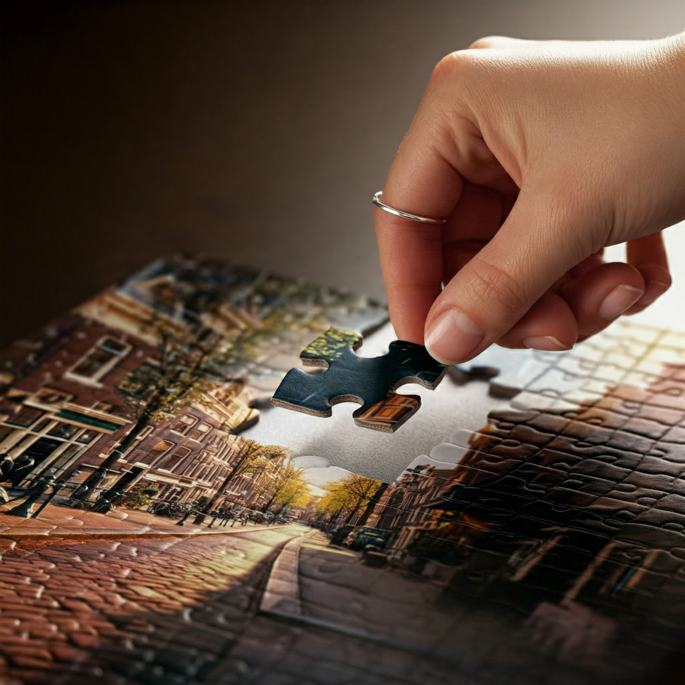
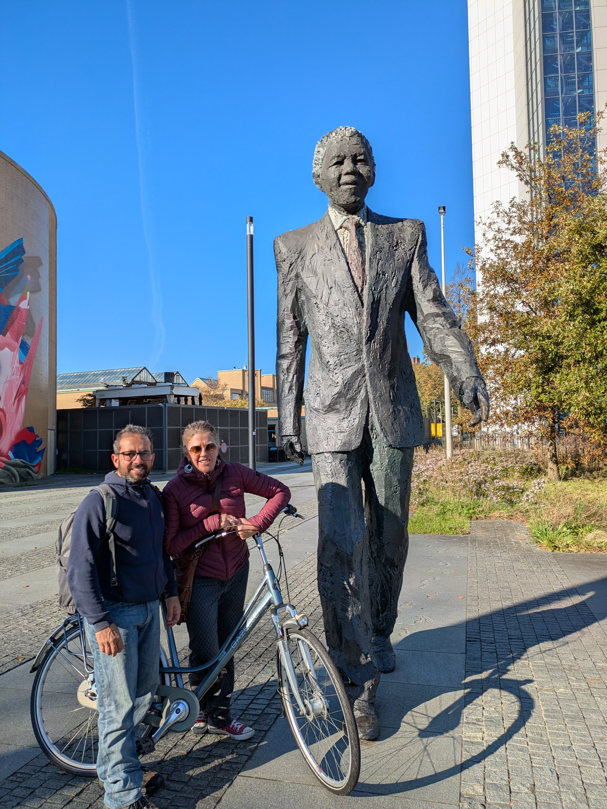
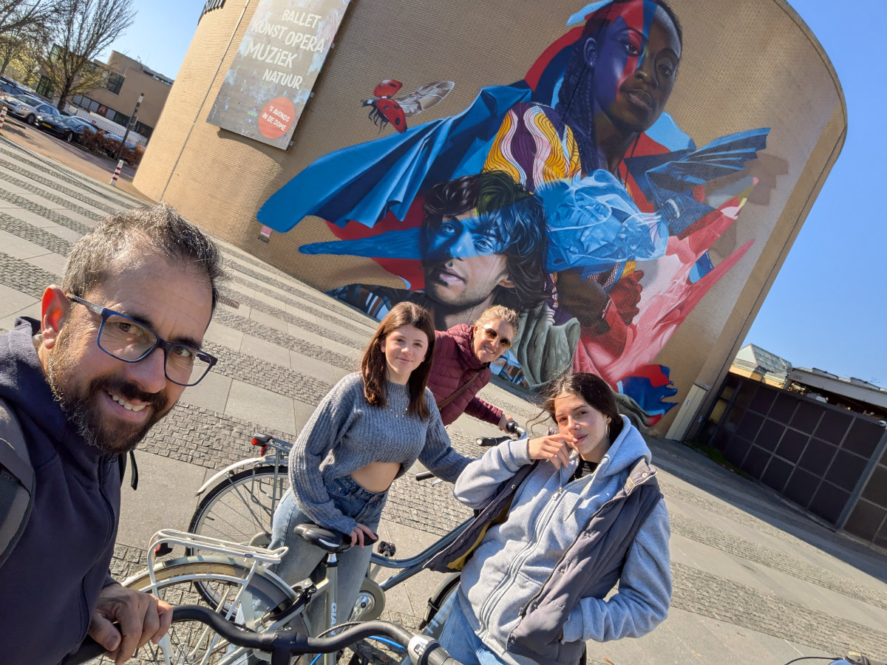

_The last piece of the puzzle_

There is no means of transport more efficient, enjoyable, and environmentally friendly than the bicycle. Many of the things we use daily, which bring us substantial benefits, come at a high cost in terms of natural resource consumption. So we use these tools, technologies, and modern gadgets, but in some way, to a greater or lesser extent, we’re aware that we’re using electricity or gasoline to achieve more comfort or simply to accomplish tasks that once required incredible effort, like going down to the river to wash clothes.

The bicycle snubs all of these guilt trips with incredible elegance.\
For the physical cost of a gym session, our reliable friend takes us wherever we want to go in a short time and without a hitch, turning walking into an outdated pastime, perfect for local strolls and nothing more.\
To keep us in shape and get us around, this useful metal contraption requires very little attention. Soap, oil, and the occasional spare part are enough to keep it happy and available. It’s unfazed by sun, rain, or cold. It only struggles a bit with snow or, for the less experienced riders, with steep, rocky hills. In some cases, it even outperforms the best off-road vehicles. At most, it might need to be carried on our shoulder to continue as soon as possible.

In the Netherlands, the bicycle is an essential asset.\
Among all private means of transport, such as cars, motorcycles, and scooters, the bicycle is by far the most used in the Netherlands. For many people here, it’s the only means of transport.\
For this reason, workshops and shops where bicycles are sold, maintained, and repaired play a significant role.\
In recent days, I've visited several of these places.
Between Leiden, Wassenaar, Leidschendam, Voorschoten, Oegstgeest, Rijnsburg, and even Katwijk aan Zee, I visited dozens of shops, always repeating the same phrase, "Hello, I’m a bicycle mechanic, recently moved to the area, and I’m looking for work."\
I’ve seen shops and workshops of all kinds.\
Those that are super organized and stocked with the latest electric bicycles (the less virtuous cousins).\
The ultra-sporty ones, filled with carbon frames and featherweight forks, expensive and delicate gadgets.\
The popular ones, with city bikes perfected over decades to accompany people in their daily routines, with large side bags for grocery shopping, or big front compartments for taking kids to school year-round, in defiance of any weather.\
The ones with "fat bikes", popular with teenagers and immigrants from Africa and the Middle East.\
The ones with hipster bikes, with fixed gears, vintage, romantic charm.\
The shops selling used bikes, all priced between 250 and 300 euros, ideal for out-of-town students or expats like us.\
Most people have been kind and encouraging. They gave me advice and hope, but no one gave me a job.\
I enjoyed it, but the treasure hunt became frustrating at some point.\
I was on the verge of giving up and opening up to any job that would come along, as long as it meant an adequate paycheck.\
Just at that moment, I finally found an agreement with "Reijneveld Rijwielen," Koen’s shop in Moerkapelle, where I had gone a few weeks ago for a trial day.\
I’m hired at the minimum wage guaranteed by the national contract for bicycle mechanics (€2,470, minus taxes) for the first year, during which, with a bonus system and some overtime, I’ll cover the shop’s expenses to pay for school and hire me.\
After the first year, we’ll renegotiate my salary for a significant increase.\
I’ll work 40 hours a week, spread over four days. Two days a week, I’ll start at 9 in the morning and finish at 9 in the evening. Sunday, Monday, and Wednesday are my days off.\
Friday and Saturday were my first two days, and everything went great.\
As for bike repairs, I’m already quite independent. However, I quickly need to learn to use the software for bike and customer management, which is entirely in Dutch, as well as to directly assist customers, also in Dutch, who come into the shop to drop off a bike for repair, buy a new one, or look for spare parts.

Now, in our family, the stress is over, and we feel like true expats in the Netherlands.\
Hilly will start working at Johnson & Johnson on December 1, but in the meantime, she’s begun working as a housekeeper for a wealthy family in Harlem, just for a few weeks. This weekend, she’s promoting wines from an Italian winery that our friend Natascia works for. Yesterday, she went to a wine shop in Tilburg, in the southwest of the Netherlands, and today, she’ll be at an event here in Leiden. If you want to meet her and taste some great Italian wines, you can find her there.

A big, warm hug to all our friends following us on this adventure.\
A joyful toast to the final puzzle piece that we’ve finally put in place. We have a comfortable home, a job, the girls are in school and happy.\
All is well here under the pale Dutch sun.\
Cheers!

_Mandela statue in The Hague_

_Last Sunday in The Hague_
