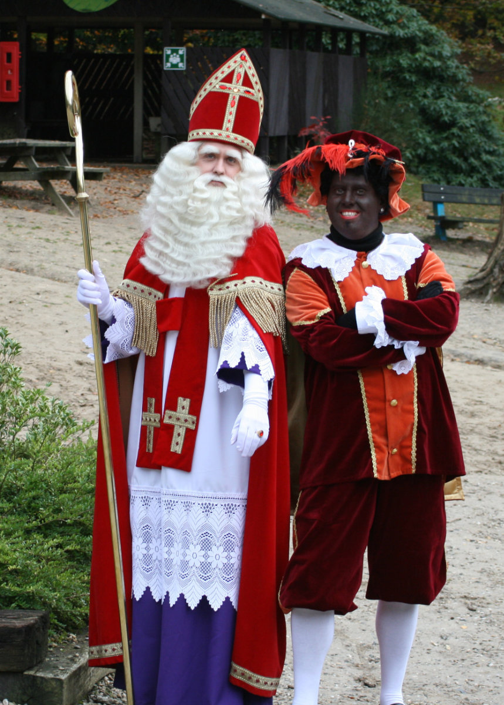
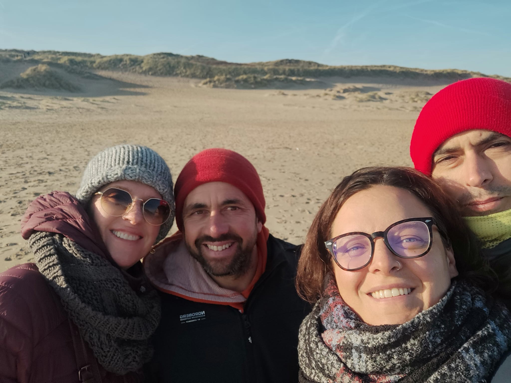
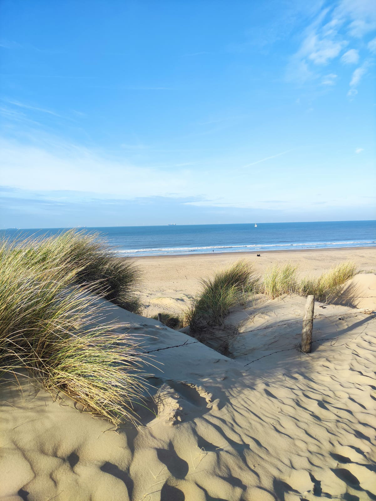
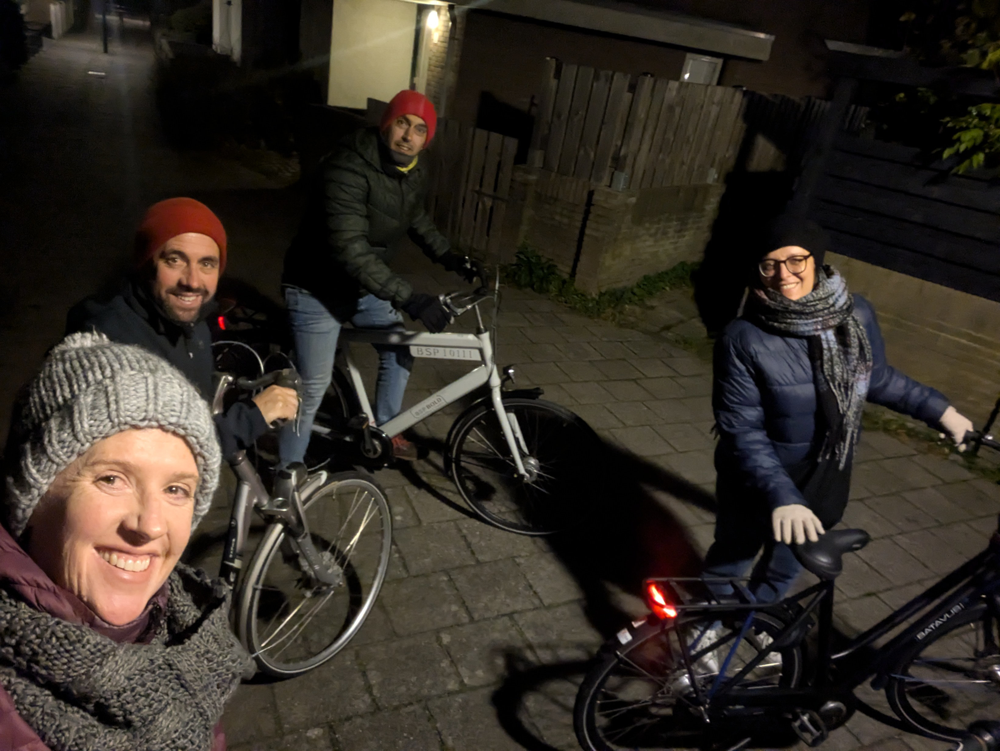

_Sinterclass and Black Pete_

---

Almost a month since my last post, I’m back to writing on the blog. I apologize to everyone who’s been waiting for updates; the only reason for my long absence has been my lethargy and lack of inspiration to write.  
I’ll try to do better.

The Dutch autumn was quickly replaced by winter, or at least, I think this is winter. It rains often, and even when the sun comes out, it doesn’t warm up at all. The temperatures aren’t too low, always above zero, but only just. It’s more or less the same climate I experienced in Milan when I lived there, though the difference is likely in the duration of the Dutch winter. In Milan, by the end of February, you’d start to get the occasional nice day when you could feel the warmth of the sun. I remember how, as a child, just one sunny Sunday spent playing at the park in a short-sleeved shirt was enough to welcome spring, with its explosive energy of fresh-cut grass smells and trees beginning to bloom.  
In the Netherlands, I think that moment arrives a bit later.

Now, for some news.  
Work is going great. Next week marks the end of my first month.  
I get along very well with my colleagues. Jost, the head mechanic, is a 25-year-old who is already incredibly knowledgeable about bicycles, and he’s teaching me a lot. Then there’s Cris, an 18-year-old who’s also much more experienced than I am in the field, and Micha, a 15-year-old who recently made me feel very old. He was chatting with the others, obviously in Dutch, and was showing them a photo on his phone. I walked over to see what it was about. Apparently, his father, who was in the United States for work, had caught a small shark while fishing on a Florida beach. As I prepared to look at the photo, I imagined an older man with a beard and white hair posing with the shark. Instead, the image showed a smiling young man of 38, ten years younger than me. Micha’s dad!  
The owner, Koen, is also a few years younger than me. He has four young children and is very dedicated to growing and improving his business.

I’m still getting used to the odd shape of my workweek. I’m off on Sundays, Mondays, and Wednesdays. On Tuesdays and Thursdays, I work from 9 AM to 9 PM. On Fridays and Saturdays, I work from 9 AM to 6 PM.

During those long workdays, while fixing all kinds of bicycles, I think about how I can scrape together a bit more money each month. This first year of work, since I have to pay for a course, my salary remains quite low. As soon as I get a full paycheck, I’ll let you know the amount. It should be around €2,000 net per month. Hilly is supposed to earn a little more, but given the exorbitant rent we have to pay each month, we barely manage to cover our living expenses, which are around €4,500 per month.

To supplement our income, the easiest option would be to start a side business repairing bikes in my tiny workshop. I could print a flyer to distribute in my neighborhood mailboxes and see what happens. To do this, though, I’d need to officially register a business so I could purchase spare parts at lower costs from suppliers. We’re talking about half or even a third of what you’d pay in a shop or online.  
Starting a business in the Netherlands should be fairly simple, and from what I understand, it doesn’t come with all the restrictions and risks involved in opening a business in Italy.

Hilly is also looking into taking on a second job, in the wine promotion world. As I mentioned before, she has participated in some events where she introduced people to Italian wines, and she really enjoyed it.

Hilly started her job at Johnson & Johnson a week ago. It’s a pretty easygoing job. She spends more time dressing, undressing, filling out Excel sheets, and signing forms than actually assembling prosthetics. She works alongside colleagues from every nationality imaginable, some new like her and others who have been there for years. As I mentioned before, Hilly works a six-day schedule: two days from 6:30 AM to 2:30 PM, two days from 2:30 PM to 11 PM, and then two days off. So she also has some free time during the week that she can invest in developing an alternative career.

One very positive thing is that her workplace is just a ten-minute bike ride from home.

The girls passed their November exams with flying colors and will be moved to different classes starting next week. We spoke with their class coordinators, who assured us that they would finish the international school program this year and begin Dutch school in September. Starting next week, they’ll need to step up their game since they’ll be in more advanced classes. For the second half of the year, they’ll also be studying additional subjects like biology, geography, physics, and more, all taught in Dutch.

The gang of Arab boys is becoming more and more present in our home. They’re good kids, and we’re happy to have them around. They often even cook for me and Hilly. That said, we’ve set some boundaries on their visits so we can also have some quiet family time, just the four of us, like in the old days.

Last night, we had Leith, Gemma’s boyfriend, over for dinner. He told us his story of how, at the age of six, he fled Syria with his family to Turkey, where they were treated rather poorly. When he was thirteen, three years ago, he and his brother, along with a small group of people, walked from Turkey to Austria. In Austria, for reasons I didn’t quite understand, he had to separate from his brother and made it to the Netherlands alone, thanks to a car ride. There, he was granted political refugee status, which later allowed him to bring over his parents and another brother who hadn’t been able to leave due to diabetes. The brother who stayed in Austria is still there and cannot come to the Netherlands because, without a Schengen visa, he could be stopped at the border, which the Netherlands recently reinstated to curb the influx of migrants. I don’t know why he didn’t come earlier. Leith doesn’t speak English very well, his Dutch is better, and I often don’t understand what he’s saying. Still, he seems like a good kid, very motivated. Besides school, he has a couple of jobs and says that as soon as he turns eighteen, he wants to open his own barbershop, for both men and women, which he hopes to later expand into a beauty salon. The only downside is that he smokes two packs of cigarettes a day, and unfortunately, Gemma has also picked up this bad habit, a while ago, but now its getting worst. My little "Gemmina"!

The Christmas spirit is very strong in the Netherlands, with lots of beautiful decorations everywhere. However, the most celebrated holiday here is “Sinterklaas,” which culminates on December 5. On this day, “Sinterklaas,” a figure halfway between Santa Claus and a bishop, arrives from Spain and brings gifts and sweets to children with the help of “Black Pete,” a boy with a black-painted face who looks like a little African servant. These days, to be politically correct, they explain that he’s just a helper blackened by chimney soot.  
On December 5, Sinterklaas came to Sophia and Gemma’s school, along with two “Black Petes” who hadn’t painted their faces black (they wouldn’t have been well received in their school looking like that) and handed out chocolates to the students.

Last weekend, two friends of ours from Milan, Brunella and Matteo, came to visit. We went on a nice bike ride to The Hague, passing along the beach on a sunny but very cold day, then to an industrial area of The Hague to a vintage clothing market, and afterwards to a great brewery/pub, just as it started raining. Luckily, after a couple of beers and some pub snacks, the rain stopped, and we enjoyed the 45-minute bike ride back home through the dark, cold Dutch countryside.

A few days earlier, we were also visited by Bea, the daughter of our dear Australian friends, Ken and Amy. Bea, who is 18, was on a months-long trip across various European countries. At the end of her journey, since she was flying out of Amsterdam, she stayed with us for a night, and we couldn’t miss the chance to take her on a bike ride through the center of Leiden, which is always charming, especially during the Christmas season.

_With Brunella and Matteo on the beach_

_Wassenar beach, towards The Hague_

_Friday evening towards Leiden_

_Together with Bea, in Leiden_
