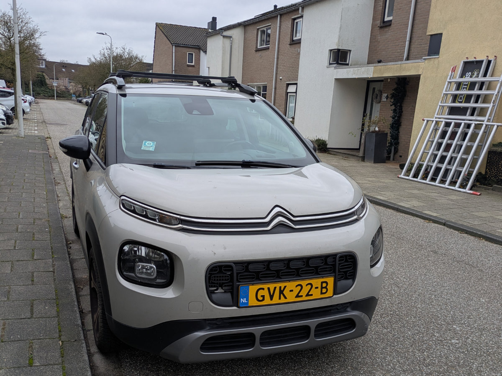
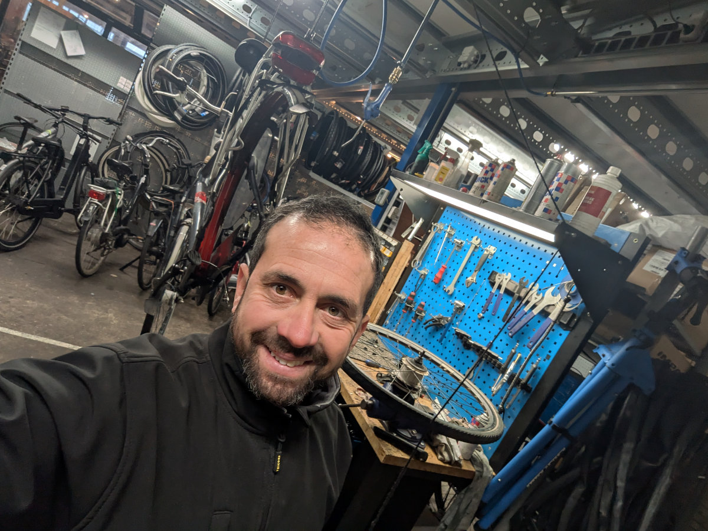
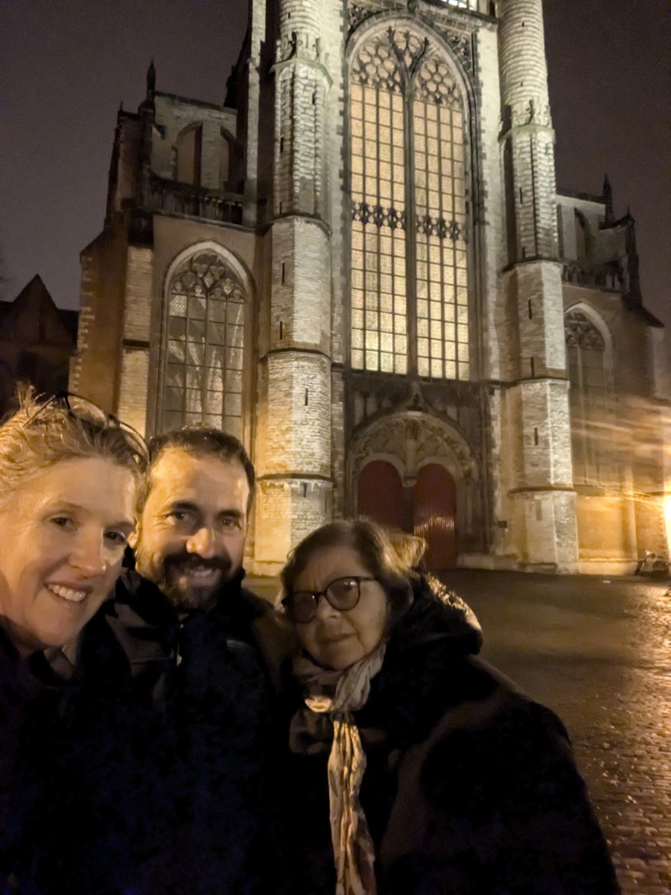
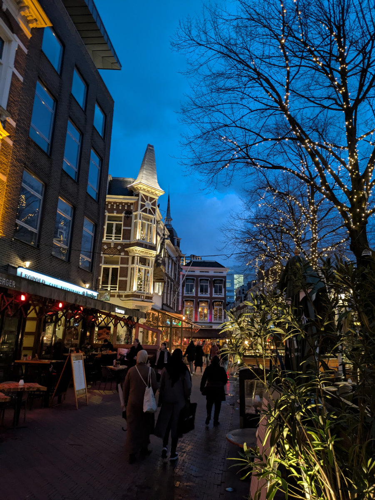
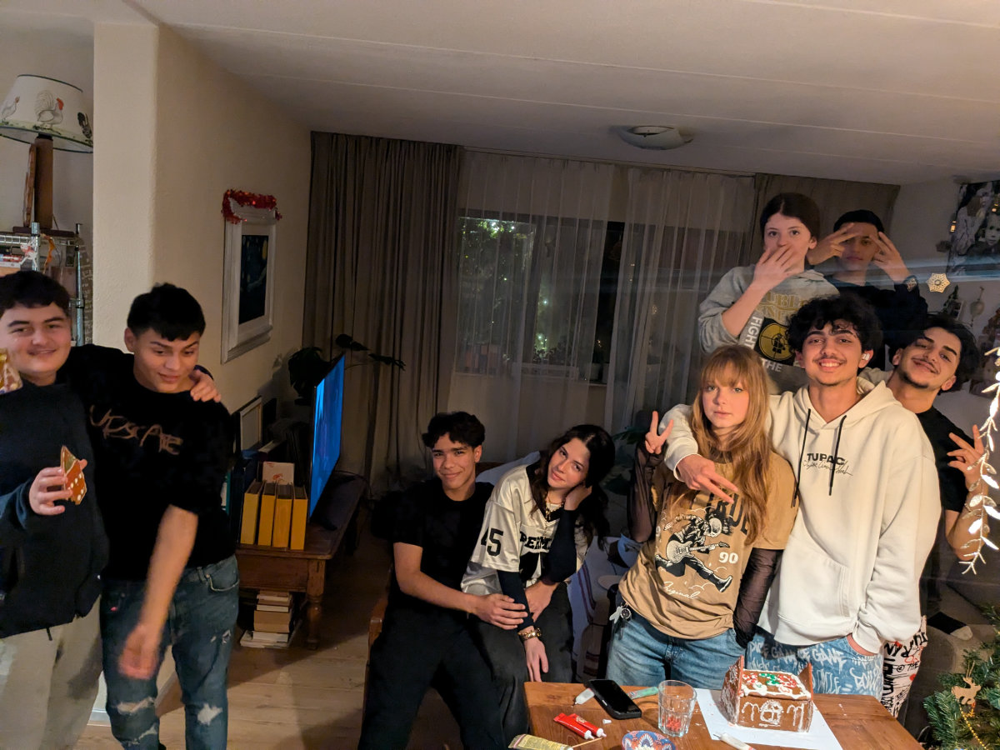
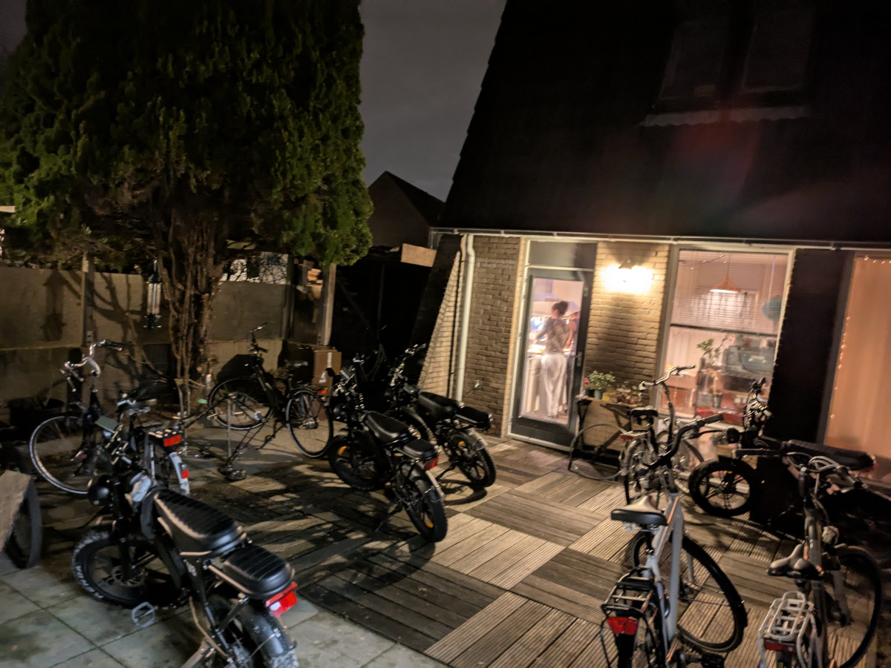
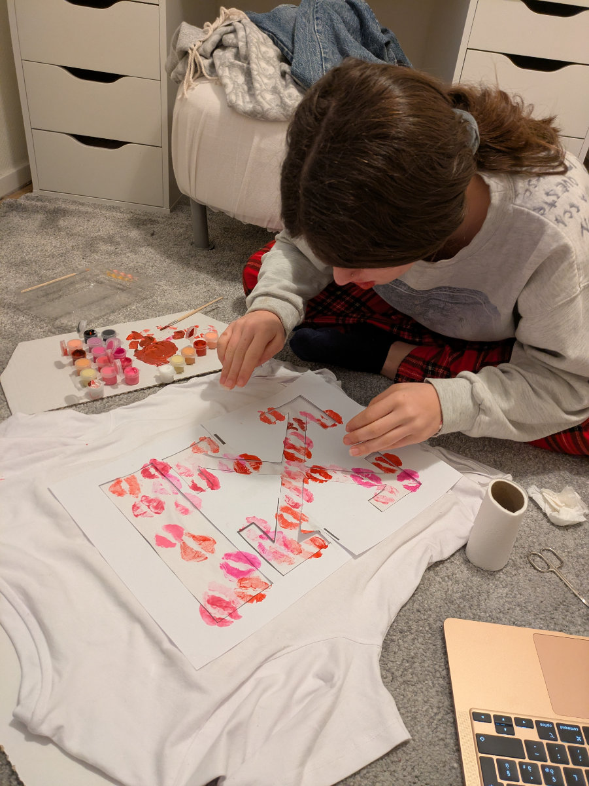
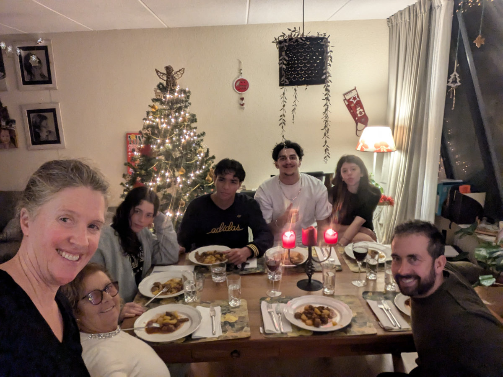
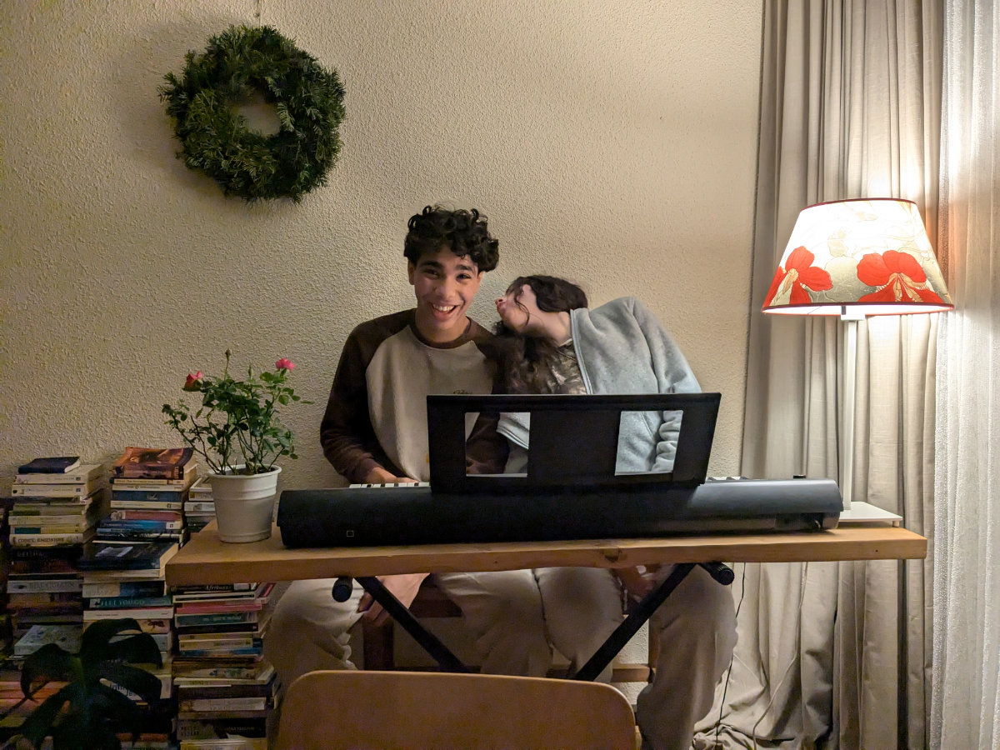
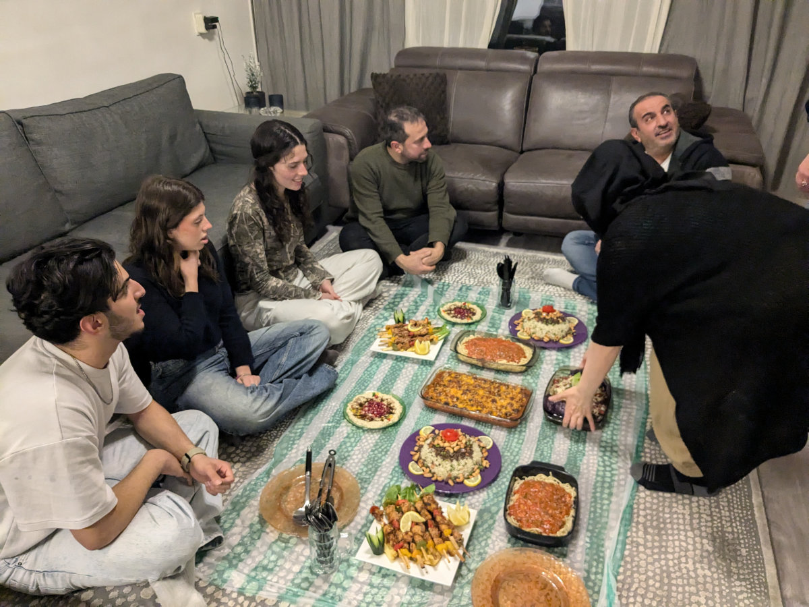

_The Dutch plates, we sweated for them but it was worth it_

For Christmas, my mom came to visit us. My dad was supposed to come too, but due to his mobility issues, he decided against it and stayed in Sardinia. In the end, it was better this way because we realized that with the very steep stairs in our house, he wouldn’t have been able to reach the upper floor. We could have tried to carry him up as we did with the washing machine, using ropes, but it wouldn’t have been easy.\
He’s planning to come in the spring, though, perhaps staying in a hotel near our house. It was the first time my mom traveled to a place in Europe farther north than Switzerland. We took her out on bike rides a bit, in the cold and rain, but not too far from home given her age and lack of experience riding a bike in urban settings.

During the holiday season, I had two full weeks off because the shop was closed. Hilly also had many days at home. I have to admit it was hard to recreate the Christmas spirit since we had Muslim guests at home, Sophia and Gemma's boyfriends, and for them, these were just normal days. Luckily, Hilly put a lot of effort into decorating the house, putting lights everywhere, and setting up the most stylish Christmas tree I’ve ever seen.

It was lovely having my mom here. Naturally, as soon as she arrived, she took over the kitchen and tried her best with the ingredients available in the local supermarkets. It wasn’t an easy task, and I think she was a little worried about our precarious culinary situation. In fact, as soon as she got back to Sardinia, she prepared a large box of high-quality food products that she’s mail to us. Ah, moms are the best!

The most remarkable thing about this Christmas and New Year’s was the fireworks. The Netherlands has an obsession with them. Throughout December, there were constant explosions, and the closer we got to the end of the year, the more frequent they became. On December 31st, from early afternoon, there wasn’t a moment of silence. At midnight, we were at friends’ house and went outside to light their fireworks. It was epic! We didn’t know where to look.\
As a child, I remember the fireworks shows they had in Sardinia in mid-August during summer, and I thought they were incredible. Imagine something like that on every street corner, between the little Dutch houses, with thousands of firework displays lighting up the sky. That night, Sophia went to Amsterdam with Farez to Museumplein, where we had also been last year to join the countdown among the celebrating crowd. Gemma, on the other hand, went to friends’ house in Leiden with her boyfriend.

One thing that was supposed to happen over the holidays but didn’t materialize was the girls starting jobs. Sophia tried working at a hotel but quit on the second day because she hadn’t yet had a formal meeting with the manager, so she didn’t go back. Gemma, meanwhile, had an interview at Dirk, a supermarket just 500 meters from our house, but at the last minute, she decided not to go because she wants to babysit instead. She’s preparing flyers to distribute outside the many preschools and nurseries near us.

Since December, we’ve started earning two salaries. Together, we make about €4,700 net per month. In Italy, this would be a decent income, but here, especially because of the exorbitant rent, it’s not sustainable. We’re now looking for a cheaper house, maybe smaller and without a garden, but costing no more than €1,800 a month. Right now, we’re paying €2,200.\
The car is also a huge expense. The road tax alone costs us €1,500 a year, plus another €1,000 for insurance since we had to start again at the lowest no-claims bonus level. Every month, we have to dip into our savings just to cover regular expenses. Until we start earning a bit more, this is how things are. But it’s okay.

I’m very happy at work. Fixing bikes is fun. Every bike is different and has its quirks. Often, solving a problem requires some creativity and using tools like drills, grinders, files, and welders. Even on the days when I work 12-hour shifts, from 9 a.m. to 9 p.m., the time flies. The days are accompanied by ‘80s and ‘90s music from "Joe," a Dutch radio station that’s omnipresent at workplaces. In December, we switched to a Christmas music channel, but after a few days, we couldn’t handle the same songs anymore, so we went back to "Joe."\
At the shop, I’ve started helping with some customers, especially those who aren’t native Dutch speakers and prefer to speak English. My colleague Christian, whose English is worse than my Dutch, calls me over whenever he can’t understand what the Polish customers working in nearby greenhouses are saying.

In November and December, we hardly saw the sun. It hasn’t been very cold, with temperatures rarely dropping below zero. I’ve been biking to work at most once a week, partly out of laziness but also after a bad fall on December 21st, the last workday before the Christmas break. I was testing a new bike I had just assembled when I crashed while testing the brakes. I think I fractured a rib, as it still hurts, though less now. Thankfully, the bike only got scratched in a couple of places, which I was able to repaint. It was a €7,500 Riese & Muller, and I nearly caused some serious damage. My boss Koen was very understanding and said these things happen.
That same day, I had biked to work. On the way back, I rode 21 km, mostly in an icy downpour, with a sore chest from the fall but in high spirits, knowing I had two weeks of Christmas vacation ahead.

Hilly finds her job a bit boring and repetitive, but she’s happy with the hours and the fact that it’s just ten minutes from home. She’s also working on developing her own business alongside her job at Johnson and Johnson, which could eventually replace it.

A few weeks ago, we finally got Dutch license plates for our car. It was the hardest bureaucratic challenge we’ve faced since moving here. One thing I immediately noticed is that people are much more tolerant of my driving mistakes now that I don’t have Italian plates. Driving in the Netherlands is a bit different from Italy. Here, lanes are everywhere, and you often have to decide well in advance if you want to turn and move into the correct lane. Occasionally, I realize too late and have to signal and squeeze into a line of cars. When I had Italian plates, people honked at me constantly, and in the rearview mirror, I’d see angry faces and middle fingers. Since switching to shiny new Dutch plates, no one honks at me anymore. There’s a bit of intolerance toward foreigners here, and Italians, with their well-earned reputation as bad drivers, don’t get much slack.

A few days ago, we were invited to dinner by the parents of Leith, Gemma’s boyfriend. It seemed a bit early to meet the parents, given Gemma’s age, especially since, in their culture, girls are often promised in marriage very young. The invitation was mostly driven by Leith’s mom, who wanted to form friendships here in the Netherlands, as they barely speak English and very little Dutch. Given the recent events in Syria, Leith’s dad is considering returning to his homeland if things stabilize, as he was a successful lawyer before the war. His mom, however, wants to stay here, as do the kids.

The dinner was amazing, and we ate traditional Syrian dishes, all cooked by Leith’s mom. Communication was a bit tricky, but in the end, we managed to understand each other on the important things.

_I'm happy at work_

_With my mom in front of a church in Leiden_

_Christmas shopping streets_

_One of the girls' friends' gatherings at our house_

_Our little garden when the gang meets at our house_

_Gemma prepares the Christmas present for Leith_

_Dinner at home during the holidays_

_Sophia and Farez at the piano_

_The exquisite Syrian dinner_
