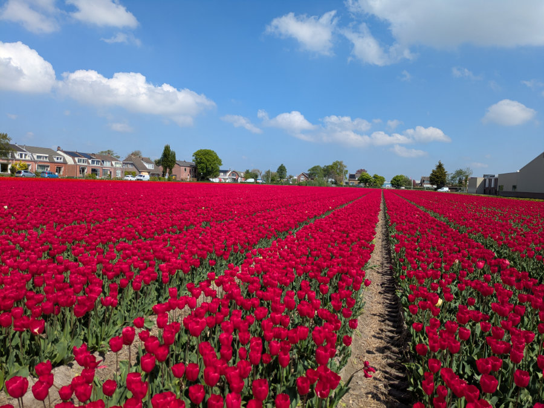
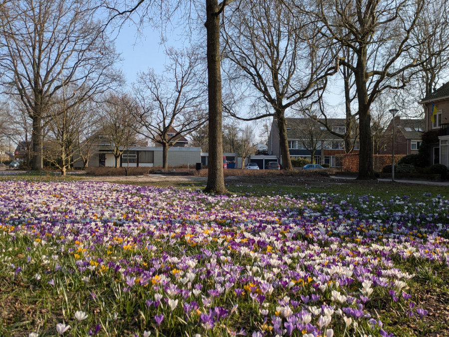
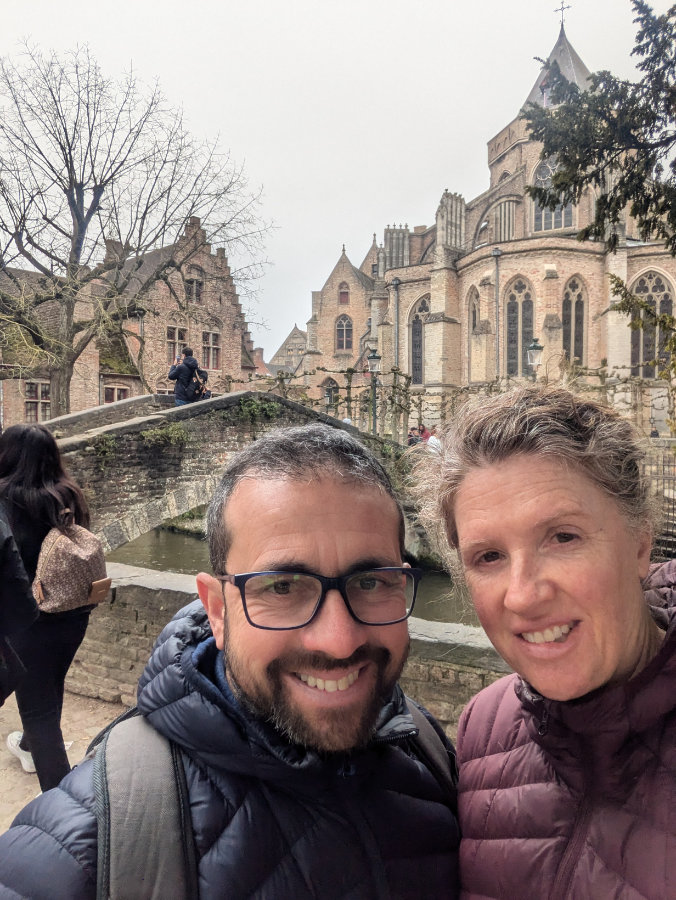

_Papaveri e amore_

Hello to all of you, friends, after several months I'm back to writing on this blog again.
The reason I haven't posted anything for so long is simply, alas, due to laziness and lack of inspiration.
Meanwhile, between one bike ride and another, a year has passed.
Exactly one year ago, on June 4, 2024, Sophia and I arrived in Holland.
I still remember the excitement of the new, the strong sense of adventure and unpredictability that accompanied our days. We had the whole summer ahead of us, hunting for a house and a job, staying in other people's homes, in the company of their beloved furry companions.
This summer promises to be more stable and peaceful.

Let's move on to some updates.
I'm continuing with my job as a bicycle mechanic in Moerkapelle. In the meantime, however, I've also been busy developing internal software for the shop. I'm spending most of my free time writing code, or rather, giving detailed instructions to artificial intelligence on the code to write. The project is almost finished, and we will soon start using it. It's incredible how much things have changed in the world of web development in the last 6 months.
I managed to do the work of a small team, by myself and in less time.
I've found the right balance in alternating between practical work in the workshop and intellectual work at the computer.
In the coming days, I will finish a 14-week Dutch course at a school in Haarlem, which was funded by the transport industry workers' union. It wasn't very intensive, just one evening a week, but it pushed me to do more exercises at home and to speak a little Dutch in a small group.
Unfortunately, at work, we always speak English. Every day I make an effort to stammer out a few sentences in Dutch with my colleague, Christian, who speaks little English, but my results are a bit pathetic, and I'm having more difficulty than I anticipated. The Dutch language is quite complex, especially in sentence construction, where it differs significantly from English and Italian.
In reading and comprehension, however, I've advanced a lot, so much so that I feel like I've developed superpowers when I understand everything Hilly and the girls say in Afrikaans.

Hilly continues to work for Johnson and Johnson. In the last two weeks, she started training for a more complicated role, and for a few days now, she has been working in a new department.
Besides that, she has also found a second job in a shop/cafeteria that sells South African food products. They cook and ship biltong and other typical dishes throughout Holland to help expatriate South Africans feel less homesick.
The owners immediately offered to hire her full-time, but given the much lower salary conditions compared to J&J, she preferred to accept only a day and a half at the shop.
With a few free hours left per week between her two jobs, the tireless Hilly collaborates with a neighborhood association that helps the elderly and disabled people. They go in small groups to tidy up these people's gardens or, on her own, she helps elderly people who struggle with their smartphones. Unlike me, who couldn't care less about others and can live a life completely focused on myself and my immediate family, Hilly needs to give something back, unconditionally, even at the cost of making many sacrifices. What a terrible person!

The girls have enrolled in Dutch school. In a month, they will finish their adventure among the refugees and, after a bit of a holiday, they will enter two different schools, although very close to each other.
Sophia, until a few months ago, was a bit demoralized because at school, the teachers told her that given her age and her level of Dutch, she could only enroll in what is called "Mavo" in the Dutch school system. In her case, it would have been a 4-year course, geared towards work, to train her as a "Middenkaderfunctionaris Bouw" – in English "Middle management construction officer," in Italian... Who knows?!
You will understand that for her, already set on studying Architecture, the situation was a bit discouraging.
At that point, we had already spoken to one of her tutors at school, who had told us the same things: that unfortunately, there was no way for her to get into more academic schools, and that anyway, after MAVO, she could go to university.
So we decided to write a letter to some institutes in Leiden, explaining the situation well, hoping that someone would accept Sophia despite the status quo.
Shortly after, we received positive responses, and now Sophia is enrolled in HAVO, at a school famous for its ability to nurture motivated students. Sophia's goal is to then be moved to VWO classes, which are more similar to the Italian Liceo. Now she is overjoyed.
For Gemma, the situation was simpler, given her age.
Gemma's school looks like something out of Harry Potter. She is a bit worried because she doesn't feel very confident speaking Dutch yet, and in the next school, that will be the language spoken among classmates as well. At the moment, she speaks little Dutch, but when she is forced to do so daily, she will surely make very rapid progress.
At school, Gemma will have all the basic subjects, and in addition, she has chosen to focus on Psychology and Economics.

To respect Dutch tradition, both have started working.
Sophia works in an ice cream parlor near home and, on weekends, in a Spanish restaurant in the center of Leiden. She works many hours a week, as they are not so busy at school at the moment, but with the start of the new school in mid-August, she will work less.
Gemma works in a supermarket, stocking shelves, only on weekends.
Gemma broke up with Leith, and now they don't even greet each other anymore, and she immediately got together with Haytham (I think it's spelled differently), a 19-year-old Yemeni boy who studies and works in a dental office. Never a dull moment with Gemma!
Sophia is always with Farez, although they see each other less now because she works a lot, and he has also started working in a pancake cafe.

Holland is treating us very well.
Spring was fantastic. There were several weeks without a drop of rain. The sky always blue, the days getting longer, flowers everywhere, and many, many bicycles.
In mid-April, the tulips bloomed. An indescribable marvel.
Hilly and I cycled from home to the area famous throughout Holland for its flower fields.
It takes about forty minutes by bike from our house.
I recommend everyone to come here during that period. Acres and acres of super-saturated colors and idyllic scents.

We are still in the first house, the one with the prohibitive cost. Despite checking classifieds sites every day and responding to some ads every week, we can't find a cheaper alternative.
The point is that alternatives would exist, but hundreds of people apply for each ad, so candidates with higher salaries, fewer children, or more stable work situations are chosen.
Somehow we manage, but the €2200 transfer on the first of every month stings quite a bit.
House prices for sale have risen by an average of 10% compared to last year.
Buying a house has become impossible unless you already have a significant amount of money saved up or receive help from parents. But I think the situation is similar in all the more developed areas of Europe.

At the end of July, Sophia and Gemma will go to Italy for two weeks. One week in Sardinia with my parents, and one in Tuscany, in Montaione, with their friends, to show off their Sardinian tan, although one week at the sea is very little.
Hilly and I, also during that period, will take a week-long cycling holiday. To spend as little as possible, we will start from home, heading towards the North of Holland, and maybe beyond, and we will sleep in campsites. For many, it would be a nightmare, but for me, and also for Hilly, it's one of the best ways to travel.
In fact, this year marks our 20th wedding anniversary, and in that summer 20 years ago, at the beginning of August, we set off on our bikes from Milan, heading to Pula, Sardinia, for a month-long cycling holiday. Although Hilly, at times, especially on the ups and downs between Bosa and Alghero, already wanted to ask for a divorce, we had a fantastic time.

That's all for now, dear friends from Italy, South Africa, the United States, Australia, England, and Germany. Greetings to all of you, an invitation to come and visit us (many will already do so this summer), and thank you for reading this blog.
See you soon.

_A sea of red_

_Outside this nursery, they had dozens of varieties of poppies_

_Near our house. The care for urban greenery in Holland is amazing_

_King's Day. A kind of Dutch St. Patrick's Day_

_Another reason to come to Holland in spring. Dozens of new duck and swan families everywhere_

_On March 27th, we celebrated our twentieth wedding anniversary in Bruges_

_Animals you meet in Dutch parks_

_Gemma and Hilly worked for the South African cafe at an event in Amsterdam_

_What a couple, these two_

_The first coffee at work, every morning, is the best_
