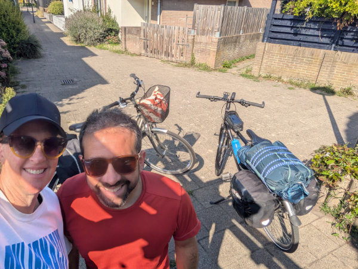
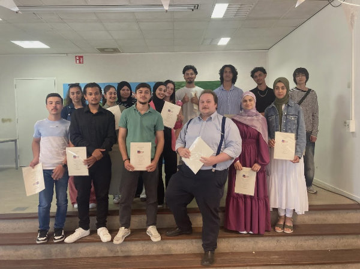

My Dearest Friends,
Even though my posts here have become quarterly, a billion things have happened at the Cassetta house.
On September 2nd, the girls started at their new Dutch school, and it's a completely different story from the international school they attended last year. Lessons were already in full swing on the second day. I'm mentioning this mostly for my Italian readers. In my school experience from 30 years ago, and in my daughters' experience in Tuscany, the first few days/weeks were pure chaos. We had provisional schedules, absent teachers, and unassigned classrooms. Every year it was like the first time.
Both Gemma and Sophia are very happy with their classes and find it strange that almost 100% of the students were born in the Netherlands. In the first week, both of them—even though they go to different schools—went on a field trip. My apologies to my Italian friends, but again, I feel compelled to point out the difference. Everyone rode their bikes from school to Katwijk, about ten kilometers away, where they spent the day on a "team building" trip at an adventure park. Can you imagine something like that being organized in Italy? Science fiction!
This initial phase is very delicate for both of them because they are now facing entire days of studying all in Dutch. Gemma also takes German and French, among other subjects. Just think, there's a day of the week where she has two hours of English, two hours of French, and two hours of German. Everything is explained in Dutch, of course. It's enough to cause a neural short circuit!
Sophia also feels quite stressed by the change of pace. I hope they both get used to it soon.
From a romantic perspective, Sophia is still with Farez, but they see each other less now that they attend different schools and Farez has started working at two restaurants, one Italian and one Indian. Sophia, on the other hand, quit the Spanish restaurant as soon as summer ended and now only works at the ice cream shop.
Gemma and Leith have broken up for the third time. No comment!
The tireless Hilly continues with her job at Johnson & Johnson and at the South African café. She also regularly visits an elderly lady who lives nearby to play Rummikub and keep her company. For those who don't know, Rummikub is a board game played with a set of numbered tiles and is quite popular in the Netherlands.
In any case, I see her as very happy and positive. Hilly, not the elderly lady.
In August, the girls went to Sardinia for three weeks. Hilly and I stayed home the whole time, except for a brief four-day escape where we loaded our bikes with a tent, sleeping bags, and mattresses, and set off on a tour of the area.

The ride, about 350 km, served as a meditation for me on the near future, and during that very week, I came to the decision that it was time to find a more fulfilling job—especially from a salary perspective, but also in terms of future prospects.
I took a look around and decided to find work as a chef in a restaurant not too far away. After sending out a few resumes, I was called immediately.
About ten days ago, I did a trial shift as a sous chef at a "fine dining" French restaurant in The Hague city center. The restaurant is called Villa Coucou (https://www.villacoucou.com/), it hasn't been open long, and it's aiming for a Michelin star this year.
The chef is from Cagliari and is engaged to a South African woman. We hit it off right away. The place is truly a dream, and the kitchen team is very welcoming and friendly.
The trial night was quite disorienting for me. I found myself completely outside my comfort zone. I saw ingredients, preparations, and techniques that I never even knew existed. Despite the initial shock, the idea immediately grabbed and fascinated me, and I felt ready to accept the challenge. They offered me a contract to start as soon as possible, and I would have accepted it, but... there was a twist.
Another ad I had sent my resume to was for a South African restaurant (a recurring theme). They were also looking for a sous chef. A few days after my trial at Villa Coucou, the manager of Paarl, the South African restaurant, contacted me to set up an interview. Since it was my day off from the bike shop, I immediately drove the twelve minutes to Sassenheim to meet Roger Rassin, a Michelin-starred chef who is now the "executive chef" of the Hotel Van Der Valk, where the Paarl restaurant is located (https://restaurantpaarl.nl/).
The interview lasted an hour, and Roger gave me a tour of the hotel's kitchens and then of the Paarl restaurant, which is located next to the hotel.
I decided to accept this offer, and on Saturday, September 27th, I'll do a trial shift before starting work in early October. Even though I haven't signed the actual contract yet, only a preliminary draft, I'm quite confident that I'll become the sous chef at Paarl. Fingers crossed!
In any case, I've already resigned from the bike shop. It was a complete shock to Koen, the owner. He was going to hire me with an indefinite contract in early October, and I don't think he expected this decision from me.
I really enjoyed working in his shop, with the whole team, especially with Joost, whom I will definitely continue to see.
Working with bikes was fantastic, and I was never bored for a moment. I learned a ton of things. Even the long 12-hour shifts flew by cheerfully. I'll also miss the four-day work week. At the restaurant, I'll work 38 hours a week, but spread over five days.
There are a lot of things I can't talk about in this post, but I'll make up for it soon.
I think I'll be able to write a bit more now that I've recently simplified how I manage the blog. I've implemented an admin interface where I can write the post and upload photos without having to mess with the code every time and spend two hours just to get the new post online. This is stuff that's been around since the 90s, but I've only just gotten to it!
So, my friends, see you soon!

