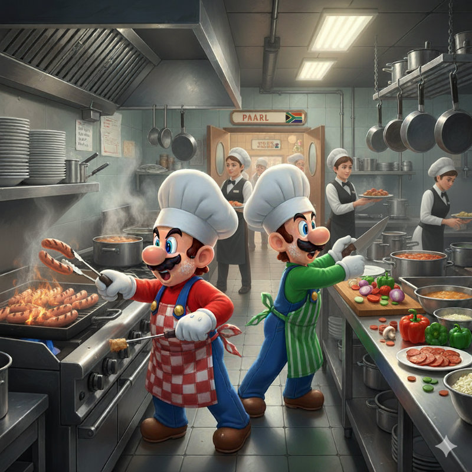

_To understand this image, we recommend reading the post_

On Saturday I arrived at the Van der Valk Hotel in Sassenheim at 1:40 PM, five minutes before the appointment that was set for 1:45 PM with Roger Rassin, the executive chef of the Hotel.\
Roger showed me where to get a clean uniform (black pants, white jacket, black apron, and white hat), I got changed, and I met Luigi, currently the chef of Paarl, the South African restaurant.\
Luigi is from Calabria (Italy), has been living in Holland for 8 years, and is 35 years old. He is the first adult man I've met in Holland who is as short as me. If my name had been Mario, we would have immediately been an epic duo!

In Italy, Luigi had graduated as a dental technician, but here he decided to be a cook and founded a small company, with other chef friends, through which he helps restaurant kitchens get organized.
He has been at Paarl for 3 months and is supposed to leave in mid-October.

On Saturday night there were about seventy guests in the restaurant, and Luigi quickly showed me how to start all the machinery, light the indoor charcoal grill, and arrange the “mise en place,” which is all the ingredients needed to prepare the dishes.\
The current menu consists of an appetizer of biltong (the South African dried meat), fried polenta, marinated and then grilled king prawns, a salad of watermelon, cherry tomatoes, mint and feta, and “copper penny salad,” a sweet and sour carrot salad.\
Then comes the “main course,” and here I understand that for Italians it might be a bit strange that after the appetizers we move directly to the second course and side dishes, but the concept of a “primo piatto” (first course) is exclusively Italian. A plate of carbonara, in the rest of the world, is considered a “main course,” just as a roast with potatoes would be, for example.\
So, for the main course, there is South African sausage (“Boerewors,” literally “farmer’s sausage”) grilled and served with a small tomato sauce, veal cheek with a red wine reduction, lemon-marinated Atlantic redfish fillet served with tomato and apricot chutney, sweet potatoes baked in orange juice (Italians stay calm, don't get agitated, I know some of these combinations would be unpopular in Italy), and green beans with butter and garlic.\
For dessert, there is Malva pudding with custard, Melktert (milk tart), and Banoffee (a creamy dessert with banana).
The menu is fixed and the portions are very small so that everyone can taste everything.\
This greatly simplifies the work, and the fact that it is “shared dining,” meaning everything is placed in the center of the table and everyone serves themselves, makes it all less laborious.

To recap, the evening went very well and in theory, I was supposed to come back on Wednesday, the day when all the preparations for the week are made, that is for Thursday, Friday, and Saturday evenings and for Sunday lunch, but Luigi gave me the news that he wouldn't be there on Thursday evening and I would have to manage it by myself with a chef from the hotel, which is pretty crazy, so I offered to come back the very next day, on Sunday, yesterday, to do the lunch service and learn the menu a little better.\
So I went yesterday as well, at 10:00 in the morning, Luigi was an hour late and I started the kitchen by myself. It was better and now I feel much more confident.\
Unfortunately, the level of the cuisine is quite low. I wonder if the cause is the location in the Netherlands or the fact that Paarl, having only been around for a year, doesn't have a stable team yet.

In mid-October we will change the menu (it will happen every two months) and I will be in charge, together with the chef, of putting it into practice. I will try to start on the right foot and raise the level a bit. Not to put on airs, but after living and cooking for 15 years in Tuscany, some things are just unbearable to see.\
Today and tomorrow are my days off and on Wednesday I have to be there at 9:30 to sign the contract and then I start my shift at 10. We will spend the whole day just doing prep.

In essence, another nice change. The work will undoubtedly be more hectic and stressful than the bike shop, but the fact that I will be working 38 hours a week, which is quite unusual in the restaurant world where you work at least 50 hours, reassures me a lot.\
Now we will see which chef will be hired. I hope it's a South African, I can't wait to learn!

The girls and Hilly are very enthusiastic about my choice and encourage me a lot. In the next post I will also talk about them, sorry if in the last few I have done so little or not at all, I will see to making it up.\
See you soon.
