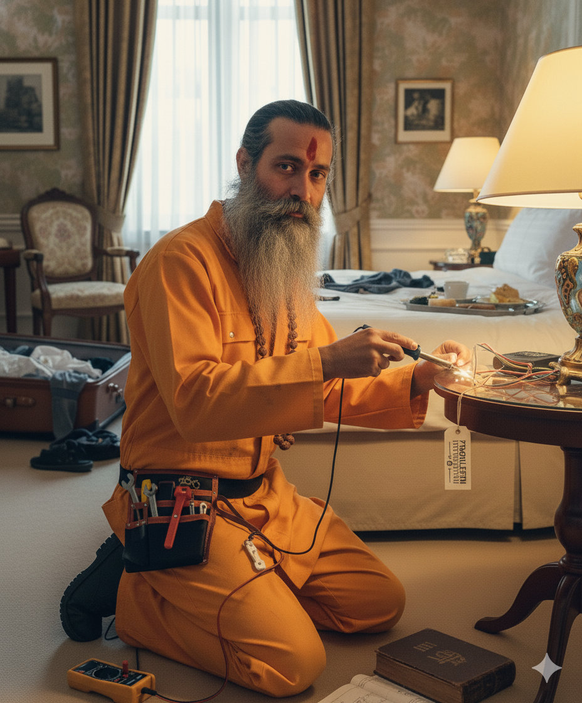

_My new professional identity_

Ok, yes, I know, I should have posted the interview with Hilly. I tried, I even wrote the questions I was going to ask her, but our conflicting schedules didn't allow it.\
So you'll have to put up with another small update on my neurotic work situation. I promise the next post will be the interview.\
The positive thing is that I'll soon be leaving my job at the restaurant. Let's recap.\
Once Luigi left, I found myself working with Laura. The seventeen-year-old girl, Saskia, was only with me for 2 days and then went back to the Hotel because she is actually doing her schooling, at the Hotel, and needs to be in close contact with the executive chef.\
Laura is capable, she's 20 and has been working at the hotel for almost 3 years. She's quite autonomous even if at times, especially towards the end of the evening, she gets a bit stuck and I have to keep spurring her on.\
Luigi's absence was felt immediately, with two of the worst evenings of my life, work-wise. It was 6:00 PM, the time service starts, and a good part of the mise-en-place (the list of ingredients needed for preparations) still to finish. It was total chaos, managing to prepare dishes while I was still cutting herbs and vegetables and roasting meat.\
After the first days of fear and loathing, the situation settled down a bit and I found a good rhythm with Laura.\
Yesterday afternoon I received confirmation of my job offer as "Problem Intervention Guru" (Emergency Intervention Guru), as the ad quoted, at the Ald Hotel in The Hague.\
In the last two weeks I had 2 interviews, in person, at the Hotel. The first was an introductory interview, with the general manager.\
The second, a week later, was a technical interview, done with the head of maintenance for the entire hotel chain that the Ald Hotel is part of.\
During this last interview, which lasted more than an hour, we walked around some of the Hotel rooms, and Luke, the head of maintenance, asked me questions/quizzes to know how I would solve certain possible technical problems. Here, all the hours spent watching MacGyver, my favorite series in the 80s, came in handy. Both interviews went well and they offered me the job.\
It will be me and a 24-year-old guy, whom I haven't met yet, in charge of solving all the Hotel's technical problems and contacting professionals in case the problems are too complex for us. The job is Monday to Friday, office hours, 38 hours a week. What a relief not to have to work evenings anymore!\
Actually, we won't just have to take care of the Ald Hotel ( https://thealdhotel.com/ ) but also the townhouse hotel (https://www.townhousehotels.nl/ ) a hundred meters away, belonging to the same chain. Both hotels have just been completely renovated and are located in the center of The Hague.\
I will go to work by train, it takes about twenty minutes from Leiden, and the subscription is paid for by the employer.\
At first glance it seems like a nice place, but who knows, even where I am now seemed like a nice environment at the beginning, and then it turned out to be the opposite. Even though the colleagues are all truly nice, we laugh and joke constantly, and I will be sorry to leave that.\
Today I should sign the contract with the Ald Hotel and then I'll have to break the news to Roger, the executive chef. However, by contract, I have to give one month's notice, starting from the following calendar month, so I will only be able to leave Paarl after December 31st.\
At the moment I am creating the new menu, which will start from the first of January, and whoever arrives in my place will have to put it into practice.
I still have more than a month of work ahead at Paarl, with the addition of the Christmas menu that we will do for December 25th and 26th, so I have to roll up my sleeves and try to keep the stress under control.\
I'll see you at the Interview with Hilly, hopefully soon.
