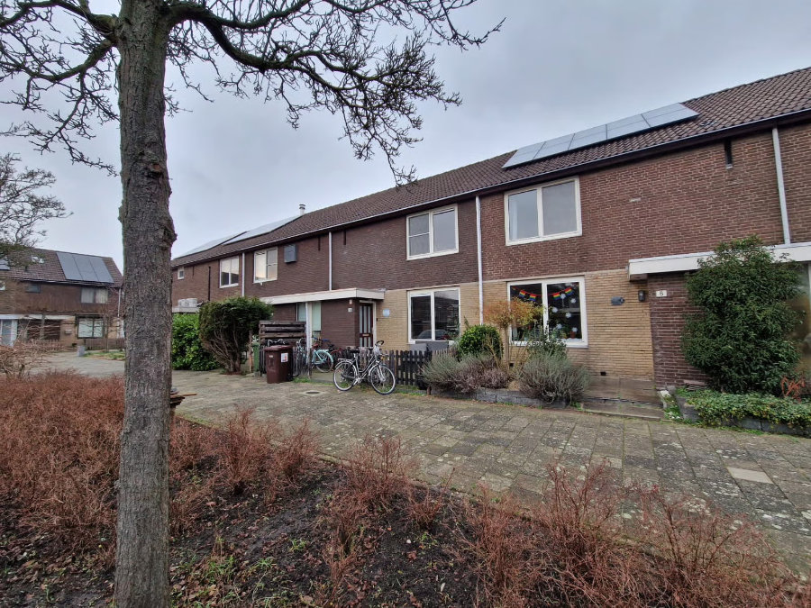

_The house in question_

Dearest friends and blog readers, in this brief update I wanted to share some great, recent news with you.

In this almost year and a half of living in the Netherlands, we have experienced many changes, and now almost all of us feel fairly settled. The only situation that is still very precarious is our housing.

The house we are currently in is comfortable and very close to the center of Leiden, but it has one major problem: the rent price, a full €2200 per month, obviously excluding all utilities and expenses. Given the financial unsustainability of the situation, we immediately turned on our radars toward the rental real estate market.

Every day, for over a year, I have consulted several sites to view rental houses and I have noticed a progressive worsening of the situation: far fewer offers and rising prices. In the last four or five months, the search has become even more intense. The obsessive scrolling of the timeline on those apps, searching for new properties on the market within a 25 km radius of Leiden, at a price lower than what we pay now, resulted every day in an average of two or three applications from us. For every application, I sent a cover letter with a series of attached documents proving our personal, financial, and work status, our savings (almost depleted), our regularity in paying rent, and a letter from the owner of our current house stating that we are honest, well-behaved, and God-fearing tenants.

Obviously, after the initial hassle of getting all these documents and writing the cover letter, applying for every new listing was quite rapid, but it required constant concentration and dedication.

I quickly realized that there are three markets in the Dutch residential rental world.

We do not have access to the first, most advantageous market. Between 30% and 40% of all existing homes in the Netherlands belong to this market. In Dutch, it is called "sociale huur" which means "social housing sector" and is only open to individuals with lower incomes or situations of social disadvantage. We are outside this category, but only barely. To give you an idea of the difference in rental prices, about a couple of months ago, a house identical to ours, on our same street, became available at the wonderful price of €650 per month. I can't tell you how envious we got! However, apart from the low income, there is a waiting list of more than ten years for a house in this sector because people hold onto them tightly, and as soon as a new one appears, everyone jumps on it like piranhas on an animal carcass.

The market segment to which our current house belongs is the third, the most disadvantageous, and by a long shot. Unfortunately, people or families with fewer guarantees, precarious jobs, and little money in the bank only have access to this sector.

The second sector has intermediate rental prices, and just to have the possibility of visiting one of these accommodations, you must possess all the documents I mentioned before and respond to the ad within the first ten minutes of it being posted online, because, since there are always hundreds of interested people, the agencies only take the first few dozen, from which they then filter out those with the best guarantees.

About a month ago, an incredible opportunity arose. A house in the center of Leiden, with three bedrooms and a garden for the unbelievable price of €1500 per month. Moreover, a free-for-all viewing had been scheduled, in a time slot of about a couple of hours, and only people who went to visit the property could then apply. Among all those who met the criteria, the lucky one would then be chosen by a draw. How cruel!

Hilly and Gemma were free at that time and went to the open day. The situation was very promising. Even though the house needed quite a bit of renovation, all at the expense of the new tenant, the location truly was a dream, in the beating heart of one of the most beautiful cities in the Netherlands. Only about fifteen candidates showed up for the viewing, and our hopes soared.

To apply, even more documents and certificates than we had were required, and the application had to be submitted by a certain time on one of the days following the viewing. We managed to obtain all the necessary certificates and declarations and submit our rental proposal in time. Success!

At this point, we just had to wait. If we weren't contacted by the agency within a week, the house had been given to someone else. The compulsiveness with which I hit refresh on the Gmail app during those days of great stress must not have gone unnoticed in Mountain View, where Google's headquarters are located. The cyber security engineers must have been busy trying to figure out what kind of attack it was.

Alas, that week passed without us receiving any news from the agency, and even today we don't know if our documentation wasn't comprehensive enough or if we simply lost in the final Russian roulette.

The search continued with even greater fervor and dedication, but also a bit of disappointment verging on despair.

Just over a week ago, another ray of light—something was finally unlocking. I imagine the house owners of the second sector as a kind of occult sect, meeting in dusty cellars illuminated by torches fueled by the fat of third-sector tenants, engaged in long debates about whom to let into their good graces and grant the privilege of paying only 1500 euros a month to rent the shacks that the sect members rightfully own. I imagine the moment one of these adepts mentioned our name: "There's this Cassetta family; they seem to have all the credentials to start giving us some money. What do you think?"

The house in question was no longer in the center of Leiden, but about twenty kilometers away, on the outskirts of "Alphen aan den Rijn," a town of 116,000 inhabitants along the Rhine.

Last Tuesday, at 11:00 AM, Hilly and I went to visit the house. The former tenant, who was in the process of moving out, received us very cordially and gave us a nice tour of the house. We both liked it a lot, and even though the girls aren't very happy because we have to move out of Leiden and because the house is 5 km by bike from the Alphen aan den Rijn train station, we decided to apply.

After a few days, the agency called us to give us the wonderful news: the house is ours! They will give us the keys on February 15th because in the meantime, they have to renovate the kitchen and bathroom. Finally, we will have a proper shower! We will also have a guest room, so we renew our invitation to come and visit us.

A new era is beginning for us where, yes, we are moving away from beautiful Leiden, but we will finally stop this monthly financial bleeding. The new house costs €1350 per month, a real bargain here in the Netherlands. The Cassetta family must have really pleased the The Brotherhood of the Balanced Ledger!

See you soon, with the interview with Sophia or Gemma.
