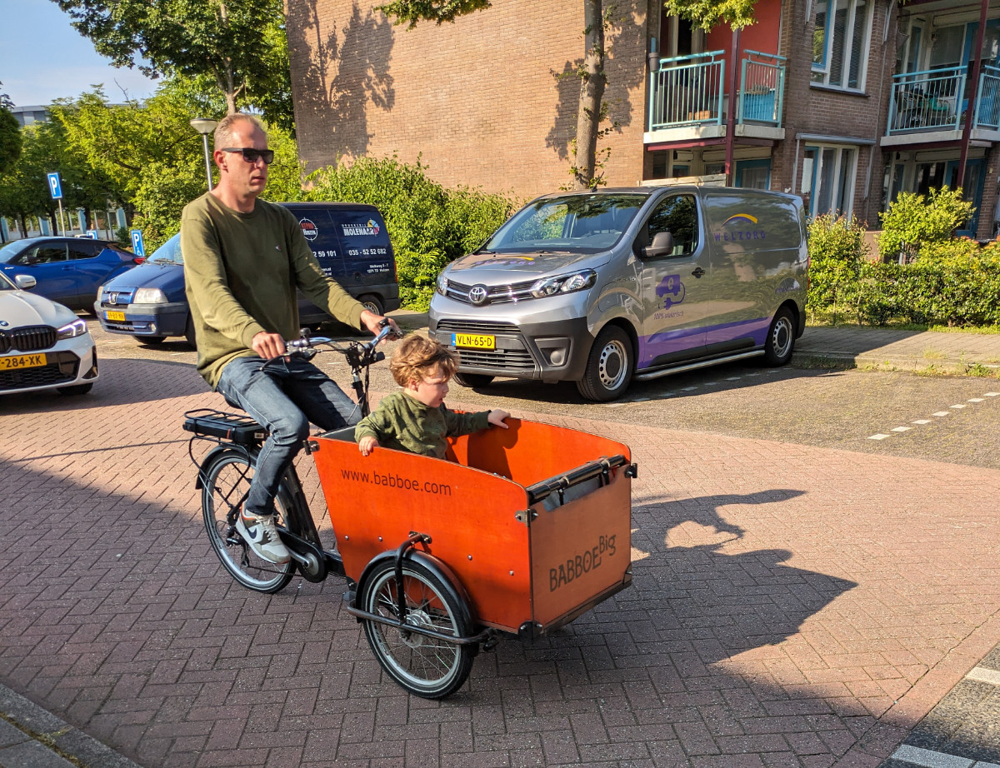
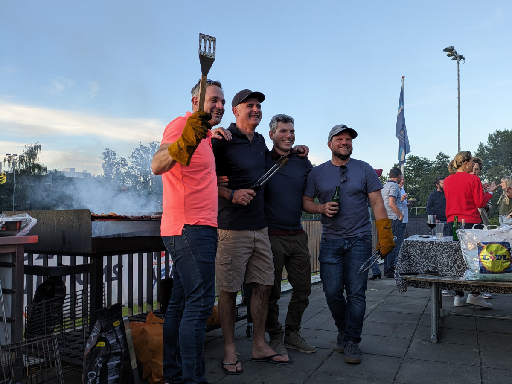

_My mobile office_

Yesterday, we spent the day working on the computer, walking the dog, grocery shopping, and visiting a natural area by a lake/gorge, which even had a beach.

I am still finishing my portfolio. Ideally, I should have been ready to start job hunting from day one, or even earlier, but due to the intense days of the past few months, I haven't managed to complete what I need to present myself on LinkedIn.

Today is quite a busy day in terms of travel. Because of poor organization (again due to the stress of the past few months, it's not my fault!), we have to go to and from Amsterdam twice. The first trip is for an appointment with the owner of Jean-Jacques, known as JJ, a small 3-year-old Australian Terrier we'll be looking after from Sunday the 9th, in two days, until June 17th.

The second trip is to attend Mornè's party, a South African friend who lives in Amstelveen, just south of Amsterdam. He's turning fifty and is throwing a barbecue party at a rugby club. So today, we will spend a total of 6 hours on public transportation.

Right now, we are on the bus heading to Amsterdam for the second time. Outside the window, I see large houses with thatched roof, which are quite popular in this area. Even the house next to ours has a roof like this.

The gardens of the houses are all very well maintained and, especially at this time of year, are full of beautiful flowers. All the buses we've taken today are electric, as are a good percentage of the cars seen around.

Huizen, in particular, looks like it's straight out of a utopian science fiction novel. In the town center, bicycles move silently, ridden by people of all ages—teenagers with backpacks in the basket on the handlebars, men or women on "cargo" bikes with one or more very blonde children onboard. Occasionally, the soft hum of an electric car or the pattering of a dog on a leash can be heard. This would be the right environment for me, while Sophia would prefer to live in downtown Amsterdam or somewhere similar.

_A cargo bike_

_Another cargo bike_

_Another one_

_Party + South Africans = barbecue_
