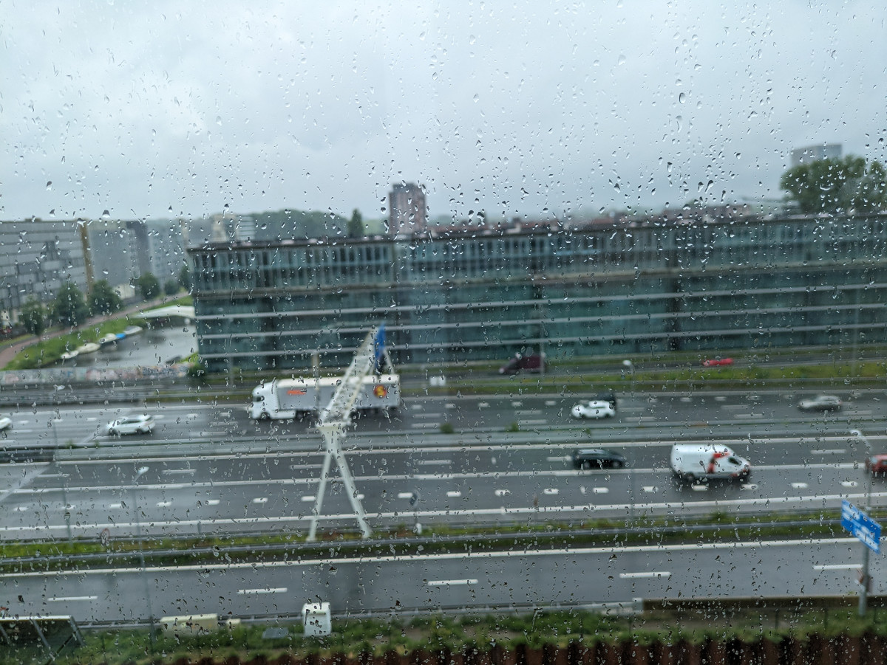
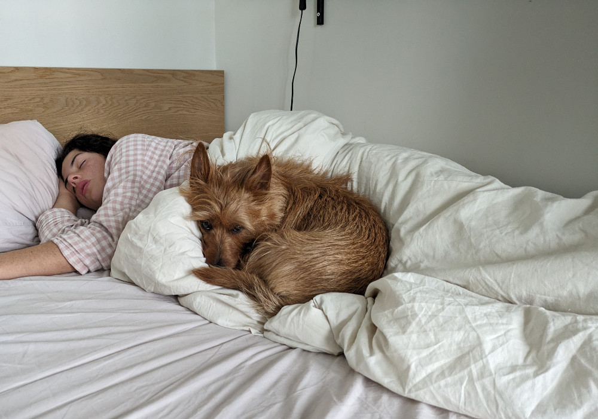
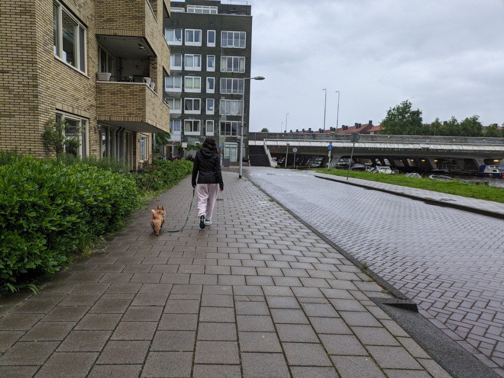

_"Koningsdag" King's Day, every April 27th_

Holland is not a nation but a region of the Netherlands, and in Italy, the inhabitants of the Netherlands are mistakenly called "Olandesi" ("Hollanders"). Luca Misculin, a journalist for the newspaper "il post," which I regularly follow, suggests calling the inhabitants of the Netherlands "Nederlandesi".\
The Dutch refer to themselves, in Dutch, as "Nederlanders." I will try to change the trend a bit and call them "Nederlandesi" too. However, in English, I will always call them "Dutch people." Sorry for the lengthy explanation, but I wanted to emphasize this point.

Today it rained all day with a maximum temperature of 14 degrees. Despite this, people here always go out, both on foot and by bicycle, and you don't see any umbrellas.\
The apartment we are in is in a large building with all glass windows, honestly quite ugly, certainly the ugliest in the neighborhood, but once inside it is all modern and well-maintained.\
Our apartment has a single large window overlooking a highway, we are on the seventh floor, but you can still hear the noise. Once the window is closed, though, you can hardly hear anything.

_We are on the seventh floor, right there._

_The view from our only window._

Today, since it was raining, we stayed inside almost all day, except for a few outings to take JJ outside and a couple of times to buy food. This evening we cooked pan-seared salmon, basmati rice, and broccoli (Sophia's favorite dish), and when we returned from our evening walk with JJ, the smell of roasted salmon filled the entire hallway. It reminds me of when I spent months in New York, in Queens, in huge buildings with very few windows. Climbing the stairs to your apartment was an olfactory journey through the kitchens of the world.

JJ is really cute and always tries to curl up next to Sophia. He's a sweet little plush toy that scurries furiously on the apartment's parquet floor. If the weather gives us a bit of a break tomorrow, we want to take him for a walk to Rembrandt Park, not far from here. Unlike the "Nederlandesi", we are not equipped for the rain; I only brought one pair of long pants, and Sophia only has very light clothes. Luckily, she brought a waterproof jacket.

_JJ and Sophia this morning_

_JJ & Sophia on the couch_

_Evening stroll_
