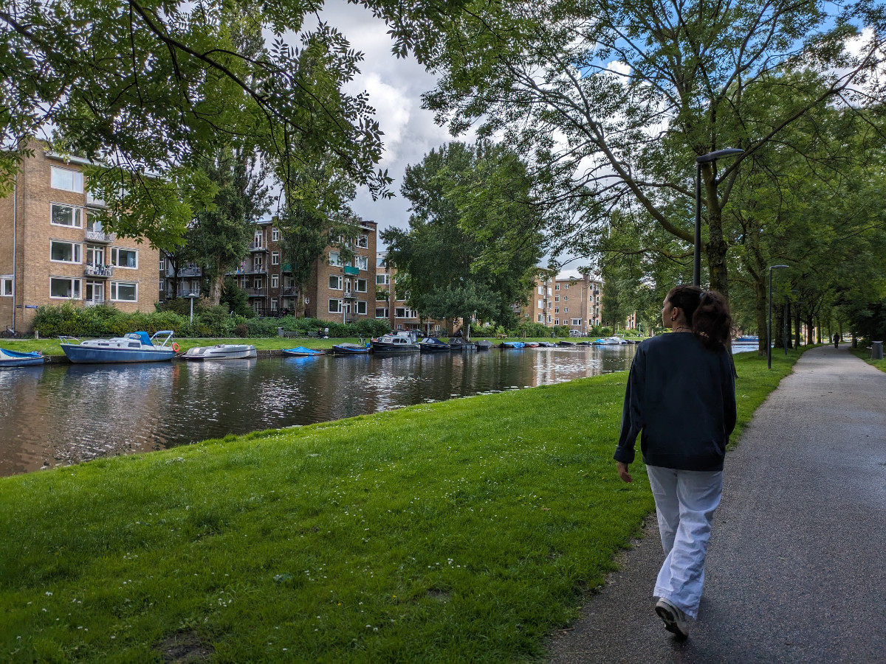

_The Laundry Boutique_

The monstrosity of glass and concrete where we currently live has a laundry room on the ground floor. To access any part of the building, you need to place a special key fob on a sensor. You need to do this to enter the building, then once you reach the seventh floor, you have to pass the gadget over the sensor again to access the landing. You also have to use it to enter the "Laundry Boutique."

The "Laundry Boutique" is managed by Miele, and it has 5 washing machines and 5 dryers. To use them, you need to download an app on your phone, load some credit, and then check through the app if any machines are available. If they're all occupied, you can see the remaining time for each cycle. Today, I did a load of laundry and used the dryer.

I put the laundry in and started it. There's no need to add detergent as it's already included. After about an hour, a short 30 degrees wash, I received a notification on my phone that the washing machine was done. The same thing happened with the dryer. Costs: €2.75 for the wash and €1.75 for the drying.

I've experienced this kind of laundromats many times in New York. However, 25 years ago, it was all less sterile, and you bought detergent from a machine. You'd put in 50 cents, and a mini box with all the graphics of a big box would come down, looking like a toy for kids. Maybe people living in Italian cities are already aware of these innovative wonders, but I've spent the last 18 years in the countryside and am a bit behind.

This morning at 11, we went to an appointment for a new “sitting.” We had a stroke of luck. So far, we had managed to cover “sittings” from June 5th to August 21st, except for six days from June 17th to 22nd. I was very skeptical about making it without having to stay in a hotel even for one day. Yesterday, I saw an ad on "trustedhousesitters.com," for exactly June 17th to 22nd. A Parisian fashion designer living in Amsterdam. I immediately sent him a message to make myself available for a video call. He responded right away and asked where I was currently located.

It turns out he's a 20-minute walk from where we are now. So, we made an appointment for today, and he gave us the keys to his house so that on Monday, when Christina returns, we can go directly to Stephan's, the fashion designer's house. Cool, right?

At Stephan's, we will have to take care of his cat, Frances. We saw her today, and she didn't want to come near us, but he says that after a couple of days, she should get in tune with us and let us approach her. Meanwhile, everything is fine here at Christina's.

JJ is a real sweetheart. Today, we took him for a long walk in Rembrandtpark, a large park not far away. It's very funny because, being so small, he quickly runs out of pee, and today he kept making the motion to mark territory, but nothing came out. Every time he did it, all confident, we burst out laughing.

Yesterday, Sophia bought a book titled "Dutch in 3 Months" to learn Dutch. She immediately got to work. The book is very well done and comes with an app to listen to all the dialogues. When I find a job and therefore have a bit more free time (at least I hope), I'll start studying Dutch seriously as well. To work in the tech world, Dutch isn't necessary; in fact, all work interactions in many sectors are conducted only in English. The other night, at the South African barbecue, several people told me how everything in their office is conducted in English, and in meetings, they can only speak Dutch if everyone is Dutch.

Yesterday afternoon, we walked to the city center. The first time I went to downtown Amsterdam was in August 1995. Honestly, I remember little of that vacation. I wonder why?

Anyway, in that area, there's a neighborhood I really like, Jordaan, and if I had a few million euros at my disposal, I'd get a small apartment there to live for a few years. Maybe with 2 or 3 million to spend, you can get about sixty square meters.

_Walking towards the city center_

_Jordaan's streets_

_Jordaan's canals_

_We are all going to learn Dutch_

_Towards Rembrandtpark_

_Work and chai latte_

_The legendary JJ and his empty bladder_
