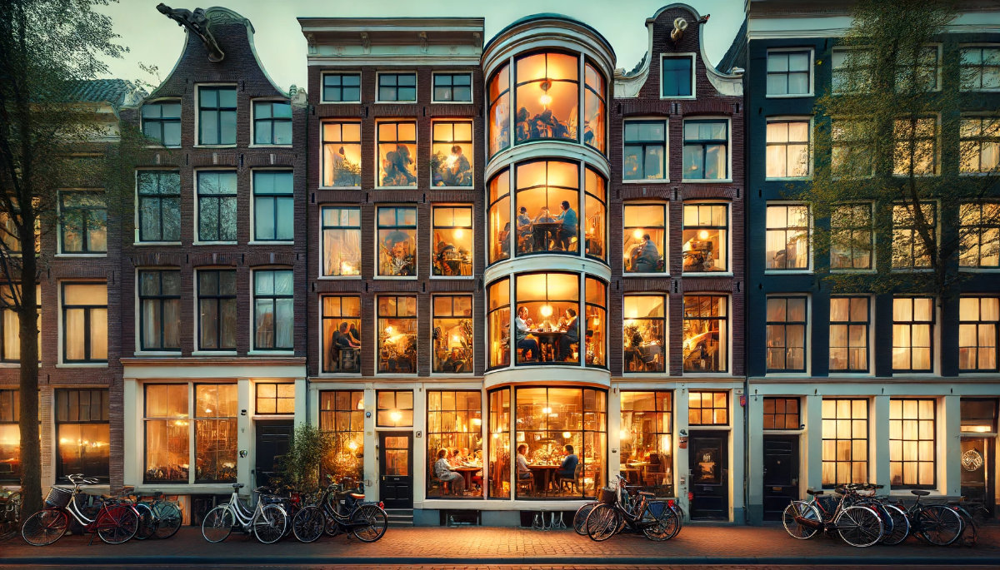
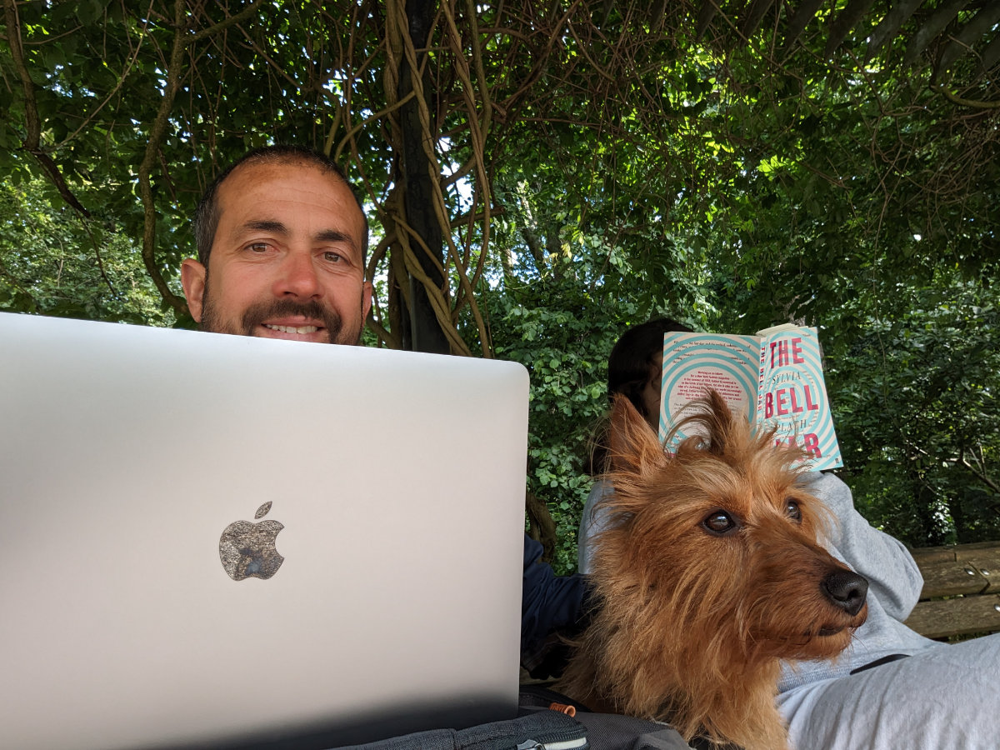
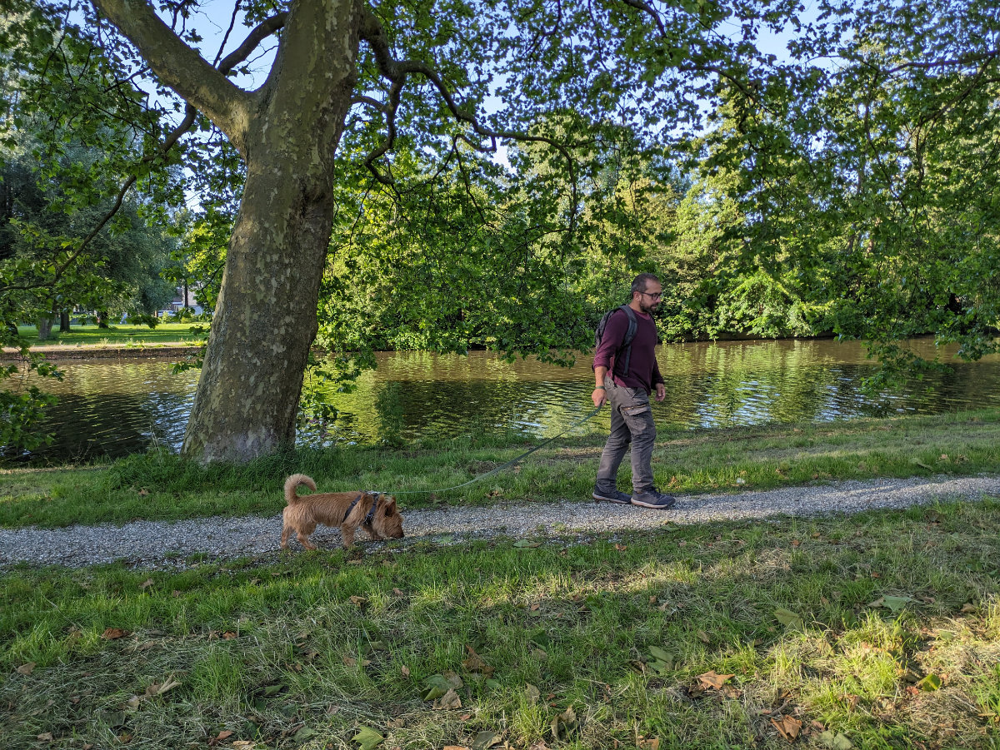
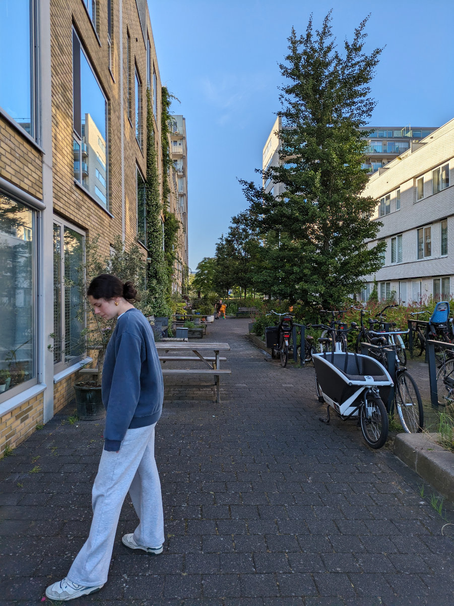

_This photo is not real_

One surprising thing about the Netherlands, and also a bit difficult to understand, is the fact that most houses don't use curtains. Even those on the ground floor. So, as you walk through the streets, not being used to something like this, you can't help but peek into people's private lives. At least, I can't resist; I have to take a look.

I've seen people dining in peace, someone busy cooking, a girl on the sofa looking at her phone, children's rooms without children, beautiful living rooms, and kitchens still needing to be cleaned from the night before. I even tried taking some photos, but they didn't turn out great, partly because I didn't want to be seen and come across as a stalker and partly because the window's reflection didn't capture what you could see in real life.

That's why I used an AI-generated photo to give a sense of it, but it seems quite exaggerated. Usually, the atmosphere is more intimate in the evening, and the lights are less glaring.

Creating a "cozy" atmosphere (in Italian, the word "cozy" can be translated as "accogliente," but it doesn't have quite the same meaning) is not only seen in homes but also in cafes and restaurants, where a lot of attention is given to lighting and interiors. In Italy, but also in other countries, many restaurants have blinding lights; the food might be amazing, but it feels like being in an operating room. And the TV always on? Come on!

Tonight, we spend our last night at Christina's house with the adorable JJ. Tomorrow afternoon, we'll go to Stephan's place with the cat Frances. This morning, I moved my office to the park, on a beautiful bench in the middle of a sort of botanical garden, but then it started raining, so we left. In the afternoon, however, the sun came out, and we went for a long walk, Sophia, JJ, and I.

There's an entire area of townhouse-like apartments, just a few hundred meters from here, that are really well designed. Between rows of houses, there's a pedestrian area where residents have potted plants, tables, benches, children's games, and, as always, a ton of bicycles. You're always just 5 minutes from the metro or tram stop, yet there's a surreal tranquility. I believe one reason for this peace and livability is the very low presence of cars.

Having a car in Amsterdam, or really anywhere in the Netherlands, is a luxury since you have to pay for parking everywhere, even at the supermarket. This is also a plus in my view, not the fact that you have to pay for parking at the supermarket, but the scarcity of cars. I think many modern cities are unlivable precisely because of cars. Take those away, and suddenly you have more space on the sidewalks, less noise, fewer dangers, and less smog.

I like Amsterdam more and more. If the rents weren't so high here, I might almost want to get one of those apartments, make a small garden in wooden boxes on the sidewalk, and maybe, just maybe, not put curtains on the windows.

_Working in the park while JJ stands guard_

_Afternoon walk_

_The townhouse-like apartments_

_Netherlands vs Poland_
