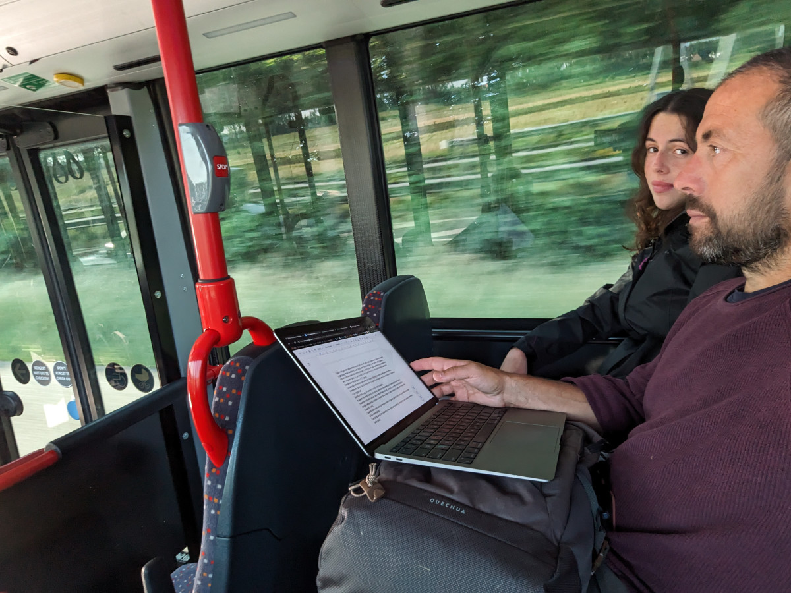
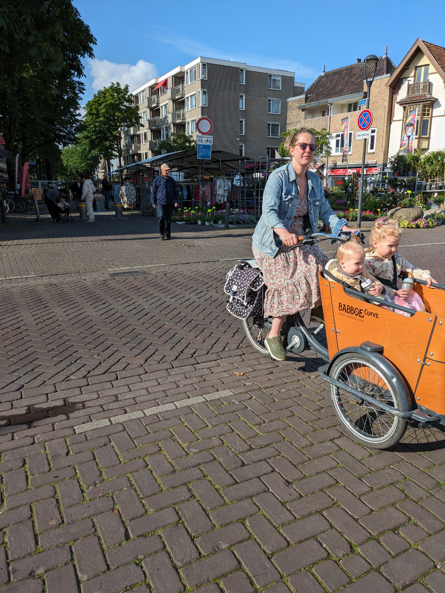
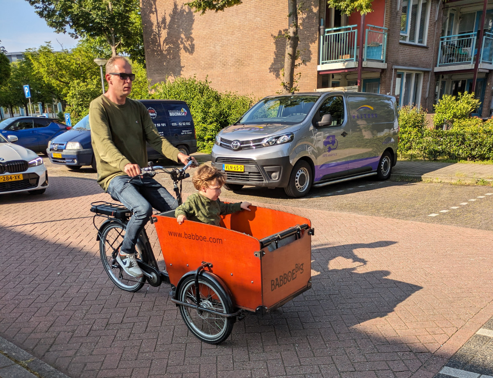
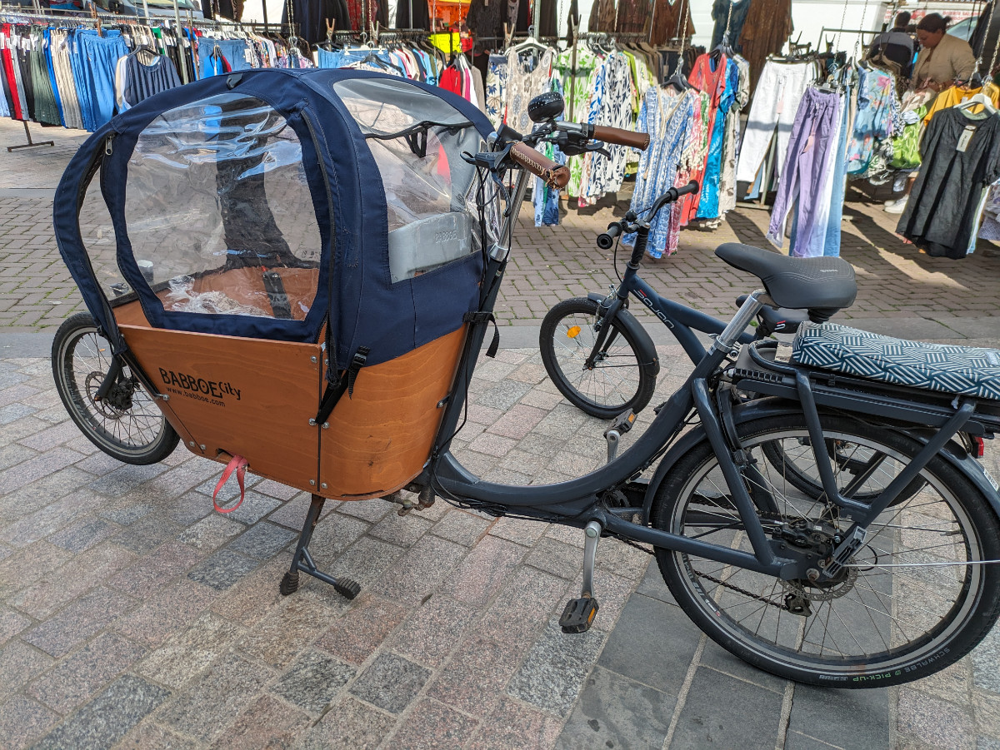
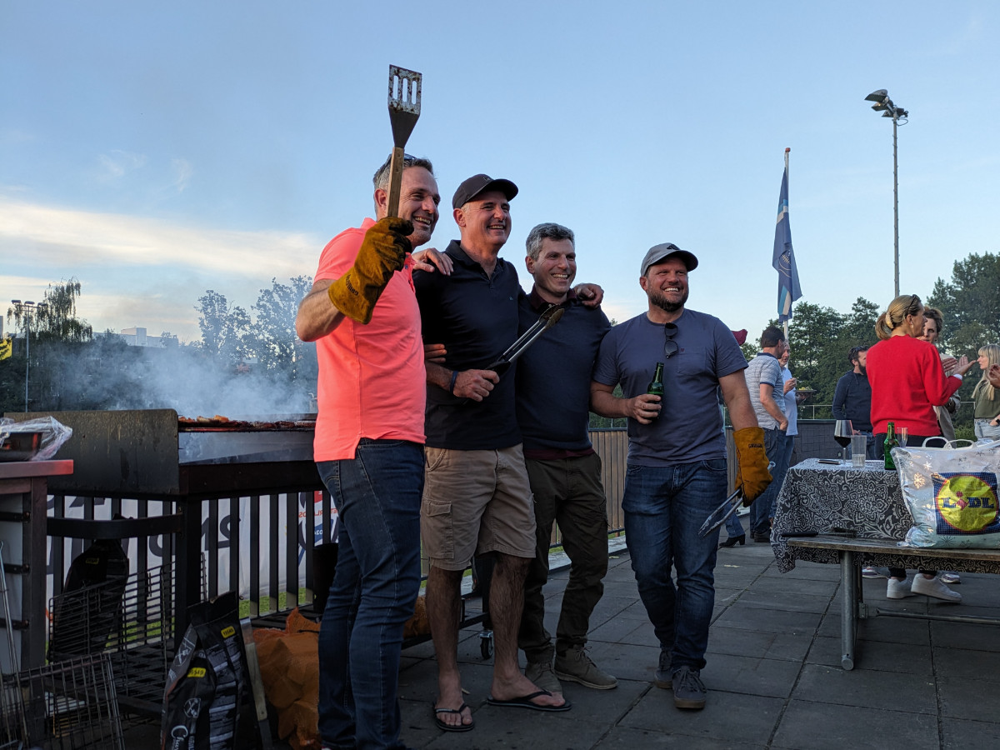

_Il mio ufficio mobile_

Ieri abbiamo passato la giornata tra lavoro al computer, giri col cane, spesa al supermercato e visita ad un'area naturale su un lago/canalone con addirittura una spiaggia.

Io sto ancora finendo il mio portfolio, in teoria avrei già dovuto essere pronto alla ricerca del lavoro già dal primo giorno, o anche prima, ma con le giornate intense degli ultimi mesi non sono riuscito a completare ciò che mi serve per propormi su LinkedIn.

Oggi è una giornata abbastanza intensa dal punto di vista degli spostamenti, siccome mi sono organizzato male (sempre a causa degli ultimi mesi di stress, io non c'entro eh!) dobbiamo andare e tornare due volte ad Amsterdam. La prima per un appuntamento con la padrona di Jean-Jacques, detto JJ , un piccolo Terrier Australiano di 3 anni a cui dovremo badare da Domenica 9, fra due giorni, fino al 17 giugno.

La seconda volta invece per andare alla festa di Mornè, un amico sudafricano che vive ad Amstelveen, poco a sud di Amsterdam, il quale fa cinquanta anni e fa una festa con barbeque in un rugby club.
Quindi in tutto, oggi, ci facciamo 6 ore di mezzi pubblici.

In questo momento siamo sull’autobus, direzione Amsterdam, per la seconda volta. Fuori dal finestrino vedo delle grosse case in style “thatched roof”, ovvero con un tetto fatto di paglia o stoppie, abbastanza popolare in questa zona. Anche la casa a fianco alla nostra ha il tetto fatto in questo modo.

I giardini delle case sono tutti molto curati e in questo periodo dell’anno soprattutto sono pieni di fiori meravigliosi.
Tutti gli autobus che abbiamo preso oggi erano elettrici e così anche una buona percentuale delle auto che si vedono in giro.

Huizen, soprattutto sembra uscito da un romanzo di fantascienza utopica. Per le vie del centro si muovono silenziosamente le biciclette con a bordo gente di tutte le eta’, teenagers con lo zaino nel cestino sul manubrio, donne o uomini in sella di bici “cargo” con a bordo uno o piu’ pargoli biondissimi. Ogni tanto il ronzio frusciante di un’auto elettrica o lo zampettare di un cane al guinzaglio.
Questa sarebbe un po’ la dimensione giusta per me, mentre Sophia vorrebbe vivere in centro ad Amsterdam o qualcosa di simile.

_Una cargo bike_

_Una altra cargo bike_

_Un'altra ancora_

_Party + sudafricani = barbeque_
