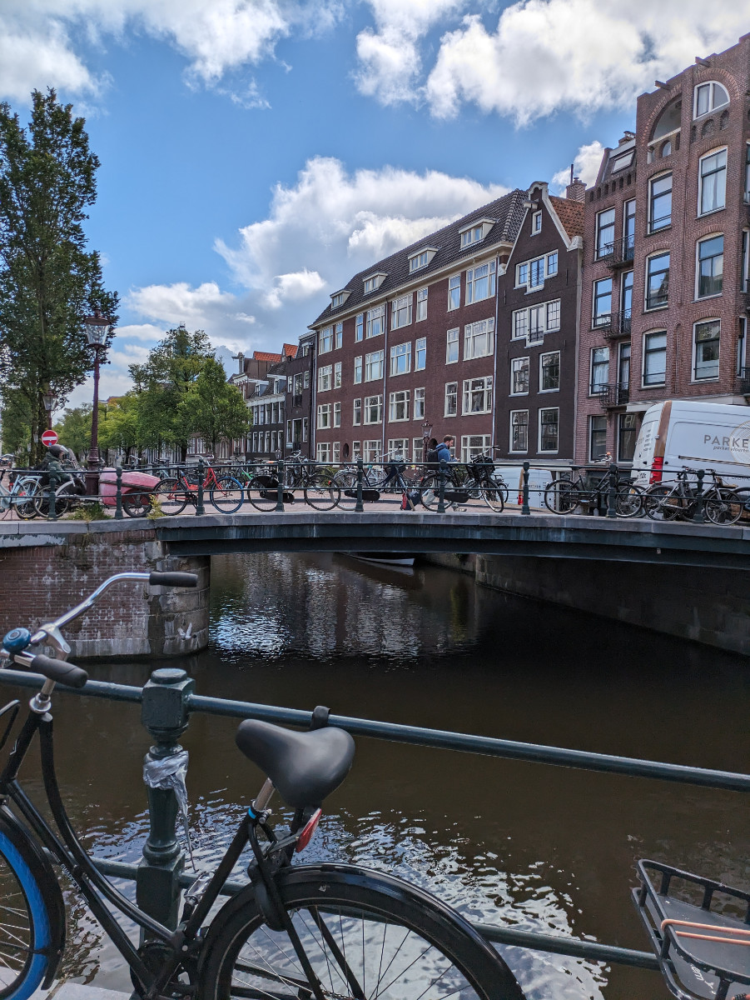

_La lavanderia Boutique_

La mostruosità di vetro e cemento in cui viviamo al momento ha un locale lavanderia al piano terra.
Per accedere a qualsiasi locale del palazzone bisogna appoggiare uno speciale portachiavi ad un sensore.\
Serve farlo per entrare nell’edificio, poi, una volta saliti al settimo piano, ancora una volta c'e' da passare l’"aggeggino" sul sensore per accedere al pianerottolo.
Bisogna anche utilizzarlo per entrare nella “Lavanderia Boutique”.\
La “Lavanderia Boutique” e’ gestita dalla Miele e ci sono dentro 5 lavatrici e 5 asciugatrici.
Per utilizzarle bisogna scaricare un app sul proprio telefono, caricare del credito e poi, sempra dall’app, controllare se ce n’e’ una libera. Se sono tutte occupate si vede il tempo mancante alla fine di ciascun ciclo.\
Oggi ho fatto una lavatrice e una asciugatrice.\
Ho messo dentro il bucato, e dato il via. Non serve mettere detersivo e’ gia’ incluso.
Dopo un’ora circa, lavaggio breve a 30’, mi arriva una notifica sul telefono che la lavatrice ha finito. Stessa cosa con l’asciugatrice.\
Costi: 2.75€ per il lavaggio e 1.75€ per l’asciugatura.\
Anche questa cosa di andare in lavanderia automatica l’ho vissuta tante volte a NewYork.\
Li pero’, 25 anni fa, era tutto meno asettico e il detersivo lo compravi da una macchinetta. Mettevi 50p e scendeva una scatoletta mini, ma con tutta la grafica della scatola grande, che sembrava uno di quei giocattolini per bambini.
Forse chi vive nelle città italiane e’ gia’ consapevole di questi prodigi dell’innovazione ma io mi sono fatto gli ultimi 18 anni in campagna e sono rimasto un po’ indietro.

Questa mattina alle 11 siamo andati ad un appuntamento per un nuovo “sitting”. Abbiamo avuto una bella botta di culo.\
In pratica eravamo finora riusciti a coprire di “sittings” dal 5 Giugno fino al 21 Agosto a parte per sei giorni, dal 17 Giugno al 22. Ero molto scettico sul fatto che ce l’avremmo fatta senza dover andare neanche un giorno in un hotel.\
Ieri ho visto un annuncio su “trustedhousesitters.com” , proprio dal 17 al 22.\
Un designer di moda Parigino che vive ad Amsterdam.\
Gli spedii subito un messaggio per rendermi disponibile ad una videochiamata.
Lui mi rispose subito e mi chiese dove mi trovavo al momento.\
Viene fuori che e’ a 20 minuti a piedi da dove ci troviamo ora. Quindi ci siamo dati appuntamento per oggi direttamente e ci ha dato le chiavi di casa in modo che Lunedì, quando torna Christina, andiamo direttamente a casa di Stephan, il designer di moda. Ganzo eh?

Da Stephan dovremo badare alla sua gatta Frances. L’abbiamo vista oggi e non si e’ voluta avvicinare ma lui dice che dopo un paio di giorni dovrebbe entrare in sintonia con noi e farsi avvicinare.\
Intanto qui da Christina va tutto bene.\
JJ e’ un vero amore. Oggi l’abbiamo portato a fare una lunga camminata a Rembrandtpark, un grande parco non molto distante.\
E’ molto buffo perche’, essendo cosi’ piccolo, finisce la scorta di pipi’ molto in fretta e, oggi, continuava a fare il gesto, per delimitare il territorio, ma non gli usciva niente.\
Ogni volta che lo faceva, tutto convinto, noi scoppiavamo a ridere.

Ieri Sophia ha comprato un libro dal titolo “Olandese in 3 mesi” per imparare l’Olandese. Si e’ subito messa al lavoro.\
Il libro e’ fatto molto bene ed e’ accompagnato da un app per ascoltare tutti i dialoghi. Quando trovero' un lavoro e avrò quindi un po’ piu’ di tempo libero (almeno spero) comincero’ anche io a studiare l’Olandese seriamente.\
Per lavorare nel mondo “tech” l’Olandese non serve, anzi, tutti i rapporti di lavoro in molti settori si svolgono solo in Inglese.\
L’altra sera, al barbeque Sud Africano, diverse persone mi raccontavano di come nel loro ufficio si svolga tutto in Inglese e, nelle riunioni, possono parlare Olandese solo se sono tutti Nederlandesi (yes!, mi sono ricordato di dire Nederlandesi!).

Ieri pomeriggio siamo andati a piedi in centro. La prima volta che andai nel centro di Amsterdam era l’agosto del 1995. Sinceramente ricordo poco di quella vacanza. Chissa’ come mai?

Comunque in quella zona c’e’ un quartiere che a me piace molto, Jordaan, e, se avessi qualche milione di euro a disposizione, mi prenderei un appartamentino lì, dove vivere per qualche anno.\
Forse, con 2 o 3 milioni da spendere, una sessantina di metri quadri riesci a prenderli.

_A piedi verso il centro_

_Le vie di Jordaan_

_I canali di Jordaan_

_Impareremo tutti l'Olandese_

_Verso Rembrandtpark_

_Lavoro e Chai latte_

_Il mitico JJ e la sua vescica vuota_
