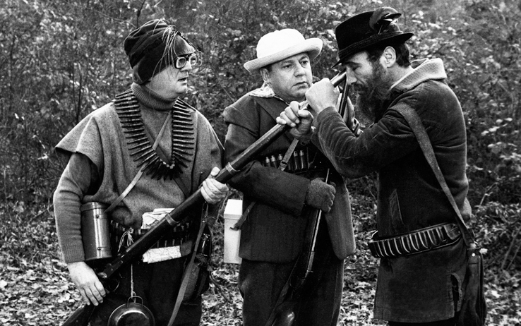
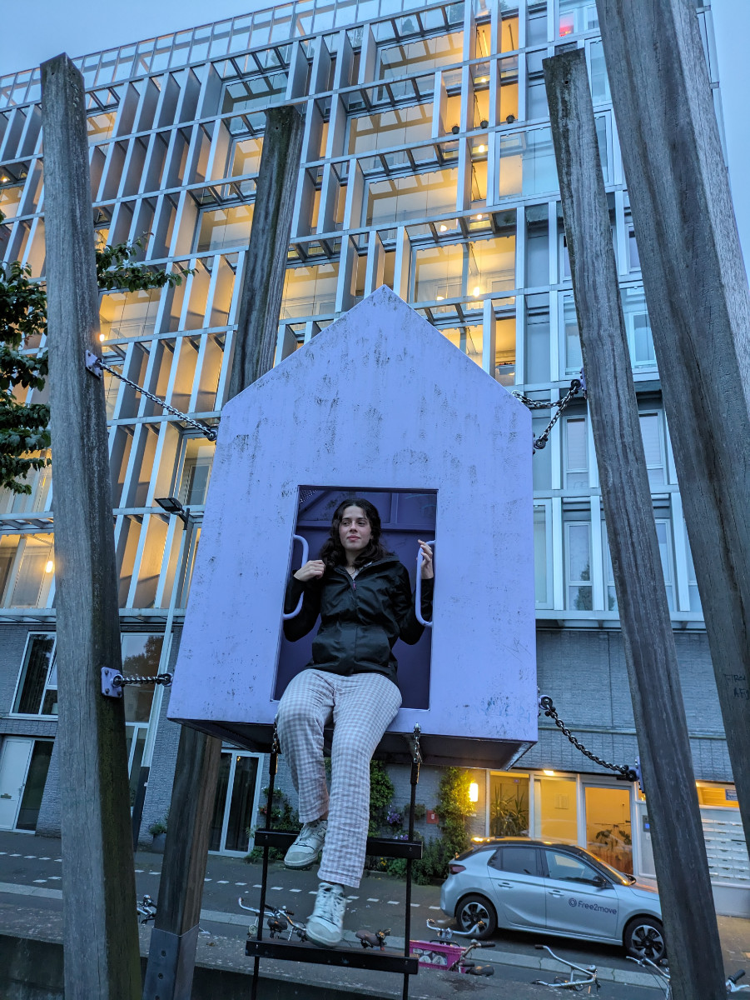
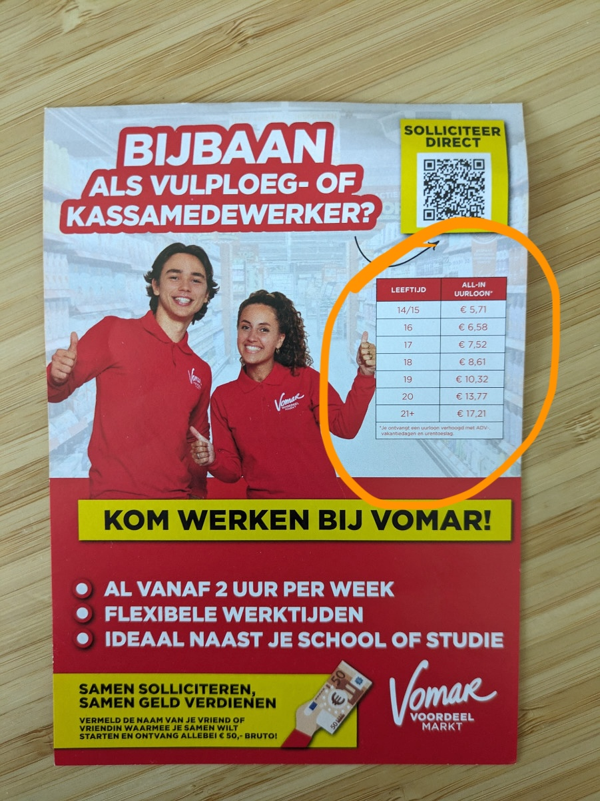

_Esperti cacciatori_

Questa mattina ho completato il mio profilo github, una piattaforma usata da tutti gli sviluppatori per tener traccia del proprio codice scritto, ma usata anche dai reclutatori per capire il livello di competenza di uno sviluppatore, e ho anche messo a punto il mio profilo su Linkedin.\
A questo punto, visto che anche il portfolio e’ pronto e il mio cv e’ aggiornato posso dichiarare la caccia al lavoro ufficialmente aperta.\
Dopo 15 anni di lavoro stabile mi rimetto completamente in gioco in un campo su cui non ho mai giocato veramente e vado a competere con giovani agili e scattanti, freschi di laurea, alla mia tenera età di 48 anni. Vediamo un po’ cosa succede, io credo di poter ancora fare qualcosa di buono,per un altra ventina d’anni, per lo meno nel mondo della programmazione. Forse sono un illuso ma, nelle prossime settimane lo scopriremo insieme.\
Ho appena mandato la mia candidatura per due inserzioni su Linkedin, entrambe le aziende cercano un “frontend web developer” che lavori ad Amsterdam, in modalità di lavoro ibrido, full time. Userò anche altre piattaforme per trovare lavoro oltre a Linkedin.\
Ieri sera, nella nostra uscitina serale con JJ, siamo passati di fronte a dei giochi “per bambini” che molto probabilmente in Italia non verrebbero mai costruiti, almeno credo, non per motivi economici ma piuttosto perche’ nei Paesi Bassi, cosi’ come credo anche nei paesi scandinavi, e anche in Sudafrica, hanno una sensibilita’ diversa verso la sicurezza nei confronti dei bambini.\
Credo sia capitato a chiunque di vedere la famigliola nordica al mare, o anche nelle citta’ turistiche, con due o tre bambini piccoli, e di notare come i genitori siano apparentemente disinteressati all’enorme pericolo che incombe sui loro figli mentre saltano a piedi nudi da uno scoglio all’altro oppure si arrampicano su monumenti giganti.\
La mega struttura che abbiamo visto ieri sera faceva paura anche a me, ma sophia c’e’ salita e l’ha fatta tutta.

_La super-mega struttura_

_Affittasi appartamento con vista sul canale, €3000 al mese_

Sempre a proposito del modo in cui vengono responsabilizzati i figli, una cosa che ho notato da tempo e che qui, nei supermercati, tutto il personale addetto a riempire gli scaffali sono ragazzi e ragazze adolescenti. E’ veramente impressionante vedere un ragazzino di 14 anni in divisa che lavora all’interno del supermercato. E si danno molto da fare!\
 All’uscita di tutti i diversi marchi di supermercato c'è sempre un cartellone con dei volantini per attrarre nuovi giovani dipendenti. Vengono scritte chiaramente le paghe orarie in base all’eta’, abbastanza basse quando si hanno 14 anni, credo per disincentivare lo sfruttamento minorile da parte dei genitori.
Anche le ore settimanali devono essere poche perché comunque ‘sti figlioli vanno pur sempre a scuola.

_Un ventuneenne prende il triplo di un quindicenne_

La zona un cui ci troviamo e’ piena di palazzoni, credo tutti completamente abitati visto che nei Paesi Bassi, e soprattutto nel Randstad, ovvero la zona piu’ sviluppata, dove si trova anche Amsterdam, c’e’ una crisi immobiliare molto forte per cui mancano abitazioni. Nonostante ciò, attraversando il quartiere e’ tutto molto tranquillo, sembra mezzo disabitato ma comunque estremamente ben tenuto e pulito.
Questa mattina JJ si e’ sporcato un po’ quando Sophia l’ha portato fuori quindi lo abbiamo dovuto lavare visto che il signorino passa tutto il tempo con noi sul letto o sul divano.\
E’ stato veramente un amore, si e’ fatto lavare tranquillamente senza opporre alcuna resistenza, anzi collaborava e prevedeva un po’ le nostre mosse. Carinissimo.\
Il nostro beneamato Sky era tutt’altra cosa sotto questo punto di vista. Appena intuiva che avevamo intenzione di togliergli di dosso i resti della carcassa in putrefazione, nella quale si era strusciato con dedizione, metteva in piedi una vera e propria colluttazione per sfuggire all’odiato sapone.\
Quanto mi manca Sky!

_Guardate che musetto carino_
