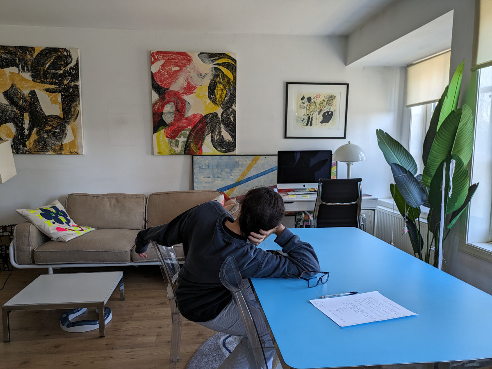
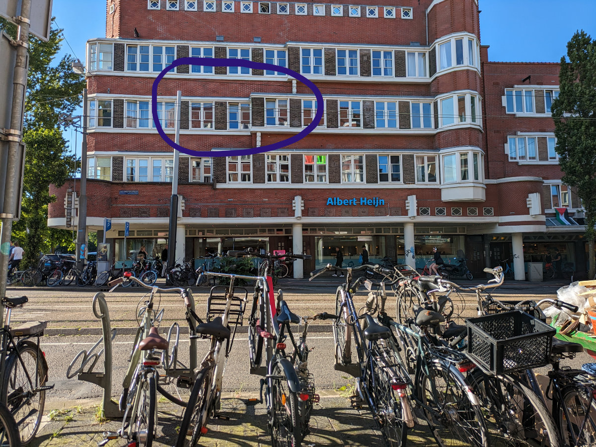

_Sophia e' innamorata di questo appartamento_

Ieri siamo entrati in casa di Stephane. Lui ci aveva lasciato le chiavi quando siamo venuti al primo incontro, qualche giorno fa. Il gatto Frances per il momento non si fa avvicinare ma Stephane ci ha detto che ci vorrà qualche giorno perché si abitui a degli estranei.

Christina e’ tornata dal suo viaggio e abbiamo salutato lei e soprattutto JJ, che restera’ nei nostri cuori con la sua dolcezza e personalita’.
Ci siamo trovati bene da Christina, il suo appartamento era piccolo ma molto accogliente e fornito di tutto il necessario.

La casa di Stephane e’ molto curata e piena di personalità, lui e’ un designer di moda Francese e il tocco artistico decisamente si vede.
Alle pareti ci sono dei bei quadri, alcuni firmati da lui, e ogni singolo oggetto di arredamento e’ stato scelto con molto gusto e originalità. Siamo al secondo piano e nella strada su cui ci si affaccia passa un tram, il 13, che va verso la stazione centrale. Poi per ogni senso di marcia c’e’: una stretta corsia per le auto, un marciapiede, la pista ciclabile e un altro grande marciapiede. Questo arrangiamento delle strade rende camminare, o pedalare, in giro per Amsterdam molto piacevole.

_Alcuni dei quadri_

_L'appartamento visto da fuori_

_Un gatto molto sulle sue_

_Pero' e' un po' curioso, si vede_

_Vista dalla finestra_

Noi non abbiamo ancora comprato delle biciclette.\
La mia idea era quella di comprarne due usate al più presto ma poi ho cambiato idea.
Infatti da sabato saremo ad Hattem, un paesino a 120 km a est di Amsterdam, poco distante dalla città di Zwolle. Poi li ci ricongiungeremo con il resto della famiglia Cassetta e sarebbe un problema spostarsi in macchina con le bici. Dovremmo tornare verso Amsterdam in treno, con la bicicletta, e ci costerebbe dei soldi in più visto che comunque disponiamo dell'auto.
Quindi abbiamo rimandato l’acquisto delle biciclette( a quel punto saranno 4 ) al giorno in cui avremo una casa stabile.

Questa sera siamo usciti con Sophia a fare una passeggiata post-cena. Sono passate un paio di auto strombazzanti, tipo matrimonio. Credo sia perché la Turchia ha vinto la partita degli europei di calcio. Nei Paesi Bassi la nazionalità estera più rappresentata e’ quella Turca, che rappresenta il 2.44% della popolazione, seguita poi da quella Marocchina (2,38%) e da quella Surinamese (2,05%).\
Al quarto posto, con poco meno del 2%, troviamo gli “Indos”, una minoranza etnica, per la maggior parte rappresentata da persone di origini miste, Europa-Indonesia, che però portano cognomi europei. L’80% della popolazione mondiale di “Indos” vive nei Paesi Bassi.

Questa mattina siamo andati ad Amsterdam Nord, dall’altra parte del grosso canale che si trova dietro la stazione centrale. Questa parte di Amsterdam è stata per diverso tempo, nella sua parte piu’ sviluppata, una zona dormitorio, ma oggi sta acquisendo un po’ piu’ di vitalita’.
Per pranzo abbiamo mangiato in un posto dove eravamo già stati nel periodo natalizio, un fast food asiatico, all’interno di un supermercato asiatico, dove cucinano tutto davanti a te e te lo servono in pochi minuti. Il supermercato e’ allucinante, da perderci un’ora a guardare tutte le stranezze in vendita. Avevano anche il durian fresco, in vaschetta, gia’ pulito, un pezzettino piccolo, tipo due bocconi, costava 25€.\
Avevano anche le banane sciroppate\
Il durian e’ un frutto tropicale tipico del sud est asiatico che nel momento in cui lo si apre fa un puzzo di carogna in putrefazione ma poi ha un gusto delicato e molto particolare, descritto anche come gusto di crema pasticcera, vaniglia o cheesecake.
In Thailandia, ricordo, nei mercati, o in giro per le strade, c’erano dei cartelli che segnalavano il divieto di aprire il frutto in pubblico, giuro.

Il motivo per cui siamo andati ad Amsterdam Noord è che mi dovevo comprare delle scarpe da corsa. Mi sono infatti dimenticato le mie in Italia e non ce la facevo più ad aspettare, quindi oggi pomeriggio ho fatto la prima corsa nei Paesi Bassi. In realtà nei paesi bassi ho corso già diverse volte, ma si tratta di quasi 30 anni fa, e quella era un altra vita.
Ad ogni modo mi son fatto una bella corsetta attraverso Rembrandtpark, e spero da ora in poi di poter correre ogni giorno.

La caccia al lavoro comunque va avanti. Ogni giorno mi candido per delle posizioni aperte come “Frontend web developer”, tra Amsterdam, Rotterdam e Utrecht, più che altro. Ho già ricevuto alcune risposte negative, e niente piu’.\
Sto allo stesso tempo lavorando ad un nuovo progetto che dimostri le mie capacita’ anche nell’utilizzo di un altro “framework javascript” ( perdonatemi il tecnicismo ma non so descriverlo in altro modo) particolarmente richiesto al momento.
Sembra ci sia molto fermento nel settore comunque, qualcosa deve saltare fuori.

_Banane sciroppate_

_Non aprite quel durian!_

_Passeggiata post-cena_
