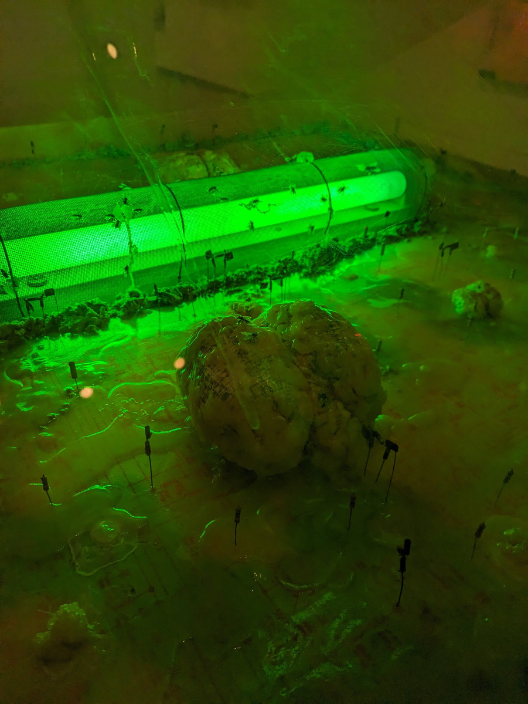
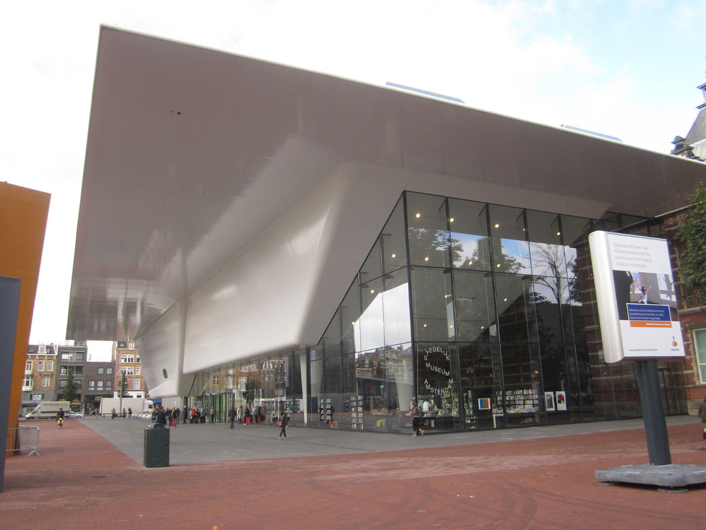
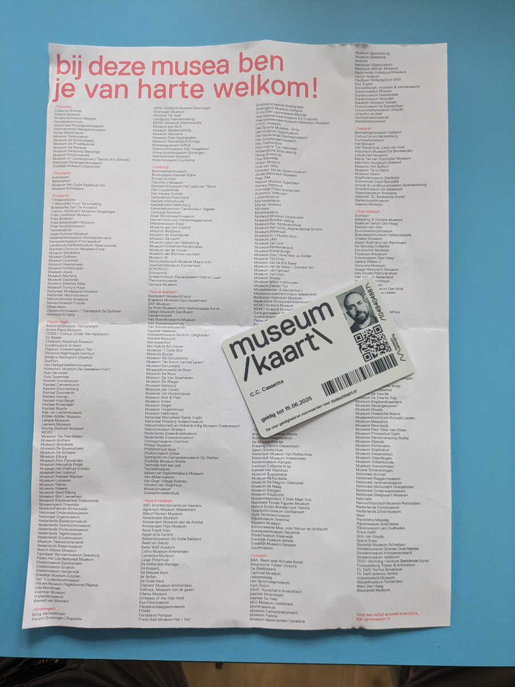
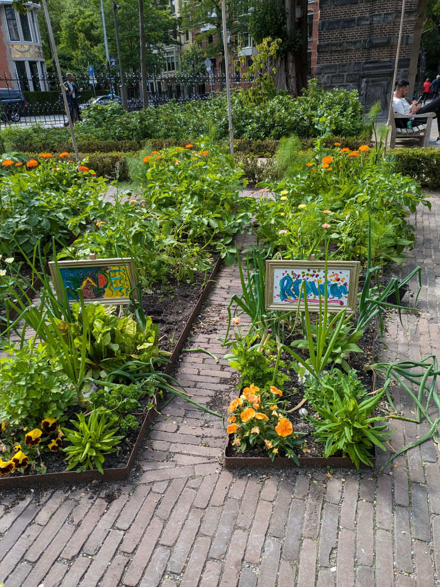
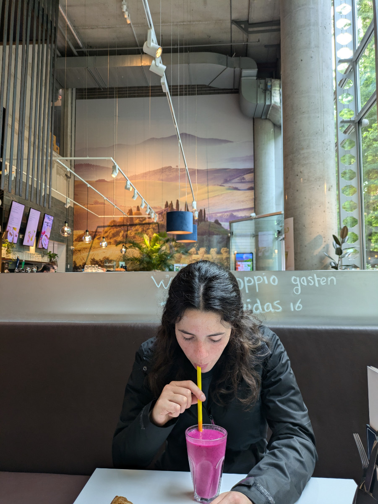
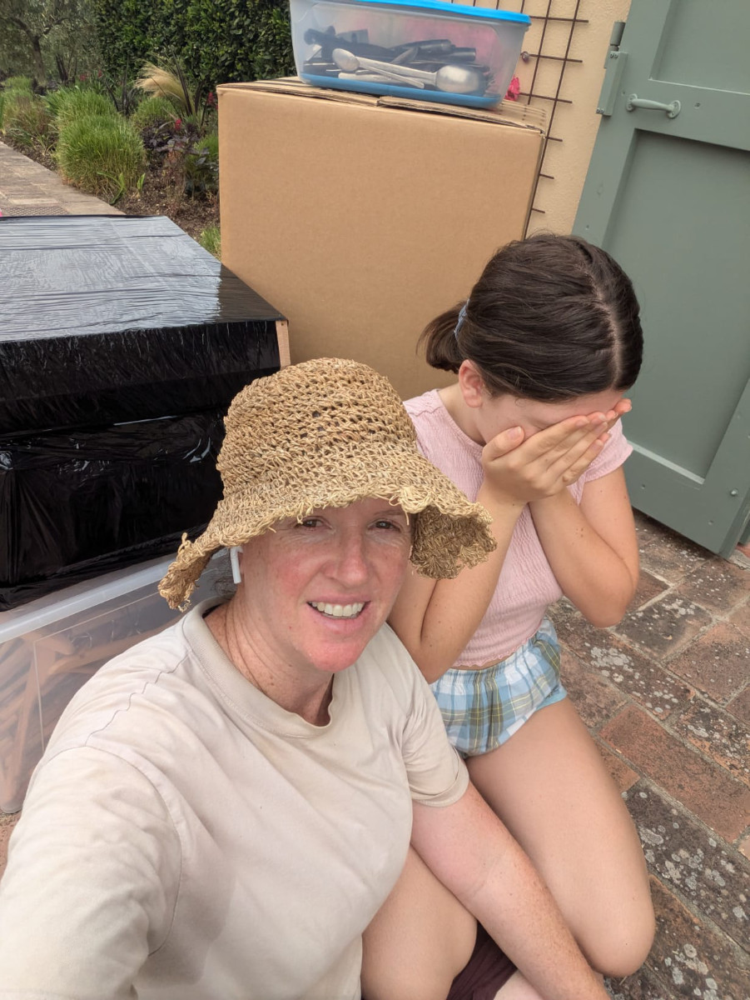

_La "torta" di capra del museo Stedelijk_

In questi giorni abbiamo visitato un paio di musei. Per poterlo fare abbiamo acquistato la “Museumkaart”, una carta annuale per visitare tutti i musei dei Paesi Bassi. Costa 70€ per gli adulti e 39€ per i minori di 18 anni e dà accesso a più di 500 musei.\
Il primo che abbiamo visitato e’ stato lo Stedelijk, dove si trovano delle gallerie di Arte moderna e Contemporanea. Ci siamo andati dopo che ci hanno rimbalzati all’ingresso del museo di Van Gogh, che si trova proprio a fianco, visto che per entrarci serve una prenotazione.

Lo Stedelijk museum raccoglie diverse gallerie di quadri, sculture e installazioni. A me piaceva ma Sophia voleva andare veloce perché non apprezza l’arte contemporanea ( anche io pero’, in realta’, faccio un po 'fatica ) e in più avevamo a casa JJ che ci aspettava in quel periodo.\
Ieri pomeriggio invece siamo riusciti, dopo aver prenotato, a visitare il museo di Van Gogh.\
Il museo e’ organizzato su quattro piani e mostra in modo sistematico l’evoluzione dei suoi lavori, attraverso tutta la sua vita.
Ci sono anche dipinti di artisti che lo hanno ispirato, soprattutto di Paul Gauguin, con il quale Van Gogh aveva un rapporto di tumultuosa amicizia.
Ammetto che era la prima volta che visitavo questo museo, nonostante tutte le mie visite ad Amsterdam, anche se la maggior parte degli Italiani dice di averlo visitato, ma non e’ vero, perche’ si vergognano di dire che sono stati ad Amsterdam solo a farsi le canne.

_Cervelli verdi fritti al museo Stedelijk_

_Il museo Stedelijk_

_Museumkaart e la lista dei musei_

Entrambi i musei si trovano in un’area dove c’e’ un grande prato che ci vide partecipi alla festa di fine anno, lo scorso 31 Dicembre.
Fu un evento incredibile in cui si susseguirono dei concerti/performance live, sotto una pioggia continua, e verso la mezzanotte ci furono dei fuochi di artificio fatti con dei laser su uno sfondo di fumo artificiale e suoni. Andammo io, Sophia e Gemma e passammo 4 ore sotto la pioggia, ovviamente nessuno aveva un ombrello, ma tra la calca delle persone non si stava poi così male.
Hildegard stette a casa perché era caduta dalle scale qualche giorno prima e si era fatta male alla schiena. Nonostante l’invalidita’, la mia amata moglie, uscì di casa 5 minuti, allo scoccare della mezzanotte, per vedere i fuochi d’artificio sparati nel vicinato, e dimenticò le chiavi di casa dentro la casa.\
Nei Paesi Bassi tutte le porte d’ingresso non hanno la maniglia all’esterno quindi c’e’ sempre il rischio di chiudersi fuori. Così avvenne e la povera Hilly si trovò chiusa fuori di casa, in pigiama, con la schiena rotta, sotto la pioggia, e con il resto della famiglia, zuppi di pioggia, che tornavano a casa desiderosi di farsi una bella doccia calda.
Eravamo in auto, verso l’una, nel breve tragitto tra il centro di Amsterdam e Amstelveen, dove alloggiavamo, quando ricevemmo la telefonata di Hildegard che ci raccontava dell’accaduto.
All’inizio pensavamo fosse uno scherzo ma quando ci rendemmo conto della misera realtà Gemma ebbe una crisi isterica e si mise a piangere.
Nel frattempo Hilly tentò di contattare il vicino di casa per sapere se aveva una copia delle chiavi del nostro appartamento.\
Vista questa terribile e insensata abitudine dei Nederlandesi di avere la serratura di casa fatta in questo modo di solito viene data una copia delle chiavi ad un vicino fidato, perche’, non importa quanto ben organizzato e preciso sia un popolo, prima o poi capitera’ a chiunque di chiudersi fuori casa come degli imbecilli.
Il vicino non rispondeva ai messaggi di Hilly perché non festeggiava il capodanno ed era andato a letto verso le 22.00.\
La poveretta stette un’ora fuori di casa prima che, per pura coincidenza, il vicino di Casa, Daniel, si accorse di lei, che si aggirava su e giù per la via, in pigiama, e la fece entrare in casa sua, perche’ lui, le chiavi di scorta non le aveva!
Noi arrivammo poco dopo, fradici come naufraghi che approdano sull’isola deserta. Ci sistemammo tutti nella stanza-ufficio del gentilissimo Daniel che, in barba a tutti gli stereotipi sui Nederlandesi ci accoglieva con calore e generosita’ in casa sua. Happy 2024!!\
Riuscimmo a entrare in casa nostra solo il giorno dopo , verso le 12, dopo essere riusciti a trovare delle chiavi di scorta da un altro vicino che però quella notte era assente.

In questi giorni Hildegard e’ ancora alla Civettaia per aiutare i nuovi arrivati ad inserirsi in modo più dolce. Aveva intenzione di scrivere anche lei un post su questo blog ma con tutti gli impegni non ce l'ha fatta. Le manca ancora da portare l’ultima macchinata di scatole nel magazzino di Luigi e poi tutta la nostra roba e’ sistemata.\
Gemma invece ha appena concluso la terza media esponendo un lavoro sulla schiavitu’ negli stati uniti durante il diciannovesimo secolo, facendo anche dei collegamenti con le diverse forme di schiavitu’ ai giorni nostri in italia e nel mondo.

Oggi e’ l’ultima giornata che passiamo ad Amsterdam, domani mattina presto lasceremo la casa di Stephane, che ci ha coccolati nella sua comodita’ stilosa, e andremo ad Hattem dove staremo a casa di Bart e Moniek a badare al loro cane Bruno.\
Finalmente potremo andare in bicicletta perche’ Bart e Moniek ne hanno piu’ di una. Staremo lì fino all’11 Luglio.
Questa sera andremo a cena a casa dei nostri amici ad Amstelveen, la casa dove avvenne il fattaccio di capodanno.

_Orti urbani vicino ai musei_

_Sophia beve un frullato di dragon fruit e altri frutti tropicali_

_Hilly, Gemma e le ultime scatole_
