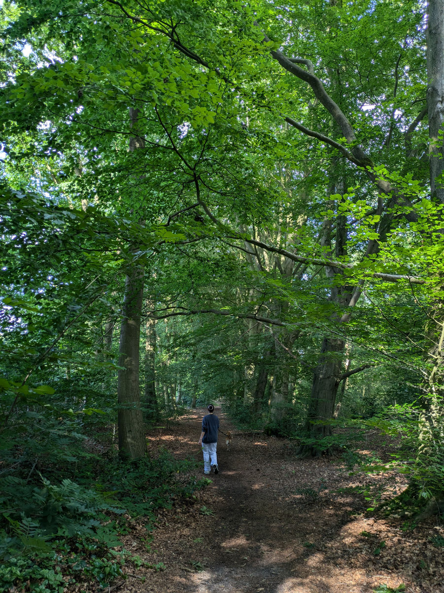

_La vetrina delle cose tipiche_

Per ragioni evolutive, durante il periodo dell’innamoramento, noi umani vediamo, nell’oggetto della nostra infatuazione, solo le caratteristiche positive, spesso ingigantendole, e minimizziamo o non vediamo affatto tutte quelle negative.\
Per questo motivo dovete avere pazienza se in questo blog sto un po’ esaltando i Paesi Bassi, paragonandoli spesso all’Italia, il mio precedente amore, che un pochino mi ha deluso, sotto alcuni punti di vista.

Per bilanciare un po’ il racconto devo ammettere che almeno uno stereotipo negativo, dei Paesi Bassi, finora si sta dimostrando vero. Nei ristoranti si mangia male. Certo, venendo dall’Italia l’asticella e’ molto alta ma non ricordo che in Inghilterra la qualita’ fosse cosi’ bassa. Forse ventitre anni fa il mio palato non era cosi’ viziato.

Uno stereotipo negativo dell’Italia invece e’ quello che gli Italiani riescono a complicare inutilmente ogni cosa, spesso con risultati grotteschi.\
Prendete un turista che arriva a Roma e deve prendere i mezzi pubblici per arrivare all’appartamento che ha prenotato, con estrema semplicita’, su airbnb. Magari deve prendere un treno e poi un autobus.\
Dal punto di vista dei biglietti; dove si fanno? Posso farli online? Quello del treno si, ma e’ complicatissimo per uno che non conosce il sito di trenitalia. E l’autobus? Dove lo prendo il biglietto? Online? Mah, forse. Boh? Forse posso comprarlo sull’autobus stesso? Non credo proprio. Vabe’, fammi chiamare un Uber e non se ne parla piu’! Ahahahah. Ma quale Uber!\
Nei Paesi Bassi c’e’ una card contactless su cui carichi dei soldi e puoi usarla su tutti i mezzi pubblici, treni e traghetti inclusi, in tutto il paese.\
Ripeto, in tutto il paese!\
Fai check-in quando sali su un mezzo e poi checkout quando scendi e paghi solo per il tragitto fatto
Se non hai questa card puoi usare qualsiasi carta di credito o debito contactless o anche il tuo telefono.
Questa mattina abbiamo preso un autobus da Amsterdam alla stazione, un treno dalla stazione a Zwolle, a un’ora di distanza, e poi un’altro autobus da Zwolle ad Hattem. Tutto semplicemente passando la nostra card ricaricabile.
Sono proprio innamorato!

Arrivati ad Hattem siamo stati accolti da Bart e Moniek nella loro splendida casa. Loro sono partiti poco dopo per un viaggio in Albania e torneranno l’11 Luglio.\
Bruno e’ un meticcio un po’ labrador di sei anni, giocherellone e dolcissimo, non ha abbaiato neanche una volta, con due estranei in casa.\
La casa si trova in una zona residenziale vicino ad un bosco di grosse querce. Il terreno soffice dei sentieri sarà perfetto per le mie nuove scarpe da corsa.

Finalmente abbiamo a disposizione due biciclette, c’e’ ne sarebbe anche una terza ma e’ la bici da lavoro di Moniek, visto che fa la postina, e quindi non possiamo usarla.\
Nel pomeriggio abbiamo quindi inforcato le bici e siamo andati a visitare il centro di Hattem.
Che spettacolo! E’ veramente una bomboniera nordica.\
C’era una festa nel centro per il solstizio d’estate e quando siamo arrivati stava suonando la banda, c’erano bancarelle di birra artigianale e street food. Intorno alle mura del centro storico ci sono dei giardini spettacolari e curatissimi. C’e’ anche un mulino a vento.\
Questo posto ce lo godremo per bene!

_Un attimo di riposo_

_Camminata nel bosco_

_Il giardino di Bruno_

_Le nostre biciclette_

_La bicicletta da lavoro di Moniek_

_L'ingresso al centro storico di Hattem_

_Le vie fiorite di Hattem_

_La banda musicale_

_Giardini intorno alle mura_

_Ancora intorno alle mura_

_Il mio nuovo ufficio_
