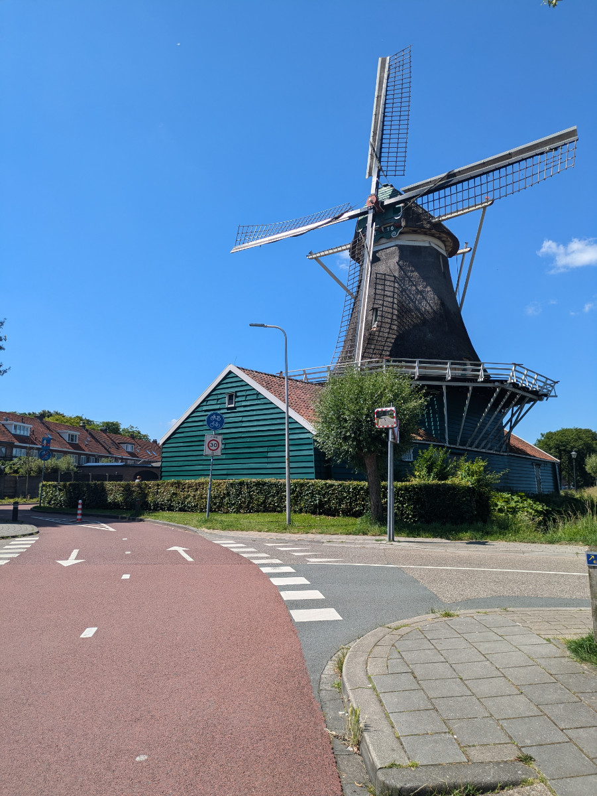
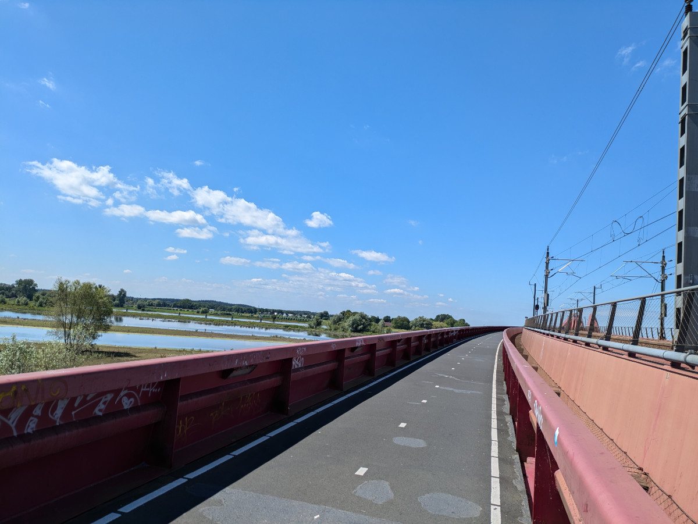
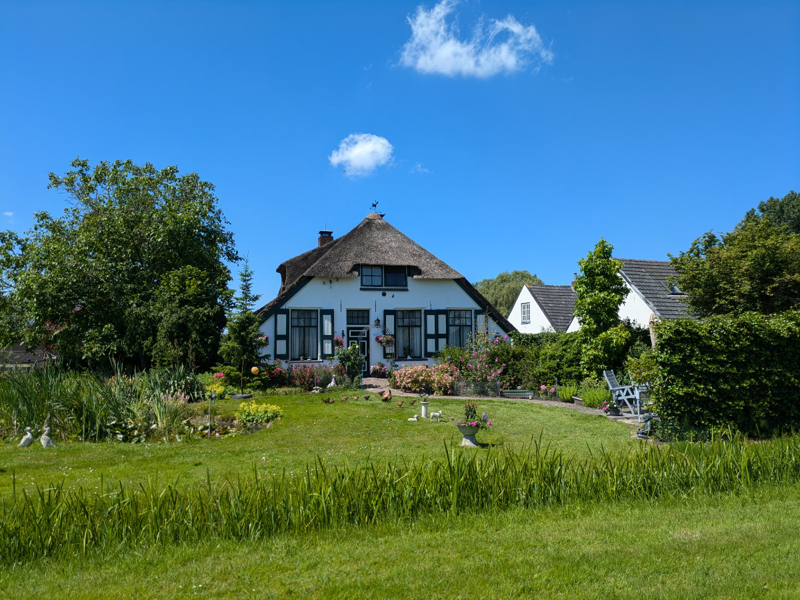
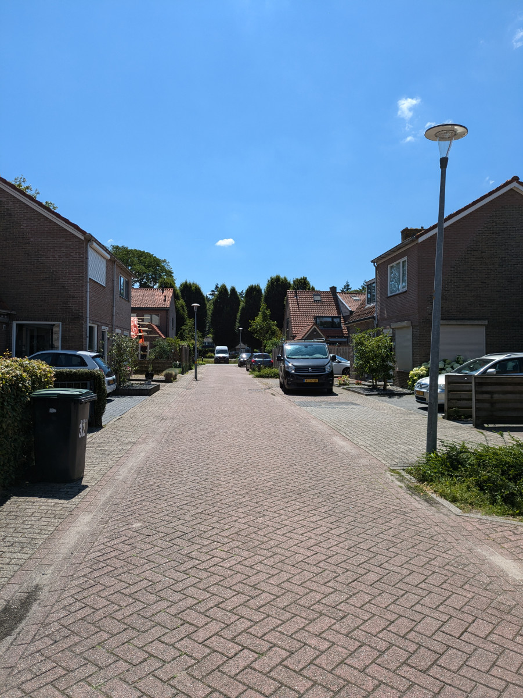
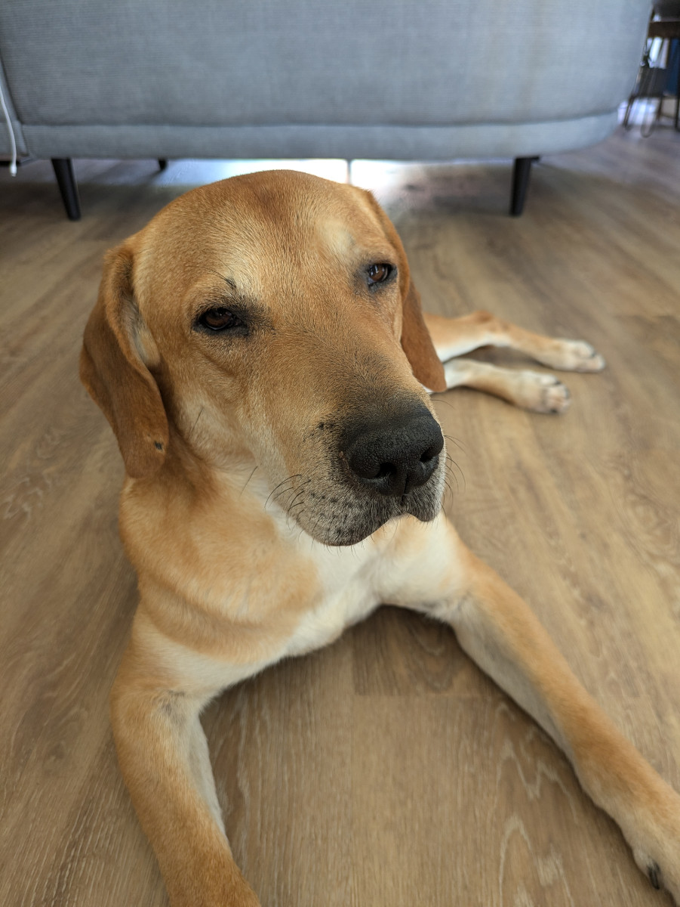

_Due cose tipiche dei paesi bassi_

Avviso importante per tutti quelli che abbiano intenzione di visitare i Paesi Bassi in futuro ( e ovviamente venirci a trovare).\
Passare qualche giorno nei Paesi Bassi e non andare in giro in bicicletta sarebbe come fare un viaggio in Italia e mangiare solo nei Mc Donalds.\
 Chi non avesse mai visitato le città o le campagne Nederlandesi in sella ad una bici dovrebbe sapere che non si sta parlando di semplici piste ciclabili ma di vere e proprie strade per le bici.\
Sia ieri che oggi siamo andati a Zwolle, a circa trenta minuti di pedalata da casa nostra, con un piacere ed una semplicità indescrivibili.\
Per il 90% il tragitto si svolge su strade dedicate solo alle bici, mentre un 10% su classiche piste ciclabili. Agli incroci quasi sempre la precedenza è data alle biciclette e, dovunque, ci sono semafori e segnaletica dedicate al mezzo a due ruote.\
Quasi tutti hanno attaccato alla bicicletta una o piu’ borse proprio perche’ viene usata per andare a fare la spesa o altre commissioni. Fuori dalle stazioni, dalle scuole, dai supermercati e in realtà un po’ dovunque ci sono centinaia di bici parcheggiate.
Ricordo la prima volta che arrivai alla stazione di Amsterdam, era il 1995 e io venivo in treno da Milano, rimasi a bocca aperta per la montagna di biciclette parcheggiate fuori dalla stazione.\
Non ci potevo credere!\
Oggi fuori dalla stazione di Amsterdam di biciclette parcheggiate non ce n'è più neanche una; hanno costruito un super parcheggio sotto acqua, solo per le biciclette, costato 60 milioni di euro. In rete si trova un video timelapse impressionante di come lo hanno costruito.

Zwolle e’ una bella città medievale di 133'000 abitanti, tutta circondata da canali, fuori dalle mura. Ieri, che era domenica, e c'era un gran bel sole, sulle sponde verdi di alcuni canali era pieno di persone in costume da bagno e bikini a prendere il sole. Le strade e le piazze erano invase da sedie e tavolini e un sacco di Nederlandesi che bevevano birra o vino. Questa mattina invece siamo andati in centro a Zwolle alle 10 ed era tutto chiuso, i negozi aprivano tutti dopo le 11.00.
Domani dobbiamo tornare a Zwolle perché alle 15.00 abbiamo appuntamento per fare il nostro codice fiscale temporaneo, quindi sara’ il nostro primo incontro con la burocrazia dei Paesi Bassi. Finora e’ stato tutto semplice. Abbiamo preso appuntamento online e abbiamo compilato un modulo, sempre online, in cui abbiamo inserito i nostri dati. Quando andiamo all’ufficio dobbiamo far vedere un QR code dal telefono invece che portare il modulo cartaceo.

La mia ricerca di lavoro intanto procede. Ogni giorno mi candido ad almeno 2 o 3 nuove posizioni ma finora ho ricevuto solo risposte molto garbate ma negative.\
Sto anche lavorando su di una nuova app perche’ mi sono accorto che ci sono molte proposte per “fullstack developer” (scusate il gergo) invece che solo “frontend developer”, cosa a cui mi potrei anche candidare, ma non ho progetti che possano dimostrare le mie capacita’, quindi sto rimediando.

Sophia sta passando un sacco di tempo a leggere, da quando siamo qui ha comprato almeno tre libri, ma sta comunque continuando le sue lezioni di Nederlandese e di programmazione.

Bruno se la passa bene, e’ un cane estremamente ubbidiente e tranquillo, anche se quando lo portiamo fuori tira il guinzaglio come una bestia, tutto il tempo.

_E' un dedalo di piste ciclabili_

_Pista ciclabile lungo il ponte della ferrovia_

_Tornando a casa nelle campagne di Hattem_

_La mia casa dei sogni_

_La nostra strada_

_Bruno e' proprio chill!_
