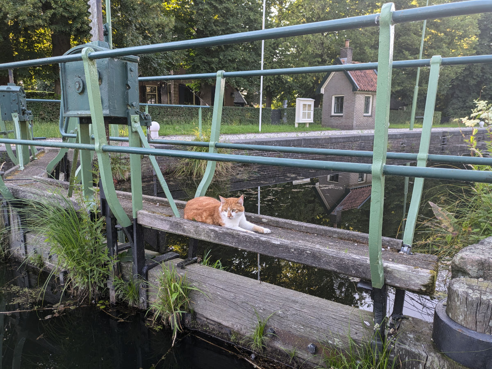
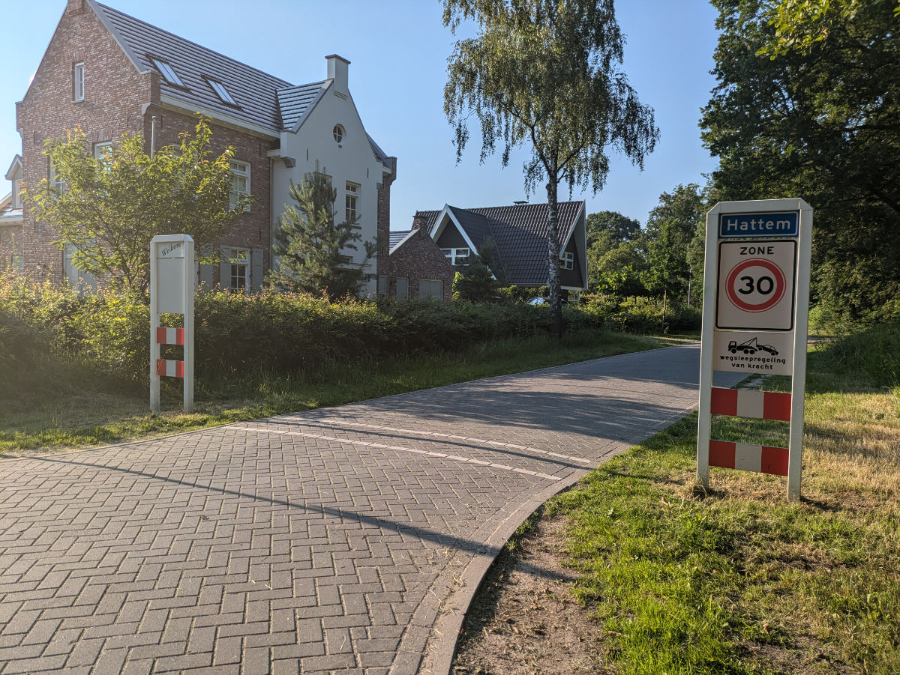
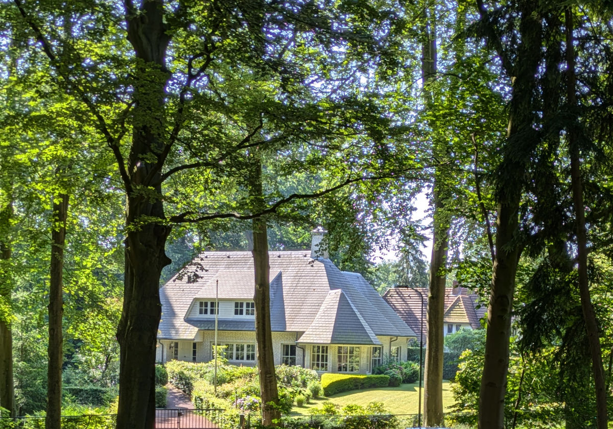

_Il municipio di Zwolle ha il logo della Pixar_

Ieri siamo andati al municipio per ottenere il “Burgerservicenummer”, detto anche BSN, ovvero il codice fiscale Nederlandese.\
L’esperienza è stata sublime.\
Sono sicuro che ad un certo punto incontrero’ sulla mia strada almeno un dipendente dell’amministrazione pubblica che mi trattera’ da misero plebeo perche’ tanto il coltello dalla parte del manico ce l’ha lui, o lei.\
Nel municipio di Zwolle i dipendenti erano quasi tutti ventenni, rapidi, efficaci e professionali.\
Ma dei vecchiacci come me cosa ne fanno? Comincio a preoccuparmi!\
Comunque e’ andato tutto liscio e abbiamo ottenuto il BSN provvisorio, visto che non abbiamo un indirizzo di residenza al momento, poi, appena avremo un indirizzo stabile si tramutera’ in definitivo.

Il palazzo comunale si trova in un'area moderna in cui ci sono uffici, facolta’ universitarie e scuole superiori e come sempre tanto, tanto verde.\
I paesi bassi hanno una densita’ di popolazione due volte e mezza quella dell’Italia, e nonostante cio’ sembra ci sia più spazio per tutti. Questo e’ dovuto al fatto che gran parte del territorio Italiano sia montagnoso e quindi poco sviluppato ma credo anche che sia un effetto di come siano organizzate le aree urbane Italiane, nelle quali, negli ultimi decenni non sono stati fatti sforzi per creare piu’ zone di verde, marciapiedi piu’ grandi etc. rendendole caotiche e soffocanti.

Nelle nostre vite in questi ultimi giorni non sta succedendo molto, io passo tutto il giorno al computer e Sophia si dedica a diverse attività in casa tra cui anche tanto riposo, visto che l’estate scorsa ha lavorato tutta l’estate.\
Portare Bruno a fare una passeggiata e’ un po’ un'impresa perché tira veramente come un matto e sono sicuro che mi si e’ allungato il braccio destro di qualche centimetro. Ora ho cominciato ad alternare il braccio con cui tengo il guinzaglio.

Alla Civettaia Hildegard e’ quasi pronta alla partenza. E’ da qualche giorno che dorme da un amica e va lì solo per lavorare durante la giornata.\
Venerdì sera Gemma farà lo spettacolo di danza e poi, sabato mattina partiranno. Faranno tappa a Milano, sabato notte, e dormiranno da qualche parte in Francia Domenica notte. Potevano farla tutta in un unico viaggio, sono poco più di 15 ore, ma vogliono farsi un “road trip” e prendersela comoda.\
Quindi venerdì sera Hilly salutera’ la Civettaia definitivamente. Quel posto è stato veramente una casa dei sogni per gli ultimi 15 anni e ci mancherà tanto.

_Il gatto pensieroso e la diga_

_Una via d'ingresso ad Hattem_

_Una delle casette della zona_
